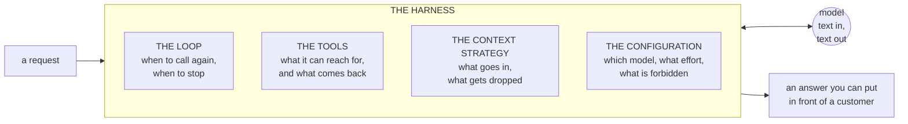

# Build 00 — Foundations: What a Harness Is, and Why Claude-Native

**Covers:** what **harness engineering** actually names, and whether it is just "building reliable LLM apps" → the four things a harness is made of — **the loop, the tools, the context strategy, the configuration** → why this track is **Claude-native** when you already know LangChain → what else exists → and the setup that gets you running on your own laptop with your own key.

**Goal:** know what you are building before you build it, and know why the stack was chosen rather than inheriting it.

**Where this sits:** build zero of the Build Track. Everything after this assumes you can run code against the API from your own machine.

---

## Part 1 — What harness engineering is

A model takes text and returns text. That is the whole contract. It has no memory, no access to your systems, no ability to stop itself, and no idea what it is allowed to do.

Everything that turns that into something a customer depends on is **code you write around the model**. That surrounding code is the **harness**, and building it is harness engineering.

### Is it the same as "building reliable LLM apps"?

Nearly — but the word choice is doing real work, and it is worth being precise about.

"Building reliable LLM apps" names an **outcome**. "Harness engineering" names **where the work is**, and makes a claim about ownership:

| | The model | The harness |
|---|---|---|
| Who builds it | Anthropic, OpenAI, Google | **You** |
| How you get it | rent it, per token | write it |
| Can a competitor have the identical thing? | **yes, tomorrow** | no |
| Where cost is decided | partly | **mostly** |
| Where production failures live | rarely | **almost always** |
| Does it survive a model upgrade? | it *is* the upgrade | **yes, if built well** |

The model is a **component**. The harness is the **product**. Teams that spend their effort on prompt-tuning a model they do not own, and little on the harness they do, end up with nothing transferable when the next model ships.

> **The one-line frame:** the model is rented and interchangeable; **the harness is the part that is yours**, and it is where the cost, the failures, and the differentiation all live.

---

## Part 2 — The four parts of a harness



**The loop.** A model answers once. Real work takes several turns: the model asks for a tool, you run it, you hand back the result, it continues. *You* own that cycle — when it runs again, when it stops, what happens if it never converges. In the Anthropic API the signal is `stop_reason`: `end_turn` means finished, `tool_use` means it wants something from you. A loop with no bound is an unbounded bill.

**The tools.** The functions the model may call, described so it knows when to reach for each. This is API design where the consumer reads documentation *at runtime* and cannot ask a follow-up question. Two tools with vague, overlapping descriptions get confused — and the fix is a better description, not a stern prompt.

**The context strategy.** Everything sent on each request: the system prompt, conversation so far, retrieved documents, tool output. It is a **budget**, not a bucket. Long conversations need pruning of verbose tool output, pinning of facts that must never drop, and compression of resolved sections. Two things make this load-bearing: you pay for every token on every request, and models attend less reliably to material buried in the middle.

**The configuration.** Which model, at what effort, with which tools available, under which rules. Not a settings file — **a design surface**. Build 01 is entirely about one dimension of it, and finds that a single configuration parameter moved more money than the architecture did.

> **The one-line frame:** loop, tools, context, configuration. **Everything in this track is one of those four**, and none of them is inside the model.

---

## Part 3 — Why Claude-native, when you already know LangChain

You have already built agents with LangChain and LangGraph. Reasonable question: why not just keep using them?

**First, clear up a category error.** These are not competing products at the same layer:

| Layer | What it is | Examples |
|---|---|---|
| **Provider SDK** | a typed client for **one** vendor's API | `anthropic`, `openai`, `google-genai` |
| **Abstraction / orchestration** | one interface over **many** providers, plus composition | LangChain, LlamaIndex, Haystack, Semantic Kernel |
| **Agent harness** | an opinionated loop + built-in tools | **Claude Agent SDK**, LangGraph, CrewAI, AutoGen |
| **Gateway** | one endpoint in front of many providers | LiteLLM, OpenRouter — see [ML Study 13h](../../study-docs/ML_Study_13h_LLM_Gateways.md) |

"Claude ecosystem" spans two of those rows: the **Anthropic SDK** (provider SDK) and the **Claude Agent SDK** (agent harness), plus **MCP** for tools and **Claude Code** for the developer surface.

### Does the Claude stack use LangChain underneath?

**No.** The Anthropic SDK and the Claude Agent SDK have no LangChain dependency.

The dependency runs the **other way**: LangChain ships `langchain-anthropic`, an integration that wraps the Anthropic SDK. LangChain depends on the provider SDK; the provider SDK knows nothing about LangChain.

That matters practically: **anything the provider SDK can do, it can do first.** An abstraction layer can only expose a feature after someone writes the wrapper.

### The real trade-off: abstraction lag

A framework spanning many providers must express features in terms all providers share. New per-provider capabilities either arrive late or arrive as an escape hatch.

Build 01 is a live example. **`effort`** — the parameter that beat the entire routing architecture — is current Anthropic API surface. A cross-provider abstraction has nowhere natural to put it, because most providers have no equivalent. Reach for it through a generic wrapper and you are passing vendor-specific kwargs through a layer whose purpose was to hide them.

Same for **adaptive thinking**, **prompt caching breakpoints**, **structured outputs**, **hooks**, **`stop_reason` control**. These are exactly what harness engineering is about, and they are exactly what generic abstraction flattens.

### When to choose which

**Go Claude-native when:**
- You have committed to Claude, or would switch deliberately rather than dynamically.
- You want current API surface the day it ships.
- The work *is* the harness — loop control, caching strategy, tool governance, guardrails.
- You want fewer layers between your code and the failure. When something breaks at 2am, one SDK and one API is a much shorter path than a stack trace through a framework.
- **Good fits:** a document-extraction pipeline, an incident-triage agent, a compliance-gated workflow, a code-review orchestrator — anything where behaviour under failure matters more than provider breadth.

**Go LangChain / LlamaIndex when:**
- **Multi-provider is a requirement**, not a preference — a contract, a regulator, a procurement rule.
- You need the **integration breadth**: hundreds of loaders, vector stores, and third-party tools already wrapped. Rebuilding that is not harness engineering, it is plumbing.
- The team has standardised on it and consistency beats the last 10% of capability.
- **Good fits:** RAG over many heterogeneous sources; a prototype that must swap models weekly; an org with a provider-neutrality mandate.

**These are not exclusive.** A common production shape is Claude-native for the agent's control surface, with a retrieval library for ingestion, behind a gateway for failover.

> **The one-line frame:** LangChain optimises for **breadth across providers**; the Claude stack optimises for **depth on one**. Harness engineering lives in the depth — so this track goes native, and you keep LangChain for the problems it is genuinely better at.

---

## Part 4 — What else is out there

| Category | Options | Reach for it when |
|---|---|---|
| **Provider SDKs** | `anthropic`, `openai`, `google-genai`, `mistralai` | you have picked a provider and want its full surface |
| **Orchestration** | LangChain · LlamaIndex (retrieval-first) · Haystack · Semantic Kernel (.NET-leaning) | many providers, or heavy integration needs |
| **Agent frameworks** | Claude Agent SDK · LangGraph · CrewAI · AutoGen · OpenAI Agents SDK | you want a loop you did not write |
| **Typed / structured** | Pydantic AI · Instructor · DSPy (optimises prompts programmatically) | output shape is the hard requirement |
| **App layer (TS)** | Vercel AI SDK | streaming UI is the main problem |
| **Gateways** | LiteLLM · OpenRouter | failover, spend control, one endpoint — [ML Study 13h](../../study-docs/ML_Study_13h_LLM_Gateways.md) |
| **Tool protocol** | **MCP** — an open standard, not Anthropic-only | tools must be reusable across apps — [ML Study 13b](../../study-docs/ML_Study_13b_MCP.md) |

Note the last row. **MCP is not a lock-in**: it is an open protocol, and a server you write is callable by any MCP-aware host.

> **The one-line frame:** the ecosystem is layered, not tribal. Pick a layer per problem — and know which layer each tool actually occupies before comparing two of them.

---

## Part 5 — Your laptop, your key

**You do not need a hosted classroom workspace.** A hosted workspace is a proxy in front of the same API — it changes one thing, the `base_url`, and hands you a scoped key.

With **your own** key:

- **No `base_url`.** The SDK defaults to Anthropic's API. Set `base_url` *only* when talking to a proxy.
- **No proxy key.** `ANTHROPIC_API_KEY` is read from the environment automatically; you rarely pass it in code at all.
- **You get the current model generation.** Proxies lag. A classroom proxy may offer `claude-opus-4-7` while your own key reaches `claude-opus-5`. This track uses the current generation.

```python
import anthropic

# Your own key: this is the whole setup.
client = anthropic.Anthropic()          # reads ANTHROPIC_API_KEY from the environment

# A proxy would need the extra line -- and nothing else:
# client = anthropic.Anthropic(base_url="https://some-proxy.example.com")
```

**Set a budget anyway.** In the Console, put a spend limit on the workspace the key belongs to. Not because you will overspend on this track — every build here costs cents — but because an unbounded loop against an unbounded key is the one expensive mistake in agent work, and the limit is the only thing that makes it a non-event.

See [SETUP.md](SETUP.md) for the install.

> **The one-line frame:** a proxy changes exactly one line. Your own key means **no `base_url`, current models, and a spend limit you control.**

---

## Quick reference / glossary

| Term | Meaning |
|---|---|
| **harness** | all the code around the model — loop, tools, context, configuration. The part you own. |
| **the loop** | the turn cycle you control; driven by `stop_reason`. Unbounded loop, unbounded bill. |
| **tools** | functions the model may call, described so it knows when. API design for a consumer that reads docs at runtime. |
| **context strategy** | what goes into each request, under a token budget. Prune, pin, compress. |
| **configuration** | model, effort, available tools, forbidden actions. A design surface, not a settings file. |
| **provider SDK** | typed client for one vendor — `anthropic`. No LangChain underneath. |
| **abstraction layer** | one interface over many providers — LangChain. Depends on provider SDKs, not the reverse. |
| **abstraction lag** | new per-provider features arrive late, or as an escape hatch, in any cross-provider layer. |
| **MCP** | open protocol for exposing tools to any MCP-aware host. Not vendor lock-in. |
| **gateway** | one endpoint in front of many providers, for failover and spend control. |
| `base_url` | only needed for a proxy. With your own key, leave it alone. |

---

*Build 00 — a model takes text and returns text; everything that makes it a product is the harness you write around it: the loop, the tools, the context strategy, the configuration. That framing is a claim about ownership — the model is rented and your competitor can rent the same one tomorrow, while the harness is the asset that survives the next release. The stack choice follows from it: LangChain optimises for breadth across providers and pays for it in abstraction lag, and harness engineering lives precisely in the per-provider depth that lag hides — so this track is Claude-native, and keeps LangChain for retrieval breadth and provider neutrality where those are the real requirement. Nothing here is a hosted classroom: your own key, no `base_url`, the current model generation, and a spend limit you set yourself.*
