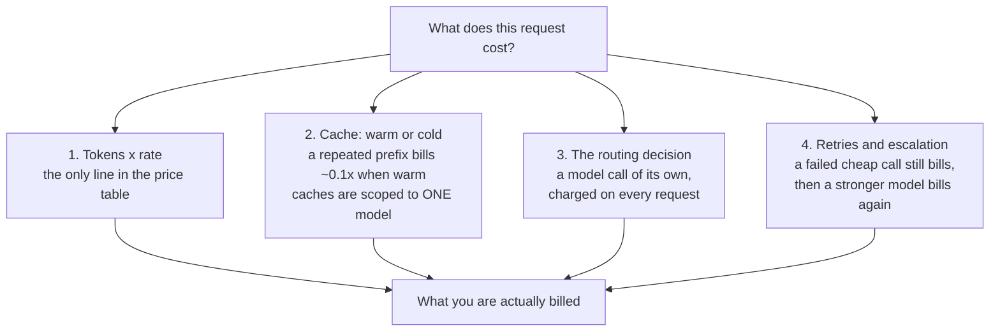
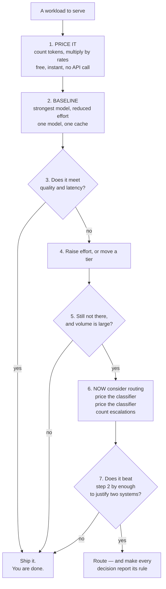

# Build 01 — Model Selection: The Decision That Outlives the Model List

**Covers:** the three tiers and the three dimensions they trade off (**intelligence · speed · cost**) → matching a model to a task → **smart routing**, the optimisation everyone reaches for first → the four things a price table leaves out (**effort**, **model-scoped caches**, **the classifier's own bill**, **cost per *completed* task**) → a router that reports the rule behind every decision → what a bench says when you actually measure it.

**Goal:** stop treating model selection as a lookup against a price table. By the end you can price a workload before spending anything, you know which lever to pull *first*, and you can defend the choice in a design review — including the case for not routing at all.

**Before you start:** [Build 00 — Foundations](../00-foundations/BUILD.md) explains what a harness is and why this track is Claude-native; [its SETUP](../00-foundations/SETUP.md) gets you running. Half of this build needs no API key at all.

**Run it in the browser:** [](https://colab.research.google.com/github/sunilmogadati/production-ai-engineering/blob/main/notebooks/hello_model_selection.ipynb) — nothing to install.

**Where this sits:** first build of the Build Track. Pairs with the runnable build in this folder: five steps in [`steps/`](steps/) you run live, and a bench in [`src/`](src/) that runs with **no API key at all**.

---

## Part 0 — Where this sits

A model takes text and returns text; everything that makes it a system is the **harness** you write
around it — the loop, the tools, the context strategy, the configuration. [Build 00](../00-foundations/BUILD.md)
defines that in full, with the diagram.

This build is the **configuration** corner of it, and specifically one dimension: *which model, at
what effort.* It comes first because every later decision assumes a model has already been chosen,
and because it is the piece teams get wrong earliest and most expensively.

---

## Part 1 — The problem: the model list is already out of date

Here is the table every introduction to a model family ends with.

| Tier | Model | Input $/MTok | Output $/MTok | Context |
|---|---|---|---|---|
| Large | `claude-opus-5` | $5.00 | $25.00 | 1M |
| Mid | `claude-sonnet-5` | $2.00 | $10.00 | 1M |
| Small | `claude-haiku-4-5` | $1.00 | $5.00 | 200K |

*Rates verified 2026-09-16.*

Three tiers, priced in order. And the conclusion that follows feels obvious: most work is easy, the small tier is a fifth the price, so classify each request and send the easy ones down.

**Start with the uncomfortable part.** That table will be wrong within months. Model families ship on a cadence measured in weeks — names change, prices move, and the relationship between tiers changes with them. A course, a blog post, or a doc built on a *specific list of models* has a shelf life, and anything you memorised about which model is "the fast one" expires with it.

So we are not going to teach the table. We are going to teach the **decision procedure**, which does not expire — and then run it against today's table.

> **The one-line frame:** the model list is a fact with an expiry date. The **way you choose** is the part worth learning, because it survives the next release.

---

## Part 2 — The three dimensions, and the one that lies

Every model is described on three axes:

- **Intelligence** — how well it handles reasoning, nuance, and multi-step problems.
- **Speed** — latency. How long the user waits.
- **Cost** — dollars per million tokens, in and out.

Two of those are honest. **Cost is not a dimension — it is four line items**, and a price table shows you one of them.



Lines 2, 3 and 4 appear in no tier table anywhere. They are also the three that decide whether routing is worth doing — which is why the obvious optimisation so often disappoints.

### Is caching automatic, or something you do?

**Something you do.** This is the most common wrong assumption about the cache line, and it is worth
being exact, because a team that believes caching is automatic never checks whether it is working.

Nothing is cached by default. You mark a **breakpoint** in the request, and everything *before* that
point becomes cacheable:

```python
response = client.messages.create(
    model="claude-opus-5",
    max_tokens=2000,
    system=[{
        "type": "text",
        "text": LARGE_STABLE_INSTRUCTIONS,      # the part worth caching
        "cache_control": {"type": "ephemeral"}, # <- the breakpoint. Without it: nothing caches.
    }],
    messages=[{"role": "user", "content": todays_question}],   # after the breakpoint, never cached
)
```

**What you control:**

| Lever | What it does |
|---|---|
| **Where the breakpoint goes** | everything before it is cacheable; up to 4 breakpoints per request |
| **What sits before it** | ordering is yours: stable content first, volatile content last |
| **TTL** | ~5 minutes by default; `{"type": "ephemeral", "ttl": "1h"}` for an hour |
| **Whether to use it at all** | omit `cache_control` and you pay full rate on every token, every time |

**What you do not control:** the storage, eviction, or the multipliers (~0.1× to read, ~1.25× to write).

**It is a prefix match, and that is the whole trap.** Any byte that changes *before* the breakpoint
invalidates everything after it. A timestamp in the system prompt, a UUID, an unsorted `json.dumps`,
a tool list that varies by request — each silently drops your hit rate to zero with no error
anywhere. The check is one line:

```python
print(response.usage.cache_read_input_tokens)   # zero across repeated calls => something is invalidating it
```

**And it is per-model.** Each model keeps its own cache, which is the mechanism behind the router's
extra cold starts — measured at 0.07% here, so small, but the reason the row exists.

**Other providers have equivalents**, with different ergonomics — some automatic, some opt-in like
this. The portable lesson is not the syntax: it is that **a repeated prefix is a cost lever you
control**, and that not checking `cache_read_input_tokens` is how teams pay full price for months.

---

### Who decides "complexity", and against what?

A **second model call** decides it — and there is nothing to check its answer against.

Look at what `04_route.py` actually does: it sends the task to the cheapest tier and asks for a digit
from 1 to 5. That is a model **judging a task it has not performed**, before anyone knows how hard it
turned out to be. There is no ground truth at routing time, by construction — if you already knew the
difficulty, you would not need to ask.

So the router's input is an **unvalidated model output**, with a price, a latency, and a failure mode
of its own. You can only measure its accuracy **offline, afterwards**: take a sample, record what the
classifier said, record what actually happened, and compare. Nothing measures it live.

**And here is what our bench says about that** — reported because it is uncomfortable, not despite it.
Sweeping classifier accuracy:

| Accuracy | Misrouted / 200 | Router total |
|---|---|---|
| 1.00 (perfect) | 0 | $20.44 |
| 0.90 | 20 | $20.55 |
| 0.82 | 29 | $20.42 |
| 0.70 | 59 | $20.47 |
| **0.50 (a coin flip)** | 92 | **$19.37** |

A coin-flip classifier comes out **cheaper**. That is not a finding that accuracy is irrelevant — it is
**the cost model failing, and it is the most important thing on this page.**

A misrouted hard task is priced here as *(cheap call + probability-of-failure × escalation)*. But the
genuinely worst outcome is a weak model returning a **confident wrong answer that nobody catches**.
That costs **$0** in this model and the most in production. Cost-only analysis is structurally blind
to it.

> **Misclassification's real price is quality, not dollars — and quality is `UNMEASURED` across this
> entire build.** Anyone who justifies a router on cost arithmetic alone has proven nothing about the
> thing that actually decides it.

### So how do you pick the thresholds?

The ones in `policy.py` — complexity ≤ 2 to the small tier, ≤ 3 to the mid — are **hand-picked
constants**. They are a starting point, not a derivation, and the doc would be lying to present them
as anything else.

The principled version is a break-even. Route down when:

```
cost_cheap  +  P(fail) × cost_escalation   <   cost_strong
```

Rearranged, route down while:

```
P(fail)  <  (cost_strong − cost_cheap) / cost_escalation
```

Put our numbers in — roughly $0.108 per task on the strong tier, $0.02 on the small one, escalation
back to strong at $0.108 — and the tolerance is about **0.8**. On cost alone you could accept an
**80% failure rate** before routing down stops paying.

That number should stop you. **It is the same blind spot again**: cost arithmetic permits a tier that
fails four times in five, because it never prices the wrong answer. So use the break-even to find the
*ceiling*, then set the real threshold from a quality bar you measured — the point where the small
tier's answers stop being good enough on **your** tasks, which is always lower.

**Cost sets the ceiling. Quality sets the threshold.**

### Is conversation history shared across models?

**Yes — because the API is stateless and you are holding the history anyway.** Nothing server-side
remembers a conversation. Every request carries the full `messages` array, so sending it to a
different `model` string is mechanically trivial. Mid-conversation switching works.

Four things make it lossy, though, and all four are the harness's problem:

| | What happens when you switch |
|---|---|
| **Prompt cache** | Caches are **per-model**. Switching means a cold cache and a re-write of the prefix. |
| **Thinking blocks** | Bound to the model that produced them. Another model **silently drops** them — no error, just lost reasoning. |
| **Context window** | Tiers differ (200K vs 1M). A conversation that outgrew the small tier's window **cannot go back to it**. |
| **Style and calibration** | Tiers phrase, hedge and format differently. A visible seam mid-conversation is a real product defect. |

So: portable, not free. This is why routing sits most naturally at the **task** boundary — one
decision, one model, one coherent conversation — rather than switching turn by turn inside a live
exchange.

### So where does routing actually live?

**Not in the API, and not in Claude Code.** There is no routing feature to switch on.

- **The Claude API** takes a `model` string per request. That is the entire mechanism. Choosing which
  string to send is **your application's code** — that is literally all `04_route.py` is.
- **Claude Code** lets *you* pick a model (`/model`, or config) for your session. That is a developer
  preference, not a request router.
- **Gateways** (LiteLLM, OpenRouter) do offer routing as a product feature — rules, fallbacks, spend
  caps — sitting in front of any SDK. If you want routing as infrastructure rather than application
  code, that is the layer. See [ML Study 13h](../../study-docs/ML_Study_13h_LLM_Gateways.md).

So: `02_three_tiers.py` shows the *mechanism* (same request, different `model` string, three results
you can compare), and `04_route.py` shows the *policy* (a rule deciding which string to send). Both
are ordinary code you own — which is exactly why this build can ask whether it earns its place.

> **The one-line frame:** a price table tells you what a **token** costs. It does not tell you what the **work** costs, and those two numbers rank your options differently.

---

## Part 3 — The claim, and how to test it

You will read everywhere — vendor docs, courses, conference talks — that routing simple work to a small model saves **80% or more**.

That number is not a lie. It is achievable. It requires three conditions to hold at once:

1. Almost all of your traffic is genuinely trivial.
2. There is little or no repeated prefix, so splitting the cache costs nothing.
3. The small tier almost never fails, so almost nothing escalates.

Break any one of them and the number collapses. **80% is a property of a workload, not a fact about routing.** Someone measured it on theirs. The engineering question is what it is on yours.

So we measure. `src/bench.py` in this folder prices 200 synthetic tasks across seven configurations, offline, from published rates. Here is what it produced:

| Configuration | Models | Calls | Classifier | Escalations | **Total** |
|---|---|---|---|---|---|
| router (policy cascade) | 3 | $18.87 | $0.05 | $1.53 | **$20.44** |
| opus only @ high effort | 1 | $20.13 | — | $1.48 | **$21.61** |
| **opus only @ low effort** | 1 | $18.50 | — | $1.39 | **$19.89** |
| **sonnet only @ high** | 1 | $8.05 | — | $4.12 | **$12.18** |
| haiku only @ high | 2 | $7.77 | — | $7.39 | **$15.16** |
| router, caching disabled | 3 | $20.28 | $0.05 | $1.65 | **$21.98** |

Four readings, and the first one is the lesson:

**1. The router saved 5.4% — and lost to one model at lower effort.** Against the naive full-effort baseline it wins. Against the *same model with one parameter changed*, it is 2.8% more expensive, and that configuration saves 8.0% on its own. One model, one cache, no classifier, no second failure mode, and a better number.

**2. Caching was worth more than routing was — and it is available on every path.** Turn caching off and the router's bill rises $1.53, **7.0%**. Routing itself saved 5.4%. One parameter, settable on *any* configuration, beat the whole architecture. And splitting a cache across three models costs almost nothing — **$0.015, or 0.07%** — a few extra cold starts, not a recurring tax. Caching is not an argument against routing; it is an argument that **the cheap multipliers move more money than the tier you pick.**

**3. The cheapest tokens produced an expensive outcome.** Haiku has the lowest rate of the three. **48.7% of its bill is escalation** — work it attempted, failed, and handed upward, having already been paid for.

**4. The genuinely cheapest option was the least sophisticated.** One mid-tier model, no routing logic at all: **43.7% below** the naive baseline.

### The two myths, and what our numbers actually say

You will meet both of these in any introduction to a model family. Neither is wrong. Both are
incomplete in the same direction.

**Myth 1 — "bigger is always better."** True that it is a myth: on an easy task the small tier is
often indistinguishable, faster, and a fifth the price. But the correction has its own failure mode,
and our bench found it. **Haiku had the lowest rate of the three and the second-worst cost per
completed task**, because 48.7% of its bill was escalation — work it attempted, failed, and handed
upward, having already been paid for. "Bigger is always better" is wrong. **"Cheaper is cheaper" is
wrong in the same way**, and it is the error you make second.

**Myth 2 — "cost is the only difference."** Also right, and it is the dimension this build is
weakest on. Latency is a real constraint: for an interactive surface, a fast adequate answer beats a
slow excellent one, and no amount of cost arithmetic tells you that. **Our bench cannot see it** —
cost is arithmetic, latency is empirical. That is why every bench row says `UNMEASURED` for latency
rather than guessing.

You measure it in the steps instead. `02_three_tiers.py` and `03_effort.py` **time every call**, so
the latency numbers you see there are real ones from your own machine. Watch what effort does to the
clock, not just to the bill — on an interactive path that may be the number that decides.

---

> **The one-line frame:** the 80% claim and our 5.4% are both true, of different workloads. **Measure the simple fix before you build the sophisticated one.**

---

## Part 4 — The procedure

This is the part that survives the next model release.



Step 2 is where most teams go wrong, by skipping it. They compare routing against the *naive* default — strongest model, full effort — which is a baseline nobody should be running. Beating it proves very little.

Two hard constraints sit outside the procedure and override it:

- **Context window.** A model that cannot hold the input is not a cheaper option; it is a different failure. Check fit before cost.
- **Latency.** If the large tier cannot meet your response budget, routing buys you *time*, not money — a completely different justification, and a legitimate one.

> **The one-line frame:** price it, baseline one model at reduced effort, and make routing **earn its place** against that — not against a default nobody should be running.

---

## Part 5 — The decision you would defend

A design review asks: *why is there no router?* "Routers are overrated" is not an answer. This is:

1. **We measured the one-model baseline first** — strongest model at reduced effort, on our traffic.
2. **We priced the multipliers first.** Caching is on, and effort is tuned. Those move more money than the tier choice, and they apply whatever we decide here.
3. **We counted escalations, not calls.** Cost per completed task, with failed cheap calls charged twice.
4. **We know what we have not measured**, and we said so rather than quoting a plausible number.

And the conditions under which the answer flips, stated in advance — because a decision with no reversal condition is just a belief:

- A **large, genuinely trivial** share of traffic, with low escalation.
- A **small or absent shared prefix**, which removes the cache penalty.
- A **latency requirement** the large tier cannot meet.

> **The one-line frame:** the defensible position is not a verdict on routing — it is **the baseline you measured, the mechanism you priced, and the condition under which you would change your mind.**

---

## Run it

Five steps, one idea each — see [`steps/README.md`](steps/README.md):

```bash
# from the repo root, once:
python3 -m venv .venv && source .venv/bin/activate && pip install anthropic

export ANTHROPIC_API_KEY=sk-ant-...
cd builds/01-model-routing/steps
python3 01_one_call.py      # one call, and what it cost
python3 02_three_tiers.py   # same work, three tiers
python3 03_effort.py        # the lever inside one model
python3 04_route.py         # a router that reports its rule
python3 05_price_first.py   # price before you spend
```

Already made the venv? `source .venv/bin/activate` from the repo root is all you need.

No key? The full bench runs offline — cost is arithmetic:

```bash
cd src && python3 bench.py
```

The deeper write-up, including how the bench models cache warmth and escalation, is in [README.md](README.md).

---

## Quick reference / glossary

| Term | Meaning |
|---|---|
| **effort** | request-level control trading thoroughness against spend *within one model* — the lever to try before a second model |
| **prompt cache** | a warm copy of a repeated prefix, billed ~0.1× on read, ~1.25× to write — **scoped to one model** |
| **cache affinity** | routing for locality because a miss costs more than the cheaper rate saves |
| **classifier tax** | the cost of deciding where to route, charged on every request including ones headed for the expensive tier |
| **escalation** | a failed cheap call handed upward; the task pays for both |
| **cost per completed task** | total spend ÷ tasks *finished* — the only unit that survives retries |
| **context window** | a hard constraint, never a preference |
| `response.usage` | what the call actually consumed — the only honest basis for a cost figure |
| `count_tokens` | prices the input side *before* you spend anything |

---

*Build 01 — the model list expires; the decision procedure does not. Cost is not one number but four: tokens × rate, cache warmth, the routing decision itself, and escalation — and a price table shows you only the first. So price the workload before spending (arithmetic, free), baseline the strongest model at reduced effort (one model, one cache, one failure mode), and make routing earn its place against **that** rather than against a default nobody should run. On our bench the router beat the naive baseline by 5.4% and **lost to the same model at low effort**, while simply turning caching on was worth 7.0% — more than routing saved, and available on every path. The widely-quoted 80% saving is real on some workload; it is a property of that workload, not of routing. Measure yours. And make every routing decision carry the rule that produced it, so a reviewer argues with the policy instead of the outcome.*
