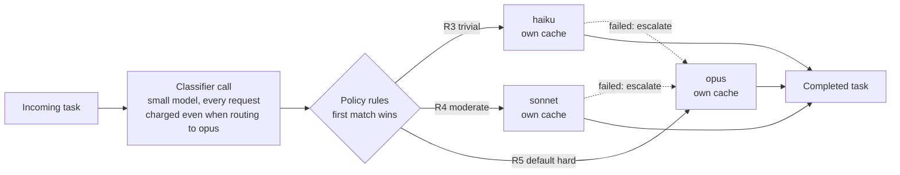
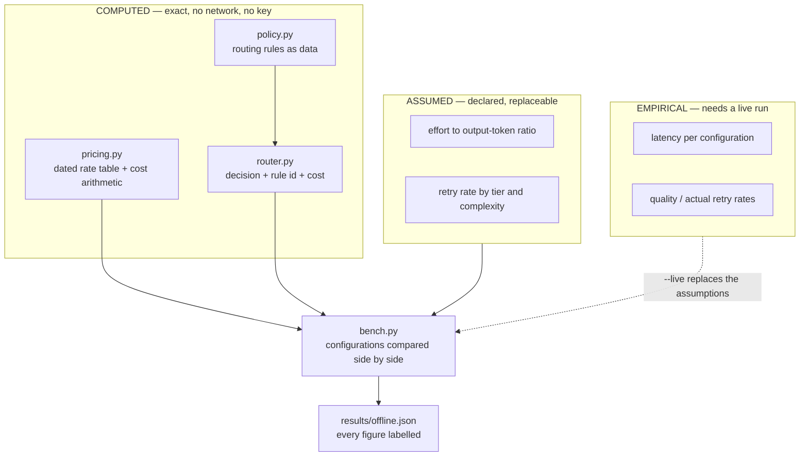

# Build 01 — Model Routing: Picking the Model Is an Engineering Decision

**Covers:** the tier table everyone starts with (**intelligence / speed / cost**) → why **routing cheap work to a cheap model** is the first optimisation every team reaches for → the four things that table leaves out — **effort as a lever inside one model**, **model-scoped prompt caches**, **the classifier's own bill**, and **cost per *completed* task** → building a router whose every decision carries **the rule that made it** → a **bench** that makes the router compete against one model at lower effort → reading the result honestly, including **which numbers you cannot know without spending money.**

**Goal:** stop treating model selection as a lookup against a price table. Price the workload before you spend anything, make the routing policy something a reviewer can argue with, and find out whether you needed a router at all — because on this workload, under stated assumptions, **the router lost to a single model at lower effort.**

**Series context:** the first build of the Build Track. Where [ML Study 13b](../../study-docs/ML_Study_13b_MCP.md) standardised how an agent *reaches* a tool, this is one layer below: which model is on the other end of the call, and what that choice actually costs once caching, retries, and the routing decision itself are on the invoice. Everything here runs with no API key — the cost half of the question is arithmetic, and arithmetic is free.

---

## Part 1 — The problem: the tier table is true and incomplete

Every introduction to a model family ends with the same table. Three tiers, ordered by capability and price:

| Tier | Model | Input $/MTok | Output $/MTok | Context |
|---|---|---|---|---|
| Large | `claude-opus-5` | $5.00 | $25.00 | 1M |
| Mid | `claude-sonnet-5` | $2.00 | $10.00 | 1M |
| Small | `claude-haiku-4-5` | $1.00 | $5.00 | 200K |

*(Rates taken 2026-09-16 from published pricing. The table in `src/pricing.py` records that date — a rate table with no date is one nobody can tell is stale.)*

Then comes the conclusion that feels obvious: most work is easy, the small tier is a fifth the price, so classify each request and send the easy ones down. Free money.

It is the first thing a team tries. It is also one of the first things that quietly costs them, because the table is silent on four things that decide the answer:

- **Effort is a lever *inside* one model.** The current generation exposes a request-level effort control that trades thoroughness against token spend without changing models. Lowering effort on a strong model is a one-line change to one system. Routing is a second model, a second set of failure modes, a second eval baseline, and a classifier.
- **Prompt caches are scoped to a model.** Your system prompt and tool definitions are the same bytes on every request, and a warm cache bills them at roughly a tenth. Split traffic across three models and you are warming three caches instead of one.
- **The classifier is not free.** Something has to decide where to route, and that something is a model call — charged on every request, including the ones that route to the expensive model anyway.
- **Cost per request is the wrong unit.** A cheap call that produced an answer you had to redo is not a cheap call. The unit is cost per *completed* task, and a failed cheap call usually escalates rather than repeating.

> **The one-line frame:** the tier table tells you what a **token** costs on each model. It does not tell you what the **work** costs — and those two numbers rank the options differently.

---

## Part 2 — The pattern underneath: this is a cache-affinity problem wearing a pricing costume

Strip the LLM vocabulary and the shape is one every backend engineer already knows.

You have a fleet of workers at different price-performance points. Each worker holds a **warm local cache** of a large shared prefix. Routing a request to a cheaper worker gains you a lower unit rate and costs you a **cache miss** — and a miss on a 4,000-token prefix is not a rounding error when it happens on every first request to every model.

That is a **cache-affinity** problem. Distributed systems have a settled answer: *route for locality unless the price difference exceeds the miss cost.* Sticky sessions exist for exactly this reason, and so does the rule that you do not shard a hot key to save on disk.

The second familiar shape is the **classifier tax**. Any tiered system that decides where work goes pays for the deciding. In a load balancer the decision is nanoseconds of hashing and you ignore it. Here the decision is a network round trip to a language model. It is small per request (**0.25% of the router's total bill** in the run below) and it is charged on requests that were always going to the expensive tier anyway. Small and relentless is how a tax works.



The dotted lines are the ones that decide the outcome. A cheap call that fails does not repeat — it escalates, and the task pays twice.

> **The one-line frame:** routing across models is **cache-affinity routing with a classifier tax and an escalation path.** Price it the way you would price a sharding decision, not the way you would read a menu.

---

## Part 3 — Architecture: separate what you can prove from what you must measure

The build splits cleanly along one line, and that line is the reason it can make honest claims:



**Cost is arithmetic.** Token pricing is multiplication over a published table. `pricing.py` never touches the network, which means the cost half of the question is provable with no spend at all — and the tests verify it against hand-computed values.

**Latency and quality are not.** No amount of reasoning produces them. They are marked `UNMEASURED` in the report and stay that way until someone runs `--live`.

**Two inputs sit in between, and they are the ones that decide the ranking:** how much effort changes output tokens, and how often each tier needs a second attempt. The bench declares both in an `ASSUMPTIONS` block that is echoed into every report, so a reader can see exactly what the conclusion rests on. They are placeholders. **They are also the most important numbers in the build**, which is the honest lesson: the decision turns on a number you have to measure on your own workload.

### The decision that carries its reason

The router returns a `Decision`, never a bare model name:

```python
@dataclass(frozen=True)
class Decision:
    model_id: str              # what was chosen
    rule_id: str               # WHICH RULE chose it  <- the point
    rule_why: str              # in plain English
    routed_cost_usd: float
    classifier_cost_usd: float # never folded into the line above
```

A bare model name is an instruction. A model name plus the rule that produced it is an **argument**, and an argument can be reviewed by the person whose budget it is — someone who will never open `router.py`. The test suite enforces it: a decision without a rule fails the build.

The policy itself is data, an ordered list where first match wins, so ordering is visibly part of the policy:

```python
{
    "id": "R3-trivial",
    "why": "Classification and extraction at this complexity do not repay a larger model.",
    "when": {"max_complexity": 2},
    "route_to": "haiku",
}
```

One rule earns special mention. `R1-context-overflow` exists because **a context window is a hard constraint, not a preference**. Routing a 400,000-token input to the small tier on the grounds that the task is easy does not produce a cheap answer; it produces a runtime failure. The router guards it and reports the guard as its own rule rather than silently correcting — a silent correction is a routing policy that lies about what it did.

> **The one-line frame:** make the provable part provable offline, declare the assumed part where a reader can see it, and never let a decision leave the system without the rule that made it.

---

## Part 4 — The result: the router lost to one model at lower effort

200 synthetic tasks, weighted toward easy work the way real traffic is. Full output in `results/offline.json`; reproduce with `python3 src/bench.py`.

| Configuration | Models | Calls | Classifier | Escalations | **Total** | Per task |
|---|---|---|---|---|---|---|
| router (policy cascade) | 3 | $18.87 | $0.05 | $1.53 | **$20.44** | $0.1022 |
| opus only @ high | 1 | $20.13 | — | $1.48 | **$21.61** | $0.1081 |
| opus only @ medium | 1 | $19.24 | — | $1.43 | **$20.67** | $0.1034 |
| **opus only @ low** | 1 | $18.50 | — | $1.39 | **$19.89** | $0.0995 |
| **sonnet only @ high** | 1 | $8.05 | — | $4.12 | **$12.18** | $0.0609 |
| haiku only @ high | 2 | $7.77 | — | $7.39 | **$15.16** | $0.0758 |
| router (caching disabled) | 3 | $20.28 | $0.05 | $1.65 | **$21.98** | $0.1099 |

**All cost figures are COMPUTED** from published rates under the assumptions in the report. **Latency and quality are UNMEASURED.**

Four things fall out, and the first one is the reason this build exists:

**1. The router beat the naive baseline — and lost to the simpler fix.** Against `opus @ high` the router saves **5.4%**. Against the same model at **low effort** it is **2.8% more expensive**, and that configuration saves **8.0%** on its own. One parameter, one model, one cache, no classifier, no second failure mode — and a better number. A team that reaches for a cascade first has skipped the cheaper experiment.

**2. Caching was worth more than routing was — and it applies to every configuration.** Turn caching off and the router's bill rises **$1.53, or 7.0%**, against the 5.4% routing itself saved. Splitting the cache across three models, by contrast, costs **$0.015 — 0.07%**: a handful of extra cold starts, not a recurring tax. The lesson is not that caching penalises routing. It is that **the cheap multipliers — caching, effort — move more money than the architecture does.**

**3. The cheapest model produced an expensive outcome.** Haiku has the lowest per-token rate of the three. **48.7% of its total bill is escalation** — work it attempted, failed, and handed to a stronger model, having already been paid for. Its per-token rate was the best available and its cost per completed task was worse than the mid tier's.

**4. The genuinely cheapest option was not the sophisticated one.** `sonnet only @ high` came in at **$12.18 — 43.7% below** `opus @ high` and 40% below the router. No routing logic, no classifier, one cache.

### What this result is not

It is **not** "routing loses." Reverse the assumed retry rates and the ranking reverses with them. The honest conclusion is narrower and more useful:

> The ranking of these options is decided by two numbers — **how much effort changes output tokens**, and **how often each tier actually fails your work.** Neither is in any pricing table. Both are cheap to measure on your own traffic and expensive to guess. The bench's real output is not the totals; it is the demonstration that the totals move when those two inputs move.

Which is why they are labelled `ASSUMED` in the report rather than presented as findings, and why `--live` exists and has not been run here.

> **The one-line frame:** the router beat the baseline nobody should have been using, and lost to a one-parameter change on a single model. **Measure the simple fix before you build the sophisticated one.**

---

## Part 5 — The decision you would defend

A design review asks: *why is there no router?* The answer that holds up is not "routers are overrated." It is evidence, in this order:

1. **We measured the one-model baseline first.** One model at reduced effort, on our traffic. That is the number a cascade has to beat, not the naive full-effort default.
2. **We priced the multipliers first.** Caching on, effort tuned. Both move more money than the tier choice, and both apply whatever we decide here.
3. **We counted escalations, not calls.** Cost per completed task, with failed cheap calls charged for both attempts.
4. **We know what we did not measure.** Latency and quality figures are outstanding, and we have said so rather than quoting a plausible number.

And the conditions under which the answer flips — stated in advance, because a decision with no reversal condition is a belief:

- A **large, genuinely trivial** share of traffic — high volume, low complexity, low escalation — where the small tier's rate dominates everything else.
- A **small or absent shared prefix**, which removes the cache penalty entirely.
- A **latency requirement** the large tier cannot meet, where routing buys response time rather than money. *(This build cannot yet speak to that: latency is `UNMEASURED`.)*

> **The one-line frame:** the defensible position is not a verdict on routing — it is **the baseline you measured, the mechanism you priced, and the condition under which you would change your mind.**

---

## Run it

See [RUNBOOK.md](./RUNBOOK.md). The offline path needs no API key and no credentials of any kind.

---

## Quick reference / glossary

| Term | Meaning |
|---|---|
| **effort** | request-level control trading thoroughness against token spend *within one model*; the lever to try before a second model |
| **prompt cache** | a warm copy of a repeated prefix billed at roughly 0.1× on read, ~1.25× to write — **scoped to a single model** |
| **cache affinity** | routing for locality because a miss costs more than the cheaper unit rate saves |
| **classifier tax** | the cost of deciding where to route, charged on every request including ones routed to the expensive model |
| **escalation** | a failed cheap call handed to a stronger model; the task pays for both |
| **cost per completed task** | total spend divided by tasks finished — the only unit that survives contact with retries |
| **context window** | a hard constraint, never a preference; a model that cannot hold the input is not a cheaper option |
| `Decision` | model + **rule id** + reason + cost; the router never returns less |
| **COMPUTED / ASSUMED / UNMEASURED** | the three labels every figure in this build carries |
| `src/pricing.py` | dated rate table and cost arithmetic; no network |
| `src/policy.py` | routing rules as editable data, first match wins |
| `src/bench.py` | configurations compared side by side, offline by default |

---

*Build 01 — model selection is not a lookup against a price table; it is a **cache-affinity decision with a classifier tax and an escalation path**. Cost is arithmetic and provable offline, so price the workload before you spend anything. Latency and quality are empirical and must be measured. Between them sit two assumed inputs — **what effort does to output tokens** and **how often each tier actually fails your work** — and those two numbers, not the published rates, decide the ranking. On this workload the router beat the naive full-effort baseline by 5.4% and **lost to the same model at low effort**, while simply having caching on was worth 7.0% — more than routing saved, and available on every path. Measure the one-parameter fix before you build the two-model one, and make every decision carry the rule that produced it, so a reviewer can argue with the policy instead of the outcome.*
