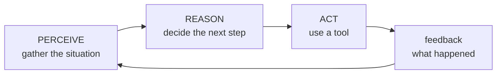
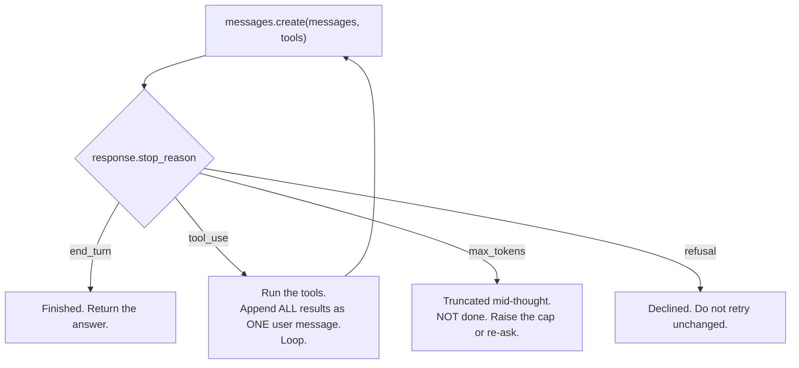

# Build 02 — The Agent Loop: Who Decides When To Stop

**Covers:** the **perceive → reason → act** cycle everyone draws → what that actually is in the API (**`stop_reason`**) → the minimal loop, in about twenty lines → why the model **cannot stop itself** and the loop is therefore yours → **bounding** it: iteration cap, cost ceiling, wall clock → what happens when a tool fails, and the three mistakes that quietly train the model to behave worse.

**Goal:** be able to write the agentic loop from scratch, say exactly which condition ends it, and state what it costs in the worst case — before you run it.

**Where this sits:** second build of the Build Track. [Build 01](../01-model-routing/BUILD.md) chose *which model*. This chooses *how many times you call it* — and that number, not the tier, is what turns a cents-per-request system into a surprise.

---

## Part 1 — The diagram everyone draws, and what it leaves out

Every introduction to agents draws the same cycle:



It is a true picture and a useless one, because it does not say **who runs it**.

Read it naively and you picture the model looping — perceiving, thinking, acting, going round again. That is not what happens. **The model answers once and stops.** It has no memory of the last call, no ability to run your code, and no way to call itself again.

Every arrow in that diagram is **your code**:

| The diagram says | Your code actually does |
|---|---|
| perceive | assemble a `messages` array and send it |
| reason | *(the model's single turn — the only part that is not yours)* |
| act | read the tool request, **run the function yourself** |
| feedback | append the result and **send the whole thing again** |
| loop | a `while` statement you wrote, with a condition you chose |

The model is a **pure function** called repeatedly. The loop is the harness.

> **The one-line frame:** perceive-reason-act is not something the model does. It is **a loop you write around a function that answers once and stops.**

---

## Part 2 — The pattern underneath: it is a state machine with a remote transition function

Strip the AI vocabulary and this is a shape you have written before.

You hold the state — the conversation. You call out to something that inspects the state and returns a **transition**: either a terminal value, or a request for work. If it is a request, you perform the side effect, fold the result back into the state, and call again.

That is a **state machine whose transition function lives on a network**, and the familiar rules apply: the transition is not free, it is not instant, it can fail, and **it cannot be trusted to terminate.**

The transition is reported in one field:



**`stop_reason` is the whole mechanism.** `end_turn` means finished; `tool_use` means it wants something from you and will continue when it has it.

The two on the right are where naive loops break. A loop written as `while stop_reason == "tool_use"` treats **every** other value as success — so a response truncated at `max_tokens` gets returned to the user as a finished answer, silently. It is not finished. It stopped mid-sentence because it ran out of room.

> **The one-line frame:** the loop is a state machine over `stop_reason`. **Handle every terminal value, not just the happy one** — silence on the others looks exactly like success.

---

## Part 3 — Architecture: the loop, and the three bounds around it

The loop itself is small. Roughly:

```python
while True:
    response = client.messages.create(model=..., messages=messages, tools=TOOLS)
    messages.append({"role": "assistant", "content": response.content})

    if response.stop_reason != "tool_use":
        break                                   # end_turn, max_tokens, refusal -- all handled below

    results = [run_tool(b) for b in response.content if b.type == "tool_use"]
    messages.append({"role": "user", "content": results})   # ALL of them, ONE message
```

That is a working agent. It is also, as written, **a system with no upper bound on what it can spend**, and that is the part worth engineering.

### Three bounds, because they fail differently

| Bound | Catches | What it looks like when it saves you |
|---|---|---|
| **Iteration cap** | a model that keeps calling tools without converging | stops at turn 12 instead of turn 400 |
| **Cost ceiling** | a few *huge* turns rather than many small ones | stops at $2.00 spent, whatever the turn count |
| **Wall clock** | a slow tool, a hung request, a retry storm | stops after 90s so a user is not waiting forever |

An iteration cap alone is the common mistake. Ten turns sounds safe until one of them carries a 400,000-token context, and ten *bounded iterations* is an *unbounded bill*. **Cost is the bound that actually protects the invoice; iterations protect the logic.**

### The context grows every single turn

Each pass appends the assistant message *and* the tool results, then resends **everything**. Turn 10 pays for turns 1 through 9 again. Cost per turn is not flat — it climbs, and roughly quadratically over the run. That is why Build 04 is about context strategy, and why the cost ceiling belongs here rather than there.

### Three mistakes that make the model behave worse

**Splitting parallel tool results across messages.** One assistant turn may request several tools. Return **all** results in a **single** user message. Splitting them teaches the model, over the conversation, to stop making parallel calls — you lose the concurrency and never see an error.

**Dropping a failed tool.** If a tool raises, return a `tool_result` with `is_error: true`. Omitting it leaves a dangling `tool_use` with no result, which is an invalid conversation. Tell it the truth and it will usually adapt.

**Assuming the tool ran once.** A retried turn can re-execute a tool you already ran. If the tool books, charges, sends, or deletes, that is a real second side effect. **Make tools idempotent, or make the loop remember.**

> **The one-line frame:** the loop is twenty lines. **The engineering is the three bounds and the failure handling** — and the bound that protects the invoice is cost, not iterations.

---

## Part 4 — The decision you would defend

*"What stops this agent?"* is the question a design review should ask, and the answer is never "it finishes."

1. **It ends on `end_turn`** — and we handle `max_tokens` and `refusal` as distinct outcomes, not as success.
2. **It is bounded three ways** — iterations, dollars, seconds — because those are three different failures.
3. **We know the worst case.** Max iterations × max context × output rate. We computed it before shipping, using [Build 01's](../01-model-routing/BUILD.md) arithmetic.
4. **Our tools are idempotent, or the loop deduplicates.** We know which, per tool.
5. **When a bound trips, a human sees it.** A silent truncation is worse than a visible failure.

> **The one-line frame:** *"what stops this agent, and what does the worst case cost?"* If those two have no answer, there is no agent — only a loop.

---

## Run it

```bash
# from the repo root, once:
python3 -m venv .venv && source .venv/bin/activate && pip install anthropic

export ANTHROPIC_API_KEY=sk-ant-...
cd builds/02-agent-loop/steps
python3 01_single_turn.py    # the model answers once and stops
python3 02_stop_reason.py    # the four terminal values, provoked deliberately
python3 03_the_loop.py       # the minimal agent, ~20 lines
python3 04_bounded.py        # the three bounds, and one of them tripping
python3 05_failures.py       # a failing tool, and the errors that train it worse
```

Already made the venv? `source .venv/bin/activate` from the repo root is all you need.

---

## Quick reference / glossary

| Term | Meaning |
|---|---|
| **perceive-reason-act** | the textbook cycle. Every arrow is your code; only "reason" is the model. |
| `stop_reason` | the transition value: `end_turn`, `tool_use`, `max_tokens`, `refusal`. The whole mechanism. |
| **the loop** | your `while`, with a condition you chose. The model cannot call itself. |
| **iteration cap** | protects the logic — stops a non-converging agent |
| **cost ceiling** | protects the invoice — the one that actually matters |
| **wall clock** | protects the user — stops an agent nobody is still waiting for |
| `is_error: true` | how a failed tool is reported. Never drop the result. |
| **parallel tool use** | several `tool_use` blocks in one turn; all results go back in **one** user message |
| **idempotent tool** | safe to run twice, because a retried turn may do exactly that |

---

*Build 02 — perceive-reason-act is not something a model does; it is a loop you write around a function that answers once and stops. In the API that loop is a state machine over `stop_reason`, and the mistake that ships is handling only `tool_use` — so a `max_tokens` truncation is returned to a user as a finished answer. The loop itself is twenty lines; the engineering is everything around it. Bound it three ways, because iterations protect the logic, wall clock protects the user, and only a cost ceiling protects the invoice — ten bounded iterations of a growing context is still an unbounded bill. Return every tool result including the failures, keep parallel results in one message, and assume a retried turn may run a tool twice. The reviewable question is not "does it work" but **"what stops it, and what does the worst case cost?"***
