# Claude Study 01 — Agent Architecture, the Agent SDK, and Managed Agents

**Covers:** what the **CCDV-F** certification actually tests (blueprint + weights) → **agent architecture** as a *dynamic policy*, not a state machine → **workflow architecture** as the state machine it is, and why the two are complements → **multi-agent patterns** and when subagents genuinely pay → the **code harness** → the **four different ways** to build an agent on Claude (the distinction the course blurs) → the **Agent SDK** (`claude_agent_sdk.query` + `ClaudeAgentOptions`) → **PreToolUse / PostToolUse hooks** → **Managed Agents** (agent · environment · session · deployment · credential vault) → one exam-style judgment call worked end to end.

**Goal:** be able to stand at a whiteboard and answer *"should this be an agent, a workflow, or neither — and if it's an agent, whose loop runs it and whose machine does the work?"* Everything else in this document is a consequence of that one question.

**Series context:** the **first rung of the Claude track**. The ML series got as far as agents in the abstract — [Study 13](ML_Study_13_LangChain_Agents.html) (tools in the same file), [13a](ML_Study_13a_LangGraph.html) (the loop as a governable graph), [13b](ML_Study_13b_MCP.html) (tools from anywhere). This track asks the question those three deferred: **when you are building on Claude specifically, what does the vendor hand you, and what are you still on the hook for?** Built from the Claude Certified Developer — Foundations course (Andrew Brown / ExamPro, freeCodeCamp), chapters 1–9, cross-checked against the official Claude Platform docs because the course moves fast and the SDK has moved since.

---

## Part 0 — What the certification is, and what it actually tests

Before the engineering, the map. Anthropic's certification program is **role-based**, not tier-based — that is the first thing that trips up anyone coming from AWS or Azure, where you expect Foundations → Associate → Professional → Specialty on a single ladder.

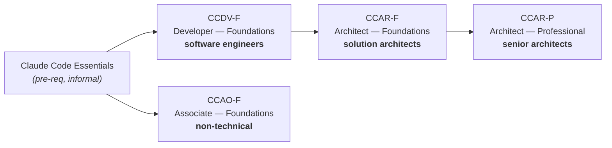

Four certifications, only **one** of which says "Professional". The others all say "Foundations" — and *Foundations here means role-scope, not difficulty*. The non-technical Associate is not an easy version of the Developer; it is a different job. Read the exam guide for the role you actually hold.

**The exam mechanics** (version 1, effective July 2026):

| Property | Value | What it means for you |
|---|---|---|
| Questions | **53** | An unusual number. Most exams use 60–65. |
| Duration | **120 min** exam / **150 min** seat | ~2.2 min per question. Not tight. |
| Pass mark | **720 / 1000**, scaled | ≈72%. You can afford roughly **14 wrong**. |
| Penalty for wrong | None | Never leave one blank. |
| Validity | **12 months** | Short. Budget for re-assessment. |
| Delivery | Pearson VUE, proctored | Test centre or online-proctored (desk sweep, screen share). |

**The blueprint** — and this is where you decide where your study hours go:

| # | Domain | Weight | ≈ Questions |
|---|---|---|---|
| 2 | **Applications and Integration** | **33.1%** | ~18 |
| 5 | **Model Selection and Optimization** | **16.8%** | ~9 |
| 1 | **Agents and Workflows** | **14.7%** | ~8 |
| 6 | Prompt and Context Engineering | 11.0% | ~6 |
| 8 | Tools and MCPs | 10.6% | ~6 |
| 7 | Security and Safety | 8.1% | ~4 |
| 3 | Claude Code | 3.1% | ~2 |
| 4 | Eval, Testing, and Debugging | 2.6% | ~1 |

Two readings of that table, and they point in opposite directions.

The **exam-taker's** reading: domains 2 + 5 + 1 are **64.6% of the paper**. Clear those three and you have passed before you reach the rest. Domain 3 (Claude Code) and domain 4 (evals) are worth **three questions combined** — do not spend a weekend there.

The **engineer's** reading: that weighting is *wrong about the real world*. Evals are 2.6% of this exam and roughly half of what separates a system that works from a demo that once worked. The blueprint is a contract about what gets asked, not a claim about what matters. Pass the exam against the weights; build against reality.

> **The one-line frame:** this is a **role-scoped** certification with a **lopsided blueprint** — two-thirds of the marks sit in three domains, and the domain that matters most in production (evals) is worth one question.

---

## Part 1 — Agent architecture: a dynamic policy, not a state machine

Here is the diagram everyone has seen, and because everyone has seen it, nobody looks at it.

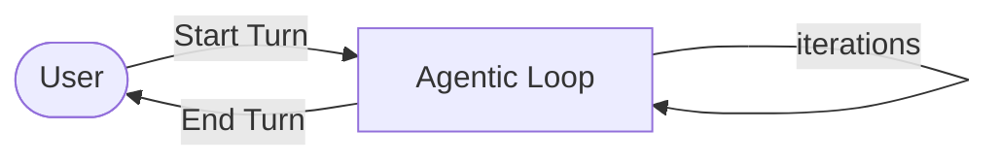

The user sends a request, which **starts a turn**. The loop then iterates — reason, act, observe, reason again — against its own goal criteria, and when *it* decides it is satisfied, it **ends the turn** and hands back. Control crosses the boundary twice: once in, once out. Everything in between the agent decides.

Which invites the natural-sounding description: *you define a state machine in the system prompt, and the agent manages its state from the message history.* That description **feels** right and is **wrong**, and the gap between those two is the single most useful idea in this chapter.

### What a real state machine in a prompt looks like

Take the course's example: an agent playing a multi-user dungeon. You could genuinely write the states out:

```text
Role: You are an autonomous MUD-playing agent.
Goal: Complete the assigned objective.

EXPLORE
  - Investigate rooms, navigate, and pursue the objective.
  - Enemy appears          → COMBAT
  - Health becomes low     → RECOVER
  - Objective completed    → DONE
COMBAT
  - Fight the current enemy.
  - Enemy defeated         → EXPLORE
  - Health dangerously low → RECOVER
RECOVER
  - Heal, rest, or retreat as needed.
  - Health restored        → EXPLORE
DONE
  - Return the final result and stop.
```

That works. You can draw it as boxes and arrows — Explore, Combat, Recover, Done — with labelled transitions. And **that is exactly the problem.** If the thing can be drawn as boxes and arrows, the boxes and arrows are code. You have paid model latency, model cost, and model non-determinism to execute a `switch` statement.

The right move when you find yourself here: **write the state machine in code, and call out to an agent from the one state that genuinely needs judgment.** `EXPLORE` might be open-ended enough to deserve a model. `RECOVER` is an `if health < threshold`. Do not buy an LLM to run an `if`.

### What agent architecture actually is

Now the same game, written the other way:

```text
Role: You are an autonomous MUD-playing agent.
Goal: Complete the assigned objective.

Use the available tools to inspect the world, navigate, interact with
characters and objects, manage resources, and overcome obstacles.

At each turn:
  - Evaluate the current situation and everything learned so far.
  - Decide the most useful next action.
  - Use tools as needed.
  - Adapt your plan based on the results.
  - Continue until the objective is complete or cannot reasonably be completed.

Avoid unnecessary actions and do not repeat actions unless new information
justifies it.
```

There are no states here. There is no diagram you can draw in advance. What you get at runtime is an **execution path**, and it is different every run:

```text
inspect room
  → realize objective requires an item
  → remember seeing a merchant
  → navigate to merchant
  → discover insufficient gold
  → find another way to earn gold
  → return
  → purchase item
  → navigate to objective
  → encounter locked door
  → investigate alternative route
  → …
```

Look at the third step. *Remember seeing a merchant.* No transition table contains that edge, because the edge did not exist until the agent noticed the merchant three steps earlier and then needed one. The path is **constructed**, not **traversed**.

What you wrote is not a state machine. It is a **dynamic policy**: a decision rule that chooses the next action *at runtime from the current context*, rather than following predefined transitions.

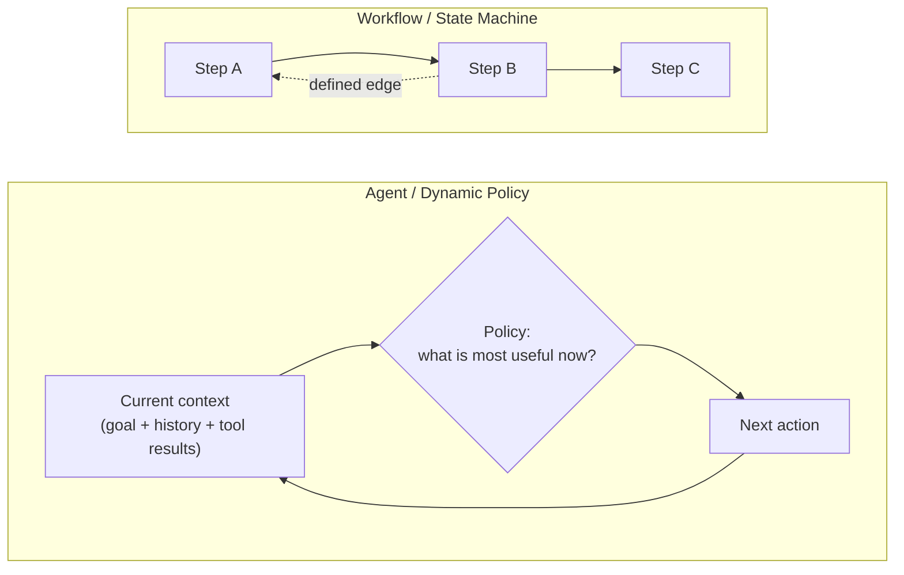

The practical test, and the one worth carrying into the exam and into design reviews:

**Can you enumerate the transitions before the system runs?**
- **Yes** → it is a workflow. Build it in code. Cheaper, faster, deterministic, testable.
- **No** → it is an agent. You are buying runtime judgment, and paying for it in cost, latency and variance.

> **The one-line frame:** a workflow **traverses** a graph you drew; an agent **constructs** a path you could not have drawn. If you can draw it, don't buy a model to walk it.

---

### Does the model *decide* to call a tool, or did we tell it to?

It decides. This is worth pinning down because it is the moment the abstract phrase "dynamic policy" becomes something you can watch happen.

When you attach tools, the **name, description and input schema** of each are serialized into the request alongside the prompt — that is why tool definitions cost input tokens on every call, and why over-attaching is a recurring tax. The model therefore reads the task and the catalogue of available tools *together*.

Give it an incident ticket and a `get_deploy_info` tool and it will emit a `tool_use` block — having both **selected the tool** and **extracted the argument**. In the loop example later, `"payments-svc"` is never passed as a parameter; the model pulls it out of prose. Nothing in your code says *"if the ticket mentions an outage, check recent deploys."* That mapping is the model's.

Is that "reasoning"? Keep the engineering claim and leave the philosophy: these models are post-trained specifically on tool use, so it is a well-practised behaviour rather than an emergent surprise. What you can defend in a design review is narrower and more useful — **you did not write the branch, and you cannot predict it.** Which is the definition of a dynamic policy from Part 1, arriving in your terminal. If you *could* enumerate "outage → check deploys", you would write a dict and skip the model entirely.

Two consequences follow immediately, and both cost people real money:

- **The `description` field is the API.** The model chooses on description and schema. A vague description gets the wrong tool called, and no amount of surrounding prompt fixes it. It is prompt engineering wearing a JSON schema.
- **It is probabilistic.** It can pick the wrong tool, invent an argument, or decline to call one at all. That is precisely why reviewer loops (Part 3) and hooks (Part 6) exist: you cannot *assert* the choice was right, you can only check it or constrain it.

> **The one-line frame:** you supply the catalogue; the **model** picks from it. Tool selection is the dynamic policy, running.

---

## Part 2 — Workflow architecture, and why it isn't the enemy

**Workflow architecture is where a developer defines a series of predetermined steps.** n8n is the canonical visual example — drag nodes, connect them, each node does one thing: Email node → AI Agent node → output formatting → write to a sheet.

And the key structural claim: **a workflow architecture *is* a state machine.** It doesn't need a visual tool. Code that decides which step runs next *is* the workflow. The nodes are incidental; the predetermination is the point.

The relationship runs both ways, and both directions are worth knowing:

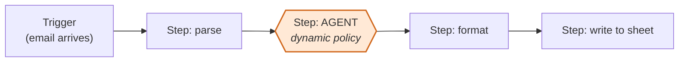

- **An agent can be embedded in a workflow** as a single step. This is the common, sane architecture: deterministic rails everywhere, judgment at the one node that needs it. That's the n8n "AI Agent" node, and it's also what you should be hand-rolling in code.
- **A workflow cannot host a capable outer agentic loop.** You can approximate one — loop back, add branches — but the loop's whole value is that the *next step is chosen at runtime*. A predetermined graph cannot choose a step that isn't in it.

So the choice is not agent *versus* workflow. It's **which part of this system needs judgment, and which part needs a guarantee.** You want workflows wherever you need a guarantee about exactly how something operates — that is a feature, not a limitation. Compliance paths, billing, anything you'll be asked to explain to an auditor: predetermined, every time.

An aside with a sharp edge in it: the course notes the running joke that nobody uses n8n any more because the models got good enough to just *write you the workflow in code*. Treat that as the real lesson. Visual workflow tools sold **authoring convenience**, not capability. When authoring becomes free, the tool's moat is gone and you are left holding a less debuggable, less versionable, less testable representation of a program. Build the workflow in code.

### Putting it together: four names, two ideas, one system

Parts 1 and 2 use four terms, and they collapse to two ideas:

| You'll hear | It's the same thing as | Who decides the next step |
|---|---|---|
| **state machine** | **workflow architecture** | your code — the transitions were written down before the system ran |
| **dynamic policy** | **agent architecture** | the model — it picks the next action at runtime from what it has seen |

So "state machine vs dynamic policy" and "workflow vs agent" are the same question asked twice. And the answer is almost never one or the other for a whole system. **They are layers, and real systems use both together:**

1. **Outside:** a workflow (code) owns the trigger, the order of stages, and anything with a rule — routing, thresholds, writes to systems of record.
2. **Middle:** an agent sits inside the one or two steps where the path can't be known in advance.
3. **Inside the agent:** hooks (Part 6) put small deterministic rules *back* around the agent's tool calls.

A concrete system — an on-call incident assistant:

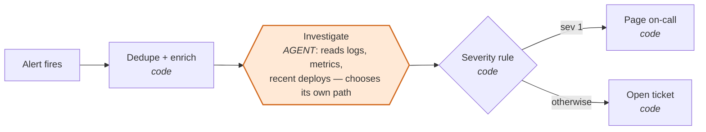

| Step | Layer | Why that layer |
|---|---|---|
| Dedupe and enrich the alert | workflow | Same logic every time. A model adds cost and variance and nothing else. |
| Investigate the cause | **agent** | Where to look next depends on what the last query showed. You can't draw that path in advance. |
| Decide whether to page | workflow | "Sev 1 pages a human" is a policy. Policies belong in code you can audit, not in a prompt. |
| Block `kubectl delete` during the investigation | hook inside the agent | The agent stays free to explore; one specific action is never allowed. |

If someone asks "is this an agent or a workflow?", the useful answer is *"which step?"*

> **The one-line frame:** workflows are **state machines you can audit**; agents are **policies you can only observe**. Put the agent inside the workflow, not the workflow inside the agent.

---

## Part 3 — Multi-agent architecture and subagents

### The patterns

There are more multi-agent shapes than "one orchestrator with helpers", and naming them is most of the battle:

| Pattern | Shape | Use when | Practical example |
|---|---|---|---|
| **Router** | send the task to the best agent/tool | tasks are heterogeneous, each handled well by one specialist | A support inbox: a cheap classifier sends billing questions to a billing agent (with invoice tools), outages to a technical agent (with log access), and account changes to an account agent. |
| **Sequential pipeline** | A → B → C | stages are ordered and each consumes the last | Contract intake: an extractor pulls parties, dates and amounts → a validator checks them against the CRM → a summarizer writes the one-paragraph brief. |
| **Parallel / fan-out** | many work independently, results combined | work is independent and latency matters | Pull-request review: security, test-coverage and style reviewers run at the same time on the same diff; their findings are merged into one review. |
| **Planner–executor** | one plans, another carries out | planning and doing need different context or models | A database migration: a strong model writes the ordered plan (with rollback per step); a cheaper executor runs each step with tools and reports back. |
| **Reviewer / critic loop** | one produces, another checks and returns for revision | correctness matters more than latency | A patient-visit summary is drafted, then a reviewer checks every claim against the source notes and sends back anything unsupported. |
| **Peer-to-peer / handoff** | agents pass control directly | ownership genuinely changes hands | A front-desk agent confirms the customer wants a refund, then hands the *whole conversation* to a refunds agent, which talks to the customer from then on. |
| **Blackboard / shared memory** | all contribute to a shared workspace | many contributors, one evolving artifact | An incident war-room document: a log analyst, a metrics analyst and a deploy-history analyst each write findings into the same doc; the timeline builds up from all three. |
| **Swarm / decentralized** | no central orchestrator | loose coordination, emergent allocation | Large-scale research: hundreds of sources sit in a queue, and worker agents claim the next unclaimed one, process it, and write results back — no one assigns work. |

### The patterns, drawn

The examples from the table are reused below so each diagram has something concrete in it. Dashed arrows are optional or occasional paths.

**1. Router.** One classifier step picks *one* specialist per request. The specialists never talk to each other. The router can be a cheap model or plain code, such as keyword or category rules. Add specialists without touching the others.

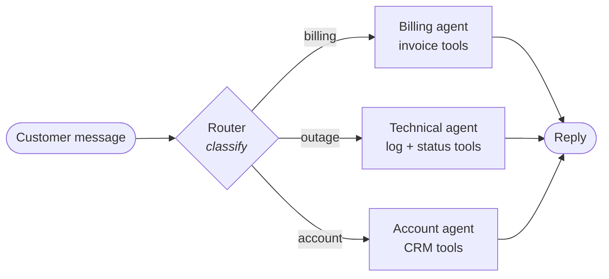

**2. Sequential pipeline.** A fixed order, where each stage's output is the next stage's input. There can be any number of stages, but every one adds latency, and an error early on flows through all the later stages. A validation stage that can **reject** the work, rather than just pass it along, is what keeps the pipeline honest.

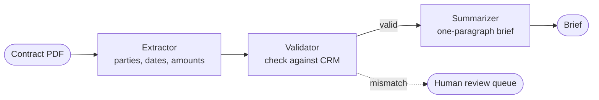

**3. Parallel / fan-out.** One dispatcher gives the *same input* (or one slice of it) to N independent workers at once, and an aggregator merges what they return. Total time is roughly the slowest worker's time, not the sum. The aggregator is the hard part: it has to de-duplicate findings and settle conflicts between workers.

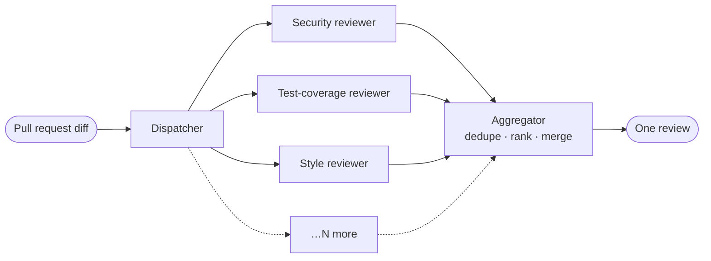

**4. Planner–executor.** One agent decides *what* to do; others *do* it. **Yes, there are usually several executors.** The planner writes steps, independent steps go to executors in parallel, and dependent steps wait their turn. Each executor gets only its own step and the tools for it. Results go back to the planner, which can **re-plan** when a step fails or turns up something unexpected. That feedback arrow is what separates a planner–executor from a pipeline.

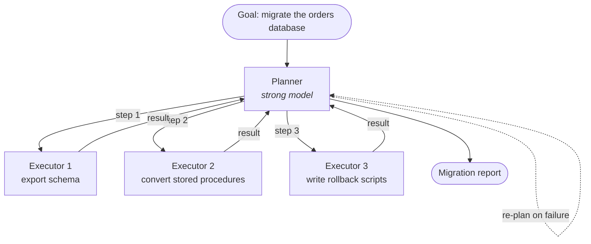

**Can there be multiple planners?** Yes, in two quite different ways:

- **Hierarchical planning (a planner of planners).** A top planner splits the goal into sub-goals and hands each one to a **sub-planner**, which plans its own part and runs its own executors. Use it when the goal is too big for one plan to hold in context, such as migrating ten services instead of one. It's the planner–executor pattern nested inside itself.
- **Competing planners (ensemble).** N planners each write a complete plan for the *same* goal, possibly on different models or with different prompts. A judge then picks one, or merges the best parts of several. Use it when **plan quality is the bottleneck** and a bad plan is expensive. You pay for N plans to get one good one.

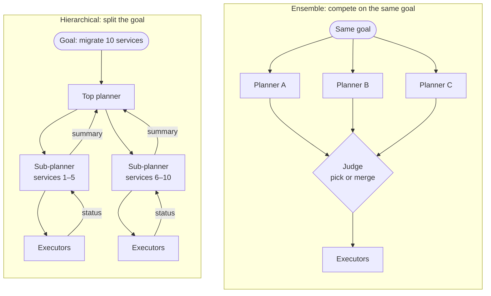

What you don't want is several planners editing *one* shared plan at the same time with no judge. That's the blackboard pattern (7) without a controller, and the plans will conflict.

**5. Reviewer / critic loop.** A worker produces, a reviewer checks against explicit criteria, and the work goes back for revision until it passes or a round limit is hit. **Multiple reviewers** are common, each checking one thing, for example accuracy against the source and compliance wording. Then it passes only when *all* of them accept. Always cap the rounds, or a strict reviewer and a stubborn worker will loop forever.

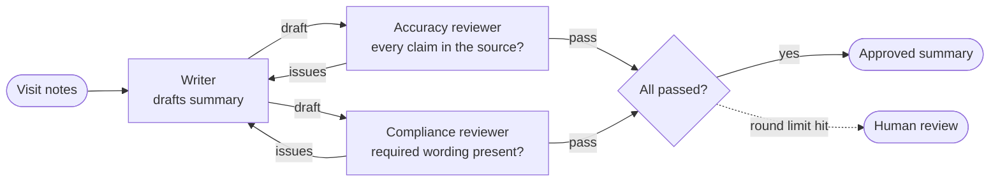

**6. Peer-to-peer / handoff.** Control *moves* along a chain, and each agent owns the conversation while it holds it. There's no central coordinator, so each agent needs its own rule for when to hand off and to whom. A handoff back to an earlier agent is allowed, but watch for ping-pong.

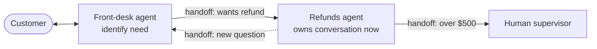

**7. Blackboard / shared memory.** Agents don't message each other at all. They read from and write to one shared workspace, and they react to what others have posted. A **controller** decides who acts next, or when the board is "done", so it doesn't stay busy forever. Any number of contributors can join, because each only needs to know the board's format.

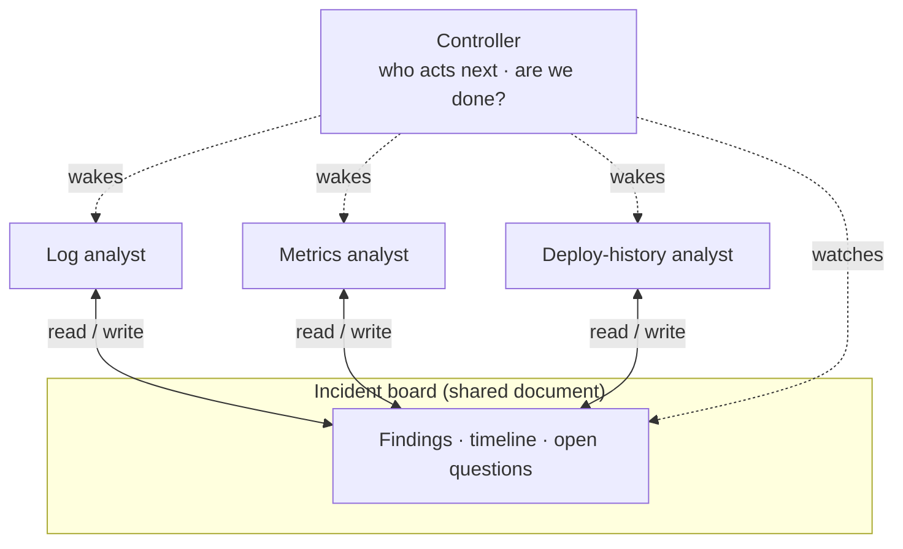

**8. Swarm / decentralized.** There's no orchestrator and no controller. Many identical workers pull the next unclaimed item from a shared queue, process it, and write the result. The work assigns itself. Add workers to go faster, and lose a worker without stopping the job. Each item must be independent, and claiming must be atomic so two workers never take the same item.

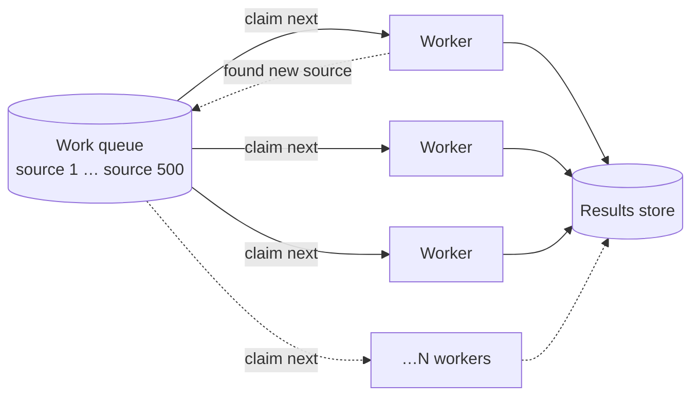

**Which ones scale out:**

| Pattern | Where you add more agents | What breaks first if you add too many |
|---|---|---|
| Router | more specialists | the router's accuracy — too many look-alike categories |
| Sequential pipeline | more stages | latency, and errors compounding stage to stage |
| Parallel / fan-out | more workers | the aggregator, merging conflicting results |
| Planner–executor | more executors; more planners (hierarchical or ensemble) | the planner's context, holding all the results |
| Reviewer / critic | more reviewers | rounds — more reviewers means more chances to fail |
| Handoff | more peers | routing clarity — who hands off to whom |
| Blackboard | more contributors | the controller, deciding who acts next |
| Swarm | more workers | the queue, and claiming items safely |

**Reviewer/critic deserves singling out**, because it is the one that most reliably buys quality rather than just throughput. A concrete production pattern worth stealing: when an agent makes a *judgment* — a classification, a severity call, a routing decision — have it emit **the decision, a confidence score, and the reasoning**. Then have a *second* agent review that triple. The score is the handle the reviewer grabs. Self-review doesn't work for the same reason self-grading doesn't: the thing that produced the error is the thing you're asking to find it, and it is both biased and overconfident.

### Do subagents actually improve execution?

Yes, and for seven reasons that are worth separating because they argue for different designs:

1. **Specialization** — one focuses on research, another on coding, another on review. Each gets exactly the prompt it needs.
2. **Parallelism** — separate threads/processes means real wall-clock savings.
3. **Better context management** — each gets only what's relevant. Not "you're a coder" but *"you're a coder working on Android, on this project, on this task."*
4. **Reduced cognitive load** — less to reason about per call. **Atomize the work as far as you can and quality goes up.**
5. **Independent verification** — a reviewer catches what the author cannot.
6. **Tool specialization** — different subagents get different tools and permissions.
7. **Isolation** — a hard task is delegated without polluting the main agent's working context.

Point 6 has a cost dimension people miss. **Every tool you attach ships its full schema in every request.** Tool definitions are input tokens, paid on *each* call in the conversation, not once. "Tool stuffing" — attaching forty tools because they might be useful — is a recurring per-call tax *and* a quality drag, because the model now chooses from forty options instead of six. Giving a subagent exactly the four tools its job needs is a cost optimization and an accuracy optimization at the same time.

And the honest ledger on the other side: **subagents add cost, latency, coordination overhead, and new failure modes in the communication between them.** Three agents doing one job is at least three times the tokens and a serial dependency chain. The default should be *one* agent until you can name which of the seven benefits you're buying.

### Subagents vs multi-agent — and is "subagent" a Claude thing?

**Multi-agent** is the umbrella: any system with more than one agent — all eight patterns above. **Subagent** is one specific shape inside that umbrella:

- a **parent** agent calls a **child** agent **as if it were a tool**;
- the child starts with a **fresh context** — it gets only the task the parent wrote for it, not the parent's conversation;
- it works, and **only its final report comes back**; its intermediate reads and tool calls never enter the parent's context;
- the **parent stays in charge** and decides what to do with the report.

The contrast that matters is with **handoff**. In a handoff, control *moves*: the second agent takes over the conversation and the first one is done. With a subagent, control *returns*: the parent delegates, gets an answer, and carries on.

| | Subagent | Handoff |
|---|---|---|
| Who owns the conversation afterwards | the parent, always | the agent it was handed to |
| What the child sees | only the task text the parent wrote | usually the conversation so far |
| What comes back | one final report | nothing — it doesn't come back |
| Typical use | "go research X and summarize" | "you're now talking to the refunds team" |

Some people use "subagent" loosely for *any* cooperating agent. Prefer the narrow meaning above, but expect both, and don't let a vocabulary dispute stall a design review.

**It is not Claude-specific.** It's a general pattern, and the LangChain ecosystem uses the same word:

| Ecosystem | What it's called | How you get it |
|---|---|---|
| **LangChain** | "Subagents" — the first of its five documented multi-agent patterns: *a main agent coordinates subagents as tools*. The others are Handoffs, Skills, Router and Custom workflow. | Wrap an agent as a tool for a main agent; or use **Deep Agents**, LangChain's higher-level harness, which ships subagents built in. LangGraph is where you build custom multi-agent graphs. |
| **Claude Agent SDK** | subagents | `ClaudeAgentOptions(agents={"name": AgentDefinition(description=..., prompt=..., tools=[...], model=...)})`. The main agent invokes them through the built-in **`Agent`** tool (shown as `"Task"` in older versions) — add `"Agent"` to `allowed_tools`. Subagents can spawn their own, up to a depth limit (default 3). |
| **Claude Managed Agents** | multiagent sessions: a coordinator plus agents, each in its own **thread** | `multiagent: {type: "coordinator", agents: [...]}` on the agent config. Threads share one container and filesystem, but each has its own context. |
| **Claude Code** (the CLI) | subagents | Markdown files in `.claude/agents/` — the same mechanism the Agent SDK uses. |

So Claude didn't invent the idea; it gives you a ready-made implementation of it in each product.

> **The one-line frame:** subagents buy **focus, parallelism and verification**; they cost **tokens, latency and coordination**. Name which of the seven you're buying before you add the second agent.

---

## Part 4 — Four ways to build an agent on Claude

This is the organizing frame the course never quite states, and without it the next three parts blur together. Two independent questions separate every option:

1. **Who supplies the harness** — the agent loop and context management?
2. **Who supplies the deployment** — the machine the tools actually run on?

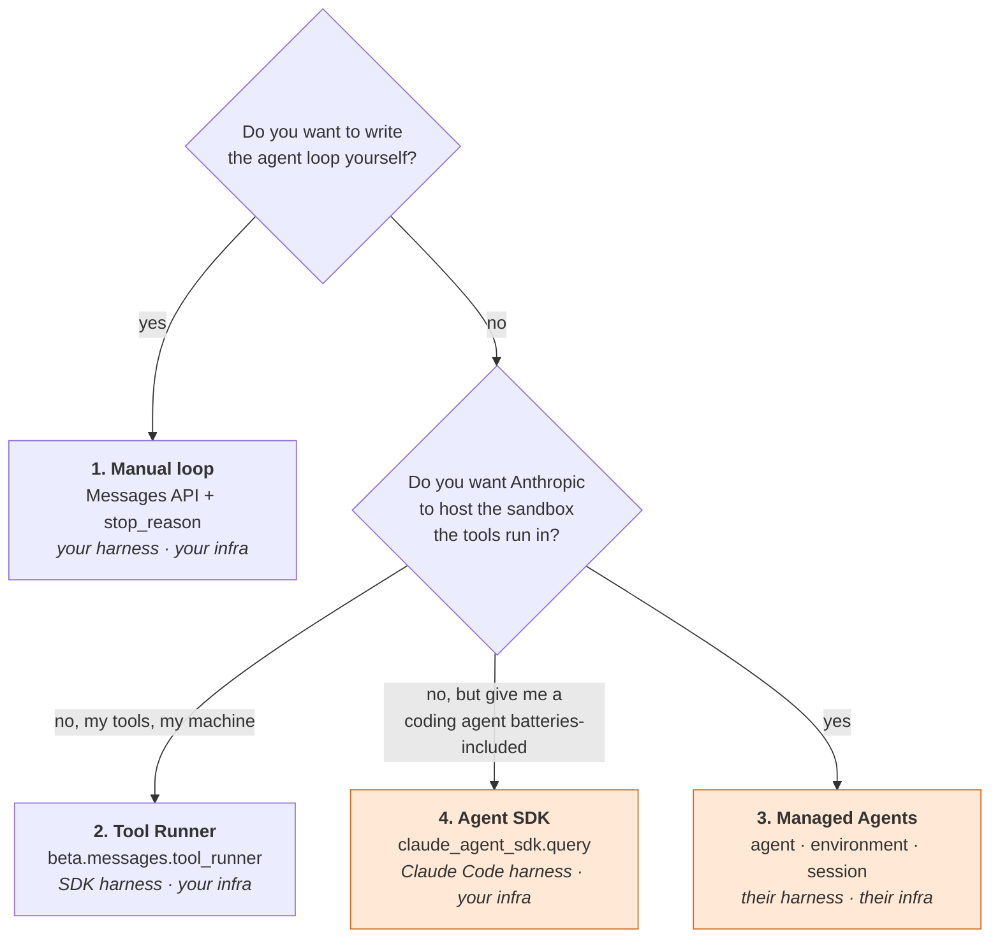

| # | Approach | You write | Harness / deployment | Tools you get |
|---|---|---|---|---|
| 1 | **Manual loop** (Messages API) | the `while stop_reason == "tool_use"` loop | yours / yours | only what you define |
| 2 | **Tool Runner** (`beta.messages.tool_runner`) | just the tool functions | SDK's / yours | only what you define |
| 3 | **Managed Agents** | agent config | Anthropic's / **Anthropic's** | hosted sandbox: bash, files, code exec + Skills + MCP |
| 4 | **Agent SDK** (`claude-agent-sdk`) | a prompt + options | Claude Code's / yours | built-in Read/Write/Edit/Bash/Glob/Grep/WebSearch + MCP + subagents |

The trap: options **2 and 4 both "give you the loop"**, so they get conflated constantly. The difference is *which* loop and *which* tools. The Tool Runner runs **your** tools. The Agent SDK ships **Claude Code's** tools — file reads, edits, bash — and is a coding/filesystem agent out of the box. Different products, different packages, different problems.

And **only Managed Agents takes the machine off your hands.** That is the real line. Everything else, you deploy.

### Is the "agent loop" real code, or something inside the model?

**It is real code — an ordinary `while` loop — and it is never inside the model.** The model does exactly one step per API call. It reads the conversation and returns one of two things:

- **"Run this tool with these inputs"** (`stop_reason == "tool_use"`), or
- **"Here is my answer"** (`stop_reason == "end_turn"`).

The model cannot run a tool, and it cannot call itself again. *Something* has to run the tool, append the result to the conversation, and call the model again. That something is the agent loop. The four approaches differ only in **who wrote that loop and where it runs**:

| Approach | Where the loop is |
|---|---|
| Manual loop | **you write it** — the code below |
| Tool Runner | inside the `anthropic` SDK on your machine (`runner.until_done()`) |
| Agent SDK | inside Claude Code's harness, on your machine |
| Managed Agents | on Anthropic's servers |

Here is the whole thing, hand-written with the Messages API:

```python
import anthropic

client = anthropic.Anthropic()
tools = [{
    "name": "get_weather",
    "description": "Current weather for a city.",
    "input_schema": {"type": "object", "properties": {"city": {"type": "string"}}, "required": ["city"]},
}]
messages = [{"role": "user", "content": "Should I bike to work in Denver today?"}]

while True:                                            # ← this is the agent loop
    response = client.messages.create(
        model="claude-opus-5-5", max_tokens=16000, tools=tools, messages=messages,
    )
    messages.append({"role": "assistant", "content": response.content})

    if response.stop_reason != "tool_use":            # the model says it's done
        break

    results = []
    for block in response.content:
        if block.type == "tool_use":
            output = run_tool(block.name, block.input)  # YOUR code runs the tool
            results.append({"type": "tool_result", "tool_use_id": block.id, "content": output})
    messages.append({"role": "user", "content": results})  # feed results back, go round again
```

Each trip round the `while` is one **iteration** from the Part 1 diagram, and the whole run from user message to final answer is one **turn**. The "dynamic policy" is the model choosing *which* tool to request at each pass; the loop itself is dumb plumbing. That is why a library can supply it for you — and why, when you do write it yourself, it is where you add the limits: maximum iterations, a spend cap, a timeout.

> **The one-line frame:** harness and deployment are **two separate purchases**. Manual loop buys neither; Tool Runner and Agent SDK buy the harness only; Managed Agents buys both.

---

## Part 5 — The Agent SDK

### First: "the Claude SDK" is two different packages

People say "the Claude SDK" and mean either of two products. They are not the same thing, and only one of them is the Agent SDK:

| | **Client SDK** (the Anthropic SDK) | **Agent SDK** |
|---|---|---|
| Install | `pip install anthropic` | `pip install claude-agent-sdk` |
| What it is | a wrapper over the Claude HTTP API | Claude Code packaged as a library |
| You call | `client.messages.create(...)` | `query(prompt, options)` |
| The agent loop | none by default — you write it (Part 4), or use the Tool Runner helper | built in |
| Built-in tools | none — you define every tool | Read, Write, Edit, Bash, Glob, Grep, WebSearch, WebFetch … |
| Also covers | Batches, Files, token counting, Models, and the Managed Agents API (`client.beta.agents`, `.sessions`, …) | hooks, subagents, MCP, permissions, sessions |
| Use it for | anything that isn't a coding/filesystem agent: chat, extraction, classification, RAG, your own agents | an agent that needs to work on files and run commands |

So: **not all Claude SDK is Agent SDK.** Most Claude applications — a RAG service, a classifier, a chatbot, a custom-tool agent — use only the client SDK. Reach for the Agent SDK when you want Claude Code's abilities inside your own program.

### Two small things that confuse everyone early

**`client.messages.create()` creates a *Message*, not a client and not an agent.** Three layers hide behind that one line: `anthropic.Anthropic()` is the **client** (holds the key and the connection pool), `client.messages` is a **resource namespace** (the `/v1/messages` endpoint), and `.create(...)` is **one POST** returning one `Message`. It is ordinary REST/CRUD naming.

What matters is that **nothing persists.** The `Message` has an id, but it is a receipt for your logs — you cannot fetch it back. Continuity exists only because *you* resend the whole `messages=[...]` list every turn. Contrast Part 7, where the same verb means the opposite: `client.beta.sessions.create()` makes a real server-side object you can retrieve, archive, and be billed for. Same `.create()`, opposite lifetimes.

**`citations=None`** appears on every text block you will ever print, and is almost always empty. `TextBlock` has exactly three fields — `citations`, `text`, `type`. Citations are *provenance*: send a document with `citations: {"enabled": True}` and the response's text blocks come back carrying pointers into the source — `CitationPageLocation` for a PDF page, `CitationCharLocation` for a character range, and so on. On a plain text call there is nothing to point at, so it is `None`. It is opt-in, exactly like `cache_control`. Worth knowing it exists before you hand-roll chunk ids and offsets for a grounded-answer feature.

### The Agent SDK itself

**The Agent SDK lets you run Claude Code programmatically** — from the CLI, Python, or TypeScript. It was previously called the Claude Code SDK; the CLI form was previously called "headless mode" or "print mode". Same thing, three names, and you will meet all three.

Via the **CLI**:

```bash
claude -p "Find and fix the bug in auth.py" --allowedTools "Read,Edit,Bash"
```

Via the **Python SDK**:

```python
import asyncio
from claude_agent_sdk import query, ClaudeAgentOptions

async def main():
    async for message in query(
        prompt="Find and fix the bug in auth.py",
        options=ClaudeAgentOptions(allowed_tools=["Read", "Edit", "Bash"]),
    ):
        print(message)   # Claude reads the file, finds the bug, edits it

asyncio.run(main())
```

Setup is two steps:

```bash
pip install claude-agent-sdk
export ANTHROPIC_API_KEY=your-api-key
```

It also authenticates through third-party providers — `CLAUDE_CODE_USE_BEDROCK=1` (Amazon Bedrock), `CLAUDE_CODE_USE_VERTEX=1` (Google Vertex AI), `CLAUDE_CODE_USE_FOUNDRY=1` (Microsoft Azure) — each with that cloud's own credentials configured. One standing caveat from the docs: **Anthropic does not permit third-party developers to offer claude.ai login or rate limits for their products**, including agents built on the Agent SDK. Use API-key authentication.

A slightly fuller example, showing what you actually get back:

```python
import asyncio
from claude_agent_sdk import query, ClaudeAgentOptions, AssistantMessage, ResultMessage

async def main():
    async for message in query(
        prompt="Review utils.py for bugs that would cause crashes. Fix any issues you find.",
        options=ClaudeAgentOptions(
            allowed_tools=["Read", "Edit", "Glob"],   # tools Claude may use
            permission_mode="acceptEdits",            # auto-approve file edits
        ),
    ):
        if isinstance(message, AssistantMessage):
            for block in message.content:
                if hasattr(block, "text"):
                    print(block.text)                      # Claude's reasoning
                elif hasattr(block, "name"):
                    print(f"Tool: {block.name}")           # tool being called
        elif isinstance(message, ResultMessage):
            print(f"Done: {message.subtype}")              # final result

asyncio.run(main())
```

Three things in that snippet carry real weight:

- **`query()` is an async generator.** You iterate the agent's work as it happens: reasoning blocks, tool calls, tool results, then a terminating `ResultMessage`. This is the observability surface — it is where logging, progress UI, and kill switches attach.
- **`tools` is the blast radius — `allowed_tools` is not.** This is the trap, and it was found the hard way: a run configured with only `allowed_tools=["Read", "Glob", "Grep"]` printed `[tool] Bash`. `ClaudeAgentOptions` carries three separate settings:

  | Option | Question | Effect |
  |---|---|---|
  | **`tools`** | *which tools exist at all?* | **the availability set — the real boundary** |
  | `allowed_tools` | *which run without asking?* | auto-approve (a permission rule) |
  | `disallowed_tools` | *which are refused outright?* | auto-deny |

  `allowed_tools` is a **pre-approval list, not an allowlist.** Leaving `Bash` out of it never removed `Bash`; it only routed it through the permission path, and unattended it still ran. To build an agent that genuinely *cannot* modify anything, set `tools=["Read", "Glob", "Grep"]`. The CLI draws the same line: `--tools` sets availability, `--allowedTools` sets pre-approval.
- **The bounds are parameters here.** `max_turns` and `max_budget_usd` are fields on `ClaudeAgentOptions`. Where the raw Messages API made you write your own turn counter, the SDK gives you two of the three bounds; wall-clock is still yours.
- **`permission_mode="acceptEdits"`** removes the human from the loop for file edits. Correct for a sandboxed CI job. Dangerous in a working tree you care about.

A real run prints something like:

```text
[Session] 1d7f1b81 | Model: claude-sonnet-4-6 | CWD: /…/pre-and-post-hooks
          Tools: Task, TaskOutput, Bash, Glob, Grep, ExitPlanMode, Read, Edit …
[Thinking] Let me find the hello_world.rb file first.
[Tool: Glob] Input: {"pattern": "**/hello_world.rb"}
[Tool Result] No files found
[Claude] I couldn't find a `hello_world.rb` file in the current directory …
[Done] 2 turns | $0.0408 | 4997ms | stop: end_turn
```

Note the footer. **Turns, cost, wall-clock, and stop reason, printed per run.** Those four numbers are the bounds you will eventually enforce in production — and the SDK is handing them to you for free. Start reading them from day one.

> **The one-line frame:** the Agent SDK is **Claude Code as a library**. You supply a prompt and a permission surface; it supplies the loop, the built-in tools, hooks, subagents, MCP and sessions — running on *your* machine.

---

### What "harness" actually means here

Part 8 defines a harness as *the surrounding program that turns an LLM into an agent.* In the Agent SDK's case that is not a metaphor — **it is the `claude` CLI, running as a subprocess.** The Python package spawns it and talks to it over stdio, which is why a Python-only install is not enough and you also need the Node package.

The clearest definition is a diff against the hand-rolled loop:

| Harness responsibility | Hand-rolled loop | Agent SDK |
|---|---|---|
| the agent loop | your `while` on `stop_reason` | supplied |
| tool **schemas** | your `TOOLS` list | supplied |
| tool **implementations** | one function reading a dict | ~15 tools that really touch a filesystem |
| permission system | none | `tools` / `allowed_tools` / `disallowed_tools` |
| context compaction | none — you blow the window eventually | supplied |
| system prompt, sessions, hooks, subagents, MCP | none | supplied |

Forty lines bought you one tool that read a dictionary. A prompt bought you a filesystem agent with a permission model. **The harness is everything in that gap** — and Part 4's question "whose harness?" is asking who writes that column.

### Why is everything `async`?

Because `query()` **streams.** The agent runs for seconds to minutes and emits events as it goes — reasoning, tool call, result, more reasoning. `async for` hands you each one *as it arrives*; a synchronous call would hand you everything after it finished, which is useless for a progress UI and worse for a kill switch.

Underneath, the SDK is reading lines from that subprocess: I/O-bound waiting. Async makes the wait non-blocking, which is what lets an agent sit behind a web request or lets several run at once without threads.

And it is the same machinery as the event loop: `async def` defines a coroutine, and something has to drive it. In a script that is `asyncio.run(main())`, which creates a loop, runs, and closes it. In a notebook a loop is **already running** — the kernel is a server multiplexing sockets — so `asyncio.run()` raises `RuntimeError: cannot be called from a running event loop` and you write `await main()` instead, which schedules onto the existing loop. Same code, different owner of the thread. This is the single most common first error when pasting the snippet above into a notebook.

### What comes out of `query()` — five message types, not two

Each iteration yields one complete event. The five:

| Message | Carries | Use it for |
|---|---|---|
| `SystemMessage` | `subtype`, `data` — the `init` one lists the live tool set | discovering what your version actually has |
| `AssistantMessage` | `content`, `model`, `usage`, `stop_reason` | Claude's output |
| `UserMessage` | `content`, `tool_use_result` | tool results going back in |
| `ResultMessage` | `num_turns`, `total_cost_usd`, `stop_reason`, `duration_ms` | the bookkeeping, at the end |
| `StreamEvent` | token-level deltas | only with `include_partial_messages` |

Most example code handles two of the five and silently drops the rest. That is fine for a demo, as long as you know it is a filter and not the whole set.

**Inside `AssistantMessage.content` are blocks**, and here the Agent SDK differs from the Messages API in a way that trips people: its block classes carry **no `.type` field**. You tell them apart by their attributes:

| Block | Attributes | Means |
|---|---|---|
| `TextBlock` | `text` | prose for the human |
| `ToolUseBlock` | `id`, `name`, `input` | a tool being invoked |
| `ThinkingBlock` | `thinking`, `signature` | extended-thinking output |
| `ToolResultBlock` | `tool_use_id`, `content`, `is_error` | what a tool returned |

Hence `hasattr(block, "text")` versus `hasattr(block, "name")` — duck-typing, not style. **Has `.text` → print it; has `.name` → a tool is being called.** Note the gap this leaves: a `ThinkingBlock` has neither, so it falls through both branches and disappears. If you turn thinking on and wonder where the reasoning went, that is the line.

---

## Part 6 — PreToolUse and PostToolUse hooks

**Hooks fire before and after a tool executes.** They are the deterministic seam in a non-deterministic system — the place where you get to run *code*, not a prompt, at a known moment in the agent's life.

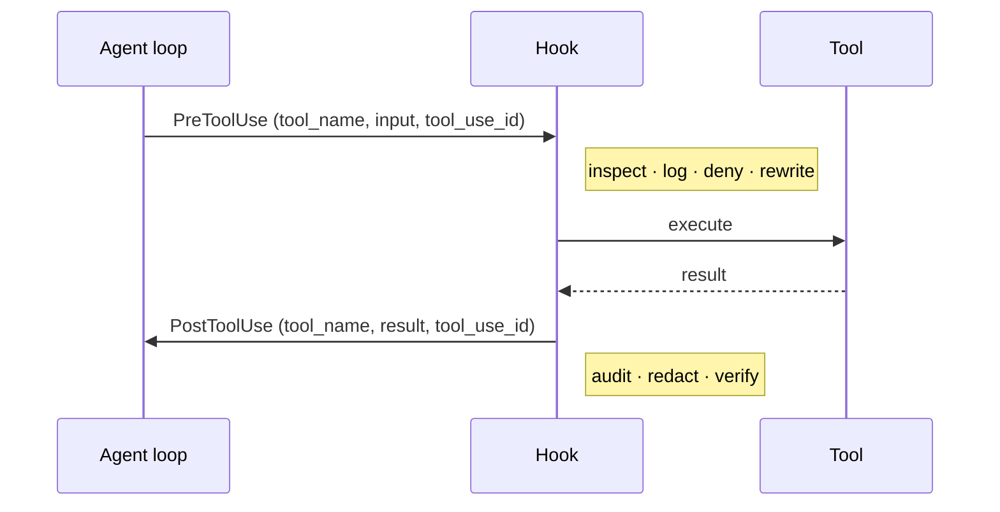

The course demo (and the video) only **prints** a line before and after each tool call. It isn't doing anything useful — its job is to show you *when* the two hooks fire and that the same `tool_use_id` ties a `PRE` to its `POST`. The useful version follows straight after it.

```python
import asyncio
from claude_agent_sdk import query, ClaudeAgentOptions, HookMatcher

async def pre_tool_hook(input_data, tool_use_id, context):
    tool = input_data.get("tool_name", "unknown")
    print(f"[PRE ] Tool: {tool} | ID: {tool_use_id}")
    return {}

async def post_tool_hook(input_data, tool_use_id, context):
    tool = input_data.get("tool_name", "unknown")
    print(f"[POST] Tool: {tool} | ID: {tool_use_id}")
    return {}

async def main():
    async for message in query(
        prompt="Find and fix the bug in hello_world.rb",
        options=ClaudeAgentOptions(
            allowed_tools=["Read", "Edit", "Bash"],
            hooks={
                "PreToolUse":  [HookMatcher(matcher=".*", hooks=[pre_tool_hook])],
                "PostToolUse": [HookMatcher(matcher=".*", hooks=[post_tool_hook])],
            },
        ),
    ):
        print(message)

asyncio.run(main())
```

Running it:

```text
[PRE ] Tool: Glob | ID: toolu_01XivqLhDvLD5XUgVJkjLXqF
[POST] Tool: Glob | ID: toolu_01XivqLhDvLD5XUgVJkjLXqF
```

**`matcher=".*"` catches every tool** (leaving `matcher` out does the same). That is the demo setting. In production you narrow it — `matcher="Edit|Write"` to intercept only the file-modifying tools, `"Bash"` for shell commands, `"^mcp__"` for every MCP tool — and you register *different* hooks per tool. The matcher only ever sees the **tool name**; to filter on a file path or a command, check `input_data["tool_input"]` inside the hook.

### What a hook can actually do

A hook returns a small dict, and that dict is the decision. Returning `{}` means "carry on unchanged". The fields that matter:

| Hook | Field (inside `hookSpecificOutput`) | Effect |
|---|---|---|
| `PreToolUse` | `permissionDecision: "deny"` + `permissionDecisionReason` | the tool does **not** run; the reason goes back to Claude so it can change approach instead of retrying |
| `PreToolUse` | `permissionDecision: "allow"` | runs without asking a human |
| `PreToolUse` | `permissionDecision: "ask"` | pauses for human approval |
| `PreToolUse` | `updatedInput: {...}` | rewrites the tool's arguments before it runs (for example, redirect a file path) |
| `PostToolUse` | `additionalContext: "..."` | appends a note to the tool result that Claude reads next |
| `PostToolUse` | `updatedToolOutput` | replaces what Claude sees as the tool's output (for example, a redacted version) |

If several hooks match, they all run, and the most restrictive answer wins: one `deny` blocks the call whatever the others return.

### A practical example: guardrails for a coding agent

The job: let an agent fix failing tests in a repository unattended. `allowed_tools` includes `Bash` and `Edit`, so **nothing but the hooks** stands between the agent and a destructive command. Four hooks, four real jobs:

1. **Block destructive shell commands** (`PreToolUse` on `Bash`).
2. **Never touch secrets** (`PreToolUse` on `Write|Edit`).
3. **Keep an audit trail** of every tool call (`PostToolUse`, all tools).
4. **Lint every edited Python file and tell Claude what's wrong** (`PostToolUse` on `Write|Edit`) — so it fixes its own mistakes before moving on, instead of you finding them in review.

```python
import asyncio, json, re, subprocess
from datetime import datetime, timezone
from claude_agent_sdk import query, ClaudeAgentOptions, HookMatcher, ResultMessage

DESTRUCTIVE = re.compile(r"rm\s+-rf|git\s+push\s+.*--force|drop\s+table|terraform\s+destroy", re.I)


def deny(input_data, reason):
    return {"hookSpecificOutput": {
        "hookEventName": input_data["hook_event_name"],
        "permissionDecision": "deny",
        "permissionDecisionReason": reason,
    }}


async def block_destructive_bash(input_data, tool_use_id, context):           # 1
    command = input_data["tool_input"].get("command", "")
    if DESTRUCTIVE.search(command):
        return deny(input_data, f"Blocked by policy: {command!r} is destructive. "
                                "Describe the change you need instead of running it.")
    return {}


async def protect_secrets(input_data, tool_use_id, context):                  # 2
    path = input_data["tool_input"].get("file_path", "")
    if path.endswith((".env", ".pem", ".key")) or "/secrets/" in path:
        return deny(input_data, f"{path} holds secrets and is off-limits to the agent.")
    return {}


async def audit_log(input_data, tool_use_id, context):                        # 3
    with open("agent_audit.jsonl", "a") as f:
        f.write(json.dumps({
            "at": datetime.now(timezone.utc).isoformat(),
            "tool": input_data["tool_name"],
            "input": input_data["tool_input"],
            "tool_use_id": tool_use_id,
        }) + "\n")
    return {}


async def lint_after_edit(input_data, tool_use_id, context):                  # 4
    path = input_data["tool_input"].get("file_path", "")
    if not path.endswith(".py"):
        return {}
    lint = await asyncio.to_thread(
        subprocess.run, ["ruff", "check", path], capture_output=True, text=True)
    if lint.returncode != 0:
        return {"hookSpecificOutput": {
            "hookEventName": input_data["hook_event_name"],
            "additionalContext": f"ruff found problems in {path}:\n{lint.stdout}\n"
                                 "Fix these before moving on.",
        }}
    return {}


async def main():
    options = ClaudeAgentOptions(
        allowed_tools=["Read", "Glob", "Grep", "Edit", "Write", "Bash"],
        permission_mode="acceptEdits",
        hooks={
            "PreToolUse": [
                HookMatcher(matcher="Bash", hooks=[block_destructive_bash]),
                HookMatcher(matcher="Write|Edit", hooks=[protect_secrets]),
            ],
            "PostToolUse": [
                HookMatcher(hooks=[audit_log]),                       # no matcher = every tool
                HookMatcher(matcher="Write|Edit", hooks=[lint_after_edit]),
            ],
        },
    )
    async for message in query(prompt="Run the test suite and fix whatever fails.", options=options):
        if isinstance(message, ResultMessage):
            print(f"{message.subtype}: ${message.total_cost_usd}")

asyncio.run(main())
```

What you'd see on a run: the agent tries `git push --force` to "clean up", the hook denies it, and Claude reads the reason and works around it. Every tool call lands in `agent_audit.jsonl`. And after each edit that leaves a lint error, Claude's next step is to fix that error — because the `additionalContext` told it to.

One honest caveat on hook 1: a regex **blocklist** is a teaching example. Commands can be written many ways, so for real enforcement prefer an **allowlist** (only `pytest`, `ruff` and `git diff` may run) and run the agent in a sandbox. The hook is still the right place for that rule — it's the only place that gets a say before every command runs.

### Why the hook output is `PRE · PRE · POST · POST`

Run the two-hook example and the output rarely alternates. A real run:

```text
[PRE ] Glob  | toolu_01UhKMJVNkgH5rh5A3DXeRMt
[PRE ] Read  | toolu_01TRnJZojTaoc9obEsRJjQf1
[POST] Read  | toolu_01TRnJZojTaoc9obEsRJjQf1
[POST] Glob  | toolu_01UhKMJVNkgH5rh5A3DXeRMt
```

That is not two passes of the loop. **Two `PRE`s before any `POST` proves both tools were in flight at once** — if execution were serial, the second tool could not be dispatched until the first had returned, and you would see `PRE·POST·PRE·POST`.

What produced it is two decisions by two different parties:

| Who | Decides |
|---|---|
| **the model** | these calls are *independent* — emits both `tool_use` blocks in one turn |
| **the harness** | independent calls are *dispatched concurrently* |

The model never says "run these in parallel." It says "I need Glob and Read, and I can specify both now" — possible only because forming the `Read` call does not require seeing `Glob`'s output. That independence is the model's judgement; turning it into concurrency is the harness's policy. Had the model needed Glob's results to know *which* file to read, it would have emitted `Glob` alone, waited, and emitted `Read` on the next turn — and the output would have alternated.

Note that a hand-rolled loop iterating the blocks with a plain `for` dispatches the same parallel request **serially**. Same model behaviour, different harness policy — another concrete line in what the harness buys.

**The consequence that bites in production: under concurrency, ordering tells you nothing.** `tool_use_id` is the only thing pairing a `POST` with its `PRE`. This is correct serially and silently wrong in production:

```python
last_tool = None
async def pre_tool_hook(input_data, tool_use_id, context):
    last_tool = input_data.get("tool_name")        # clobbered by the next PRE
async def post_tool_hook(input_data, tool_use_id, context):
    print(f"done {last_tool}")                     # reports the wrong tool
```

Key by id instead, which also gives you per-tool timing for free:

```python
started = {}

async def pre_tool_hook(input_data, tool_use_id, context):
    started[tool_use_id] = (input_data.get("tool_name"), time.monotonic())
    return {}

async def post_tool_hook(input_data, tool_use_id, context):
    name, t0 = started.pop(tool_use_id, ("?", None))
    print(f"[POST] {name} took {time.monotonic() - t0:.2f}s")
    return {}
```

Same correlation-key lesson as `tool_result.tool_use_id` in the hand-rolled loop — but there you could get away with ignoring it, and here you cannot.

---

### Is this like LangChain middleware?

Yes — same idea, different shape. Both are **deterministic code wrapped around a probabilistic agent loop**. LangChain v1 agents take middleware with hooks such as `before_model`, `after_model`, `wrap_model_call` and `wrap_tool_call`:

| Claude Agent SDK | LangChain v1 middleware | Note |
|---|---|---|
| `PreToolUse` | `wrap_tool_call` — code *before* calling the handler | inspect, block or rewrite a tool call |
| `PostToolUse` | `wrap_tool_call` — code *after* the handler returns | audit, redact or annotate the result |
| `UserPromptSubmit` / `Stop` | `before_agent` / `after_agent` | once per run, at the start and the end |
| — | `before_model` / `after_model` / `wrap_model_call` | the Agent SDK has no hook around each model call |

The difference in shape: LangChain middleware **wraps** the call — you're handed a `handler` and decide whether and how to call it, so you can retry or short-circuit. A Claude hook is a **callback that returns a decision** (`allow`, `deny`, `ask`, rewritten input, extra context), and the SDK enforces it. It's also matched by tool name for you, rather than you branching on the tool inside one wrapper.

Why this matters more than it looks:

**Prompts request; hooks enforce.** "Never write to production config" in a system prompt is a strong suggestion to a probabilistic system. A `PreToolUse` hook that inspects the `Write` tool's path argument and refuses is a guarantee. For anything compliance-shaped — audit logging, PII redaction, path allow-lists, spend caps — the hook is the control and the prompt is documentation.

This is also where the **hand-rolled version dies**, and good riddance. Before hooks existed you built your own interception layer around the loop: wrap the tool dispatcher, thread a context object through, maintain it. It worked and it was a lot of code that wasn't your product. The SDK version is a dict literal.

One honest note from the walkthrough worth carrying: the instructor initially believed hooks weren't in the Agent SDK, asked an assistant, got told they weren't, pushed back, and *then* got the correct answer. **They are in the SDK.** The lesson isn't about hooks — it's that on a surface this new, your assistant's prior is stale and the first answer is not the last word. Check the docs. Push back twice.

> **The one-line frame:** hooks are the **deterministic control plane** around a probabilistic agent. A prompt asks; a `PreToolUse` hook decides.

---

## Part 7 — Managed Agents

Everything so far runs on **your** machine. Managed Agents is the option where Anthropic runs the loop *and* hosts the sandbox the tools execute in. It is the only one of the four approaches that takes deployment off your plate.

### Where does it actually run? (Not on claude.ai)

A common mix-up: a managed agent does **not** live on the claude.ai website, and your users never open claude.ai to use it. claude.ai is Anthropic's chat app for people. Managed Agents is part of the **Claude Platform** — the developer API — and three places are involved:

| What | Where it lives | How you reach it |
|---|---|---|
| The agent loop (the model deciding each step) | Anthropic's servers | nothing to manage |
| The tools (bash, files, code execution) | a fresh **container per session** in Anthropic's cloud — or your own infrastructure if you choose a self-hosted environment | nothing to manage |
| Your control and your app | your laptop, CI, or backend | the `ant` CLI and the API / SDK |
| Watching runs | the **Console** at `platform.claude.com` (developer dashboard) | a browser — every session has a live trace with tool calls, timings and cost |

So "deploying" a managed agent means **registering its configuration with the API**. Your own application starts sessions through the API, or a schedule starts them. Nothing gets hosted on a website.

### The object model

Five objects, created in order. Getting this sequence straight is most of what the hands-on chapter teaches, because the quickstart does not make the dependency chain obvious:

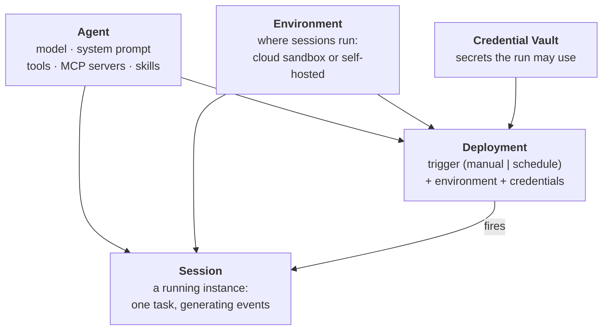

| Object | What it is |
|---|---|
| **Agent** | the model, system prompt, tools, MCP servers, and skills — a stored, versioned config |
| **Environment** | configuration for *where* sessions run: an Anthropic-managed cloud sandbox, or a self-hosted sandbox on your own infrastructure |
| **Session** | a running agent instance inside an environment, performing a specific task and generating events |
| **Deployment** | binds an agent + environment + credentials to a **trigger** — `Manual` (Console button or `POST /v1/deployments/:id/run`) or `Schedule` |
| **Credential vault** | stored secrets the agent gets access to — for MCP servers and other tools |

The two that surprise people:

**Environment is not environment variables.** It is the *machine*: name, description, networking policy, installed packages. The sandbox itself.

**Deployment is just a trigger binding.** The name suggests shipping to production; it actually means "run this agent on a schedule, or on demand via API." If you were expecting Kubernetes, recalibrate — it's cron plus a webhook.

### Agent · Environment · Session — what each one actually is

The five names sound interchangeable and are not. The cleanest way in is to ask **what each one would still be if you deleted the others.**

| Object | Analogy | Lifetime | What it holds |
|---|---|---|---|
| **Agent** | a **class** — or a container *image* | permanent, versioned | model, system prompt, tools, MCP servers, skills |
| **Environment** | the **machine** the class runs on | permanent | sandbox type (cloud/self-hosted), networking policy, installed packages |
| **Session** | an **instance** — one running process | minutes; archived after | one task, its event stream, its cost |
| **Deployment** | **cron plus a webhook** | permanent | agent + environment + credentials bound to a trigger |
| **Credential vault** | a **secret store** | permanent | secrets a run may use (MCP servers, other tools) |

An **Agent** is a *definition*, not something running. Creating one spends nothing — you are saving a config server-side and getting an id back. It is versioned, so a session pins the version it started with and your edits don't retroactively change history.

An **Environment** is the *machine*, and this is the name that misleads everyone: **it is not environment variables.** It is the sandbox — what OS image, what packages, whether the thing can reach the public internet. Two agents can share one environment; one agent can run in several.

A **Session** is where the money goes. Agent + environment + a task = a running instance that emits events and reports its own cost. It is the only one of the five that *does* anything. Agents and environments are inert until a session binds them — which is why creating a session needs **both** ids, and why the dependency chain breaks if you follow a quickstart tab out of order.

A **Deployment** binds agent + environment + credentials to a **trigger**: `Manual` (a Console button, or `POST /v1/deployments/:id/run`) or `Schedule`. Despite the name it is not Kubernetes — it is the thing that starts sessions for you, on a clock or on demand, so nothing on your side has to stay awake.

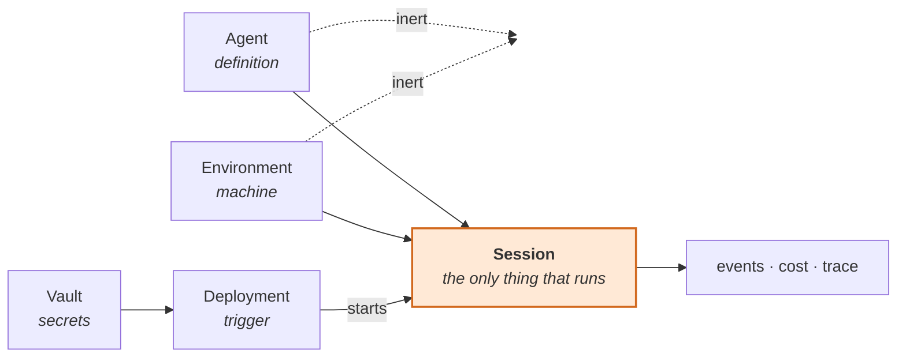

> **The one-line frame:** **Agent = what to run · Environment = where · Session = the actual run.** Deployment decides *when*, vault decides *with which secrets*.

### What does the agent we deploy actually *do*?

Worth asking bluntly, because the quickstart-shaped agent does almost nothing and it is easy to mistake the ceremony for the capability.

A minimal agent — a model, a system prompt, **and no `tools`** — has **no tools at all.** This is worth stating plainly because the failure mode is deceptive: asked to use a shell, such an agent emits tool-call syntax *as plain text* —

```text
MSG: <function_calls><invoke name="shell">
     <parameter name="command">python3 fib.py</parameter></invoke></function_calls>
```

— and nothing executes. No `agent.tool_use` event, no sandbox activity. It reads like a tool call in the transcript and is just a string. Verified against a live account: the same prompt that produced that text produced real `write` and `bash` calls once tools were switched on.

The line that makes it an agent:

```python
agent = client.beta.agents.create(
    name="demo-tools",
    model="claude-haiku-4-5",
    system="You are terse. Use the shell to do real work, then report.",
    tools=[{"type": "agent_toolset_20260401"}],    # <- the built-in sandbox tools
    betas=["managed-agents-2026-04-01"],
)
```

With that in place, *"create fib.py printing the first 15 Fibonacci numbers, run it, and report the output"* produces exactly what you would hope:

```text
TOOL   write {'content': 'def fibonacci(n): ...'}
RESULT File created: /mnt/session/outputs/fib.py
MSG    Now let me run it:
TOOL   bash  {'command': 'cd /mnt/session/outputs && python fib.py'}
RESULT 0 1 1 2 3 5 8 13 21 34 55 89 144 233 377
```

The `tools` union accepts three kinds: the **built-in toolset** (`agent_toolset_20260401` — shell, file read/write, code execution), **MCP toolsets**, and **custom tools**, up to 256 across all of them. `configs` and `default_config` narrow individual tools — the same availability-versus-approval split as Part 5.

So the honest description of a quickstart agent is: **it proves the object chain works, not that the agent is capable.** Capability is one parameter away, and that parameter is not on by default. Its value is that you now have a place to put something real — the nightly dependency-audit agent above is the same five objects with a job worth doing.

### Can I see it in the Console — and run it from there?

Yes to both, and this is the strongest practical argument for Managed Agents.

Everything you create through the API appears at **platform.claude.com** under **Managed Agents**, with a section per object: Agents, Sessions, Deployments, Environments, Credential vaults. Open an agent and you see its system prompt and its built-in tools. Open a session and you get the full trace — every tool call, every result, thinking steps, per-step timings, and **cost and token counts per session**.

You can also work in the other direction. The Console will **create an agent in place**, start a session with **Create session**, and fire a deployment with **Run now**. So the API and the Console are two front doors onto the same objects, not separate worlds — build it in a notebook, hand the Console to someone who will never open a terminal.

This is why the trace matters more than the hosting. Self-hosting an agent is not hard. Building the event store, the per-session cost attribution, and a UI that makes a failed run legible at 2am **is** hard, and it is the part teams reliably under-build. Here you get it as a side effect of creating a session.

**One caution that follows from the same property:** because the objects are real and server-side, a script that dies halfway leaves them behind. Creating an agent and then failing to create the environment leaves an orphan agent in your account. Archive what you create, and sweep before you re-run.

### Worked example: a nightly dependency-audit agent, start to finish

**The use case.** Every night, check a Python repository for vulnerable or outdated dependencies and leave a short report. It's an agent rather than a script because the repos differ — some use `requirements.txt`, some `pyproject.toml`, some both — and the agent has to work out which upgrades matter. It suits Managed Agents because it runs unattended on a schedule and needs a machine with Python and a package manager. You don't want to host that.

**The steps at a glance:**

| # | Step | What you run | What it creates | Where it lives |
|---|---|---|---|---|
| 0 | Install the CLI and log in | `ant auth login` | a local login profile | your laptop |
| 1 | Define the agent | write `agents/dep-auditor.md`, then `ant apply` | **Agent** `agent_…` (versioned) | Anthropic |
| 2 | Define the environment | write `environments/audit-env.yaml` (same `ant apply`) | **Environment** `env_…` | Anthropic |
| 3 | Test one run by hand | the Python below | **Session** `sesn_…` + its container | Anthropic's cloud sandbox |
| 4 | Watch it | open the Console link the script prints | — | your browser |
| 5 | Collect the report | `files.list` / `files.download` | `dependency-report.md` | from `/mnt/session/outputs/` to your disk |
| 6 | Put it on a schedule | `client.beta.deployments.create(...)` | **Deployment** (cron) | Anthropic; it starts a new session every night |
| 7 | Run it now / check history | `POST /v1/deployments/{id}/run`; list deployment runs | a deployment run → a session | Anthropic |

**Step 1 — the agent**, as a version-controlled file. The YAML frontmatter is the config; the Markdown body is the system prompt:

```markdown
---
# agents/dep-auditor.md
name: Dependency auditor
model: claude-opus-5-5
tools:
  - type: agent_toolset_20260401      # bash, file read/write, search, web fetch
---

You audit Python projects. Find the dependency files, run pip-audit and check for
outdated pins, then write /mnt/session/outputs/dependency-report.md: what is
vulnerable, what is outdated, and the three upgrades to do first, with reasons.
```

**Step 2 — the environment**, meaning the machine. This one is a cloud sandbox whose network allows package managers, so `pip install pip-audit` works:

```yaml
# environments/audit-env.yaml
name: audit-env
config: {type: cloud, networking: {type: limited, allow_package_managers: true}}
```

```bash
ant apply agents/dep-auditor.md environments/audit-env.yaml   # shows the plan, asks y/n
# → creates both, writes their IDs to claude-lock.json (commit that file)
```

**Steps 3–5 — one test run**, from Python with the client SDK. The repository is attached to the session as a resource. Its token is used by an Anthropic-side git proxy and never enters the container:

```python
import json, os
import anthropic

client = anthropic.Anthropic()
ids = json.load(open("claude-lock.json"))["resources"]
AGENT_ID = ids["./agents/dep-auditor.md"]["id"]
ENV_ID = ids["./environments/audit-env.yaml"]["id"]

session = client.beta.sessions.create(
    agent=AGENT_ID,
    environment_id=ENV_ID,
    resources=[{
        "type": "github_repository",
        "url": "https://github.com/your-org/your-repo",
        "authorization_token": os.environ["GITHUB_TOKEN"],   # read-only token is enough
    }],
)
print(f"Watch live: https://platform.claude.com/workspaces/default/sessions/{session.id}")

with client.beta.sessions.events.stream(session_id=session.id) as stream:
    client.beta.sessions.events.send(          # send the task after the stream is open
        session_id=session.id,
        events=[{"type": "user.message",
                 "content": [{"type": "text", "text": "Audit the mounted repository."}]}],
    )
    for event in stream:
        if event.type == "agent.message":
            for block in event.content:
                if block.type == "text":
                    print(block.text, end="", flush=True)
        elif event.type == "agent.tool_use":
            print(f"\n[tool: {event.name}]")
        elif event.type == "session.status_terminated":
            break
        elif event.type == "session.status_idle" and event.stop_reason.type != "requires_action":
            break   # finished; "requires_action" means it is waiting on you, so keep going

# Step 5 — download what the agent wrote to /mnt/session/outputs/
for f in client.beta.files.list(scope_id=session.id, betas=["managed-agents-2026-04-01"]).data:
    client.beta.files.download(f.id).write_to_file(f.filename)
    print("saved", f.filename)
```

Two details in that loop are easy to get wrong:

- **Open the stream before sending the message.** Otherwise you can miss the first events.
- **Don't stop on "idle" alone.** A session also goes idle while it waits for you, for example for a tool approval. Stop only when the idle reason is something other than `requires_action`. If the file list comes back empty, wait a second and retry; output files take a moment to index.

**Step 6 — the schedule.** A deployment takes the same pieces as a session: the agent, the environment and the repo resource. On top of those it adds a cron schedule and the message that starts each run. Create it from code so the GitHub token comes from the environment and never gets written into a committed file:

```python
deployment = client.beta.deployments.create(
    name="Nightly dependency audit",
    agent=AGENT_ID,
    environment_id=ENV_ID,
    resources=[{
        "type": "github_repository",
        "url": "https://github.com/your-org/your-repo",
        "authorization_token": os.environ["GITHUB_TOKEN"],
    }],
    initial_events=[{"type": "user.message",
                     "content": [{"type": "text", "text": "Audit the mounted repository."}]}],
    schedule={"type": "cron", "expression": "0 2 * * *", "timezone": "America/Denver"},
)
```

From then on, Anthropic starts a fresh session at 2 a.m. Denver time every night. Each run shows up in the Console with its own trace and cost, and `POST /v1/deployments/{id}/run` fires one immediately when you want to test.

The mapping back to the object model: **agent** = what it is, **environment** = the machine, **session** = one run, **deployment** = when runs start, **vault** = secrets for MCP servers and APIs (not needed here, because the repo token travels with the resource).

### The course's quickstart walkthrough

Install the CLI — it's called `ant`:

```bash
# Linux / WSL
VERSION=1.30.0
OS=$(uname -s | tr '[:upper:]' '[:lower:]')
case $(uname -m) in
  x86_64)  ARCH=amd64 ;;
  aarch64) ARCH=arm64 ;;
esac
curl -fsSL "https://github.com/anthropics/anthropic-cli/releases/download/v${VERSION}/ant_${VERSION}_${OS}_${ARCH}.tar.gz" \
  | sudo tar -xz -C /usr/local/bin ant

ant --version
```

Authenticate — and note this is a **separate** login from Claude Code:

```bash
ant auth login     # opens a browser, returns a code to paste back
```

Define the agent as a markdown file (`coding-assistant.md`) with the model, system prompt and tools, then apply it:

```bash
ant apply coding-assistant.md
```

That writes **`claude-lock.json`** locally and creates the agent server-side. If you've used Terraform, the shape is familiar — a declarative file, an `apply`, a lock file holding the resulting IDs, and `+ 1 created · 1 unchanged` in the output.

Define the environment (`environment.yaml`):

```yaml
name: quickstart-env
config:
  type: cloud
  networking:
    type: unrestricted
```

```bash
ant apply environment.yaml
# + ./environment.yaml  created   env_01PrCYeEPHvQyFQVbQbQ8dX7
# Resources  + 1 created · 1 unchanged
# State written to ./claude-lock.json
```

Create a session, referencing both:

```bash
export AGENT_ID=agent_01BSES69hAGcGxa9LtVuKAxq
export ENVIRONMENT_ID=env_01PrCYeEPHvQyFQVbQbQ8dX7

SESSION_ID=$(ant beta:sessions create \
  --agent "$AGENT_ID" \
  --environment-id "$ENVIRONMENT_ID" \
  --title "Quickstart session" \
  --transform id --raw-output)

echo "Session ID: $SESSION_ID"
```

Then send a message and stream the response — this step **does not translate to a one-off shell command**, so you move to an SDK. Ruby, since the docs offer it:

```ruby
stream = client.beta.sessions.events.stream_events(session.id)

# Send the user message after the stream opens
client.beta.sessions.events.send_(
  session.id,
  events: [{
    type: "user.message",
    content: [{ type: "text", text: "Create a Python script that generates the first 20 Fibonacci numbers" }]
  }]
)

# Process streaming events
stream.each do |event|
  case event.type
  in "agent.message"
    event.content.each { print it.text if it.type == :text }
  in "agent.tool_use"
    puts "\n[Using tool: #{event.name}]"
  in "session.status_idle"
    puts "\nAgent finished."
    break
  else
    # ignore other event types
  end
end
```

The Console then shows the full trace, which is the part worth lingering on:

```text
Session running
  Thread  Coding Assistant running
    Create a Python script that generates the first 20 Fibonacci numbers and saves …
    I'll create that script for you.                                     +1.9s
    Tool bash      →  Result bash
    Thinking                                                             +1.3s
    Tool write     →  Result write                                       +2.5s
    Tool bash      →  Result bash                                        +1.4s
    Done. Two files are in /mnt/session/outputs: fibonacci.py — the script. It u… +3.4s
  Thread  Coding Assistant idle
Session idle
```

Every tool call, every result, every timing, every status transition — with per-session **cost and token counts** in the sessions list. This is the strongest argument for Managed Agents and it isn't the hosting: **you get agent observability you would otherwise have to build.**

### Two field notes from the walkthrough

**The quickstart's dependency chain is undocumented.** Following the CLI tabs gets you an agent, an environment and a session; then the streaming step hands you SDK code that *creates its own session*. Which means the SDK sample doesn't continue from where the CLI left you — it starts over. The fix is to **retrieve** the existing resources rather than create new ones (`client.beta.agents.retrieve`, and likewise for sessions). Worth knowing before you burn twenty minutes, and worth remembering as a general property of brand-new product docs: each tab is written standalone.

**Agent-written code runs.** Partway through, the instructor found sessions in the Console he hadn't knowingly created — an assistant had executed the code while he was reading it. His own comment is the right one: *"you've got to be careful here."* On a surface where every run costs money and creates server-side resources, the gap between "show me the code" and "run the code" has a bill attached. Know which mode you're in.

> **The one-line frame:** Managed Agents is **agent + environment + session**, optionally triggered by a **deployment** and fed by a **vault**. You give up control of the machine; you get the trace for free.

---

## Part 8 — The code harness

One piece of vocabulary, because it will appear in the exam and in every architecture conversation this year.

A **code harness** (also *agentic harness*, *agent harness*) is **the surrounding program that turns an LLM into an agent**: engineered prompts, tools, sandboxes, permission systems, context management — and harnesses typically interact across multiple surfaces (terminal, IDE, CI, web).

**Most agentic coding tools are code harnesses:** Claude Code, Aider, Cursor, OpenAI Codex, Continue, Cline, Devin, Sweep, Smol Developer, Open Interpreter, AutoGPT, LangChain, CrewAI.

The reason this term earns its keep: it names the thing you are either **building or buying** in every one of the four approaches from Part 4. The manual loop means you're building a harness. The Tool Runner means you're buying a minimal one. The Agent SDK means you're buying Claude Code's. Managed Agents means you're buying one and the machine under it. "Harness" is the unit of that purchase decision — and the definition drifts between vendors, so pin it down when someone uses it at you.

> **The one-line frame:** the model is the engine; the **harness** is the car. Every agent decision is a decision about how much of the car you build.

---

## Part 9 — One exam question, worked properly

> A developer must process 10,000 documents overnight to produce a non-urgent analytics report. Cost is the primary concern, and results are not needed until the following morning. Which approach best fits the requirement?
>
> **A.** Send every request synchronously through the Messages API in parallel to finish as quickly as possible.
> **B.** Use the Message Batches API, which processes large asynchronous workloads within a 24-hour window at reduced cost.
> **C.** Lower `max_tokens` on synchronous calls to minimize cost.
> **D.** Switch to the smallest available model regardless of output quality.

**Answer: B.**

The reasoning the exam wants, in order: *cost is the primary concern* and *results aren't needed until morning* together describe exactly the workload the Batches API exists for — high volume, latency-tolerant, discounted. A is optimizing for speed, which the question explicitly deprioritizes. C saves pennies on output and ignores the structural saving. D trades quality for cost with no quality justification in the scenario.

**The objection, which is a good one.** Batches guarantee a **24-hour maximum** turnaround; most finish far faster, but *most* isn't a guarantee. If "the following morning" is a hard deadline eight hours out, you've accepted a window that can legitimately overrun it — and if it overruns, you re-run the job and pay twice. So in a genuinely critical pipeline, the engineering answer is "batch it with a monitored deadline and a synchronous fallback", which is not an available option.

Hold both. **For the exam, take the horse.** Certification questions test whether you know what a feature is *for*; the scenario was written to match the Batches API's description, and over-reading it costs you a mark. **For production, keep the objection** — "the exam's answer" and "the answer I'd defend in a design review" come apart often enough that knowing *which room you're in* is itself a skill.

> **The one-line frame:** exam questions reward **canonical fit**; production rewards **failure-mode thinking**. Don't outsmart the exam, and don't let the exam flatten your engineering.

---

## Where this lands

The whole document collapses to two decisions, asked in order.

**First: is this an agent at all?** Can you enumerate the transitions before it runs? If yes, it's a workflow — build it in code, deterministic and testable, and call an agent from the one step that needs judgment. If no, you're buying a dynamic policy and paying in cost, latency and variance.

**Second: whose harness and whose machine?** Manual loop (neither), Tool Runner (harness only, your tools), Agent SDK (Claude Code's harness and tools, your machine), Managed Agents (both theirs). Four answers to one question that most people never articulate.

Everything else is instrumentation on those two choices: **hooks** make the non-deterministic part auditable, **subagents** trade tokens for focus and verification, and the Console **trace** tells you what actually happened — which, with an agent, is never quite what you designed.

---

## Quick reference / glossary

| Term | Meaning |
|---|---|
| **agent architecture** | the agent drives the next step via an agentic loop |
| **agentic loop** | start turn → iterate (reason · act · observe) → end turn |
| **dynamic policy** | a decision rule choosing the next action at runtime from current context, rather than following predefined transitions |
| **workflow architecture** | predetermined steps defined by a developer; **is** a state machine |
| **execution path** | the trace an agent actually took this run — constructed, not traversed |
| **code harness** | the surrounding program (prompts, tools, sandbox, permissions) that turns an LLM into an agent |
| **subagent** | an agent under an orchestrator (narrow sense); any cooperating agent (loose sense) |
| **handoff** | control moves to another agent and doesn't come back (contrast: a subagent reports back to its parent) |
| **multi-agent** | umbrella term for any system with more than one agent; subagents are one shape of it |
| `AgentDefinition` | Agent SDK subagent config: `description`, `prompt`, `tools`, `model`; passed via `agents={...}` |
| `Agent` tool | how the Agent SDK's main agent invokes a subagent (`"Task"` in older versions) |
| **client SDK** | `anthropic` package — Messages API, Tool Runner, Batches, Files, Managed Agents API; not the Agent SDK |
| **reviewer / critic loop** | one agent produces, another checks and returns for revision |
| **tool stuffing** | attaching too many tools; every schema is input tokens on every call |
| **Agent SDK** | `claude-agent-sdk` — run Claude Code programmatically (CLI, Python, TypeScript) |
| `query(prompt, options)` | Agent SDK entry point; an **async generator** of messages |
| `ClaudeAgentOptions` | `allowed_tools`, `permission_mode`, `hooks`, … |
| `tools` | **the availability set — the real blast radius**; omit Bash/Edit/Write and the agent cannot reach them |
| `allowed_tools` | **pre-approval, not restriction** — which tools run without prompting |
| `disallowed_tools` | auto-deny list |
| `max_turns` / `max_budget_usd` | bounds built into `ClaudeAgentOptions` |
| `permission_mode="acceptEdits"` | auto-approve file edits (no human in the loop) |
| `AssistantMessage` / `ResultMessage` | streamed reasoning + tool blocks / terminating result |
| **headless / print mode** | older names for the Agent SDK's CLI form (`claude -p`) |
| **PreToolUse / PostToolUse** | hooks firing before/after each tool execution |
| `HookMatcher(matcher, hooks)` | pattern over the **tool name** → hook list; omit (or `".*"`) to match all |
| `permissionDecision` | `PreToolUse` output: `"allow"` / `"deny"` / `"ask"` / `"defer"`; deny wins over everything |
| `updatedInput` / `additionalContext` | rewrite a tool's arguments (Pre) / append a note to its result for Claude (Post) |
| `wrap_tool_call` | LangChain v1 middleware hook — the closest equivalent of Pre + PostToolUse |
| **Console** | `platform.claude.com` — developer dashboard where Managed Agents sessions are traced; not claude.ai |
| **Managed Agents** | Anthropic runs the loop *and* hosts the sandbox |
| `ant` | the Anthropic CLI (`ant auth login`, `ant apply`, `ant beta:sessions create`) |
| `claude-lock.json` | local state file of created Managed Agents resource IDs |
| **Agent** (CMA) | stored, versioned config: model, system prompt, tools, MCP, skills |
| **Environment** (CMA) | the sandbox itself — cloud or self-hosted; networking, packages |
| **Session** (CMA) | a running agent instance performing one task, emitting events |
| **Deployment** (CMA) | agent + environment + credentials bound to a trigger (manual or schedule) |
| **Credential vault** | stored secrets a run may use (MCP servers, other tools) |
| **Message Batches API** | asynchronous, discounted, ≤24h turnaround for latency-tolerant volume |
| `citations` | field on every `TextBlock`; populated only when a document was sent with `citations: {enabled: true}` — provenance back to page or character ranges |
| `client.messages.create()` | creates **a Message** — one request, one response. The id is a receipt; nothing is stored server-side |
| `client.beta.*` | pre-GA APIs; shapes can change and many need a dated `anthropic-beta` header. Features graduate out (Files, Skills) |
| `anthropic-beta` header | dated capability flag, e.g. `managed-agents-2026-04-01`. The date is exact — a near-miss is rejected |
| `SystemMessage` / `UserMessage` / `StreamEvent` | the other three Agent SDK message types besides `AssistantMessage` and `ResultMessage` |
| `hasattr(block, "text")` vs `"name"` | Agent SDK blocks carry no `.type`; duck-type them — `.text` is prose, `.name` is a tool call |
| parallel tool use | one assistant turn can request several tools; the harness may dispatch them concurrently, so hook output interleaves |
| **CCDV-F** | Claude Certified Developer — Foundations. 53 Q · 120 min · 720/1000 · 12-month validity |

*Claude Study 01 — An **agent** is a **dynamic policy** (next action chosen at runtime), a **workflow** is a **state machine** (transitions enumerable in advance); if you can draw it, don't buy a model to walk it, and put the agent **inside** the workflow at the one step needing judgment. Building one is two purchases — **harness** and **deployment**: manual loop buys neither, Tool Runner and **Agent SDK** (`query` + `ClaudeAgentOptions`, Claude Code as a library) buy the harness, **Managed Agents** (agent · environment · session · deployment · vault) buys both and hands you the trace. **Hooks** (`PreToolUse`/`PostToolUse`) are the deterministic control plane — prompts request, hooks enforce — and **subagents** buy focus, parallelism and independent verification at the price of tokens, latency and coordination.*
