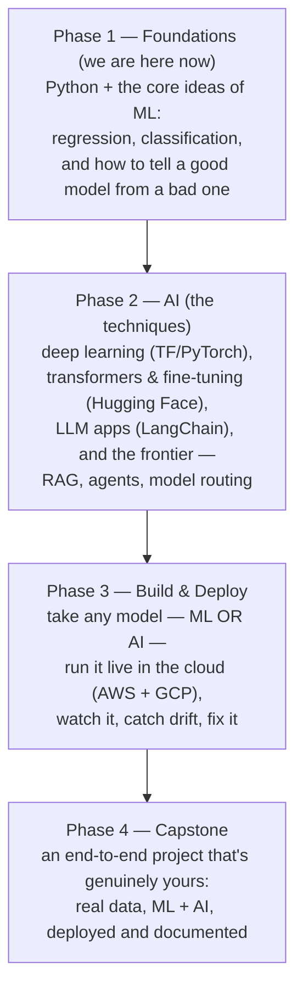
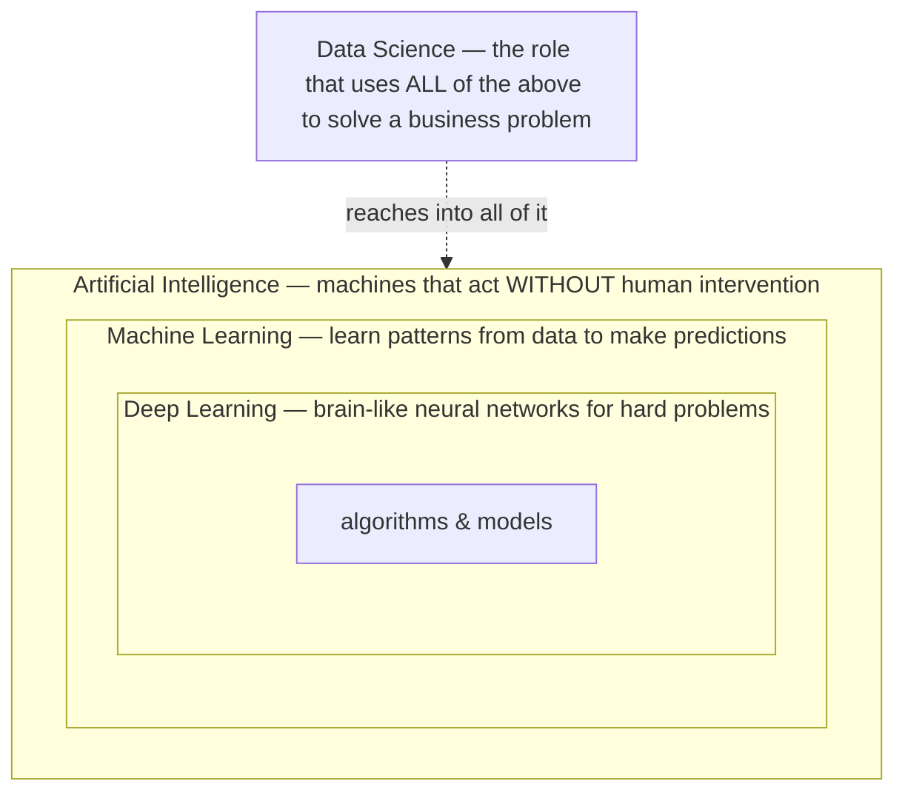
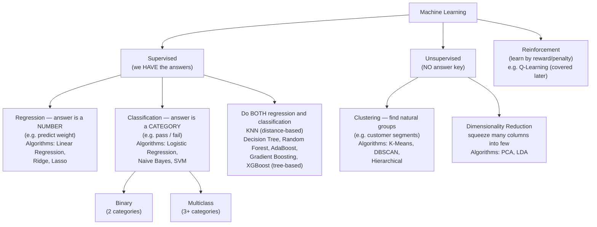
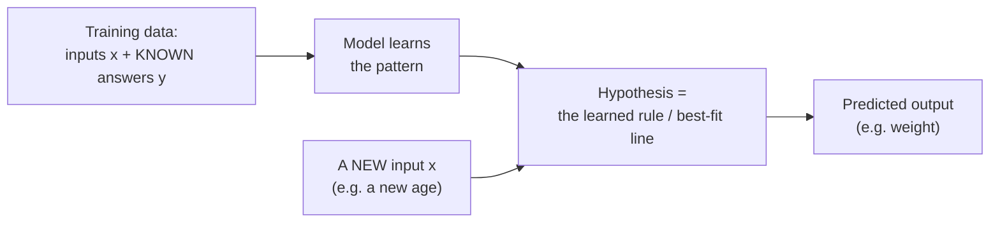
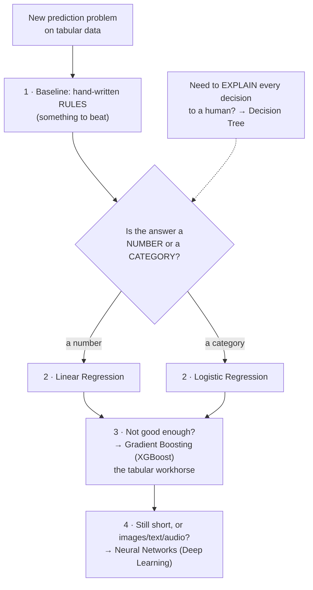
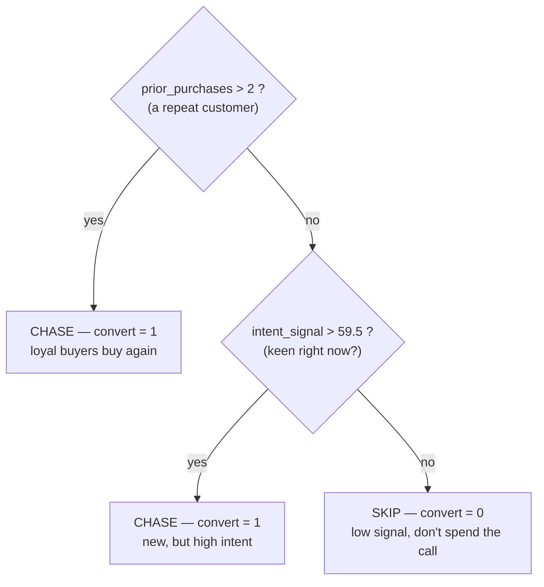

# ML Study 00 — ML Foundations: the Landscape

**Covers:** AI vs ML vs DL vs Data Science → the two kinds of machine learning → where this course is headed.
**Goal:** get the map in your head — the vocabulary and the big picture — before we open up the first algorithm.

---

## Where this is going — and what you'll be able to build

Before the algorithms, here's the map — so you can see how each session builds on the last, and what becomes possible as you go.

**The mindset first.** An AI engineer isn't someone who memorizes algorithms. It's someone who looks at a messy real-world problem and asks: *what is actually going on in this data, and what's the simplest thing that would capture it?* Every technique in this series is a tool for answering that question. We learn the math not to tick a box, but because understanding *why* a method works is what lets you trust it, debug it, and reach for the right one next time. Curiosity is the real skill — the algorithms are how it gets expressed.

**What you'll be able to do, step by step:**



The shape is deliberate: **first you learn** (Phase 1 the ML foundations, Phase 2 the AI techniques on top), **then you ship** (Phase 3 deploy any of it, Phase 4 pull it together into one real project). Building and deploying come *after* the techniques — not sprinkled through them — because you deploy ML and AI models the same way, once.

**What each phase opens up:**
- **Foundations** — you stop seeing "the model" as a black box. You can look at data and reason about what will and won't work, and why.
- **AI** — the whole modern toolkit: deep learning, transformers you fine-tune and *publish* (to the Hugging Face Hub — out in the world for others to use), LLM apps, and the frontier where models start to *reason and act* (RAG, agents, model routing). This is where "AI engineer" earns its name — and there's no ceiling; the same fundamentals keep compounding.
- **Build & Deploy** — you take a model — ML *or* AI — from a notebook on your laptop to something *anyone can use over the internet*, then watch it, notice when it drifts, and fix it. Most people never cross this line; it's where a lot of the real craft lives.
- **Capstone** — you build something real, on real data, end to end — combining what you've learned into one deployed, documented project that's genuinely yours.

**One rule holds the whole thing together: foundations first.** The exciting LLM and agent work only holds up when the basics — how data behaves, how you know a model is any good, how you put it in front of real people — are solid underneath. Build the base well and everything above it comes easier.

**Between sessions — the habit that matters most:**
- Pick a dataset you're actually curious about and try each new idea on it. A concept sticks when *you* care about the answer.
- Keep your work on **GitHub** — not as a checkbox, but as a record of what you've built and figured out.
- Explain what you learned to someone else, out loud. If you can make it simple, you understand it. If you can't yet, you've just found the next thing to learn.

---

## Part 1 — The Landscape: AI vs ML vs DL vs Data Science

> These four terms nest inside each other. **AI** is the broadest — *anything* that lets a machine act on its own (Netflix suggesting a movie, a Tesla steering itself). **Machine Learning** sits inside AI: the specific approach of *learning patterns from data* instead of being hand-coded. **Deep Learning** sits inside ML: the same idea using brain-like neural networks for the hardest problems (recognizing faces, understanding language). **Data Science** isn't one of the nested layers — it's the *role* that reaches for whichever layer the business problem needs.



| Term | Plain definition | Everyday example |
|---|---|---|
| **AI** | Any app that makes decisions/acts on its own. | Netflix & Amazon recommendations, Tesla autopilot. |
| **ML** *(subset of AI)* | Learns from data using **statistics** to predict/forecast. | "Given past data, predict this." |
| **DL** *(subset of ML)* | ML using **multi-layer neural networks** that mimic the brain. | Image recognition, speech, language. |
| **Data Science** | The **role** that uses ML + DL + plain data analysis to solve a business use case. | A data scientist might build a dashboard Monday, an ML model Tuesday. |

**🎯 Say it clearly:** *"AI is the umbrella — any autonomous app. ML is a subset that learns patterns from data. DL is a subset of ML using neural networks for complex problems. Data science is the role that combines all three to solve a business problem."*

---

## Part 2 — Types of Machine Learning

> There are two main ways a machine learns, and the difference is simply **"do we have an answer key?"**
> - **Supervised learning = studying with an answer key.** You show the model lots of examples where you *already know the right answer* (people's age *and* their weight), and it learns the age→weight pattern. Like flashcards with the answer on the back.
> - **Unsupervised learning = no answer key.** You hand the model data with *no "right answer"* and ask it to find structure by itself — like being handed a pile of photos and asked to sort them into groups nobody labeled.



> **Note on the "do both" group:** some algorithms handle *either* a number (regression) *or* a category (classification) — that's why they get their own box rather than sitting under just one. **KNN** does both by looking at its nearest neighbours: it *votes* their labels to classify, or *averages* their values to regress (see [ML Study 06](ML_Study_06_KNN.html)). The tree-based family — decision trees and the ensembles built on them (Random Forest, AdaBoost, Gradient Boosting, XGBoost) — does both by construction.

### Inputs vs the thing you predict (independent vs dependent features)
> In any prediction problem you have **the stuff you know** and **the thing you want to guess.** Predicting weight from age: age is *the stuff you know* (input), weight is *the thing you want to guess* (output). Jargon: inputs are **independent features** (you can have many), the output is the **dependent feature** (exactly one). It's called "dependent" because it *depends on* the inputs — change the age, the predicted weight changes.

The trained model is also called a **hypothesis** — fancy word for "the rule the model learned that turns a new input into a predicted output."

> The whole supervised flow in one picture: you **train once** using data where the answers are known, which produces the **hypothesis** (the learned rule). Then, for any **new** input, you feed it through that hypothesis to get a **prediction**.



### Regression vs Classification
> The only question is **"is the answer a number or a bucket?"** A *number* (weight = 71.5 kg, price = 412K dollars) → **regression**. A *bucket/category* (pass or fail, spam or not-spam) → **classification**. Two buckets = **binary**; three or more = **multiclass**.

| | Regression | Classification |
|---|---|---|
| Answer is… | a **continuous number** | a **category** |
| Example | ad spend → weekly sales | study hours → pass/fail |

### Unsupervised jobs
> - **Clustering = automatic grouping.** Give it customers' age + salary and it finds natural groups ("young high-earners," "middle-class," etc.) so marketing can target each group differently. It's *grouping, not labeling* — nobody told it the groups in advance.
> - **Dimensionality reduction = decluttering.** If you have 1,000 columns, squeeze them down to the ~100 that actually carry the signal, so models run faster and cleaner (e.g. **PCA**, **LDA**).


*What this graph shows: customers plotted by age and salary, with no labels given. Clustering finds the natural groups on its own (here: young high-earners, middle-class, older high-earners) so a business can target each group differently. This is **grouping**, not labeling — nobody told it the categories in advance.*

---

## Part 2½ — The algorithms themselves: a first map

The tree above sorts algorithms by their *job*. Here's the next level: a one-line feel for the ones you'll actually use, roughly **in the order you'd try them on a new tabular problem.** You don't learn these all at once — each gets its own deep-dive later. This is just the map, so the names aren't strangers when we arrive.

| Algorithm | In one line | Predicts | Reach for it when… | First meet it in |
|---|---|---|:---:|---|
| **Hand-written rules** | if-else *you* code — **no learning at all** | either | you need a **baseline to beat** (always start here) | `hello_rules.py` |
| **Linear regression** | the best-fit straight line | a **number** | the relationship is roughly linear | **ML_Study_01** (deep-dive) |
| **Logistic regression** | a line squashed into a 0–1 probability, then thresholded | a **category** | you want a simple, explainable classifier | `ml02` · **ML_Study_02** (next) |
| **Decision tree** | a flowchart of yes/no questions the model *learns* | either | you want a model you can **read** | `ml03` |
| **Random forest** | hundreds of trees vote; the crowd beats any single tree | either | a lone tree overfits and you want robustness | `ml04` |
| **Gradient boosting (XGBoost)** | trees built in sequence, each fixing the last one's mistakes | either | you want the **best score on tabular data** (the usual winner) | `ml05` |
| **KNN** | "what did the nearest neighbours do?" | either | tiny data, no real training step | later |
| **SVM** | the widest-margin dividing line | a category | clean, medium-size data | later |
| **Naive Bayes** | probabilities from feature / word counts | a category | text / spam-style problems | later |

**Unsupervised (no answer key):** **K-Means** groups points into *k* clusters (customer segments, above); **PCA** squeezes many columns down to the few that carry the signal.

**When tabular ML runs out of road:** for **images, text, audio** — or when boosting still isn't enough — you move to **neural networks (Deep Learning)**. Same idea of "learn from examples," just far more knobs. That's Phase 2 of the roadmap.

### Which one do I pick? (the practitioner's ladder)

The pros do **not** start with a neural network. They start simple and escalate only if they must:



**The habit worth internalising:** *simplest thing that could work first.* A rules baseline and a regression take minutes and are easy to explain; you only pay for complexity when the simple thing demonstrably falls short. Our lab (`hands-on/`) walks this exact ladder — `hello_rules → ml02 → … → ml05`.

### Seeing one up close: what "a model you can read" means

Most models are black boxes — you get an answer but can't see *why*. A **decision tree** is the exception: its entire learned logic is a flowchart you can read at a glance. Train a shallow tree on the lab's call-center leads (`ml03`) — *should we chase this prospect?* — and it discovers a rule like this:



That diagram **is** the model — nothing hidden behind it. It's identical to this hand-readable code:

```python
def should_chase(prior_purchases, intent_signal):
    if prior_purchases > 2:     return 1   # loyal repeat buyer   → chase
    elif intent_signal > 59.5:  return 1   # new but high intent  → chase
    else:                       return 0   # low signal           → skip
```

Two things worth noticing. First, the model **learned those thresholds** — `2` prior purchases, `59.5` intent — *from the data*; nobody wrote them in. Finding *where to cut* is what "learning" means for a tree. Second, it surfaced a real business insight on its own: **loyalty beats today's mood** — a repeat customer gets chased no matter their intent score.

That readability is exactly why you reach for a tree when a human must **audit or trust** each decision — loan approvals, medical triage. And it's the very thing **random forests** and **XGBoost** trade away: hundreds of trees vote for a better score, but you can no longer read any single one. Accuracy vs. explainability — a trade you'll learn to make on purpose.

### The deeper lens: the big ideas behind *every* algorithm

The map above sorts algorithms by *task* (number vs. category, labels vs. none). There's a second, more powerful way to see them — by the **one core idea each is built on.** Almost every algorithm in this series is a variation on just a handful of engines:

| # | The core idea (say it in one line) | Algorithms that run on it |
|---|---|---|
| **1** | **Assume a shape, then optimize a loss** — pick a form (a line, an S-curve, a network) and tune its parameters to minimize error, usually by gradient descent | Linear & Logistic Regression, Ridge/Lasso, SVM, **Neural Nets / Deep Learning** |
| **2** | **Model the probability** — describe how the data is generated and use Bayes' theorem / likelihood | Naive Bayes |
| **3** | **Measure distance / similarity** — "similar things sit near each other"; compare number-vectors | KNN, **K-Means** |
| **4** | **Recursively split into pure regions** — keep asking the best yes/no question | Decision Trees (entropy / Gini / MSE) |
| **5** | **Combine many models** *(a level up — it sits on top of the others)* | Bagging → Random Forest · Boosting → AdaBoost, **XGBoost** |
| **6** | **Project with linear algebra** — rotate the data onto its most informative axes | PCA (dimensionality reduction) |

**Three things to internalise about this lens:**
- **#5 (ensembles) isn't a peer — it's a *meta*-idea.** Ideas 1–4 (and 6) are how a *single* model reasons; ensembles are how you *combine* models (a Random Forest is a pile of idea-#4 trees). Think **"four base-model ideas + one way to combine them + one to compress them."**
- **"Turn data into numbers" is universal**, not idea #3's identity — *every* algorithm needs numeric features (encoding). What's special about #3 is *using the distance* between those numbers.
- **These are lenses, not rigid boxes.** Some algorithms straddle two: **logistic regression** is both "optimize a loss" (#1) *and* "model a probability" (#2); **SVM** is #1 with a #3 (similarity/kernel) flavour. Seeing an algorithm through two lenses is a sign you understand it, not a contradiction.

**Why this is the most useful frame you'll carry:** it's the real answer to *"how do I choose an algorithm?"* — you're really asking *"which idea fits my data and my goal?"* Need to explain every decision? → the splitting idea (#4). Similar-items recommendation? → distance (#3). A messy non-linear target with lots of data? → optimize a loss, deep (#1), or combine trees (#5). The whole rest of this series is these six ideas, one at a time.

---

**Next → [ML Study 01 — Linear Regression](ML_Study_01_Linear_Regression.html)** — your first algorithm, start to finish (Parts 3–5 of the series).
