# ML Study 01 — Intro + Linear Regression

**Covers:** Intro (AI / ML / DL / Data Science) → Types of ML → **Linear Regression** → R² / Adjusted R².
**Goal:** understand this well enough to *explain the idea, the math, and the graphs in plain English* — and to see *why* each piece works, not just *that* it works. We start from intuition; the formulas follow.

---

## Where this is going — and what you'll be able to build

Before the algorithms, here's the map — so you can see how each session builds on the last, and what becomes possible as you go.

**The mindset first.** An AI engineer isn't someone who memorizes algorithms. It's someone who looks at a messy real-world problem and asks: *what is actually going on in this data, and what's the simplest thing that would capture it?* Every technique in this series is a tool for answering that question. We learn the math not to tick a box, but because understanding *why* a method works is what lets you trust it, debug it, and reach for the right one next time. Curiosity is the real skill — the algorithms are how it gets expressed.

**What you'll be able to do, step by step:**

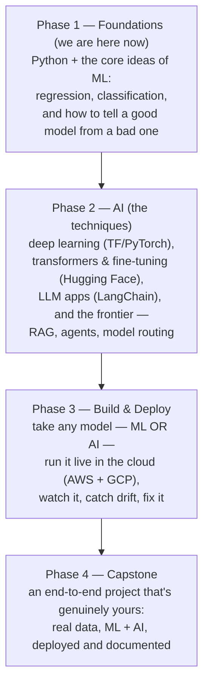

The shape is deliberate: **first you learn** (Phase 1 the ML foundations, Phase 2 the AI techniques on top), **then you ship** (Phase 3 deploy any of it, Phase 4 pull it together into one real project). Building and deploying come *after* the techniques — not sprinkled through them — because you deploy ML and AI models the same way, once.

**What each phase opens up:**
- **Foundations** — you stop seeing "the model" as a black box. You can look at data and reason about what will and won't work, and why.
- **AI** — the whole modern toolkit: deep learning, transformers you fine-tune and *publish* (to the Hugging Face Hub — out in the world for others to use), LLM apps, and the frontier where models start to *reason and act* (RAG, agents, model routing). This is where "AI engineer" earns its name — and there's no ceiling; the same fundamentals keep compounding.
- **Build & Deploy** — you take a model — ML *or* AI — from a notebook on your laptop to something *anyone can use over the internet*, then watch it, notice when it drifts, and fix it. Most people never cross this line; it's where a lot of the real craft lives.
- **Capstone** — you build something real, on real data, end to end — combining what you've learned into one deployed, documented project that's genuinely yours.

**One rule holds the whole thing together: foundations first.** The exciting LLM and agent work only holds up when the basics — how data behaves, how you know a model is any good, how you put it in front of real people — are solid underneath. Build the base well and everything above it comes easier.

**Between sessions — the habit that matters most:**
- Pick a dataset you're actually curious about and try each new idea on it. A concept sticks when *you* care about the answer.
- Keep your work on **GitHub** — not as a checkbox, but as a record of what you've built and figured out.
- Explain what you learned to someone else, out loud. If you can make it simple, you understand it. If you can't yet, you've just found the next thing to learn.

---

## Part 1 — The Landscape: AI vs ML vs DL vs Data Science

> These four terms nest inside each other. **AI** is the broadest — *anything* that lets a machine act on its own (Netflix suggesting a movie, a Tesla steering itself). **Machine Learning** sits inside AI: the specific approach of *learning patterns from data* instead of being hand-coded. **Deep Learning** sits inside ML: the same idea using brain-like neural networks for the hardest problems (recognizing faces, understanding language). **Data Science** isn't one of the nested layers — it's the *role* that reaches for whichever layer the business problem needs.

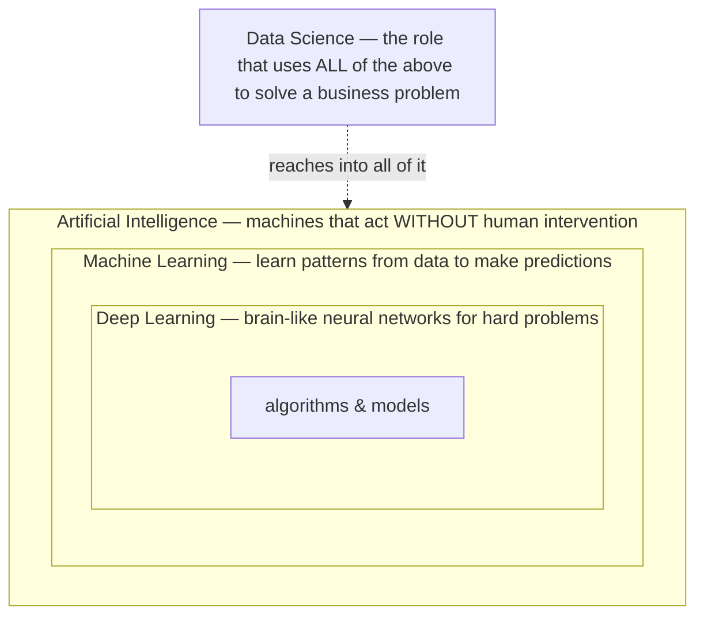

| Term | Plain definition | Everyday example |
|---|---|---|
| **AI** | Any app that makes decisions/acts on its own. | Netflix & Amazon recommendations, Tesla autopilot. |
| **ML** *(subset of AI)* | Learns from data using **statistics** to predict/forecast. | "Given past data, predict this." |
| **DL** *(subset of ML)* | ML using **multi-layer neural networks** that mimic the brain. | Image recognition, speech, language. |
| **Data Science** | The **role** that uses ML + DL + plain data analysis to solve a business use case. | A data scientist might build a dashboard Monday, an ML model Tuesday. |

**🎯 Say it clearly:** *"AI is the umbrella — any autonomous app. ML is a subset that learns patterns from data. DL is a subset of ML using neural networks for complex problems. Data science is the role that combines all three to solve a business problem."*

---

## Part 2 — Types of Machine Learning

> There are two main ways a machine learns, and the difference is simply **"do we have an answer key?"**
> - **Supervised learning = studying with an answer key.** You show the model lots of examples where you *already know the right answer* (people's age *and* their weight), and it learns the age→weight pattern. Like flashcards with the answer on the back.
> - **Unsupervised learning = no answer key.** You hand the model data with *no "right answer"* and ask it to find structure by itself — like being handed a pile of photos and asked to sort them into groups nobody labeled.

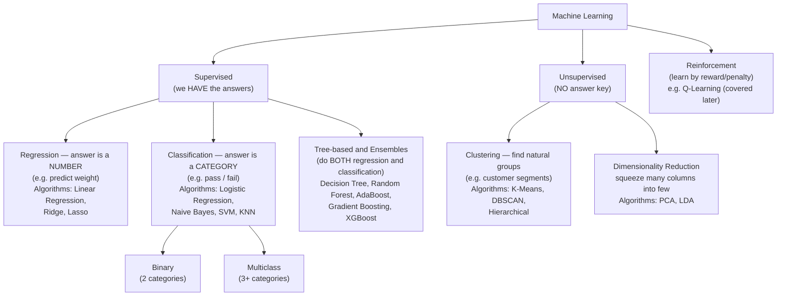

> **Note on the "do both" group:** decision trees and the ensembles built on them (Random Forest, AdaBoost, Gradient Boosting, XGBoost) can handle *either* a number (regression) *or* a category (classification) — that's why they get their own box rather than sitting under just one.

### Inputs vs the thing you predict (independent vs dependent features)
> In any prediction problem you have **the stuff you know** and **the thing you want to guess.** Predicting weight from age: age is *the stuff you know* (input), weight is *the thing you want to guess* (output). Jargon: inputs are **independent features** (you can have many), the output is the **dependent feature** (exactly one). It's called "dependent" because it *depends on* the inputs — change the age, the predicted weight changes.

The trained model is also called a **hypothesis** — fancy word for "the rule the model learned that turns a new input into a predicted output."

> The whole supervised flow in one picture: you **train once** using data where the answers are known, which produces the **hypothesis** (the learned rule). Then, for any **new** input, you feed it through that hypothesis to get a **prediction**.

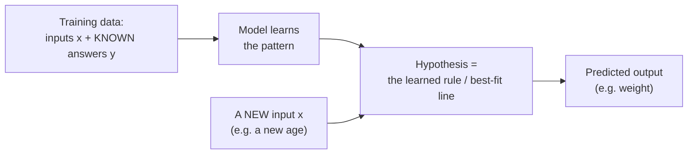

### Regression vs Classification
> The only question is **"is the answer a number or a bucket?"** A *number* (weight = 71.5 kg, price = 412K dollars) → **regression**. A *bucket/category* (pass or fail, spam or not-spam) → **classification**. Two buckets = **binary**; three or more = **multiclass**.

| | Regression | Classification |
|---|---|---|
| Answer is… | a **continuous number** | a **category** |
| Example | ad spend → weekly sales | study hours → pass/fail |

### Unsupervised jobs
> - **Clustering = automatic grouping.** Give it customers' age + salary and it finds natural groups ("young high-earners," "middle-class," etc.) so marketing can target each group differently. It's *grouping, not labeling* — nobody told it the groups in advance.
> - **Dimensionality reduction = decluttering.** If you have 1,000 columns, squeeze them down to the ~100 that actually carry the signal, so models run faster and cleaner (e.g. **PCA**, **LDA**).

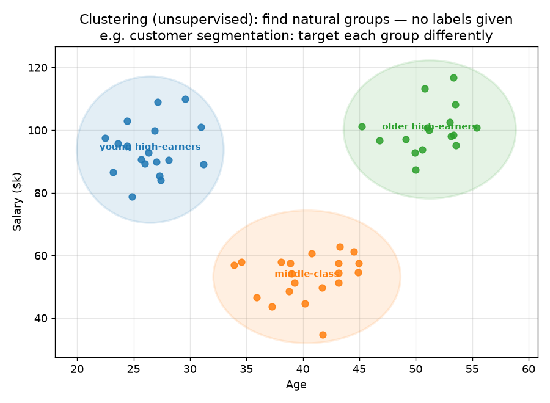
*What this graph shows: customers plotted by age and salary, with no labels given. Clustering finds the natural groups on its own (here: young high-earners, middle-class, older high-earners) so a business can target each group differently. This is **grouping**, not labeling — nobody told it the categories in advance.*

---

## Part 3 — Linear Regression (the core)

### 3.1 The idea: draw the best trend line
> Plot your data as dots on a graph. **Linear regression draws the single straight line that comes closest to all the dots at once** — the "line of best fit," the trend line you'd eyeball through a scatter of points. Once you have that line, predicting is easy: for any new input, just read the height of the line.

Here's a tiny sample dataset — four weeks of **advertising spend and the weekly sales that followed** (both in $1,000s). **These four rows are exactly the dots plotted below — and we'll carry this same example all the way through linear regression:**

| Point | x = ad spend | y = sales *(actual)* | ŷ = sales *(line's prediction)* | error = y − ŷ |
|:---:|:---:|:---:|:---:|:---:|
| 1 | 1 | 5 | 4.9 | +0.1 |
| 2 | 2 | 7 | 6.8 | +0.2 |
| 3 | 3 | 8 | 8.7 | −0.7 |
| 4 | 4 | 11 | 10.6 | +0.4 |

*How to read the table:* the first two columns (**ad spend, sales**) are the **sample data** — the blue dots. The **ŷ** column is what the **best-fit line predicts** for each spend, and **error** is the leftover miss (the gray dashed lines in the graph). Those errors are exactly what the cost function (§3.3) squares and adds up. *(Notice the errors roughly cancel to ≈ 0 — a good-fit line sits right in the middle of the points.)*

Plotted as a scatter with the best-fit line drawn through them:

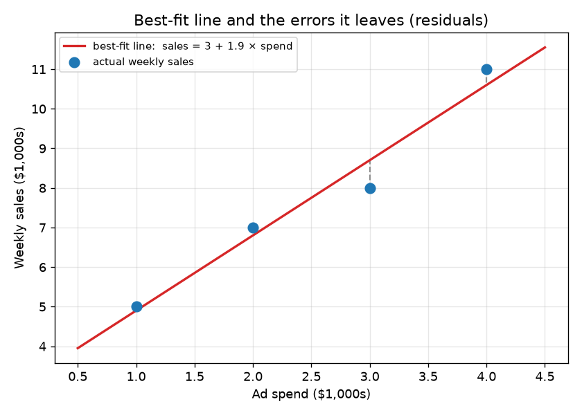
*What this graph shows: blue dots = the real data (the first two columns above). The red line = the model's best guess of the trend, **sales = 3 + 1.9 × spend**. Each gray dashed line = how far the line missed that dot — the **error** column above. Linear regression picks the line that makes all those gray misses as small as possible.*

**The math.** A straight line is written using Andrew Ng's notation:

$$h_\theta(x) = \theta_0 + \theta_1 x$$

📖 **Read it aloud:** *"h-theta of x equals theta-zero plus theta-one times x."* ($h_\theta(x)$ is read **"h-theta of x"** — the hypothesis $h$, *tuned by* the parameters $\theta$, *evaluated at* input $x$; in plain words, "the line's prediction for input x.")

**What it does:** it's the recipe for the line. Give it an input $x$ and it returns a prediction — **start at $\theta_0$, then add $\theta_1$ for every unit of $x$.** (You'll also see the same line written as $y = mx + c$ or $y = \beta_0 + \beta_1 x$.)

**Reading the symbols you'll keep seeing:**
- $\theta_0$ = "theta-zero", $\theta_1$ = "theta-one" — the two numbers we tune.
- $x^{(i)}, y^{(i)}$ = "x-i, y-i" — the $i$-th data point. The superscript $(i)$ is an **index** (which row), **not** a power.
- $m$ = the number of data points.
- $:=$ = "gets updated to" (an assignment/update, not an equation).
- $\hat{y}$ = "y-hat" = a predicted value; $\bar{y}$ = "y-bar" = the average of $y$.
- $\sum_{i=1}^{m}$ = "the sum, for i from 1 to m" — add the same thing up over every data point.

### 3.2 What θ₀ and θ₁ actually mean
> Every straight line is just **"a starting point plus a rate."** Take our ad spend → sales line:
> - **θ₀ (intercept) = the starting value** — the sales you'd expect at **0 ad spend** (where the line crosses the vertical axis).
> - **θ₁ (slope) = the rate** — the **extra sales for each additional $1,000 of ad spend** (how much the line climbs for each step right).
>
> Finding the best line = finding the best *starting point* and the best *rate*.

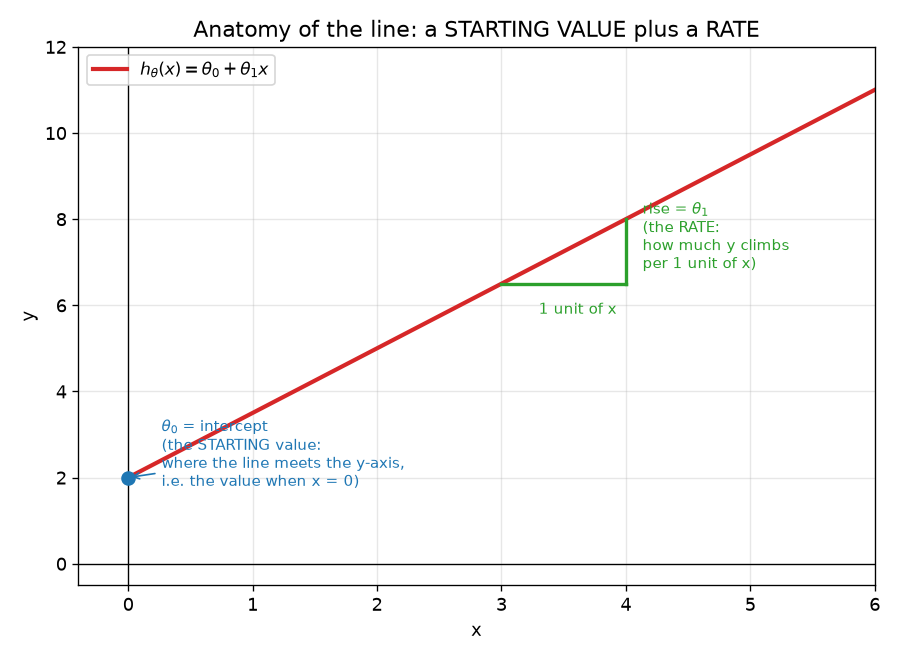
*What this graph shows: any straight line is just a **starting value** ($\theta_0$, where it meets the vertical axis) plus a **rate** ($\theta_1$, how much it climbs per step right). Finding the best line = finding the best starting value and rate.*

**The math.** $\theta_0$ = **intercept** (value of $h_\theta(x)$ when $x = 0$). $\theta_1$ = **slope/coefficient** (change in $y$ per one-unit increase in $x$).

### 3.3 Scoring a line: the cost function
> To find the *best* line, you first need a way to say how *bad* any given line is — a single **badness score**. Here's the recipe: for each dot, measure how far the line's prediction missed (the error). **Square** each error, then **average** them. Low score = good line, high score = bad line. **It's literally a golf score: lower is better, and our goal is the lowest score possible.**
>
> - **Why square the errors?** (1) A miss of −3 and a miss of +3 are equally bad, but if you just added them they'd cancel to 0 and *lie* to you that the line is perfect — squaring makes every miss positive. (2) Squaring **punishes big misses far more** than small ones (a miss of 4 counts as 16; a miss of 2 counts as 4), which is exactly what you want.
> - **Why "average" (÷ m)?** So the score is fair whether you have 10 rows or 10 million.
> - **What about that extra ½ (the 2 in the denominator)?** Pure convenience for the calculus that's coming. To improve the line we'll *differentiate* this squared error — and squaring spits out a **2**. The ½ is placed here so it cancels that 2, keeping every later formula clean. *(The 90-second calculus primer just below explains exactly why — that's its proper home — and you'll watch the 2 cancel in §3.7.)* It does **not** change which line wins — halving every score doesn't move where the minimum sits.

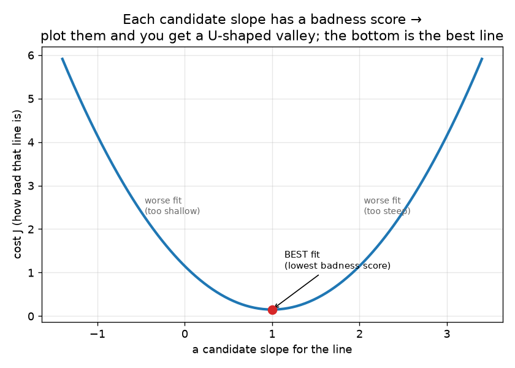
*What this graph shows: each candidate slope for the line gets a badness score; plotting slope (across) vs. score (up) gives a U-shaped valley, and the bottom of the valley is the best-fit line. Our whole job is to reach that bottom.*

**The math.** The badness score is the **cost function** $J$ — the mean squared error:

$$J(\theta_0, \theta_1) = \frac{1}{2m}\sum_{i=1}^{m}\Big(h_\theta(x^{(i)}) - y^{(i)}\Big)^2$$

📖 **Read it aloud:** *"J of theta-zero and theta-one equals one over two-m, times the sum from i equals 1 to m of, open paren, h-theta of x-i minus y-i, close paren, squared."*

**What it does, step by step:** for each data point $i$ —
1. $h_\theta(x^{(i)})$ = the line's **prediction** for that point,
2. $-\,y^{(i)}$ = subtract the **actual** value → this is the **error** (how far off),
3. $(\;)^2$ = **square** it (positive, and big misses hurt more),
4. $\sum_{i=1}^{m}$ = **add up** all $m$ squared errors,
5. $\frac{1}{2m}$ = **divide by $2m$** to get the (half-)average.

The single number $J$ that pops out = "how bad is this line." **Goal:** find $\theta_0, \theta_1$ that make $J$ as small as possible ($\min J$).

### 3.4 Watch it learn: gradient descent on a real example
> You can't test *every* possible line — there are infinitely many. So instead you **start with a guess and let the math improve it, step by step**, until it can't get better. Let's watch that actually happen on a small, realistic dataset — with a genuine intercept and slope, not a perfect 45° line.

**The data** — the **same four weeks of ad spend → weekly sales from §3.1** (both in $1,000s):

| Ad spend (x) | Sales (y) |
|:---:|:---:|
| 1 | 5 |
| 2 | 7 |
| 3 | 8 |
| 4 | 11 |

These are the same actual data points you saw fitted in §3.1 — but there we just *showed* you the answer line; here we watch the algorithm **find** it. The best fit *turns out to be* **sales = 3 + 1.9 × spend** — our algorithm doesn't know that yet; it has to discover it, starting from nothing.

**Step 0 — start with a deliberately bad guess.** Set θ₀ = 0 and θ₁ = 0 (a flat line predicting 0 sales for everything), and pick a **learning rate** α = 0.05 (how big a step we take — more in §3.6).

**Step 1 — do the math once, and watch the line improve.** With θ₀ = θ₁ = 0:

| | value |
|---|---|
| **Predictions** ŷ (= 0 + 0·x) | 0, 0, 0, 0 |
| **Errors** (ŷ − y) | −5, −7, −8, −11 |
| **Cost** J = (1/2·4)(5²+7²+8²+11²) = (1/8)(259) | **32.4** (very bad, as expected) |
| **Slope for θ₀** = average error = (−5−7−8−11)/4 | **−7.75** |
| **Slope for θ₁** = avg error weighted by x = [(−5)(1)+(−7)(2)+(−8)(3)+(−11)(4)]/4 | **−21.75** |
| **Update** θ₀ := 0 − 0.05(−7.75) | **0.39** |
| **Update** θ₁ := 0 − 0.05(−21.75) | **1.09** |
| **New cost** with the updated line | **11.3** ↓ |

The cost fell from **32.4 → 11.3 in one step** — the math nudged the line toward the data, automatically. (The slope formulas are derived in §3.7; for now just note *which way is downhill* is: for θ₀ the average error, for θ₁ the average error weighted by x.)

**Repeat the same step over and over, and it keeps improving until it settles:**

| Iteration | θ₀ | θ₁ | cost J |
|:---:|:---:|:---:|:---:|
| 0 (start) | 0.00 | 0.00 | 32.38 |
| 1 | 0.39 | 1.09 | 11.28 |
| 2 | 0.62 | 1.72 | 4.12 |
| 3 | 0.76 | 2.08 | 1.69 |
| 5 | 0.91 | 2.42 | 0.58 |
| 10 | 1.04 | 2.55 | 0.41 |
| 100 | 2.01 | 2.24 | 0.17 |
| 500 | 2.95 | 1.92 | 0.088 |
| 3000 | **3.00** | **1.90** | **0.0875** |

It lands on exactly **θ₀ = 3.0, θ₁ = 1.9** — the true best fit — with the cost bottoming out at 0.0875. (θ₁ overshoots to ~2.55 early then eases back as θ₀ catches up: a normal zig-zag; what matters is the **cost drops every step**.)

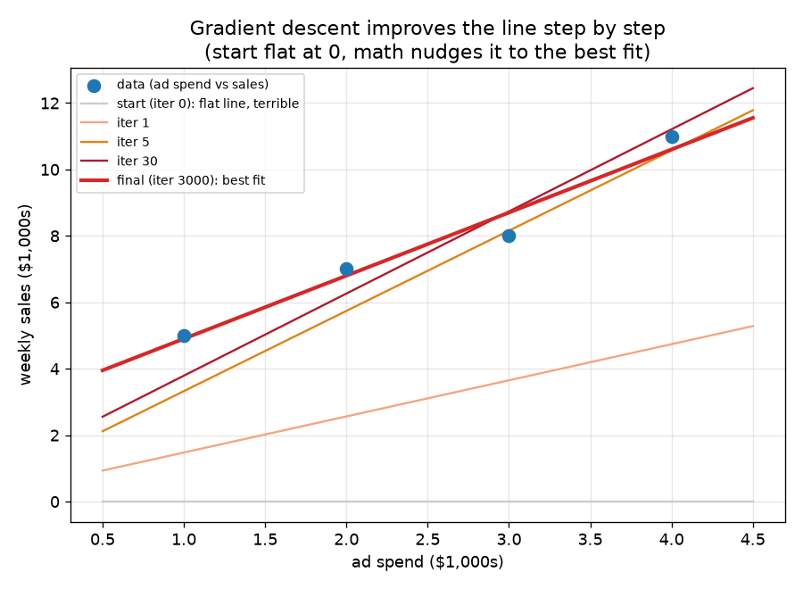
*What this graph shows: the same four data points (dots) with the line drawn at different iterations. It starts flat (the bad guess at 0), then swings up step by step until the final red line fits the points.*

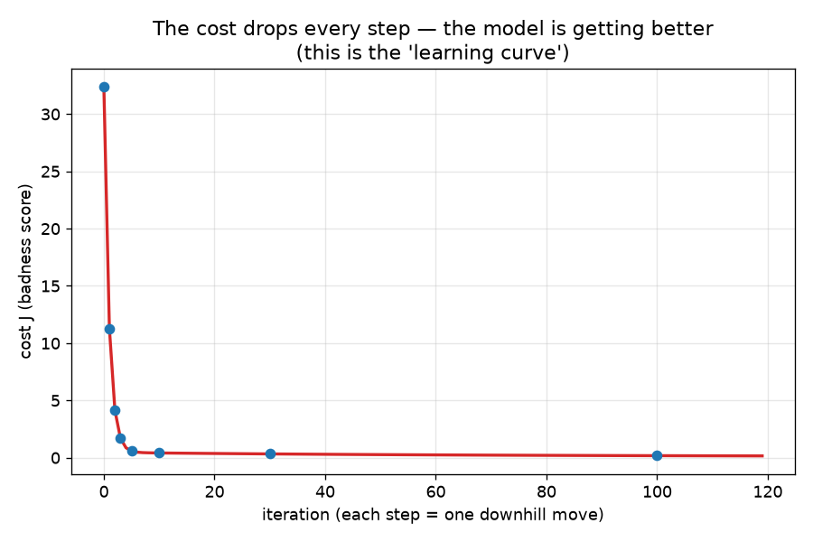
*What this graph shows: the cost (badness score) at each iteration — it drops fast at first, then flattens as the line reaches the best fit. This falling curve is the **learning curve**, and it's how you confirm training is actually working.*

That back-and-forth — **predict → measure the error → nudge the line downhill → repeat** — is **gradient descent.** The next section states the one-line rule behind it.

### A 90-second calculus primer — only the bits this doc needs
> You don't need a calculus course for this. You need **one idea** and **one rule.**

**The one idea: a derivative is just a slope.** The **derivative** of a function at a point tells you **how steep it is and which way it tilts** there — how fast the output changes when you nudge the input. On our badness-score valley:
- **Positive** derivative → the ground tilts **up to the right** → the bottom is to your **left**.
- **Negative** derivative → tilts **down to the right** → the bottom is to your **right**.
- **Zero** derivative → **flat ground** → you're at the **bottom** (the minimum). *This is why gradient descent stops when the slope reaches ≈ 0.*

**Partial derivative — same thing, one knob at a time.** When a function depends on several inputs (our cost $J$ depends on both θ₀ and θ₁), the **partial derivative** $\frac{\partial J}{\partial \theta_0}$ means "the slope if I wiggle **only** θ₀ and hold θ₁ still." The curly $\partial$ (read *"partial-dee"*) just signals "one variable at a time" — we compute one slope per knob.

**The one rule we actually use — the power rule:** the derivative of $x^2$ is $2x$ (bring the power down to the front, drop it by one). And the derivative of a plain term $x$ is just $1$ (a straight line has constant slope). That's the whole toolkit — plus one add-on:

**Chain rule (one line):** to differentiate *something-squared*, bring the 2 down and multiply by the derivative of the inside. For example $\frac{d}{d\theta_1}(\theta_0 + \theta_1 x - y)^2 = 2(\theta_0 + \theta_1 x - y)\cdot x$ — the extra $x$ is the inside's derivative. *(That extra $x$ is exactly where the $x^{(i)}$ in the θ₁ slope comes from in §3.7.)*

**And *this* is why the cost function carried that ½.** Look at what just happened: differentiating the square produced a **2** out front. If the cost were plain $\frac{1}{m}\sum(\dots)^2$, every slope formula would come out as a messy $\frac{2}{m}$. So we quietly put a ½ in the cost *up front* — making it $\frac{1}{2m}$ — precisely so the 2 and the ½ cancel: $\frac{1}{2m}\cdot 2 = \frac{1}{m}$. It's a cosmetic choice made *before* the calculus purely so the answer *after* the calculus is clean — and it changes nothing about the best line (scaling every score by ½ doesn't move the minimum). *(You'll see it cancel for real in §3.7.)*

That's all the calculus this doc uses.

### 3.5 The rule behind it: gradient descent
> You just watched it work in §3.4; here's the rule in one line. Each step we **nudge the line downhill** on the badness-score valley. The picture to hold — the single most important idea in ML: **you're on a foggy hillside, blindfolded.** You can't see the bottom, but you *can* feel which way the ground slopes under your feet, so you step **downhill**, feel again, step again, until you reach the valley floor. The "slope you feel" is the **derivative**; each step is one update of the θ's — exactly the arithmetic we did by hand a moment ago.

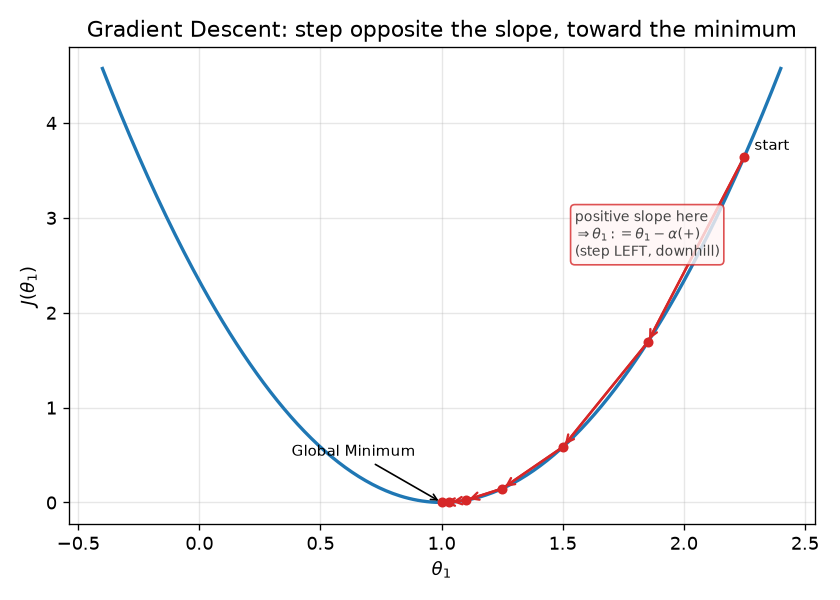
*What this graph shows: the same U-shaped valley. The red dots are successive steps: you start high on the side and keep stepping downhill until you settle at the bottom (the best-fit slope).*

**The math.** Repeatedly update each parameter by stepping opposite its slope:

$$\theta_j := \theta_j - \alpha \, \frac{\partial}{\partial \theta_j} J(\theta_0, \theta_1)$$

📖 **Read it aloud:** *"theta-j gets updated to theta-j minus alpha times the partial derivative of J with respect to theta-j."* (The $:=$ means "gets updated to." $\frac{\partial}{\partial\theta_j}J$ means "the slope of $J$ in the $\theta_j$ direction." $j$ just means "which parameter" — 0 or 1.)

**What it does:** each round, nudge a parameter **downhill**. $\frac{\partial J}{\partial\theta_j}$ is the **slope** (which way is uphill and how steep); subtracting it moves you the other way — **downhill**. $\alpha$ (**alpha**, the learning rate) sets **how big** each step is.

**Why the minus sign is clever:** on the *right* wall of the valley the slope is positive, so "minus a positive" moves you **left** (toward the bottom); on the *left* wall the slope is negative, so "minus a negative" moves you **right** (toward the bottom). Either way you head to the bottom — automatically.

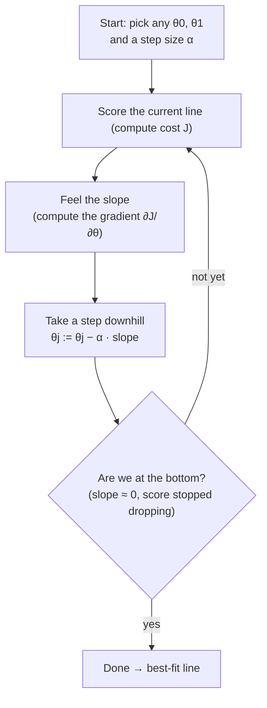

### 3.6 How big a step? The learning rate
> The **learning rate** is simply *how big a step you take downhill each time*. Too big and you'll leap right over the valley bottom and bounce back and forth forever, never settling — like a hyperactive marble that can't stop in the bowl. Too small and you're inching down the hill all day. You want steps **"just right."** A common starting value is 0.01.

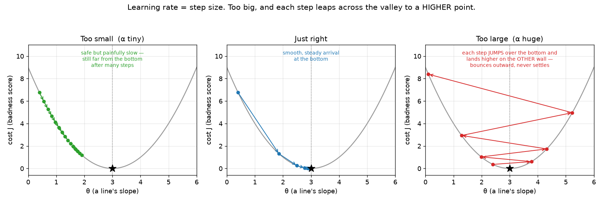
*What this graph shows: same valley, three step sizes. Left = tiny steps (safe but painfully slow). Middle = good steps (smooth arrival at the bottom). Right = huge steps (overshoots and bounces outward — never settles).*

### 3.7 The slope formulas → the final rules
> "Compute the derivative" just means "figure out which way is downhill and how steep, for each knob (θ₀ and θ₁)." The formulas below are that, done. Notice they're intuitive: each is basically **the average error**, and for the slope knob (θ₁) it's the average error *weighted by the input x*.

**The math — and here's the ½ paying off.** To get the slope we differentiate the cost, which means differentiating the squared term. The chain rule brings a **2** down front (power rule, $x^2 \to 2x$), and that 2 lands right on the $\frac{1}{2m}$:

$$\frac{1}{2m}\cdot 2 = \frac{2}{2m} = \frac{1}{m}$$

**That is the whole reason the ½ was in the cost function** — it cancels the 2 that squaring produces, so every gradient comes out as a clean $\frac{1}{m}$ instead of a messy $\frac{2}{m}$. With that cancellation done, the two slopes are:

$$\frac{\partial J}{\partial \theta_0} = \frac{1}{m}\sum_{i=1}^{m}\Big(h_\theta(x^{(i)}) - y^{(i)}\Big)$$

📖 **Read it aloud:** *"the partial derivative of J with respect to theta-zero equals one over m, times the sum of, open paren, h-theta of x-i minus y-i, close paren."*
**What it does:** the slope for the **intercept** knob is just the **average error** — how far off the line is, on average.

$$\frac{\partial J}{\partial \theta_1} = \frac{1}{m}\sum_{i=1}^{m}\Big(h_\theta(x^{(i)}) - y^{(i)}\Big)\, x^{(i)}$$

📖 **Read it aloud:** *"the partial derivative of J with respect to theta-one equals one over m, times the sum of, open paren, h-theta of x-i minus y-i, close paren, times x-i."*
**What it does:** the slope for the **slope** knob is the average error **weighted by the input $x$** — because $\theta_1$ is multiplied by $x$ in the line, so changing $\theta_1$ affects large-$x$ points more (that extra $x^{(i)}$ comes from the chain rule).

So the two update rules, applied **together** and repeated until convergence:

$$\theta_0 := \theta_0 - \alpha \, \frac{1}{m}\sum_{i=1}^{m}\Big(h_\theta(x^{(i)}) - y^{(i)}\Big)$$

$$\theta_1 := \theta_1 - \alpha \, \frac{1}{m}\sum_{i=1}^{m}\Big(h_\theta(x^{(i)}) - y^{(i)}\Big)\, x^{(i)}$$

📖 **Read it aloud:** *"theta-zero gets updated to theta-zero minus alpha times the average error; theta-one gets updated to theta-one minus alpha times the average error weighted by x."*
**What it does:** plug the two slopes into the downhill-step rule and repeat both — that *is* training a linear regression.

**Why a bowl — and why only *one* path down it?** Good question to ask. The badness score depends on **the knobs we tune** — the parameters. Even with a *single* feature there are already **two** knobs, θ₀ and θ₁, so the honest cost surface is a **3D bowl**: θ₀ on one floor axis, θ₁ on the other, and the badness score as the height. *(The flat U-curve back in §3.3 was a simplification — it froze θ₀ to look at just the slope. This bowl is the real, both-knobs-at-once picture.)*

There is **one** descent, not one-per-knob. Each step reads **one slope per knob** — the two partial derivatives from §3.7 — and moves θ₀ **and** θ₁ *together* in that single step. So the single ball rolling down the bowl **is** the (θ₀, θ₁) pair being tuned at once: its side-to-side drift is θ₀ changing, its front-to-back drift is θ₁ changing. The extra dimension isn't a second descent — **it's the second knob.**

**More features → more knobs → more dimensions.** Two features means three knobs (a bowl in 4D you can't draw); *n* features means *n*+1 knobs. You can't picture it past two, but nothing changes: **one descent, every knob nudged together, rolling to the single lowest point — the global minimum.** (This is the "coming down a mountain" picture Krish uses — literally right.)

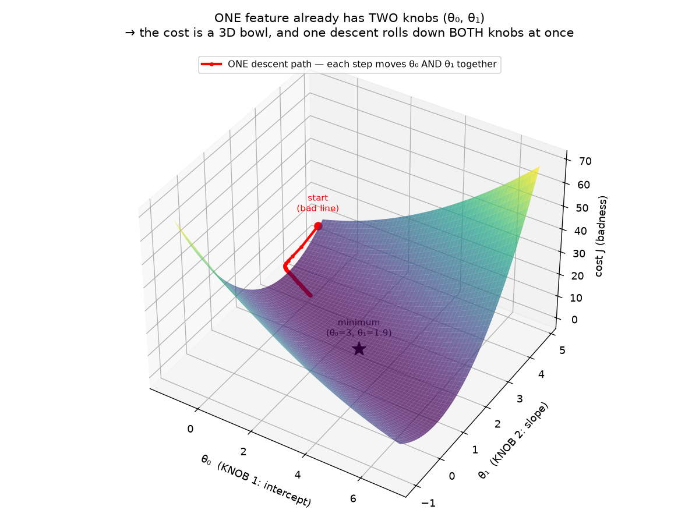
*What this graph shows: the honest picture of tuning **both** knobs of a one-feature line. The two floor axes are the parameters θ₀ and θ₁; the height is the badness score — together they make a 3D bowl. The single red path is gradient descent: each step moves θ₀ **and** θ₁ at once, rolling to the bottom (the best-fit line). One path, not one-per-knob — the extra dimension is the second knob, not a second descent.*

**But it's usually a *lopsided* bowl — you spotted this.** The bowl is rarely a clean, round one, because different features move the prediction by different amounts (different scales and slopes). That stretches the bowl into an **elongated valley** — steep across the narrow direction, gentle along the long one. Seen from directly above, the contour rings are **stretched ellipses, not circles**, and gradient descent **zig-zags** across the narrow direction while it crawls along the long one, instead of heading straight to the middle:

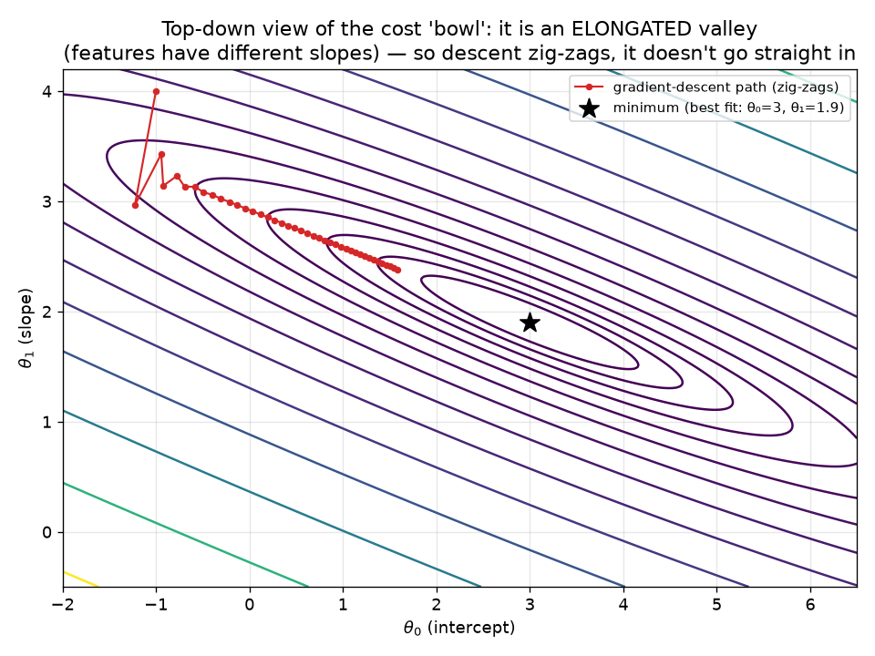
*What this graph shows: the same cost bowl viewed from straight above. The rings are stretched ellipses. The red path zig-zags across the narrow axis and inches along the long one toward the minimum (★). The more different the features' scales, the more stretched the valley — and the more the descent zig-zags.*

**The fix — feature scaling.** Rescaling the features to a common range (e.g. 0–1, or mean-0/variance-1) makes the bowl **rounder**, so gradient descent heads more directly to the bottom and converges faster. You'll meet this as a standard preprocessing step later; the point for now is *why* it helps — it un-stretches the valley.

### 3.8 Getting stuck: local vs global minima
> Sometimes a hillside has a **small dip partway down that isn't the true bottom.** Blindfolded, you might reach that dip, feel flat ground, and think "I made it!" — but a deeper valley exists elsewhere. That trap is a **local minimum**; the true bottom is the **global minimum.** *Good news for linear regression:* its valley is a single clean bowl with **no traps** — you always reach the true bottom. *Deep learning* has bumpy terrain full of traps, which is why it uses smarter step-strategies (**Adam, RMSprop**).

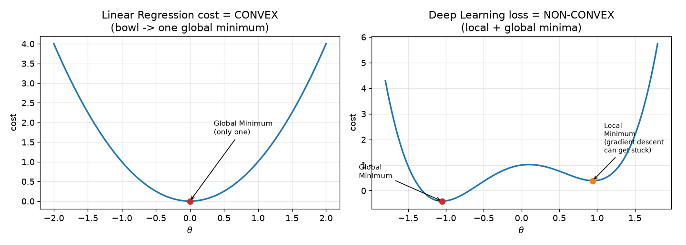
*What this graph shows: left = linear regression's smooth single bowl (one bottom, can't get stuck). Right = a deep-learning-style bumpy landscape with a shallow trap (local min) and the true deepest point (global min).*

**🎯 Say it clearly — "Are there local minima in linear regression?"** *"No. Its cost function is convex — a single bowl with one global minimum — so gradient descent can't get stuck. Local minima are a deep-learning problem, which is why we use optimizers like Adam or RMSprop there."*

### 3.9 When is linear regression the right tool? (and what to do when the data isn't linear)
> A sharp question: **should you only use linear regression when the relationship really is a straight line?** Mostly yes — but there's a useful nuance here that's genuinely worth understanding.

**If the relationship is a straight line** (more x → proportionally more y), linear regression is exactly right.

**If it's clearly *not* a straight line** — for example, **money growing by compound interest**, which curves upward exponentially over time — then forcing a straight line onto it is the *wrong tool*: the line systematically misses (it sits above the data in the middle and below at the ends), and R² looks mediocre.

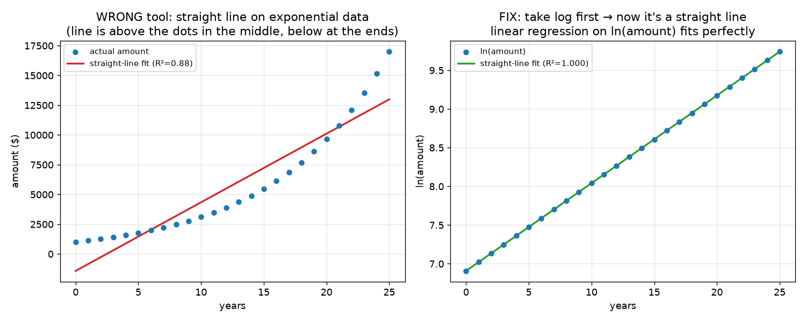
*What this graph shows: LEFT — a straight line forced onto exponential (compound-interest) growth. It "sort of" fits (R² ≈ 0.88) but you can see it systematically misses — the tell-tale sign the relationship isn't linear. RIGHT — take the **log** of the amount first, and the same data becomes a **perfectly straight line** (R² ≈ 1.00).*

**Why does the log work — and when?** Because it turns *multiplying* into *adding*. Compound interest multiplies by the same factor every period: $A = P(1+r)^t$. Take the log and $\ln A = \ln P + t\cdot\ln(1+r)$ — a constant ($\ln P$) plus a constant ($\ln(1+r)$) times $t$: that's literally the equation of a **straight line** in $t$. So the log is the exact *un-doer* of exponential growth. It linearizes when the relationship is **multiplicative / exponential** ($y = a\cdot b^{x}$ → take the log of $y$) or a **power law** ($y = a\cdot x^{k}$ → take the log of *both* $x$ and $y$). It does **not** straighten everything — it's a specific tool for a specific shape.

**What if the growth rate changes over time** (say 5% for a few years, then 8%)? Then it isn't a single clean exponential, so one log-linear line won't fit the whole span — on the log plot you'd see the **slope change** (a bend/kink where the rate changed). You'd handle it by fitting **separate lines per period**, or a model that lets the relationship shift over time (tree-based or a proper time-series model). The takeaway: the log trick assumes **one constant growth rate** across the data.

**So what do you do with non-linear data? Three options, least to most powerful:**
1. **Transform a variable so it becomes linear.** Compound interest is $A = P(1+r)^t$. Take the log: $\ln(A) = \ln(P) + t\cdot\ln(1+r)$ — now $\ln(A)$ is a *straight line* in $t$, so linear regression on $\ln(A)$ vs $t$ fits perfectly. *(This is exactly the log trick we used for World Bank income → life expectancy.)* Use this when you know or can guess the shape.
2. **Polynomial regression** — add $x^2, x^3, \dots$ as extra features: $y = \theta_0 + \theta_1 x + \theta_2 x^2 + \dots$. It's **still linear regression** (linear in the θ's) but it can bend into curves. Use for gentle curves when you don't want to guess an exact transform.
3. **Switch to a non-linear model** — **decision trees, random forests, gradient boosting (XGBoost)**, or **neural networks**. These learn arbitrary curved/complex patterns *without* you specifying the shape. Use when the relationship is complicated or unknown.

**🎯 Say it clearly — "Can you use linear regression on non-linear data?"** *"Plain linear regression assumes a straight-line relationship, so on clearly non-linear data it underfits and the residuals show a pattern. But you can often make it work by transforming a variable — e.g. a log for exponential growth — or adding polynomial features; it's still linear in the coefficients. If the relationship is genuinely complex, switch to a non-linear model like a random forest, gradient boosting, or a neural network."*

#### A field guide to non-linear shapes (and how to handle each)
The log is one tool for one shape. Here's the broader map — the common shapes data takes and the go-to fix for each.

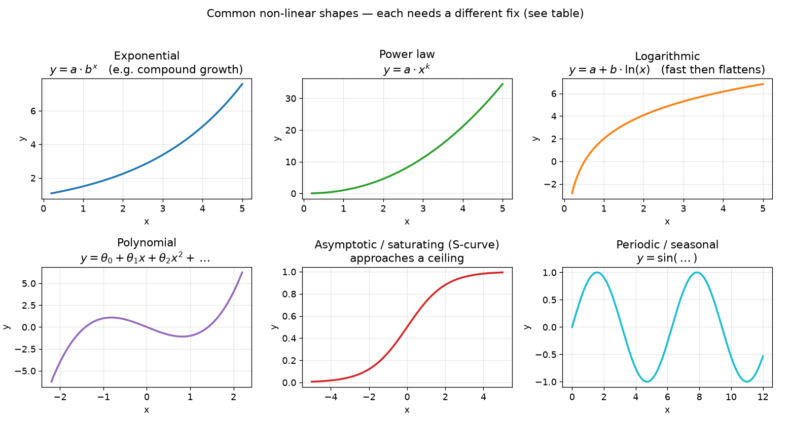
*What this graph shows: six shapes real data commonly takes. Each has a standard way to handle it — see the table.*

| Shape | Looks like | Example | How to handle it |
|---|---|---|---|
| **Linear** | straight line | more ads → proportionally more sales | plain linear regression |
| **Exponential** | curves up, ever-steeper | compound interest, viral growth | **log the y** → linear regression on $\ln y$ vs $x$ |
| **Power law** | curve through the origin | area vs length; many physics laws | **log both** → linear regression on $\ln y$ vs $\ln x$ |
| **Logarithmic** | fast rise, then flattens | learning curves, diminishing returns | use $\ln(x)$ as the feature |
| **Polynomial** | bends, humps, U-shapes | trajectory, dose–response | **polynomial regression** (add $x^2, x^3, \dots$ as features) |
| **Asymptotic / S-curve** | approaches a ceiling or floor | adoption, saturation, probabilities | **logistic regression** or a specific saturating / non-linear model |
| **Periodic / seasonal** | repeating waves | monthly sales, temperature | add sine/cosine features, or use time-series methods |
| **Complex / unknown** | no clean shape | most messy real data | **tree-based models** (random forest, XGBoost) or **neural networks** — they learn the shape for you |

**Rule of thumb:** if you can *see* the shape and it's a known one, a transform or polynomial keeps you in cheap, interpretable linear-regression land. If it's messy or unknown, reach for a model that learns the non-linearity on its own (trees, boosting, neural nets).

---

## Part 4 — Is the model any good? R² and Adjusted R²

### 4.1 R² — how much better than "just guess the average?"
> You built a model — but is it actually useful? Compare it to the **laziest possible model: always guessing the average.** (Predicting house prices? The lazy model just says "the average price" for every house.) If your line barely beats that lazy average-guess, it's weak. If it nails the points far better than the average, it's strong. **R² is exactly that comparison, scored from 0 to 1.** R² = 0.90 means your model explains 90% of what's going on; the lazy average-guess is the 0% baseline. It's like grading a student against the class average — how much better than average did they do?

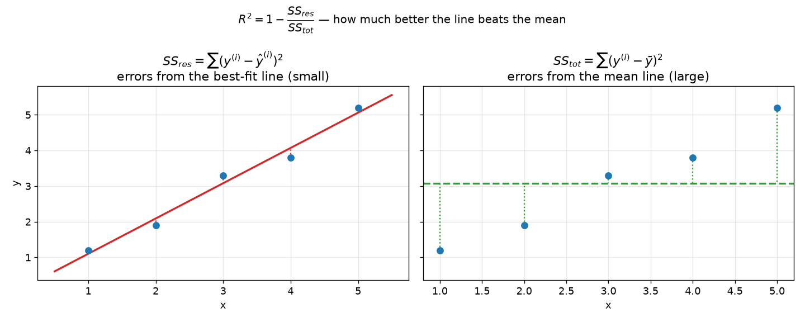
*What this graph shows: LEFT = how far the dots miss your best-fit line (small errors = good). RIGHT = how far the dots miss the flat "just guess the average" line (big errors = the baseline). R² compares the two.*

**The math.**

$$R^2 = 1 - \frac{SS_{res}}{SS_{tot}} = 1 - \frac{\sum_i (y^{(i)} - \hat{y}^{(i)})^2}{\sum_i (y^{(i)} - \bar{y})^2}$$

📖 **Read it aloud:** *"R squared equals one minus SS-res over SS-tot — which equals one minus, the sum of (y-i minus y-hat-i) squared, over the sum of (y-i minus y-bar) squared."* ($\hat{y}^{(i)}$ = "y-hat-i" = the **predicted** value; $\bar{y}$ = "y-bar" = the **average** of all the $y$'s. $SS$ = "sum of squares.")

**What it does:**
- **Top ($SS_{res}$, "residual sum of squares")** = your line's total squared error (small when the line fits well).
- **Bottom ($SS_{tot}$, "total sum of squares")** = the average-guess's total squared error (the baseline).
- Their **ratio** = "how much error you have compared to the dumb baseline." A good fit makes it tiny; **subtracting from 1** flips it so **near 1 = great, near 0 = no better than the average.**
- **Can R² be negative?** Yes — if your line is somehow *worse* than guessing the average (bottom < top). Rare in practice.

### 4.2 R²'s bad habit → Adjusted R²
> R² has one dangerous flaw: **it never goes down when you add a new column of data — even a totally useless one.** Add "customer's favorite color" to a house-price model and R² will still tick *up*, tricking you into thinking the junk-filled model is better. **Adjusted R² is the skeptical manager who fixes this.** It only gives credit for a new feature if that feature genuinely pulls its weight; add a useless column and Adjusted R² actually goes **down**, flagging "that column isn't earning its seat." So when comparing models with different numbers of features, you trust **Adjusted R², not R²**.
>
> *Example:* house price from `bedrooms` → R² 0.85. Add `location` (relevant) → 0.90, and Adjusted R² also rises. Add `gender` (irrelevant) → R² still creeps to 0.91, but **Adjusted R² drops** (say 0.86 → 0.82), correctly warning you off.

**The math.**

$$R^2_{adj} = 1 - \frac{(1 - R^2)\,(N - 1)}{N - P - 1}$$

📖 **Read it aloud:** *"adjusted R squared equals one minus, open paren one minus R squared close paren, times open paren N minus 1 close paren, all over open paren N minus P minus 1 close paren."* ($N$ = number of samples/rows; $P$ = number of predictors/features.)

**What it does:** it starts from R² but adds a **penalty for how many features you used.** Add more features → $P$ goes up → the denominator $N - P - 1$ **shrinks** → the subtracted fraction **grows** → the result gets **pulled down** — *unless* the new feature raised R² enough to outweigh that penalty. That's why a useless feature makes Adjusted R² fall.

**🎯 Say it clearly — "R² vs Adjusted R², which is bigger?"** *"R² is always ≥ Adjusted R². R² only ever rises when you add features, even irrelevant ones. Adjusted R² penalizes the number of predictors, so it only rises when a new feature genuinely helps — which is why we use it to compare models with different feature counts."*

---

## Part 5 — Putting it together: linear regression on real World Bank data

> So far we've used tiny made-up numbers to see the machinery. Here's the **exact same linear regression** run on **real World Bank data** — the kind of dataset you'll work with in the sessions.

**The question:** can a country's **income** predict its **life expectancy**? Using 210 countries (2021):
- **y (predict):** life expectancy at birth
- **x (feature):** income, as $\ln(\text{GDP per capita})$ — we use the **log** because income is wildly skewed (a handful of very rich countries), and the log straightens the relationship into a line.

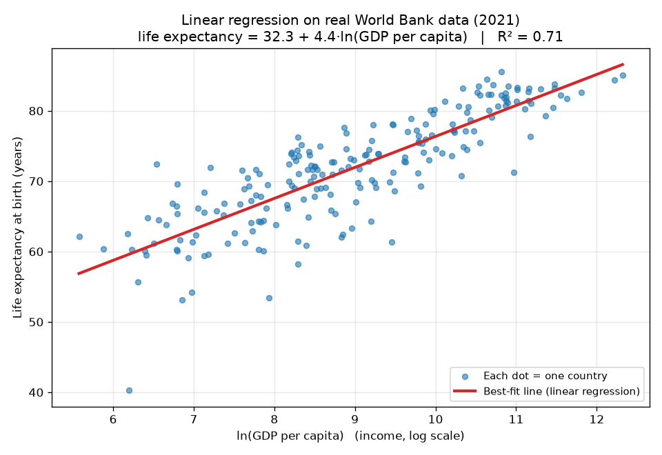
*What this graph shows: each dot is a country — income (log scale) across the bottom, life expectancy up the side. The red line is the linear regression best fit. Richer countries live longer, and one straight line captures most of that pattern.*

**The line the model learned:**

$$\text{life expectancy} = 32.3 + 4.4 \times \ln(\text{GDP per capita})$$

📖 **Read it aloud:** *"life expectancy equals thirty-two-point-three plus four-point-four times the natural log of GDP per capita."*

**What the numbers mean — interpret them, don't just report them (this is where real understanding shows):**
- **θ₀ = 32.3** (intercept) — anchors the line. (Literally the prediction at $\ln(\text{GDP})=0$, i.e. GDP per capita = 1 dollar — not physically meaningful alone, just where the line starts.)
- **θ₁ = 4.4** (slope) — each one-unit rise in $\ln(\text{GDP per capita})$ adds ~4.4 years. In plain terms: **every doubling of income buys roughly $4.4 \times \ln 2 \approx 3$ more years of life.**
- **R² = 0.71** — income *alone* explains **~71% of the differences in life expectancy across countries.** One feature, most of the story — the other 29% is healthcare, education, conflict, etc., which is exactly why you'd add more features (multiple regression).
- Sanity-check predictions from the line: 1,000 dollars/capita → ~63 years; 10,000 → ~73; 50,000 → ~80. Real, and roughly right.

**And it's only a few lines of code** — the hand-derived math *is* what scikit-learn runs for you:
```python
from sklearn.linear_model import LinearRegression
import numpy as np
X = np.log(df[["gdp_per_capita"]])       # feature: log income
y = df["life_expectancy"]                # target
model = LinearRegression().fit(X, y)     # the gradient-descent-style fit, done for you
print(model.intercept_, model.coef_[0])  # θ₀ , θ₁
print(model.score(X, y))                 # R²
```

**Why this matters for the plan:** this is the applied World Bank context in miniature — a real development question answered with the linear regression you just learned. In the sessions you'll run it live in the notebook; then you **repeat it on your own dataset** (a different indicator, or a Kaggle set) — and *that* becomes a project that's genuinely your own, a real question you answered with your own hands.

---

## Quick Reference — say it in plain words (then the term)
| Question | Plain-English answer (lead with this) |
|---|---|
| **What is linear regression?** | "Draw the straight trend line that comes closest to all the data points, then use it to predict." (Formally: minimize squared residuals.) |
| **What's the cost function?** | "A single badness-score for a line — the average of the squared misses. Lower = better." (Mean squared error.) |
| **Why square the errors?** | "So overshoots and undershoots don't cancel out, and big misses are punished more." |
| **Why ÷ 2m?** | "÷m makes it an average; the ½ is a math convenience that cancels cleanly in the calculus." |
| **How do we find the best line?** | "Gradient descent — like walking downhill blindfolded, feeling the slope and stepping down until you reach the valley bottom." |
| **What's the learning rate?** | "Step size. Too big overshoots the bottom; too small takes forever." |
| **What's the derivative doing?** | "Telling you which way is downhill and how steep, so you step the right way." |
| **Local minima in linear regression?** | "None — it's a single clean bowl (convex). Local minima are a deep-learning problem → Adam/RMSprop." |
| **θ₀ and θ₁?** | "θ₀ = the starting value (intercept); θ₁ = the rate/steepness (slope)." |
| **What's R²?** | "How much better your model is than just guessing the average — scored 0 to 1." |
| **Can R² be negative?** | "Yes, if your line is worse than the average-guess." |
| **R² vs Adjusted R²?** | "R² always rises when you add columns, even junk ones; Adjusted R² penalizes junk columns, so it only rises for useful features. R² ≥ Adjusted R²." |

## All the equations in one place
*(Full "how to read it" for each is in the body above.)*
- **Line (hypothesis):** $h_\theta(x) = \theta_0 + \theta_1 x$ — "h-theta of x equals theta-zero plus theta-one x."
- **Cost (badness score, MSE):** $J = \frac{1}{2m}\sum_{i=1}^{m}(h_\theta(x^{(i)}) - y^{(i)})^2$ — "average of the squared errors."
- **Gradient descent step:** $\theta_j := \theta_j - \alpha\,\frac{\partial J}{\partial\theta_j}$ — "nudge each theta downhill by learning-rate × slope."
- **Slopes:** $\frac{\partial J}{\partial\theta_0} = \frac{1}{m}\sum(h_\theta(x^{(i)})-y^{(i)})$ (average error); $\;\frac{\partial J}{\partial\theta_1} = \frac{1}{m}\sum(h_\theta(x^{(i)})-y^{(i)})x^{(i)}$ (average error weighted by x).
- **R²:** $R^2 = 1 - \frac{SS_{res}}{SS_{tot}}$ — "one minus (your error ÷ the average-guess's error)."
- **Adjusted R²:** $R^2_{adj} = 1 - \frac{(1-R^2)(N-1)}{N-P-1}$ — "R² with a penalty for the number of features."

## Glossary (jargon → plain English)
| Term | Plain meaning |
|---|---|
| Hypothesis $h_\theta(x)$ | The learned rule / best-fit line that turns an input into a prediction ("h-theta of x") |
| Independent feature | An input (the stuff you know); can be many |
| Dependent feature | The output (the thing you predict); exactly one |
| Residual / error | How far a prediction missed the real value |
| Cost function $J$ | The line's "badness score" — average squared miss |
| θ₀ / θ₁ | Starting value (intercept) / rate (slope) |
| Gradient descent | Walking downhill on the badness-score valley to the best line |
| Learning rate $\alpha$ | Step size when walking downhill |
| Convergence | You've reached the bottom (score stops dropping) |
| Global / local minimum | The true bottom / a fake bottom you can get stuck in |
| Convex | A single clean bowl (no fake bottoms) — true for linear regression |
| $SS_{res}$ / $SS_{tot}$ | Total miss from your line / from the average line |
| $R^2$ / Adjusted $R^2$ | How much you beat the average-guess / same, but penalizing junk features |

---
*ML Study 01 — Intro → Linear Regression → R²/Adjusted R². Diagrams built for clarity. Next: Ridge & Lasso → Logistic Regression.*
