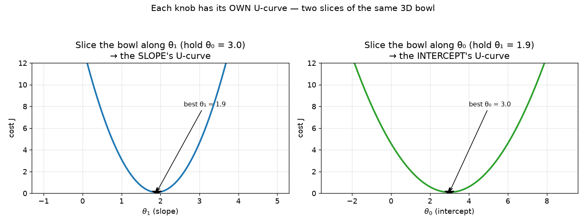
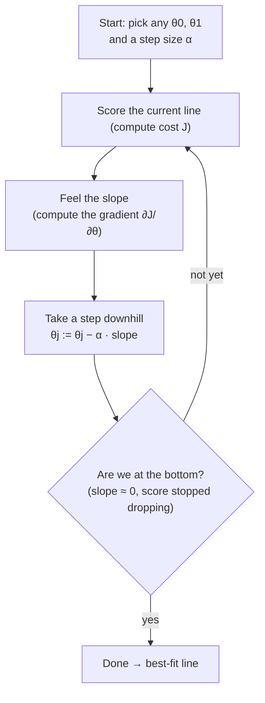
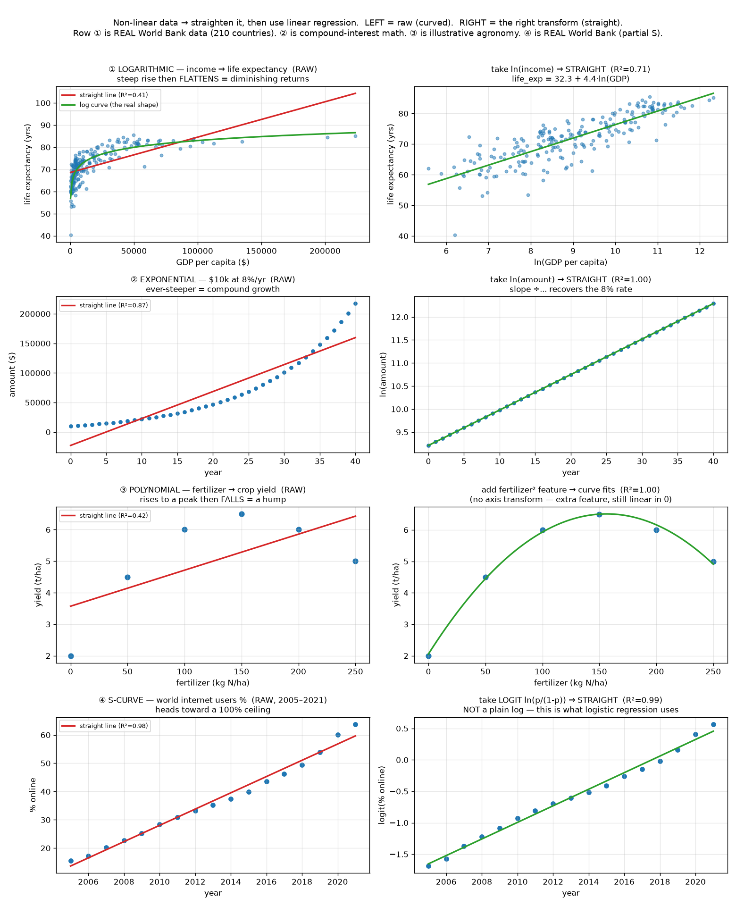
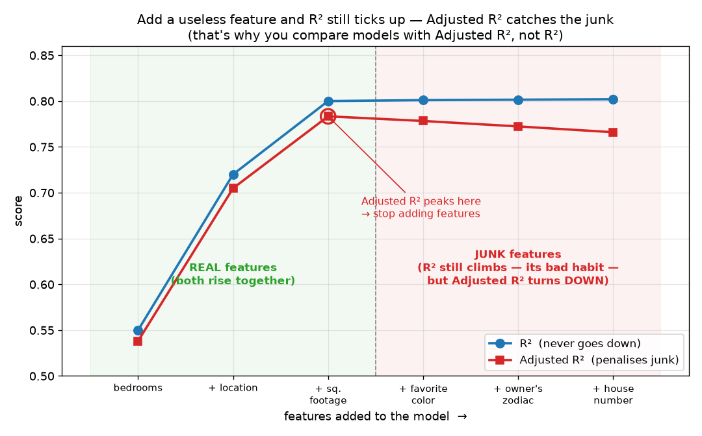

# ML Study 01 — Linear Regression

**Covers:** the best-fit line → the cost function → gradient descent → R² / Adjusted R² → real World Bank data.
**Goal:** understand it well enough to *explain the idea, the math, and the graphs in plain English* — and to see *why* each piece works, not just *that* it works. We start from intuition; the formulas follow.

**Series context:** this is **Parts 3–5**. The map — AI vs ML vs DL, and *regression vs classification* — is in **[ML Study 00 — ML Foundations](ML_Study_00_ML_Foundations.html)**. Three ideas carry over from there: **regression** predicts a *number*; **supervised** learning trains on labelled examples; and the **hypothesis** $h_\theta(x)$ is the line the model learns.

---

## Part 3 — Linear Regression (the core)

### 3.1 The idea: draw the best trend line
> Plot your data as dots on a graph. **Linear regression draws the single straight line that comes closest to all the dots at once** — the "line of best fit," the trend line you'd eyeball through a scatter of points. Once you have that line, predicting is easy: for any new input, just read the height of the line.

Here's a tiny sample dataset — four weeks of **advertising spend and the weekly sales that followed** (both in $1,000s). **These four rows are exactly the dots plotted below — and we'll carry this same example all the way through linear regression:**

| Point | x = ad spend | y = sales *(actual)* | ŷ = sales *(line's prediction)* | error = y − ŷ |
|:---:|:---:|:---:|:---:|:---:|
| 1 | 1 | 5 | 4.9 | +0.1 |
| 2 | 2 | 7 | 6.8 | +0.2 |
| 3 | 3 | 8 | 8.7 | −0.7 |
| 4 | 4 | 11 | 10.6 | +0.4 |

*How to read the table:* the first two columns (**ad spend, sales**) are the **sample data** — the blue dots. The **ŷ** column is what the **best-fit line predicts** for each spend, and **error** is the leftover miss (the gray dashed lines in the graph). Those errors are exactly what the cost function (§3.3) squares and adds up. *(Notice the errors roughly cancel to ≈ 0 — a good-fit line sits right in the middle of the points.)*

Plotted as a scatter with the best-fit line drawn through them:


*What this graph shows: blue dots = the real data (the first two columns above). The red line = the model's best guess of the trend, **sales = 3 + 1.9 × spend**. Each gray dashed line = how far the line missed that dot — the **error** column above. Linear regression picks the line that makes all those gray misses as small as possible.*

**The math.** A straight line is written using Andrew Ng's notation:

$$h_\theta(x) = \theta_0 + \theta_1 x$$

📖 **Read it aloud:** *"h-theta of x equals theta-zero plus theta-one times x."* ($h_\theta(x)$ is read **"h-theta of x"** — the hypothesis $h$, *tuned by* the parameters $\theta$, *evaluated at* input $x$; in plain words, "the line's prediction for input x.")

**What it does:** it's the recipe for the line. Give it an input $x$ and it returns a prediction — **start at $\theta_0$, then add $\theta_1$ for every unit of $x$.** (You'll also see the same line written as $y = mx + c$ or $y = \beta_0 + \beta_1 x$.)

**Reading the symbols you'll keep seeing:**
- $\theta_0$ = "theta-zero", $\theta_1$ = "theta-one" — the two numbers we tune.
- $x^{(i)}, y^{(i)}$ = "x-i, y-i" — the $i$-th data point. The superscript $(i)$ is an **index** (which row), **not** a power.
- $m$ = the number of data points.
- $:=$ = "gets updated to" (an assignment/update, not an equation).
- $\hat{y}$ = "y-hat" = a predicted value; $\bar{y}$ = "y-bar" = the average of $y$.
- $\sum_{i=1}^{m}$ = "the sum, for i from 1 to m" — add the same thing up over every data point.

### 3.2 What θ₀ and θ₁ actually mean
> Every straight line is just **"a starting point plus a rate."** Take our ad spend → sales line:
> - **θ₀ (intercept) = the starting value** — the sales you'd expect at **0 ad spend** (where the line crosses the vertical axis).
> - **θ₁ (slope) = the rate** — the **extra sales for each additional $1,000 of ad spend** (how much the line climbs for each step right).
>
> Finding the best line = finding the best *starting point* and the best *rate*.


*What this graph shows: our ad-spend line, **sales = 3 + 1.9 × spend**. The **starting value** ($\theta_0 = 3$, where it meets the vertical axis) plus a **rate** ($\theta_1 = 1.9$, how much it climbs per step right). Finding the best line = finding the best starting value and rate.*

**The math.** $\theta_0$ = **intercept** (value of $h_\theta(x)$ when $x = 0$). $\theta_1$ = **slope/coefficient** (change in $y$ per one-unit increase in $x$).

**So what's the actual formula for the slope?** Two different questions hide here — answer both:

**(a) Given the line, read the slope off it — "rise over run":**

$$\theta_1 = \frac{\text{rise}}{\text{run}} = \frac{\Delta y}{\Delta x} = \frac{y_2 - y_1}{x_2 - x_1}$$

📖 *"theta-one equals rise over run — the change in y divided by the change in x."* Step 1 unit right, see how far the line climbs. On our line that climb is **1.9** — every extra $1,000 of ad spend lifts sales by $1,900.

**(b) Given only the data, compute the best slope — the least-squares formula:**

$$\theta_1 = \frac{\sum_i (x^{(i)} - \bar{x})(y^{(i)} - \bar{y})}{\sum_i (x^{(i)} - \bar{x})^2}
\qquad\qquad \theta_0 = \bar{y} - \theta_1\bar{x}$$

📖 *"theta-one equals the sum of (x minus x-bar)(y minus y-bar), over the sum of (x minus x-bar) squared; then theta-zero equals y-bar minus theta-one times x-bar."* ($\bar{x}, \bar{y}$ are just the averages.)

**What is that formula actually asking?** *"When x goes up, does y go up too — and by how much?"* Read the top and bottom separately:
- **Top — "do they move together?"** For each point, $(x^{(i)} - \bar{x})$ asks *"is this a high-x or low-x point?"* and $(y^{(i)} - \bar{y})$ asks *"high-y or low-y?"* **Multiply them:** the product is **positive** when a point is high on *both* (or low on both) — x and y **moving together** — and negative when one's high and the other low. Summing gives the total "move-together" signal.
- **Bottom — "how spread out is x?"** $\sum(x^{(i)}-\bar{x})^2$ is just how much the x-values vary.
- So **slope = (how much x and y move together) ÷ (how much x spreads out).**

**Trace it on our four weeks** ($\bar{x} = 2.5,\ \bar{y} = 7.75$) — *this* is where the 9.5 and 5.0 come from:

| week | x | y | $x - \bar{x}$ | $y - \bar{y}$ | product | $(x-\bar{x})^2$ |
|:---:|:---:|:---:|:---:|:---:|:---:|:---:|
| 1 | 1 | 5 | −1.5 | −2.75 | 4.125 | 2.25 |
| 2 | 2 | 7 | −0.5 | −0.75 | 0.375 | 0.25 |
| 3 | 3 | 8 | +0.5 | +0.25 | 0.125 | 0.25 |
| 4 | 4 | 11 | +1.5 | +3.25 | 4.875 | 2.25 |
| | | | | **sum →** | **9.5** | **5.0** |

$$\theta_1 = \frac{9.5}{5.0} = \mathbf{1.9}$$

**Then the intercept.** The best-fit line *always* passes through the **average point** $(\bar{x}, \bar{y}) = (2.5, 7.75)$ — the data's center of mass. So once you know the slope, slide the line until it hits that point: $\bar{y} = \theta_0 + \theta_1\bar{x}$, which gives

$$\theta_0 = \bar{y} - \theta_1\bar{x} = 7.75 - 1.9 \times 2.5 = \mathbf{3.0}$$

**That's where the 3 and the 1.9 come from** — not magic, just that formula, one row at a time.

**What about more than one feature?** This formula is the **one-feature** case. With several features ($x_1, x_2, \dots$ and $\theta_1, \theta_2, \dots$) the same closed-form idea generalizes to the **Normal Equation** — one *matrix* formula that solves for **all** the θ's at once:

$$\theta = (X^\top X)^{-1}\, X^\top y$$

where $X$ stacks the data (one row per point, one column per feature) and $y$ is the answers. *(The scalar formula above is just this collapsed to one dimension.)* Two things to know: you **can't** run the one-feature formula on each feature separately — features can be **correlated**, and the matrix is what solves them *jointly* (so no feature double-counts another's effect). And notice the catch: it must **invert a matrix**, which grows expensive fast (≈ features³) and can even fail if features are redundant — **yet another reason gradient descent is the general workhorse.** Gradient descent, by contrast, scales trivially: just more knobs, all nudged together each step (§3.7).

> **Wait — if a formula hands us the best slope, why do gradient descent at all?** *(Gradient descent is the step-by-step "start with a guess and walk downhill" method we build in §3.4 — for now, just "the other way to find the best line.")* (And the flip side: *how can a formula know the "best" without trying anything?*) Here's the resolution — it's one of the most important ideas in ML. The best line sits at the **bottom of the cost bowl** (§3.3), where the slope is **zero**. The formula and gradient descent are **two roads to that same bottom:**
> - **The formula** uses calculus to *solve* "where is the slope zero?" in one shot — possible *only* because linear regression's bowl is simple enough to solve exactly.
> - **Gradient descent** *walks* to that same zero-slope point, step by step.
>
> They reach the **identical** answer (3.0, 1.9). **So why learn the walk?** Because almost every other model — neural networks especially, and even logistic regression next — has a cost surface too complex to solve with any formula. There, walking downhill is the **only** option. We learn it here, on the one problem where a formula *does* exist, precisely so we can **check the walk against the exact answer.** *(And we do: §3.4 walks downhill and lands on exactly 3.0 and 1.9.)*

### 3.3 Scoring a line: the cost function
> To find the *best* line, you first need a way to say how *bad* any given line is — a single **badness score**. Here's the recipe: for each dot, measure how far the line's prediction missed (the error). **Square** each error, then **average** them. Low score = good line, high score = bad line. **It's literally a golf score: lower is better, and our goal is the lowest score possible.**
>
> - **Why square the errors?** (1) A miss of −3 and a miss of +3 are equally bad, but if you just added them they'd cancel to 0 and *lie* to you that the line is perfect — squaring makes every miss positive. (2) Squaring **punishes big misses far more** than small ones (a miss of 4 counts as 16; a miss of 2 counts as 4), which is exactly what you want.
> - **Why "average" (÷ m)?** So the score is fair whether you have 10 rows or 10 million.
> - **What about that extra ½ (the 2 in the denominator)?** Pure convenience for the calculus that's coming. To improve the line we'll *differentiate* this squared error — and squaring spits out a **2**. The ½ is placed here so it cancels that 2, keeping every later formula clean. *(The 90-second calculus primer just below explains exactly why — that's its proper home — and you'll watch the 2 cancel in §3.7.)* It does **not** change which line wins — halving every score doesn't move where the minimum sits.


*What this graph shows: each candidate slope for the line gets a badness score; plotting slope (across) vs. score (up) gives a U-shaped valley, and the bottom of the valley is the best-fit line. Our whole job is to reach that bottom.*

> **Where's θ₀ in this picture?** To keep the graph 2D, this U-curve varies only the **slope (θ₁)** and holds the intercept **θ₀** fixed — a flat picture shows one knob at a time. **θ₀ has its own U-curve too** — you just slice the bowl the other way:


*What this graph shows: slice the cost bowl along **θ₁** (holding θ₀) → the slope's valley; slice it along **θ₀** (holding θ₁) → the intercept's valley. Same bowl, two slices, each a U-curve with its own bottom. With both knobs varying at once, the true shape is the **3D bowl** of §3.7.*

> **Same *process*, different *formula*.** θ₀ gets treated exactly like θ₁ — its own slope, its own downhill step, moved together every iteration — **but its slope *formula* is different:** θ₀'s slope is the **plain average error**, while θ₁'s is the **average error weighted by x**. You'll compute both in the §3.4 table, and see *why* they differ in the calculus primer (the chain-rule "inside derivative" is **1** for θ₀ but **x** for θ₁). So: same method, two different slope formulas.

**The math.** The badness score is the **cost function** $J$ — the mean squared error:

$$J(\theta_0, \theta_1) = \frac{1}{2m}\sum_{i=1}^{m}\Big(h_\theta(x^{(i)}) - y^{(i)}\Big)^2$$

📖 **Read it aloud:** *"J of theta-zero and theta-one equals one over two-m, times the sum from i equals 1 to m of, open paren, h-theta of x-i minus y-i, close paren, squared."*

*Why "**of θ₀ and θ₁**"? Because the badness score depends on **both** knobs — change either the intercept or the slope and the score changes, so J is a function of both. With more features you'd tune more knobs and simply write $J(\theta_0, \theta_1, \theta_2, \dots)$ — the cost is always a function of **every** parameter you're adjusting.*

**What it does, step by step:** for each data point $i$ —
1. $h_\theta(x^{(i)})$ = the line's **prediction** for that point,
2. $-\,y^{(i)}$ = subtract the **actual** value → this is the **error** (how far off),
3. $(\;)^2$ = **square** it (positive, and big misses hurt more),
4. $\sum_{i=1}^{m}$ = **add up** all $m$ squared errors,
5. $\frac{1}{2m}$ = **divide by $2m$** to get the (half-)average.

The single number $J$ that pops out = "how bad is this line." **Goal:** find $\theta_0, \theta_1$ that make $J$ as small as possible ($\min J$).

**Now do it with real numbers — this table *is* the code.** Take the worst possible line, the flat one the algorithm starts from: $\theta_0 = 0,\ \theta_1 = 0$, which predicts **0 sales no matter what you spend**. Walk the four weeks one row at a time:

| week | $x$ (spend) | $y$ (sales) | $\hat{y} = h_\theta(x)$ | error $= \hat{y} - y$ | error$^2$ |
|:---:|:---:|:---:|:---:|:---:|:---:|
| 1 | 1 | 5 | 0 | −5 | 25 |
| 2 | 2 | 7 | 0 | −7 | 49 |
| 3 | 3 | 8 | 0 | −8 | 64 |
| 4 | 4 | 11 | 0 | −11 | 121 |
| | | | | **sum →** | **259** |

Then divide by $2m = 2 \times 4 = 8$:

$$J(0,\,0) = \frac{259}{8} = \mathbf{32.375}$$

*(Here every error is negative because a flat line at 0 under-predicts every week. We write error as **prediction − actual** to match the formula; §3.1 wrote it the other way round — but we **square** it, so 25 is 25 either way.)*

**That single number, 32.375, is the badness of the flat line** — and it's not abstract. Run `hands-on/hello_gradient_descent.py` and the very first row of its output reads `cost 32.3750`. The table above **is** the `cost()` function, done by hand — each column is one line of code:

```python
def cost(theta0, theta1):
    total = 0.0
    for x, y in zip(ad_spend, sales):          # ← one table ROW per loop pass
        error = predict(theta0, theta1, x) - y #   the "error" column
        total += error ** 2                    #   the "error²" column, summed
    return total / (2 * m)                     # ← the final ÷ 2m step
```

Every other line gradient descent tries gets scored this exact same way. Its whole job (§3.4) is to hunt for the line whose score is the **lowest** — which turns out to be $J(3,\,1.9) = 0.0875$, down from 32.375.

### 3.4 Watch it learn: gradient descent on a real example
> You can't test *every* possible line — there are infinitely many. So instead you **start with a guess and let the math improve it, step by step**, until it can't get better. Let's watch that actually happen on a small, realistic dataset — with a genuine intercept and slope, not a perfect 45° line.

**The data** — the **same four weeks of ad spend → weekly sales from §3.1** (both in $1,000s):

| Ad spend (x) | Sales (y) |
|:---:|:---:|
| 1 | 5 |
| 2 | 7 |
| 3 | 8 |
| 4 | 11 |

These are the same actual data points you saw fitted in §3.1 — but there we just *showed* you the answer line; here we watch the algorithm **find** it. The best fit *turns out to be* **sales = 3 + 1.9 × spend** — our algorithm doesn't know that yet; it has to discover it, starting from nothing.

**Step 0 — set everything up, then start from a deliberately bad guess.** Before the loop can run we make a handful of choices. It's worth seeing *all* of them at once, because only two are things the algorithm will *learn* — the rest are dials **we** set and the algorithm never touches:

| We choose… | Our choice here | What it is |
|---|---|---|
| the model's **shape** | a straight line, $h_\theta(x)=\theta_0+\theta_1 x$ | our assumption that sales rise linearly with spend |
| the **badness score** | mean squared error, $J$ | how we grade a line (§3.3) |
| **starting values** for the knobs | $\theta_0 = 0,\ \theta_1 = 0$ | a flat line — deliberately terrible, so we can watch it recover |
| the **learning rate** $\alpha$ | 0.05 | step size downhill (§3.6) |
| **how much data** per step | all 4 weeks | "batch" gradient descent (§3.7) |
| **when to stop** | cost stops dropping (`TOLERANCE`) or a cap (`MAX_ITERS`) | the exit conditions (§3.5) |

**Only $\theta_0$ and $\theta_1$ get *learned*** — those two are the **parameters**, the numbers the loop hunts for. **Everything else in that table we set by hand** before pressing go — those are the **hyperparameters** (plus the modelling choices). The algorithm never adjusts them; tuning them well is *your* job. Keep that line sharp — it's one of the most useful distinctions in all of ML:

> **Parameters** are found *by* the model (here: θ₀, θ₁). **Hyperparameters** are chosen *by you* (here: α, the initial guess, batch size, the stopping rules). A model "learns" its parameters; you "tune" its hyperparameters.

**How to set each dial — a first field guide.** These are the knobs *you* turn; here's what each does and where to start:

| Hyperparameter | What it controls | How to set it / what to try |
|---|---|---|
| **learning rate α** | the size of each downhill step — *the one you'll tune most* | Start ~**0.01**; try a ladder **0.001 → 0.01 → 0.1**. If the cost goes **up**, α is too big (overshooting); if it barely moves, too small (crawling). Both failure modes are in §3.6. |
| **starting values** (θ₀, θ₁) | where the walk begins | For linear regression's single bowl it **doesn't matter** (every start reaches the one bottom), so `0` is fine. For models with many local minima (neural nets) it matters — you start from small **random** values. |
| **MAX_ITERS** | a hard cap on the number of steps | A safety net so a bad α can't loop forever. If training stops here *without the cost flattening*, it hasn't converged — raise the cap (or fix α). |
| **TOLERANCE** | *"close enough to stop"* — how tiny a cost improvement still counts as progress | Each step lowers the score a little; once one whole step improves it by **less than TOLERANCE**, more steps aren't worth it, so we stop. **Smaller → more precise answer but more iterations; larger → stops sooner, rougher.** Typical values are tiny, e.g. $10^{-6}$. |
| **batch size** | how much data each step looks at | **all** rows (*batch* — what we do here: smooth but slower steps), **one** row (*stochastic*: fast, noisy), or a **chunk** of ~32–256 (*mini-batch*: the deep-learning default). More in §3.7. |

**The mental model:** *parameters* are the answer the model finds; *hyperparameters* are the settings that control **how** it searches. Getting them wrong doesn't give a slightly-wrong answer — it can give **no** answer (α too big → diverges) or a wasted afternoon (α too small → never finishes). Tuning them is a real part of the job.

> **Is that the *full* list of hyperparameters for linear regression?** No — it depends on *which* linear regression:
> - **Plain / closed-form (OLS)** — solved directly by the Normal Equation (§3.2), so it has **essentially none**; there's nothing to tune.
> - **Gradient-descent** linear regression — the five dials above (α, starting values, MAX_ITERS, TOLERANCE, batch size), plus optionally a **learning-rate schedule** (shrink α as you go).
> - **Regularized** linear regression (**Ridge / Lasso** — Study 02) — adds the big one: the **regularization strength λ** (how hard to penalize large weights), and for Elastic Net the **L1/L2 mix**.
> - **Modelling choices** that behave like hyperparameters: the **polynomial degree** (§3.9) and whether you **scale the features** (§3.7).
>
> So the five above are the core *gradient-descent* set — not a universal "linear regression" list. Add regularization or polynomial features and you add more.

> **One notation note before the table — $\hat{y}$ and $h_\theta(x)$ are the *same thing*.** Both mean "the model's prediction." We keep both on purpose, because you'll see both everywhere: **$h_\theta(x)$** is natural in the *machinery* (the cost and gradient formulas, where the parameters $\theta$ are the whole point), while **$\hat{y}$** — "y-hat" — is the everyday shorthand for a predicted value that reads cleaner in *tables* and in error terms like $\hat{y}-y$ (and it's what R² and scikit-learn use). Same quantity, two names — so $\hat{y} = h_\theta(x)$.

**Step 1 — do the math once, and watch the line improve.** With θ₀ = θ₁ = 0:

| | value |
|---|---|
| **Predictions** $\hat{y} = h_\theta(x) = \theta_0 + \theta_1 x = 0 + 0\cdot x$ | 0, 0, 0, 0 |
| **Errors** $(\hat{y} - y)$ | −5, −7, −8, −11 |
| **Cost** $J(\theta_0,\theta_1) = \frac{1}{2\cdot 4}\left[(0-5)^2+(0-7)^2+(0-8)^2+(0-11)^2\right] = \frac{259}{8}$ | **32.4** (very bad, as expected) |
| **Slope for θ₀** $=\dfrac{\partial J}{\partial\theta_0}=$ average error $=\dfrac{-5-7-8-11}{4}$ | **−7.75** |
| **Slope for θ₁** $=\dfrac{\partial J}{\partial\theta_1}=$ avg error weighted by $x=\dfrac{(-5)(1)+(-7)(2)+(-8)(3)+(-11)(4)}{4}$ | **−21.75** |
| **Update** $\theta_0 := 0 - 0.05(-7.75)$ | **0.39** |
| **Update** $\theta_1 := 0 - 0.05(-21.75)$ | **1.09** |
| **New cost** with the updated line | **11.3** ↓ |

*(Reading row 1: the prediction is the full line $\theta_0 + \theta_1 x$ — here both knobs are 0, so $0 + 0\cdot x = 0$ for every week. Reading row 3: each squared term is $(\hat{y}-y)^2$, e.g. $(0-5)^2 = 25$ — that's where the 25 comes from.)*

**"Those last two slope rows — that's a derivative, isn't it?"** Exactly right. Each "slope" is a **partial derivative** of the cost — $\dfrac{\partial J}{\partial\theta_0}$ and $\dfrac{\partial J}{\partial\theta_1}$ — meaning *"if I wiggle only this one knob, how fast does the badness $J$ change?"* §3.7 does the full derivation; here is the one-line reason they come out so clean.

Differentiating the squared cost brings the power down ($x^2 \to 2x$), and that **2 cancels the ½** in $\frac{1}{2m}$ — leaving a plain **average** ($\frac{1}{m}\sum$). What survives is the derivative of the **inside**, $(\theta_0 + \theta_1 x - y)$, and *that* is where the two rows part ways:

- wiggle **θ₀** — it sits **alone**, so its inside-derivative is just **1** → the slope is the **plain average error**.
- wiggle **θ₁** — it is **multiplied by $x$**, so its inside-derivative is **$x$** → every term gets **weighted by its own $x$**.

**That's the entire difference between the two slope rows: θ₀ carries no $x$, so it's a plain average; θ₁ is attached to $x$, so it's $x$-weighted.** (Full working in §3.7; the single calculus rule behind it is in the primer just below.)

The cost fell from **32.4 → 11.3 in one step** — the math nudged the line toward the data on its own.

**Repeat the same step over and over, and it keeps improving until it settles:**

| Iteration | θ₀ | θ₁ | cost J |
|:---:|:---:|:---:|:---:|
| 0 (start) | 0.00 | 0.00 | 32.38 |
| 1 | 0.39 | 1.09 | 11.28 |
| 2 | 0.62 | 1.72 | 4.12 |
| 3 | 0.76 | 2.08 | 1.69 |
| 5 | 0.91 | 2.42 | 0.58 |
| 10 | 1.04 | **2.55** ← overshoot peak | 0.41 |
| 30 | 1.32 | 2.47 ← easing back | 0.32 |
| 100 | 2.01 | 2.24 | 0.17 |
| 500 | 2.95 | 1.92 | 0.088 |
| 3000 | **3.00** | **1.90** | **0.0875** |

It lands on exactly **θ₀ = 3.0, θ₁ = 1.9** — the true best fit — with the cost bottoming out at 0.0875. (θ₁ overshoots to ~2.55 early then eases back as θ₀ catches up: a normal zig-zag; what matters is the **cost drops every step**.)


*What this graph shows: the same four data points (dots) with the line drawn at different iterations. It starts flat (the bad guess at 0) and swings up fast. **Look closely at "iter 30": it is steeper than the final line, not closer to it** — that's the overshoot from the table above (θ₁ races to ≈2.55 while θ₀ lags behind), and it then eases back down as θ₀ catches up. That's not an error in the picture — it's the zig-zag, and it's normal. What matters is that the **cost drops at every single step**, even while the line looks like it's wandering.*


*What this graph shows: the cost (badness score) at **every** iteration — it drops fast in the first ~10 steps, then flattens as the line nears the best fit and the last ~40 steps barely move it. (Plotting every step shows it's a smooth descent, not a cliff.) This falling curve is the **learning curve**, and watching it fall is how you confirm training is actually working.*

That back-and-forth — **predict → measure the error → nudge the line downhill → repeat** — is **gradient descent.** The next section states the one-line rule behind it.

### A 90-second calculus primer — only the bits this doc needs
> You don't need a calculus course for this. You need **one idea** and a handful of **small rules.**

**The one idea: a derivative is just a slope.** The **derivative** of a function at a point tells you **how steep it is and which way it tilts** there — how fast the output changes when you nudge the input. On our badness-score valley:
- **Positive** derivative → the ground tilts **up to the right** → the bottom is to your **left**.
- **Negative** derivative → tilts **down to the right** → the bottom is to your **right**.
- **Zero** derivative → **flat ground** → you're at the **bottom** (the minimum). *This is why gradient descent stops when the slope reaches ≈ 0.*

**But when is it actually negative or positive? Read it straight off your errors.** For the intercept knob, the slope turns out to be nothing more than the **average error** (§3.7 shows why):

| Where your line sits | Average error $(\hat{y} - y)$ | Derivative | The update $\theta_0 - \alpha(\text{slope})$ does… |
|---|:---:|:---:|---|
| **too low** (under-predicting) | negative | **negative** | subtracting a negative → **raises** the line ✓ |
| **too high** (over-predicting) | positive | **positive** | subtracting a positive → **lowers** the line ✓ |
| **balanced** through the middle | ≈ 0 | **≈ 0** | nothing moves — **you've converged** |

The sign always points *away* from where you want to go — which is exactly why the update rule **subtracts** it.

**Derivative vs. partial derivative — and how they're written.** A plain **derivative** (written $\frac{d}{dx}$, a *straight* "d") is for a function of **one** input — one variable, one slope. But our cost $J(\theta_0, \theta_1)$ has **two** inputs, so there's no single "the derivative" — there are two directions you could move. So we take a **partial derivative**, written with a *curly* **∂** (read "partial-dee"), one per knob:

- $\dfrac{\partial J}{\partial \theta_0}$ — "the slope if I wiggle **only** θ₀ and hold θ₁ fixed"
- $\dfrac{\partial J}{\partial \theta_1}$ — "the slope if I wiggle **only** θ₁ and hold θ₀ fixed"

The **rules are exactly the same** as for an ordinary derivative — the *only* thing "partial" changes is that you treat the **other** variable as a fixed number (a constant). That's why the constant rule does the heavy lifting: the held-fixed symbols differentiate to 0.

> **So which one handles "both θ₀ and θ₁ together"?** Not a plain derivative, and not a single partial — it's the **gradient**, written $\nabla J = \left[\dfrac{\partial J}{\partial \theta_0},\ \dfrac{\partial J}{\partial \theta_1}\right]$: the *pair* of partials stacked into one vector. So the hierarchy is: **derivative** = the one-variable case ($\frac{d}{dx}$); **partial derivative** = one knob of a many-variable function ($\frac{\partial}{\partial \theta_j}$, others held fixed); **gradient** = all the partials bundled together ($\nabla J$). Gradient descent uses the whole gradient — it nudges θ₀ and θ₁ *together*, each by its own partial (that's the "simultaneous update" of §3.7).

**The rules we use** — all small ones, and **the same whether it's a derivative or a partial derivative**:

- **Power rule:** the derivative of $x^2$ is $2x$ (bring the power down to the front, drop it by one). The derivative of a plain $x$ is just $1$.
- **Constant rule:** the derivative of a **constant** — any plain number, *or any term with no θ in it* — is **0** (flat ground has no slope). And a constant *times* θ just keeps the constant: $\frac{d}{d\theta}(c\,\theta) = c$.
- **Sum rule:** the derivative of a *sum* is the *sum of the derivatives*. So a big $\sum(\dots)^2$ can be differentiated **one term at a time**, then added up — the $\sum$ just comes along for the ride.
- **Chain rule:** to differentiate *something-squared*, bring the 2 down and multiply by the derivative of the **inside**: $\frac{d}{d\theta}(\text{inside})^2 = 2\,(\text{inside})\cdot(\text{inside})'$.

**Now the step that trips everyone up — the derivative of the inside $(\theta_0 + \theta_1 x - y)$.** Because we take the slope for **one knob at a time** (that's the partial derivative), we treat every *other* symbol as a **fixed number** and lean on the constant rule:
- **with respect to θ₁:** $\theta_0$ has no θ₁ → **0**; $-y$ has no θ₁ → **0**; $\theta_1 x$ is a constant ($x$) times θ₁ → **$x$**. Add them: $0 + x - 0 = \boldsymbol{x}$. *(So yes — we "ignore" θ₀ and y, because the **constant rule** makes their derivatives 0. That leftover $x$ is why θ₁'s slope is weighted by x.)*
- **with respect to θ₀:** $\theta_0$ → **1**; $\theta_1 x$ has no θ₀ → **0**; $-y$ → **0**. Add them: $\boldsymbol{1}$. *(That's why θ₀'s slope is the plain average error — no x attached.)*

So the full chain-rule step for θ₁ is $\frac{d}{d\theta_1}(\theta_0 + \theta_1 x - y)^2 = \underbrace{2\,(\theta_0+\theta_1 x - y)}_{\text{power rule}}\cdot \underbrace{x}_{\text{inside derivative}}$ — the **2** from the square, the **x** from the inside.

**And *this* is why the cost function carried that ½.** Look at what just happened: differentiating the square produced a **2** out front. If the cost were plain $\frac{1}{m}\sum(\dots)^2$, every slope formula would come out as a messy $\frac{2}{m}$. So we quietly put a ½ in the cost *up front* — making it $\frac{1}{2m}$ — precisely so the 2 and the ½ cancel: $\frac{1}{2m}\cdot 2 = \frac{1}{m}$. It's a cosmetic choice made *before* the calculus purely so the answer *after* the calculus is clean — and it changes nothing about the best line (scaling every score by ½ doesn't move the minimum). *(You'll see it cancel for real in §3.7.)*

That's all the calculus this doc uses.

### 3.5 The rule behind it: gradient descent
> You just watched it work in §3.4; here's the rule in one line. Each step we **nudge the line downhill** on the badness-score valley. The picture to hold — the single most important idea in ML: **you're on a foggy hillside, blindfolded.** You can't see the bottom, but you *can* feel which way the ground slopes under your feet, so you step **downhill**, feel again, step again, until you reach the valley floor. The "slope you feel" is the **derivative**; each step is one update of the θ's — exactly the arithmetic we did by hand a moment ago.


*What this graph shows: the same U-shaped valley. The red dots are successive steps: you start high on the side and keep stepping downhill until you settle at the bottom (the best-fit slope).*

**The math.** Repeatedly update each parameter by stepping opposite its slope:

$$\theta_j := \theta_j - \alpha \, \frac{\partial}{\partial \theta_j} J(\theta_0, \theta_1)$$

📖 **Read it aloud:** *"theta-j gets updated to theta-j minus alpha times the partial derivative of J with respect to theta-j."* (The $:=$ means "gets updated to." $\frac{\partial}{\partial\theta_j}J$ means "the slope of $J$ in the $\theta_j$ direction." $j$ just means "which parameter" — 0 or 1.)

**What it does:** each round, nudge a parameter **downhill**. $\frac{\partial J}{\partial\theta_j}$ is the **slope** (which way is uphill and how steep); subtracting it moves you the other way — **downhill**. $\alpha$ (**alpha**, the learning rate) sets **how big** each step is.

**Why the minus sign is clever:** on the *right* wall of the valley the slope is positive, so "minus a positive" moves you **left** (toward the bottom); on the *left* wall the slope is negative, so "minus a negative" moves you **right** (toward the bottom). Either way you head to the bottom — automatically.



**Yes — it's a loop.** Notice the arrow curving back: gradient descent isn't one calculation, it's **"repeat until convergence."** Each trip around the loop is **one iteration** — exactly the rows of the table in §3.4. Training a model *is* running this loop.

**So when does the loop exit?** Any one of three conditions stops it:
1. **The slope reaches ≈ 0** — flat ground, which only happens at the bottom. This is the true "converged" signal.
2. **The cost stops dropping** — each pass improves $J$ by less than some tiny tolerance, so more steps buy nothing. *(In our run: iteration 500 gave J = 0.0877, iteration 3000 gave J = 0.0875 — it had effectively stopped moving. That's convergence.)*
3. **A maximum iteration count is hit** — a safety stop, so a bad learning rate can't spin forever. (Recall §3.6: too large an α *never* settles — without this cap it would loop endlessly.)

In practice #2 and #3 do the real work: you rarely land on a slope of *exactly* zero, you just get close enough that the numbers stop changing. **That state — "the score stopped improving" — is what the word convergence means.**

### 3.6 How big a step? The learning rate
> The **learning rate** is simply *how big a step you take downhill each time*. Too big and you'll leap right over the valley bottom and bounce back and forth forever, never settling — like a hyperactive marble that can't stop in the bowl. Too small and you're inching down the hill all day. You want steps **"just right."** A common starting value is 0.01.


*What this graph shows: same valley, three step sizes. Left = tiny steps (safe but painfully slow). Middle = good steps (smooth arrival at the bottom). Right = huge steps (overshoots and bounces outward — never settles).*

### 3.7 The slope formulas → the final rules
> "Compute the derivative" just means "figure out which way is downhill and how steep, for each knob (θ₀ and θ₁)." The formulas below are that, done. Notice they're intuitive: each is basically **the average error**, and for the slope knob (θ₁) it's the average error *weighted by the input x*.

**The math — and here's the ½ paying off.** To get the slope we differentiate the cost, which means differentiating the squared term. The chain rule brings a **2** down front (power rule, $x^2 \to 2x$), and that 2 lands right on the $\frac{1}{2m}$:

$$\frac{1}{2m}\cdot 2 = \frac{2}{2m} = \frac{1}{m}$$

**That is the whole reason the ½ was in the cost function** — it cancels the 2 that squaring produces, so every gradient comes out as a clean $\frac{1}{m}$ instead of a messy $\frac{2}{m}$. With that cancellation done, the two slopes are:

$$\frac{\partial J}{\partial \theta_0} = \frac{1}{m}\sum_{i=1}^{m}\Big(h_\theta(x^{(i)}) - y^{(i)}\Big)$$

📖 **Read it aloud:** *"the partial derivative of J with respect to theta-zero equals one over m, times the sum of, open paren, h-theta of x-i minus y-i, close paren."*
**What it does:** the slope for the **intercept** knob is just the **average error** — how far off the line is, on average.

$$\frac{\partial J}{\partial \theta_1} = \frac{1}{m}\sum_{i=1}^{m}\Big(h_\theta(x^{(i)}) - y^{(i)}\Big)\, x^{(i)}$$

📖 **Read it aloud:** *"the partial derivative of J with respect to theta-one equals one over m, times the sum of, open paren, h-theta of x-i minus y-i, close paren, times x-i."*
**What it does:** the slope for the **slope** knob is the average error **weighted by the input $x$** — because $\theta_1$ is multiplied by $x$ in the line, so changing $\theta_1$ affects large-$x$ points more (that extra $x^{(i)}$ comes from the chain rule).

So the two update rules, applied **together** and repeated until convergence:

$$\theta_0 := \theta_0 - \alpha \, \frac{1}{m}\sum_{i=1}^{m}\Big(h_\theta(x^{(i)}) - y^{(i)}\Big)$$

$$\theta_1 := \theta_1 - \alpha \, \frac{1}{m}\sum_{i=1}^{m}\Big(h_\theta(x^{(i)}) - y^{(i)}\Big)\, x^{(i)}$$

📖 **Read it aloud:** *"theta-zero gets updated to theta-zero minus alpha times the average error; theta-one gets updated to theta-one minus alpha times the average error weighted by x."*
**What it does:** plug the two slopes into the downhill-step rule and repeat both — that *is* training a linear regression.

#### Do we converge θ₀ first, then θ₁? No — every knob moves on every step

A natural question, and the answer is **no**. There is **one** loop, and **every** parameter is updated on **every** pass. You never finish θ₀ and then start on θ₁.

**The rule that makes it work — the "simultaneous update."** Within one iteration you must compute **all** the slopes *first*, using the **current** θ values, and only **then** write the new values in:

```text
CORRECT — simultaneous:
    temp0 := θ₀ − α · (∂J/∂θ₀  evaluated at the CURRENT θ₀, θ₁)
    temp1 := θ₁ − α · (∂J/∂θ₁  evaluated at the CURRENT θ₀, θ₁)
    θ₀ := temp0          ← both written only after
    θ₁ := temp1             both slopes are computed

NOT gradient descent — sequential:
    θ₀ := θ₀ − α · ∂J/∂θ₀     ← θ₀ moves here...
    θ₁ := θ₁ − α · ∂J/∂θ₁     ← ...so THIS slope is measured from a hill you already stepped off
```

**Why it matters.** The gradient *is* "all the slopes measured at the **same** point." Mix in a slope measured *after* θ₀ has already moved and your step is no longer along the gradient — you're combining readings from two different places on the bowl. That's a different algorithm (a cousin of Gauss–Seidel / coordinate descent), not gradient descent.

> **An honest footnote — don't over-fear this one.** On a convex bowl like ours, the sequential version *still lands on exactly the same answer* (θ₀=3.0, θ₁=1.9). The stopping point is wherever all the slopes vanish, and that's the same place either way — it just takes a different route there (and here it's even a hair *faster* early on). So why insist on simultaneous? Three reasons: **(1)** it's the **definition** everything else is reasoned from — the steepest-descent argument, the learning-rate analysis, and the convergence proofs all assume the true gradient; **(2)** real vectorized code does it simultaneously *by construction* ($\theta := \theta - \alpha\nabla J(\theta)$), so hand-rolling a loop is the main way to drift off-definition without noticing; **(3)** on surfaces less forgiving than this bowl, the two genuinely part ways. **Run `hands-on/hello_gradient_descent.py` to watch both paths side by side — same destination, different route.**

**Why they can't be tuned separately: the knobs are coupled.** $J$ depends on both at once, so "downhill" is a **single combined direction**, not two independent ones. And you already have the proof in the §3.4 table: **θ₁ shot up to 2.55, then eased back to 1.90** as θ₀ climbed to 3.0. If the knobs were independent, θ₁ would have gone straight to 1.9 and stayed. It retreated *because* θ₀ moved — the best slope depends on where the intercept is, and vice versa. One ball, one path.

**Convergence is checked once, on the whole thing** — not per knob. You stop when the *total* cost stops dropping (all slopes ≈ 0 **together**), never when "θ₀ is done."

**More features? Identical.** With θ₂, θ₃ … θₙ you compute every partial derivative from the current values, then update them all in the same step. In real code it's a single vector operation — $\theta := \theta - \alpha \nabla J(\theta)$ — which updates every parameter at once, by construction. (A neural network does exactly this, just with millions of knobs instead of two.)

> *Aside for the curious:* there **is** a method that deliberately tunes one knob at a time until it settles — **coordinate descent** (it's what Lasso often uses). It's a legitimate algorithm and it converges perfectly well on a convex bowl. So the instinct behind "why not one at a time?" isn't wrong — it describes a real method. It just isn't *gradient descent*, which by definition steps along the true gradient with every knob moving at once.

#### Does every step use ALL the data? Yes — and that has a name

Look at the slope formulas again: $\sum_{i=1}^{m}$. **That symbol is the answer.** Every single iteration walks the **entire** training set, adds up all $m$ errors, and averages them ($\div m$). Nothing is skipped, nothing is sampled.

Our run did **1,035 iterations × 4 weeks = 4,140 visits to a data point** — to learn two numbers.

That's called **batch gradient descent** — *"batch"* meaning **the whole batch of training data, on every step.**

**With 4 rows that's free. With 10 million rows it's brutal:** one step = one full pass over 10 million rows. A thousand steps = a thousand full passes. You'd wait days to nudge two knobs. So the same math comes in three flavours — identical idea, different amount of data per step:

| Flavour | Data per step | Character | Where you'll meet it |
|---|---|---|---|
| **Batch** GD | **all $m$** rows | smooth, accurate path; expensive per step | small data — *what this doc does* |
| **Stochastic** GD (SGD) | **1** random row | very fast, very noisy — zig-zags hard but gets there | huge / streaming data |
| **Mini-batch** GD | a **chunk** (32, 64, 256…) | the practical middle ground | **almost all deep learning** |

**Why do the noisy ones work at all?** One row's error is a *rough estimate* of the average error — wrong on any given step, but right on average. So you trade a few expensive, perfect steps for many cheap, sloppy ones. That's usually the better deal: the noise even helps escape the bad spots on the bumpy deep-learning terrain from §3.8.

> **One word you must not mix up — *epoch*.**
> - **iteration** = one update of the knobs (one trip around the loop)
> - **epoch** = one full pass through all the training data
>
> In **batch** GD they're **the same thing** — which is exactly why the distinction is invisible here and confusing later. With 10M rows and mini-batches of 100, **one epoch = 100,000 iterations.** So when a deep-learning tutorial says *"train for 10 epochs,"* it means *"sweep the whole dataset 10 times"* — not "take 10 steps."

**Why a bowl — and why only *one* path down it?** Good question to ask. The badness score depends on **the knobs we tune** — the parameters. Even with a *single* feature there are already **two** knobs, θ₀ and θ₁, so the honest cost surface is a **3D bowl**: θ₀ on one floor axis, θ₁ on the other, and the badness score as the height. *(The flat U-curve back in §3.3 was a simplification — it froze θ₀ to look at just the slope. This bowl is the real, both-knobs-at-once picture.)*

There is **one** descent, not one-per-knob. Each step reads **one slope per knob** — the two partial derivatives from §3.7 — and moves θ₀ **and** θ₁ *together* in that single step. So the single ball rolling down the bowl **is** the (θ₀, θ₁) pair being tuned at once: its side-to-side drift is θ₀ changing, its front-to-back drift is θ₁ changing. The extra dimension isn't a second descent — **it's the second knob.**

**More features → more knobs → more dimensions.** Two features means three knobs (a bowl in 4D you can't draw); *n* features means *n*+1 knobs. You can't picture it past two, but nothing changes: **one descent, every knob nudged together, rolling to the single lowest point — the global minimum.** (This is the "coming down a mountain" picture Krish uses — literally right.)


*What this graph shows: the honest picture of tuning **both** knobs of a one-feature line. The two floor axes are the parameters θ₀ and θ₁; the height is the badness score — together they make a 3D bowl. The single red path is gradient descent: each step moves θ₀ **and** θ₁ at once, rolling to the bottom (the best-fit line). One path, not one-per-knob — the extra dimension is the second knob, not a second descent.*

**But it's usually a *lopsided* bowl — you spotted this.** The bowl is rarely a clean, round one, because different features move the prediction by different amounts (different scales and slopes). That stretches the bowl into an **elongated valley** — steep across the narrow direction, gentle along the long one. Seen from directly above, the contour rings are **stretched ellipses, not circles**, and gradient descent **zig-zags** across the narrow direction while it crawls along the long one, instead of heading straight to the middle:


*What this graph shows: the same cost bowl viewed from straight above. The rings are stretched ellipses. The red path zig-zags across the narrow axis and inches along the long one toward the minimum (★). The more different the features' scales, the more stretched the valley — and the more the descent zig-zags.*

**The fix — feature scaling.** Rescaling the features to a common range (e.g. 0–1, or mean-0/variance-1) makes the bowl **rounder**, so gradient descent heads more directly to the bottom and converges faster. You'll meet this as a standard preprocessing step later; the point for now is *why* it helps — it un-stretches the valley.

### 3.8 Getting stuck: local vs global minima
> Sometimes a hillside has a **small dip partway down that isn't the true bottom.** Blindfolded, you might reach that dip, feel flat ground, and think "I made it!" — but a deeper valley exists elsewhere. That trap is a **local minimum**; the true bottom is the **global minimum.** *Good news for linear regression:* its valley is a single clean bowl with **no traps** — you always reach the true bottom. *Deep learning* has bumpy terrain full of traps, which is why it uses smarter step-strategies (**Adam, RMSprop**).


*What this graph shows: left = linear regression's smooth single bowl (one bottom, can't get stuck). Right = a deep-learning-style bumpy landscape with a shallow trap (local min) and the true deepest point (global min).*

**🎯 Say it clearly — "Are there local minima in linear regression?"** *"No. Its cost function is convex — a single bowl with one global minimum — so gradient descent can't get stuck. Local minima are a deep-learning problem, which is why we use optimizers like Adam or RMSprop there."*

### 3.9 When is linear regression the right tool? (and what to do when the data isn't linear)
> A sharp question: **should you only use linear regression when the relationship really is a straight line?** Mostly yes — but there's a useful nuance here that's genuinely worth understanding.

**If the relationship is a straight line** (more x → proportionally more y), linear regression is exactly right.

**If it's clearly *not* a straight line** — for example, **money growing by compound interest**, which curves upward exponentially over time — then forcing a straight line onto it is the *wrong tool*: the line systematically misses (it sits above the data in the middle and below at the ends), and R² looks mediocre.


*What this graph shows: LEFT — a straight line forced onto exponential (compound-interest) growth. It "sort of" fits (R² ≈ 0.88) but you can see it systematically misses — the tell-tale sign the relationship isn't linear. RIGHT — take the **log** of the amount first, and the same data becomes a **perfectly straight line** (R² ≈ 1.00).*

**Why does the log work — and when?** Because it turns *multiplying* into *adding*. Compound interest multiplies by the same factor every period: $A = P(1+r)^t$. Take the log and $\ln A = \ln P + t\cdot\ln(1+r)$ — a constant ($\ln P$) plus a constant ($\ln(1+r)$) times $t$: that's literally the equation of a **straight line** in $t$. So the log is the exact *un-doer* of exponential growth. It linearizes when the relationship is **multiplicative / exponential** ($y = a\cdot b^{x}$ → take the log of $y$) or a **power law** ($y = a\cdot x^{k}$ → take the log of *both* $x$ and $y$). It does **not** straighten everything — it's a specific tool for a specific shape.

**What if the growth rate changes over time** (say 5% for a few years, then 8%)? Then it isn't a single clean exponential, so one log-linear line won't fit the whole span — on the log plot you'd see the **slope change** (a bend/kink where the rate changed). You'd handle it by fitting **separate lines per period**, or a model that lets the relationship shift over time (tree-based or a proper time-series model). The takeaway: the log trick assumes **one constant growth rate** across the data.

**So what do you do with non-linear data? Three options, least to most powerful:**
1. **Transform a variable so it becomes linear.** Compound interest is $A = P(1+r)^t$. Take the log: $\ln(A) = \ln(P) + t\cdot\ln(1+r)$ — now $\ln(A)$ is a *straight line* in $t$, so linear regression on $\ln(A)$ vs $t$ fits perfectly. *(This is exactly the log trick we used for World Bank income → life expectancy.)* Use this when you know or can guess the shape.
2. **Polynomial regression** — add $x^2, x^3, \dots$ as extra features: $y = \theta_0 + \theta_1 x + \theta_2 x^2 + \dots$. It's **still linear regression** (linear in the θ's) but it can bend into curves. Use for gentle curves when you don't want to guess an exact transform.
3. **Switch to a non-linear model** — **decision trees, random forests, gradient boosting (XGBoost)**, or **neural networks**. These learn arbitrary curved/complex patterns *without* you specifying the shape. Use when the relationship is complicated or unknown.

**🎯 Say it clearly — "Can you use linear regression on non-linear data?"** *"Plain linear regression assumes a straight-line relationship, so on clearly non-linear data it underfits and the residuals show a pattern. But you can often make it work by transforming a variable — e.g. a log for exponential growth — or adding polynomial features; it's still linear in the coefficients. If the relationship is genuinely complex, switch to a non-linear model like a random forest, gradient boosting, or a neural network."*

#### A field guide to non-linear shapes (and how to handle each)
The log is one tool for one shape. Here's the broader map — the common shapes data takes and the go-to fix for each.


*What this graph shows: six shapes real data commonly takes. Each has a standard way to handle it — see the table.*

| Shape | Looks like | Example | How to handle it |
|---|---|---|---|
| **Linear** | straight line | more ads → proportionally more sales | plain linear regression |
| **Exponential** | curves up, ever-steeper | compound interest, viral growth | **log the y** → linear regression on $\ln y$ vs $x$ |
| **Power law** | curve through the origin | area vs length; many physics laws | **log both** → linear regression on $\ln y$ vs $\ln x$ |
| **Logarithmic** | fast rise, then flattens | learning curves, diminishing returns | use $\ln(x)$ as the feature |
| **Polynomial** | bends, humps, U-shapes | trajectory, dose–response | **polynomial regression** (add $x^2, x^3, \dots$ as features) |
| **Asymptotic / S-curve** | approaches a ceiling or floor | adoption, saturation, probabilities | **logistic regression** or a specific saturating / non-linear model |
| **Periodic / seasonal** | repeating waves | monthly sales, temperature | add sine/cosine features, or use time-series methods |
| **Complex / unknown** | no clean shape | most messy real data | **tree-based models** (random forest, XGBoost) or **neural networks** — they learn the shape for you |

**Rule of thumb:** if you can *see* the shape and it's a known one, a transform or polynomial keeps you in cheap, interpretable linear-regression land. If it's messy or unknown, reach for a model that learns the non-linearity on its own (trees, boosting, neural nets).

**▶ Run it:** **`hands-on/hello_nonlinear_transforms.py`** demonstrates four of these shapes on real data and straightens each one — **log the x** (income → life expectancy, World Bank), **log the y** (exponential compound growth), **add an x² feature** (fertilizer → crop yield), and the **logit** transform for an S-curve (world internet adoption %). It's the runnable companion to this field guide — you watch a curved relationship become a straight line, then fit it with plain linear regression.

#### The data behind the shapes — real scenarios, sources, and the transform

Abstract shapes are easy to nod at and hard to *feel*. Here's a concrete case for each — the situation, **where the data comes from**, the raw pattern, and the transform that straightens it. This figure runs all four on actual data:


*What this graph shows: LEFT column = raw data (curved). RIGHT column = the right transform (straight), each with its real R². Row ① is **real World Bank data, 210 countries**; ② is compound-interest math; ③ is illustrative agronomy; ④ is **real World Bank data**. Reproduce it yourself with `hands-on/hello_nonlinear_transforms.py`.*

**① Logarithmic — income → life expectancy** — the **Preston curve** (Preston, 1975).
The first few thousand dollars of national income buy huge health gains; past that, each extra dollar buys less and less life. **Real data** — GDP per capita and life expectancy, 210 countries, 2021:

| Country | GDP per capita | ln(GDP) | Life expectancy |
|:---|---:|---:|---:|
| Sierra Leone | $885 | 6.8 | 60.3 |
| India | $2,240 | 7.7 | 67.3 |
| Brazil | $7,973 | 9.0 | 73.0 |
| Poland | $18,636 | 9.8 | 75.4 |
| Germany | $52,349 | 10.9 | 80.8 |

*A straight line on raw income gives **R² = 0.41** (it can't follow the flattening curve); with **ln(GDP)** it jumps to **R² = 0.71** — `life_exp = 32.3 + 4.4·ln(GDP)`. The USA is a famous outlier: $71,441 but only 76.3 years — richer than Germany, shorter-lived.*
*Source: World Bank — [GDP per capita](https://data.worldbank.org/indicator/NY.GDP.PCAP.CD) (`NY.GDP.PCAP.CD`), [life expectancy](https://data.worldbank.org/indicator/SP.DYN.LE00.IN) (`SP.DYN.LE00.IN`), 2021.*

**② Exponential — compound growth** *(this table is math, not a dataset)*
Anything multiplying by a constant factor each period. The cleanest instance is the **compound-interest formula** itself, `A = P·(1+r)^t` — here $10,000 at 8%/yr:

| Year | Amount | ln(Amount) |
|:---:|---:|---:|
| 0 | $10,000 | 9.21 |
| 10 | $21,589 | 9.98 |
| 20 | $46,610 | 10.75 |
| 30 | $100,627 | 11.52 |
| 40 | $217,245 | 12.29 |

*The dollar gain per decade explodes, but **ln(Amount)** climbs a constant +0.77 — dead straight. Fix: regress ln(Amount) on Year.*
> **Honesty check — verify the shape, don't assume it.** "Population grows exponentially" is the textbook line, but **real** World Bank world population, 1960–2020, is nearly **linear** (raw R² = 0.999): the growth *rate* fell over the period and cancelled the compounding. Clean exponentials are *unchecked* growth — epidemics, viral spread, a product's first months. *(Source: World Bank [SP.POP.TOTL](https://data.worldbank.org/indicator/SP.POP.TOTL).)*

**③ Polynomial — the "sweet spot"** *(illustrative numbers — Mitscherlich's law of diminishing returns)*
More of a good thing helps, until it hurts. Fertilizer lifts crop yield, then scorches it. (The numbers are illustrative; the inverted-U is a real, named agronomic law.)

| Fertilizer (kg N/ha) | Yield (t/ha) |
|:---:|:---:|
| 0 | 2.0 |
| 100 | 6.0 |
| 150 | **6.5** ← peak |
| 200 | 6.0 |
| 250 | 5.0 |

*A straight line can't bend both ways (R² = 0.42). Fix: **polynomial regression** — add fertilizer² as a feature (R² = 1.0). Note this is **not an axis transform**: you're adding a feature, and the model stays linear in θ. Same shape: drug dose→effect, ad frequency→response, the environmental Kuznets curve.*

**④ S-curve — technology adoption** — and the twist you asked about.
Anything spreading through a fixed population saturates toward a ceiling. **Real data** — share of the world online:

| Year | % online |
|:---:|:---:|
| 2005 | 15.6% |
| 2010 | 28.4% |
| 2015 | 39.9% |
| 2020 | 60.1% |
| 2021 | 63.8% |

*Source: World Bank — [Individuals using the Internet](https://data.worldbank.org/indicator/IT.NET.USER.ZS) (`IT.NET.USER.ZS`). The world series starts in 2005, so this is the rising **middle** of the S — not the slow start or the plateau.*

> **Is the S-curve "linearizing" like the others? No — this is the key distinction.** A plain **log does NOT straighten an S-curve**: it has a *ceiling* (100%), not runaway growth, so `ln(%)` gives R² = 0.98 — no better than raw. The S-curve has its **own** transform: the **logit**, `ln( p / (1−p) )` — the *log-odds*. *That* straightens it (R² = 0.99). And the logit **is the engine of logistic regression** — the whole subject of **ML Study 03**.

**So the "fixes" come in four kinds — worth keeping straight:**

| Situation | What you do | Still linear regression? |
|---|---|---|
| Exponential / power / logarithmic | **transform an axis** (log y, log both, log x) | ✅ yes — on the transformed variable |
| Polynomial (humps, U-shapes) | **add features** (x², x³) | ✅ yes — "linear in θ", curved in x |
| S-curve (floor **and** ceiling) | **logit → logistic regression** | ❌ a different (but closely related) model |
| Complex / unknown | **a model that learns the shape** (trees, boosting, neural nets) | ❌ no |

**Are these shapes "industry standard"?** Yes — each is a named, well-established model: the **Preston curve** (income ↔ longevity), **compound / Malthusian growth** (exponential), **Mitscherlich's law of diminishing returns** (the fertilizer hump), and **Rogers' Diffusion of Innovations / the Bass model / logistic growth** (the adoption S-curve). Recognizing which shape you're looking at is the skill; the fix follows from it.

---

## Part 4 — Is the model any good? R² and Adjusted R²

### 4.1 R² — how much better than "just guess the average?"
> You built a model — but is it actually useful? Compare it to the **laziest possible model: always guessing the average.** (Predicting house prices? The lazy model just says "the average price" for every house.) If your line barely beats that lazy average-guess, it's weak. If it nails the points far better than the average, it's strong. **R² is exactly that comparison, scored from 0 to 1.** R² = 0.90 means your model explains 90% of what's going on; the lazy average-guess is the 0% baseline. It's like grading a student against the class average — how much better than average did they do?


*What this graph shows: LEFT = how far the dots miss your best-fit line (small errors = good). RIGHT = how far the dots miss the flat "just guess the average" line (big errors = the baseline). R² compares the two.*

**The math.**

$$R^2 = 1 - \frac{SS_{res}}{SS_{tot}} = 1 - \frac{\sum_i (y^{(i)} - \hat{y}^{(i)})^2}{\sum_i (y^{(i)} - \bar{y})^2}$$

📖 **Read it aloud:** *"R squared equals one minus SS-res over SS-tot — which equals one minus, the sum of (y-i minus y-hat-i) squared, over the sum of (y-i minus y-bar) squared."* ($\hat{y}^{(i)}$ = "y-hat-i" = the **predicted** value; $\bar{y}$ = "y-bar" = the **average** of all the $y$'s. $SS$ = "sum of squares.")

**What it does:**
- **Top ($SS_{res}$, "residual sum of squares")** = your line's total squared error (small when the line fits well).
- **Bottom ($SS_{tot}$, "total sum of squares")** = the average-guess's total squared error (the baseline).
- Their **ratio** = "how much error you have compared to the dumb baseline." A good fit makes it tiny; **subtracting from 1** flips it so **near 1 = great, near 0 = no better than the average.**
- **Can R² be negative?** Yes — if your line is somehow *worse* than guessing the average (bottom < top). Rare in practice.

### 4.2 R²'s bad habit → Adjusted R²
> R² has one dangerous flaw: **it never goes down when you add a new column of data — even a totally useless one.** Add "customer's favorite color" to a house-price model and R² will still tick *up*, tricking you into thinking the junk-filled model is better. **Adjusted R² is the skeptical manager who fixes this.** It only gives credit for a new feature if that feature genuinely pulls its weight; add a useless column and Adjusted R² actually goes **down**, flagging "that column isn't earning its seat." So when comparing models with different numbers of features, you trust **Adjusted R², not R²**.
>
> *Example:* house price from `bedrooms` → R² 0.85. Add `location` (relevant) → 0.90, and Adjusted R² also rises. Add `gender` (irrelevant) → R² still creeps to 0.91, but **Adjusted R² drops** (say 0.86 → 0.82), correctly warning you off.


*What this graph shows: we keep adding features left to right. On the **real** features (bedrooms, location, square footage) both scores climb together. Then we start adding **junk** (favorite colour, zodiac sign, house number): **R² keeps ticking up — its bad habit — while Adjusted R² turns down.** The spot where Adjusted R² **peaks** is the signal to stop adding features; everything past it is the model fooling itself. That divergence is the entire reason you compare models with Adjusted R², not R².*

**The math.**

$$R^2_{adj} = 1 - \frac{(1 - R^2)\,(N - 1)}{N - P - 1}$$

📖 **Read it aloud:** *"adjusted R squared equals one minus, open paren one minus R squared close paren, times open paren N minus 1 close paren, all over open paren N minus P minus 1 close paren."* ($N$ = number of samples/rows; $P$ = number of predictors/features.)

**What it does:** it starts from R² but adds a **penalty for how many features you used.** Add more features → $P$ goes up → the denominator $N - P - 1$ **shrinks** → the subtracted fraction **grows** → the result gets **pulled down** — *unless* the new feature raised R² enough to outweigh that penalty. That's why a useless feature makes Adjusted R² fall.

**🎯 Say it clearly — "R² vs Adjusted R², which is bigger?"** *"R² is always ≥ Adjusted R². R² only ever rises when you add features, even irrelevant ones. Adjusted R² penalizes the number of predictors, so it only rises when a new feature genuinely helps — which is why we use it to compare models with different feature counts."*

---

## Part 5 — Putting it together: linear regression on real World Bank data

> So far we've used tiny made-up numbers to see the machinery. Here's the **exact same linear regression** run on **real World Bank data** — the kind of dataset you'll work with in the sessions.

**The question:** can a country's **income** predict its **life expectancy**? Using 210 countries (2021):
- **y (predict):** life expectancy at birth
- **x (feature):** income, as $\ln(\text{GDP per capita})$ — we use the **log** because income is wildly skewed (a handful of very rich countries), and the log straightens the relationship into a line.


*What this graph shows: each dot is a country — income (log scale) across the bottom, life expectancy up the side. The red line is the linear regression best fit. Richer countries live longer, and one straight line captures most of that pattern.*

**The line the model learned:**

$$\text{life expectancy} = 32.3 + 4.4 \times \ln(\text{GDP per capita})$$

📖 **Read it aloud:** *"life expectancy equals thirty-two-point-three plus four-point-four times the natural log of GDP per capita."*

**What the numbers mean — interpret them, don't just report them (this is where real understanding shows):**
- **θ₀ = 32.3** (intercept) — anchors the line. (Literally the prediction at $\ln(\text{GDP})=0$, i.e. GDP per capita = 1 dollar — not physically meaningful alone, just where the line starts.)
- **θ₁ = 4.4** (slope) — each one-unit rise in $\ln(\text{GDP per capita})$ adds ~4.4 years. In plain terms: **every doubling of income buys roughly $4.4 \times \ln 2 \approx 3$ more years of life.**
- **R² = 0.71** — income *alone* explains **~71% of the differences in life expectancy across countries.** One feature, most of the story — the other 29% is healthcare, education, conflict, etc., which is exactly why you'd add more features (multiple regression).
- Sanity-check predictions from the line: 1,000 dollars/capita → ~63 years; 10,000 → ~73; 50,000 → ~80. Real, and roughly right.

**And it's only a few lines of code** — the hand-derived math *is* what scikit-learn runs for you:
```python
from sklearn.linear_model import LinearRegression
import numpy as np
X = np.log(df[["gdp_per_capita"]])       # feature: log income
y = df["life_expectancy"]                # target
model = LinearRegression().fit(X, y)     # the gradient-descent-style fit, done for you
print(model.intercept_, model.coef_[0])  # θ₀ , θ₁
print(model.score(X, y))                 # R²
```

**▶ Run the whole thing:** `hands-on/hello_worldbank.py` does exactly this on all **210 countries** (bundled offline; `--live` refetches). It prints the line, **R² *and* Adjusted R²** — with a live demo of the §4 idea (junk features fool R² but not Adjusted R², shown on real data) — sample predictions, and, best of all, the **residuals**: which countries live *longer* or *shorter* than their income predicts (Sri Lanka beats its income by +7 years; Central African Republic falls 19 short). That gap — the 29% income *doesn't* explain — is where the real analysis begins.

**Why this matters for the plan:** this is the applied World Bank context in miniature — a real development question answered with the linear regression you just learned. In the sessions you'll run it live in the notebook; then you **repeat it on your own dataset** (a different indicator, or a Kaggle set) — and *that* becomes a project that's genuinely your own, a real question you answered with your own hands.

---

## Quick Reference — say it in plain words (then the term)
| Question | Plain-English answer (lead with this) |
|---|---|
| **What is linear regression?** | "Draw the straight trend line that comes closest to all the data points, then use it to predict." (Formally: minimize squared residuals.) |
| **What's the cost function?** | "A single badness-score for a line — the average of the squared misses. Lower = better." (Mean squared error.) |
| **Why square the errors?** | "So overshoots and undershoots don't cancel out, and big misses are punished more." |
| **Why ÷ 2m?** | "÷m makes it an average; the ½ is a math convenience that cancels cleanly in the calculus." |
| **How do we find the best line?** | "Gradient descent — like walking downhill blindfolded, feeling the slope and stepping down until you reach the valley bottom." |
| **What's the learning rate?** | "Step size. Too big overshoots the bottom; too small takes forever." |
| **What's the derivative doing?** | "Telling you which way is downhill and how steep, so you step the right way." |
| **Local minima in linear regression?** | "None — it's a single clean bowl (convex). Local minima are a deep-learning problem → Adam/RMSprop." |
| **θ₀ and θ₁?** | "θ₀ = the starting value (intercept); θ₁ = the rate/steepness (slope)." |
| **What's R²?** | "How much better your model is than just guessing the average — scored 0 to 1." |
| **Can R² be negative?** | "Yes, if your line is worse than the average-guess." |
| **R² vs Adjusted R²?** | "R² always rises when you add columns, even junk ones; Adjusted R² penalizes junk columns, so it only rises for useful features. R² ≥ Adjusted R²." |

## All the equations in one place
*(Full "how to read it" for each is in the body above.)*

- **Line (hypothesis):** $h_\theta(x) = \theta_0 + \theta_1 x$ — "h-theta of x equals theta-zero plus theta-one x."
- **Cost (badness score, MSE):** $J = \frac{1}{2m}\sum_{i=1}^{m}(h_\theta(x^{(i)}) - y^{(i)})^2$ — "average of the squared errors."
- **Gradient descent step:** $\theta_j := \theta_j - \alpha\,\frac{\partial J}{\partial\theta_j}$ — "nudge each theta downhill by learning-rate × slope."
- **Slopes:** $\frac{\partial J}{\partial\theta_0} = \frac{1}{m}\sum(h_\theta(x^{(i)})-y^{(i)})$ (average error); $\;\frac{\partial J}{\partial\theta_1} = \frac{1}{m}\sum(h_\theta(x^{(i)})-y^{(i)})x^{(i)}$ (average error weighted by x).
- **R²:** $R^2 = 1 - \frac{SS_{res}}{SS_{tot}}$ — "one minus (your error ÷ the average-guess's error)."
- **Adjusted R²:** $R^2_{adj} = 1 - \frac{(1-R^2)(N-1)}{N-P-1}$ — "R² with a penalty for the number of features."

## Glossary (jargon → plain English)
| Term | Plain meaning |
|---|---|
| Hypothesis $h_\theta(x)$ | The learned rule / best-fit line that turns an input into a prediction ("h-theta of x") |
| Independent feature | An input (the stuff you know); can be many |
| Dependent feature | The output (the thing you predict); exactly one |
| Residual / error | How far a prediction missed the real value |
| Cost function $J$ | The line's "badness score" — average squared miss |
| θ₀ / θ₁ | Starting value (intercept) / rate (slope) |
| Gradient descent | Walking downhill on the badness-score valley to the best line |
| Learning rate $\alpha$ | Step size when walking downhill |
| Convergence | You've reached the bottom (score stops dropping) |
| Global / local minimum | The true bottom / a fake bottom you can get stuck in |
| Convex | A single clean bowl (no fake bottoms) — true for linear regression |
| $SS_{res}$ / $SS_{tot}$ | Total miss from your line / from the average line |
| $R^2$ / Adjusted $R^2$ | How much you beat the average-guess / same, but penalizing junk features |

---
**◄ Previous: [ML Study 00 — ML Foundations](ML_Study_00_ML_Foundations.html)**  ·  **Next → [ML Study 02 — Overfitting, Ridge & Lasso](ML_Study_02_Overfitting_Ridge_Lasso.html)**

*ML Study 01 — Linear Regression → cost function → gradient descent → R²/Adjusted R².*
