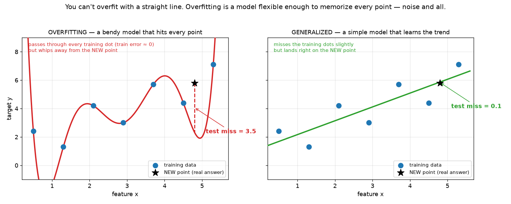
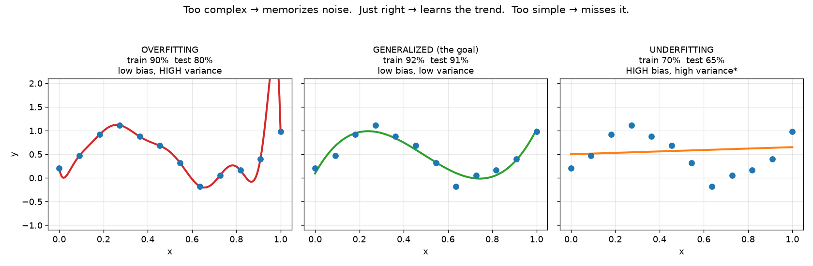
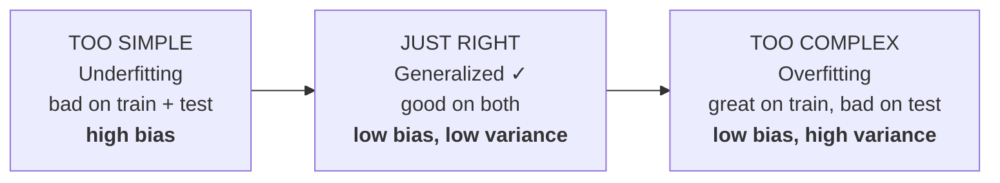
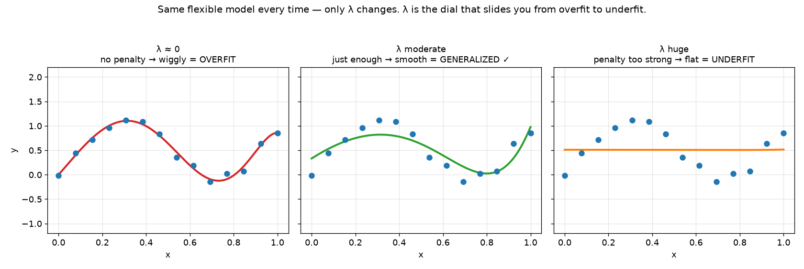
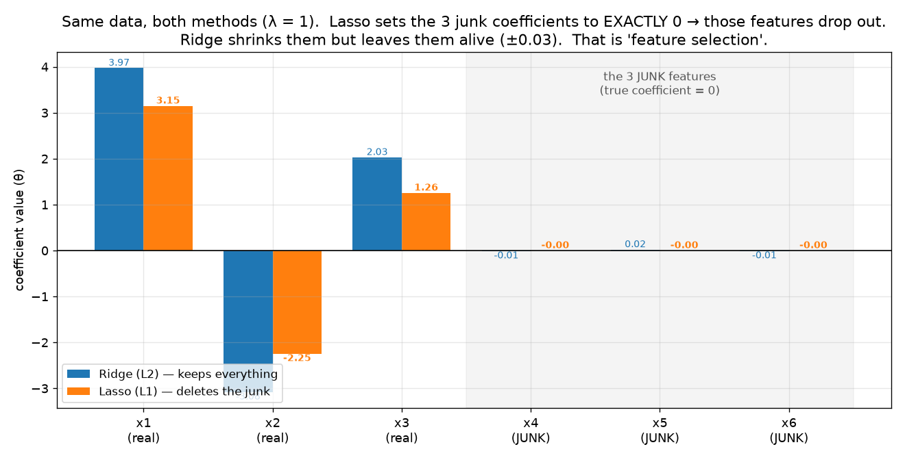
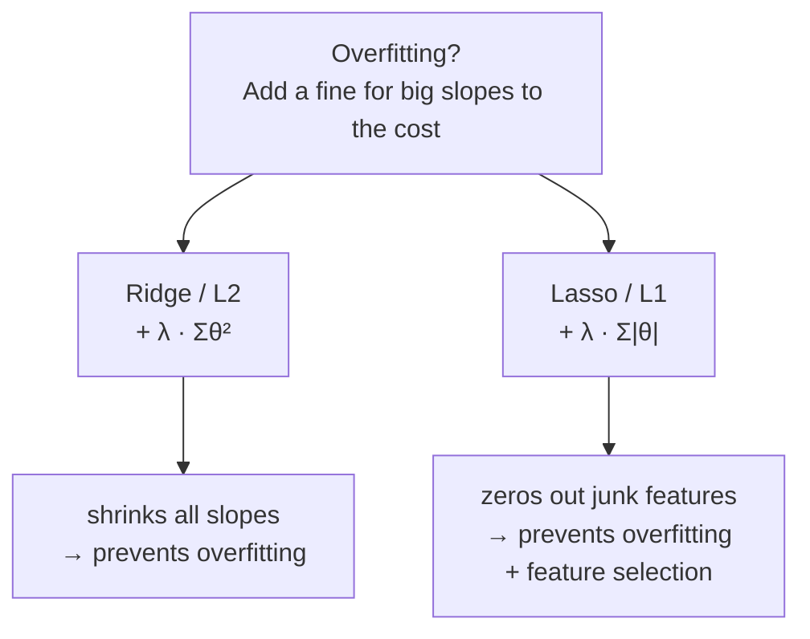

# ML Study 02 — Overfitting, and the Fix: Ridge & Lasso

**Covers:** Overfitting vs Underfitting → Bias & Variance → **Ridge (L2)** → **Lasso (L1)** → how to set λ → assumptions of linear regression.
**Goal:** understand *why* a model that scores perfectly on your data can still be useless — and the two small tweaks to the cost function that fix it. Builds directly on **ML Study 01** (the cost function $J$ and gradient descent).

> **One-line bridge from Study 01:** we spent all of Study 01 driving the training error to its minimum. This doc is the plot twist — **driving training error all the way to zero is often the *wrong* goal.** Here's why, and what to do instead.

---

## Part 1 — The real enemy: overfitting

### 1.1 The story: a fit that's *too* good

Imagine a scatter of data points, and a model **flexible enough to bend through every single one** — it touches every point, so the training error is **exactly zero**. Perfect score. You'd think that's the best possible model.

Then a **new** point arrives (the kind of data the model will actually face in the real world). The curve — contorted so tightly to the original points — whips away and misses it badly. *(You can't do this with a straight line: a line is too stiff to bend through every point. Overfitting takes a **flexible** model.)*

*What this graph shows: LEFT — a bendy red curve passes through every training dot (training error ≈ 0), then whips away and misses the new test point (★) by 3.5. RIGHT — a simple green line misses the training dots slightly, yet lands almost exactly on the new point (miss 0.1). The simple model is **worse on the data you have and better on the data you don't** — which is the whole game.*

That gap — great on training data, bad on new data — is **overfitting.** The model didn't learn the *trend*; it **memorized the training points**, noise and all.

> **"Can a *linear* model overfit, or does it need a curvy graph like this?"** The wavy curve above is the *textbook picture*, but overfitting isn't about **curviness** — it's about **too much flexibility for the data** (too many free knobs chasing noise). A straight line with **one** feature (just θ₀, θ₁) is too stiff to overfit — true. But a **linear model with many features overfits readily**: it stays perfectly "linear" (a flat hyperplane, no curves at all), yet with, say, **50 features and 60 rows** it has enough knobs to fit the noise. When the number of features **approaches or exceeds** the number of rows, a plain linear model overfits badly. **That is exactly why this chapter exists** — Ridge and Lasso regularize *linear* models. So: overfitting comes from the **number of parameters**, not the shape of the graph. *(The bendy curve is just polynomial regression — still linear in its parameters, only fed x², x³… as extra features.)*

### 1.2 Bias and variance — two words for two failures

These two terms describe *where* a model fails. The trick to never mixing them up:

> - **Bias** is about the **training** data. High bias = the model does badly even on the data it learned from (it's too simple to capture the pattern).
> - **Variance** is about the **test** data. High variance = the model does well on training but badly on new data (it's too twitchy — it changes wildly with the exact points it saw).

**Three outcomes, and only one is good:**

| Outcome | Training | Test | Bias | Variance | What happened |
|---|---|---|---|---|---|
| **Overfitting** | great | bad | **low** | **high** | memorized the training points; can't generalize |
| **Generalized** ✅ | great | great | low | low | learned the real trend — *this is the goal* |
| **Underfitting** | bad | bad | **high** | high\* | too simple to capture the pattern at all |

**A worked read — three example models.** *(The percentages are a **performance score** — think **accuracy** for a classification model, or **R² / Adjusted R²** for a regression model like linear regression. The exact metric doesn't matter here; what matters is the **gap between the train and test scores**.)*
- **Model 1** — train **90%**, test **80%** → the 10-point gap gives it away: **overfitting** (great on train, drops on test → low bias, high variance).
- **Model 2** — train **92%**, test **91%** → close together *and* both high: **generalized** (low bias, low variance). Ship this one.
- **Model 3** — train **70%**, test **65%** → bad at both: **underfitting** (high bias).

*What this graph shows: the same points fit three ways. Too complex (left) wiggles through every point including the noise. Just right (middle) traces the trend. Too simple (right) barely bends. Complexity is a dial — and both extremes hurt on new data.*

> **\* An honest footnote you'll want in an interview.** We're calling underfitting "high bias, high variance" here (the practical shorthand: *bad on both*). Many textbooks are stricter and call underfitting **high bias, _low_ variance** — a too-simple model is *stable*, so it doesn't swing much from dataset to dataset. Both framings show up in the wild. If pressed, the precise statement is: **underfitting = high bias; overfitting = high variance; the sweet spot minimizes their sum.** Don't get caught flat-footed on this one.

### 1.3 Is there a *formula* for bias and variance? And how do you measure them?

**Yes — formally.** The expected test error at a point splits into exactly three pieces (the **bias–variance decomposition**):

$$\underbrace{\mathbb{E}\big[(y-\hat f(x))^2\big]}_{\text{expected test error}} = \underbrace{\big(\mathbb{E}[\hat f(x)]-f(x)\big)^2}_{\textbf{Bias}^2} + \underbrace{\mathbb{E}\big[(\hat f(x)-\mathbb{E}[\hat f(x)])^2\big]}_{\textbf{Variance}} + \underbrace{\sigma^2}_{\text{irreducible noise}}$$

- **Bias** = how far the model's *average* prediction sits from the truth $f(x)$ — systematic error from being too simple.
- **Variance** = how much the prediction *wobbles* when you retrain on a different sample of data — twitchiness.
- **Irreducible noise** ($\sigma^2$) = randomness in the data itself that no model can remove.

**But in practice you never compute these directly** — the formula needs the true function $f(x)$ and the averaging $\mathbb{E}[\cdot]$ over infinitely many datasets, neither of which you have. So you **measure them by proxy**:

- **Train vs. validation gap** *(the everyday tool)* — high error on *both* train and validation → **high bias**; low train error but a big *gap* down to validation → **high variance**. (That's precisely the three-model read above — the gap *is* your variance meter.)
- **Resample and watch the spread** — retrain on many bootstrap samples of your data; at a test point, the **spread** of the predictions estimates the **variance**, and the average prediction's distance from the target estimates the **bias**.
- **Cross-validation** — wildly different scores across the CV folds is a variance signal; uniformly poor scores is a bias signal.

**🎯 Say it clearly — "What's the difference between overfitting and underfitting?"** *"Overfitting means the model memorized the training data — high accuracy on train, low on test (low bias, high variance). Underfitting means it's too simple to capture the pattern — bad on both. The goal is a generalized model in between: low bias and low variance, so it performs on data it's never seen."*

---

## Part 2 — The fix: regularization (punish steep slopes)

### 2.1 Why overfitting *is* a steep slope

Look again at the red overfit line — it's **steep.** To thread every training point exactly, a model cranks its slopes up high. A steep slope means the prediction swings enormously for a small change in input — which is exactly why it flies off on new points.

> **The core idea, in one sentence:** *a big slope is a symptom of overfitting, so let's make big slopes **expensive.*** We add a penalty to the cost function that grows with the size of the slopes. Now gradient descent can't just chase a perfect fit — every unit of steepness *costs* it. It settles on a flatter, more generalized line.

Recall the cost from Study 01 — the "badness score" we minimize:

$$J = \frac{1}{2m}\sum_{i=1}^{m}\big(h_\theta(x^{(i)}) - y^{(i)}\big)^2$$

Regularization just **bolts a second term onto it** — a fine for steepness. Two flavours of fine give us the two methods below.

---

## Part 3 — Ridge Regression (L2 regularization)

### 3.1 The idea: fine the *square* of the slope

> Ridge adds **λ times the slope, squared** to the cost. The bigger the slope, the bigger the fine — and because it's squared, big slopes are punished *very* hard. Gradient descent now has to balance two wants: *fit the data* **and** *keep the slopes small.*

**The Ridge (L2) cost function** — it's the ordinary cost from Study 01 with **one extra term** bolted on:

$$J_{\text{ridge}} \;=\; \frac{1}{2m}\sum_{i=1}^{m}\big(\hat{y}^{(i)} - y^{(i)}\big)^2 \;+\; \lambda\sum_{j=1}^{n}\theta_j^2$$

📖 **Read it aloud:** *"J-ridge equals the usual average squared error, **plus lambda times the sum of the slopes squared**."*

- The **first part** is exactly the cost we already know from Study 01 — *"how badly does the line fit?"*
- The **second part**, $\lambda\sum\theta_j^2$, is the **new fine for steepness**: each slope $\theta_j$ is **squared** (always positive; big slopes hurt far more), summed over **all the slopes** $\theta_1 \dots \theta_n$ (**not** the intercept $\theta_0$ — we fine steepness, not height), and scaled by $\lambda$, the **size of the fine**.

### 3.2 Watch it work (worked example, λ = 1)

Say the overfit line has **slope = 2**, and it fits the training points so well the fit term is ≈ 0.
- **Cost now** = (≈0) + $1 \times 2^2$ = **4.** That penalty of 4 is a problem — gradient descent still wants to shrink the total.
- So it **lowers the slope to ~1.5.** The line now misses the training points a little (fit term = "small value"), but the fine drops: $1 \times 1.5^2 = 2.25$.
- **Cost now** ≈ small + 2.25 ≈ **3.** Lower than 4 — progress.
- It keeps trading a *tiny* bit of training accuracy for a *lot* less steepness, until the total can't drop further. The result is a **flatter, generalized line.**

The same principle on a *flexible* model (not just a single line): turn λ up and watch an overfit wiggle relax into the trend — then over-relax into a flat underfit.

*What this graph shows: the **same flexible model** every time — only λ changes. λ≈0 (red) means no fine, so it wiggles through every point (overfit). A moderate λ (green) shrinks the coefficients just enough to smooth it into the trend (generalized ✓). A huge λ (orange) over-shrinks everything to a near-flat line (underfit). **λ is the dial that slides you from overfit to underfit.***

> **Why not just drive the fit term to zero like before?** Because a zero training error *is* the overfit model — the wiggly red one. Ridge deliberately **refuses to let training error reach zero**, trading a little of it for coefficients that survive contact with new data. The one-line rule: *the slopes should not be steep.*

**🎯 Say it clearly — "What does Ridge regression do?"** *"It adds a penalty of λ times the sum of squared coefficients to the cost. That makes large slopes expensive, so the model settles on smaller, smoother coefficients — a flatter line that generalizes instead of memorizing. It's called L2 regularization, and it shrinks every coefficient toward zero but never exactly to zero."*

---

## Part 4 — Lasso Regression (L1 regularization)

### 4.1 The idea: fine the *absolute value* of the slope

> Lasso changes **one thing**: instead of squaring the slope, it takes the **absolute value** (the "mod," or magnitude, of the slope). That tiny change has a surprising superpower — it doesn't just shrink coefficients, it can drive the useless ones **all the way to exactly zero**, effectively deleting those features. That's **feature selection**, for free.

**The math:**

$$J_{\text{lasso}} = \frac{1}{2m}\sum_{i=1}^{m}\big(\hat{y}^{(i)} - y^{(i)}\big)^2 \;+\; \lambda\sum_{j=1}^{n}\lvert\theta_j\rvert$$

📖 **Read it aloud:** *"J-lasso equals the average squared error, plus lambda times the sum of the absolute values of the slopes."* (The only change from Ridge: $\lvert\theta_j\rvert$ instead of $\theta_j^2$.)

### 4.2 Feature selection: the useless features get deleted

With many features, $\hat{y} = \theta_0 + \theta_1 x_1 + \theta_2 x_2 + \dots + \theta_n x_n$, some inputs genuinely don't matter. Lasso pushes those features' coefficients to **exactly 0** — and a feature multiplied by 0 is simply **gone** from the model.

*What this graph shows: the same data fit by both methods (λ = 1). Three features are real, three are pure junk (true coefficient = 0). Both keep the real ones. But look at the junk region: **Lasso sets those coefficients to exactly 0** — the features vanish from the model — while **Ridge only shrinks them** to tiny non-zero values (−0.01, 0.02, −0.01). Zeroing out = feature selection.*

**▶ Run it:** **`hands-on/hello_ridge_lasso.py`** fits plain, Ridge, and Lasso on data with real *and* junk features and prints their coefficients side by side — you watch **Lasso drive the junk to exactly 0** while Ridge only shrinks it. The feature-selection superpower, live.

**The receipts** — the same data, both methods, at λ = 1:

| | x₁ (real) | x₂ (real) | x₃ (real) | x₄ (junk) | x₅ (junk) | x₆ (junk) |
|---|---|---|---|---|---|---|
| **Lasso (L1)** | 2.88 | −1.80 | 0.96 | **0.00** | **0.00** | **0.00** |
| **Ridge (L2)** | 4.00 | −2.96 | 2.01 | −0.03 | 0.03 | 0.01 |

Lasso set the junk features to a clean **0**. Ridge left them tiny-but-alive. *That's* the whole difference between "shrink" and "select."

### 4.3 Why does |θ| zero things out but θ² doesn't?

> Intuition, no heavy math: think about the *pull* each penalty applies as a coefficient gets close to zero.
> - **Ridge (θ²):** its pull is proportional to the coefficient ($2\lambda\theta$). As θ → 0, the pull → 0 too. So it slows down and *coasts* toward zero — never quite arriving.
> - **Lasso (|θ|):** its pull is **constant** ($\pm\lambda$), no matter how small θ gets. It keeps shoving with the same force all the way down — so it shoves right through zero and *pins* the coefficient there.

**🎯 Say it clearly — "Ridge vs Lasso — when do you use which?"** *"Both add a penalty to prevent overfitting. Ridge (L2) penalizes squared coefficients and shrinks them all toward zero — good when most features matter. Lasso (L1) penalizes absolute coefficients and drives the useless ones to exactly zero — so it doubles as automatic feature selection when you have lots of features and suspect many are irrelevant. When unsure, try both and keep whichever scores better (that's Elastic Net's whole premise — it blends them)."*

---

## Part 5 — The two questions everyone asks about λ

### 5.1 How do you pick λ? → cross-validation

λ is a **hyperparameter** — a knob *you* set before training, not something the model learns on its own (unlike θ). So how do you find a good value? **Cross-validation:** try a range of λ values (0.001, 0.01, 0.1, 1, 10, …), train with each, and measure how each does on **held-out validation data**. Pick the λ with the best validation score. Too small → no effect (still overfit). Too large → line too flat (underfit). Cross-validation finds the balance point in the middle.

### 5.2 λ vs the learning rate α — the one everyone confuses

Both are Greek letters you tune, so people assume they're similar. **They do completely different jobs.** This is the single most important distinction in this doc:

| | **Learning rate α** (Study 01) | **Regularization λ** (this doc) |
|---|---|---|
| **What it controls** | how big a *step* gradient descent takes | how hard we *fine* big slopes |
| **What it affects** | the **journey** — how fast you reach the bottom | the **destination** — *where* the bottom is |
| **Change it and…** | you reach the **same** line, faster or slower | you reach a **different** line (flatter) |
| **Too big** | overshoots, diverges (Study 01 §3.6) | line too flat → **underfitting** |
| **Too small** | crawls; slow to converge | ~no effect → **still overfitting** |
| **How to set it** | rule of thumb (start ~0.01) | **cross-validation** |

> **The mental model:** you're rolling a ball down a valley to find the best line.
> - **α is the size of your steps.** Bigger steps get you down faster (until they're so big you bounce out). But the valley floor is in the *same spot* either way.
> - **λ reshapes the valley itself.** Turning λ up tilts the whole landscape so the lowest point moves to where the slope is smaller. **λ moves the answer; α just changes how quickly you get there.**

So when λ is described as controlling *"how fast you lessen the steepness,"* that means **how strongly the slopes are pulled toward zero** — i.e. how *simple* the final model ends up — **not** the per-iteration speed (that's α). Bigger λ = stronger pull = simpler model.

**🎯 Say it clearly — "Is λ the same as the learning rate?"** *"No. The learning rate is the step size in gradient descent — it changes how fast you converge, not the final model. λ is the regularization strength — it changes the cost function itself, so it changes which model you converge to (a flatter, simpler one). α affects the journey; λ affects the destination."*

---

## Part 6 — Assumptions of linear regression

Linear regression works best when the data plays by a few rules. Worth a checklist:

1. **Normal (Gaussian) distribution of features.** The model trains best when features are roughly bell-shaped. If a feature is badly skewed, apply a **feature transformation** (e.g. a log — the same trick from Study 01 §3.9) to make it more normal.
2. **Standardization (feature scaling).** Rescale each feature to a **Z-score** (mean $\mu = 0$, standard deviation $\sigma = 1$). This matters *specifically because of gradient descent*: on unscaled features the cost bowl is a stretched, lopsided valley (Study 01 §3.7's elongated bowl), so descent zig-zags and converges slowly. Scaling rounds the bowl and speeds it up.
3. **Linearity.** The relationship between features and target should be roughly linear. If it's wildly curved, linear regression underfits (Study 01 §3.9 covers the fixes: transforms, polynomials, or a non-linear model).
4. **No multicollinearity.** If two features are ~95% correlated with *each other*, they carry the same information — keep one, drop the other. (The formal check is the **Variance Inflation Factor, VIF**.)

> These aren't hard gates — a model still runs if you skip them — but satisfying them is the difference between a model that *works* and one that merely *runs*.

> **⚠️ Why multicollinearity matters in practice: it makes your coefficients LIE.** When features are correlated, the model can't tell which one deserves the credit, so it splits it arbitrarily between them — and a coefficient can come out **the wrong sign** or wildly large. Real example: a diabetes model with GDP, health-spend, urbanization, and life-expectancy (all correlated) returned a **strong *negative* coefficient on health spending** — literally "more health spending → less diabetes," which would be a *harmful* policy if you believed it. It's not a real effect; it's the model dividing shared signal among correlated features. **The lesson:** *before trusting any coefficient's sign or size, check a correlation matrix.* If features are tangled, the individual coefficients aren't interpretable (though the model's *predictions* can still be fine, and **Ridge/Lasso** tame it — Ridge shrinks the tangled coefficients, Lasso drops the redundant ones). Predicting ≠ explaining.

---

## Quick Reference — say it in plain words
| Question | Plain-English answer |
|---|---|
| **What is overfitting?** | "The model memorized the training data — great on train, bad on new data. Low bias, high variance." |
| **What is underfitting?** | "The model is too simple to catch the pattern — bad on both train and test. High bias." |
| **Bias vs variance?** | "Bias = error on training data (too simple). Variance = error on new data (too twitchy). Bias is a training-data word, variance is a test-data word." |
| **What's regularization?** | "Adding a penalty for big coefficients so the model can't chase a perfect fit — it settles for a simpler, more general one." |
| **Ridge (L2)?** | "Penalty = λ·Σθ². Shrinks all coefficients toward zero, never to zero. Prevents overfitting." |
| **Lasso (L1)?** | "Penalty = λ·Σ|θ|. Drives useless coefficients to exactly zero → prevents overfitting AND does feature selection." |
| **Why does Lasso zero out but Ridge doesn't?** | "Lasso's pull is constant all the way to zero; Ridge's pull fades as the coefficient shrinks, so it only coasts near zero." |
| **How do you set λ?** | "Cross-validation — try many values, keep the one that scores best on held-out data." |
| **λ vs learning rate?** | "Learning rate = step size (the journey). λ = regularization strength (the destination). Totally different jobs." |

## All the equations in one place
- **Ridge (L2):** $J = \frac{1}{2m}\sum(\hat{y}^{(i)} - y^{(i)})^2 + \lambda\sum_{j}\theta_j^2$ — "usual error plus a fine on squared slopes."
- **Lasso (L1):** $J = \frac{1}{2m}\sum(\hat{y}^{(i)} - y^{(i)})^2 + \lambda\sum_{j}\lvert\theta_j\rvert$ — "usual error plus a fine on absolute slopes."

## Glossary (jargon → plain English)
| Term | Plain meaning |
|---|---|
| Overfitting | memorized training data; fails on new data |
| Underfitting | too simple; fails on everything |
| Generalized model | learned the real trend; works on new data (the goal) |
| Bias | error on the **training** data (too simple) |
| Variance | error on the **test** data (too sensitive to the exact training points) |
| Regularization | penalizing big coefficients to prevent overfitting |
| Ridge / L2 | penalty on **squared** slopes; shrinks toward 0 |
| Lasso / L1 | penalty on **absolute** slopes; can hit exactly 0 (feature selection) |
| λ (lambda) | regularization strength — a hyperparameter set by cross-validation |
| Hyperparameter | a knob you set before training (λ, α, iterations), not learned by the model |
| Cross-validation | testing many hyperparameter values on held-out data to pick the best |
| Multicollinearity | two features carrying the same information (highly correlated) |
| Standardization | rescaling features to mean 0, standard deviation 1 (Z-score) |

---
**◄ Previous: [ML Study 01 — Linear Regression](ML_Study_01_Linear_Regression.html)**  ·  **Next → [ML Study 03 — Logistic Regression](ML_Study_03_Logistic_Regression.html)**

*ML Study 02 — Overfitting → Ridge & Lasso → assumptions. Builds on Study 01 (cost function + gradient descent).*
