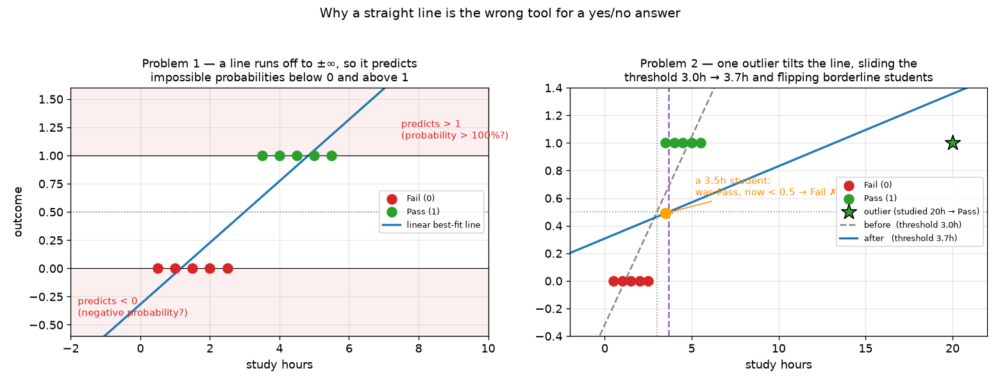
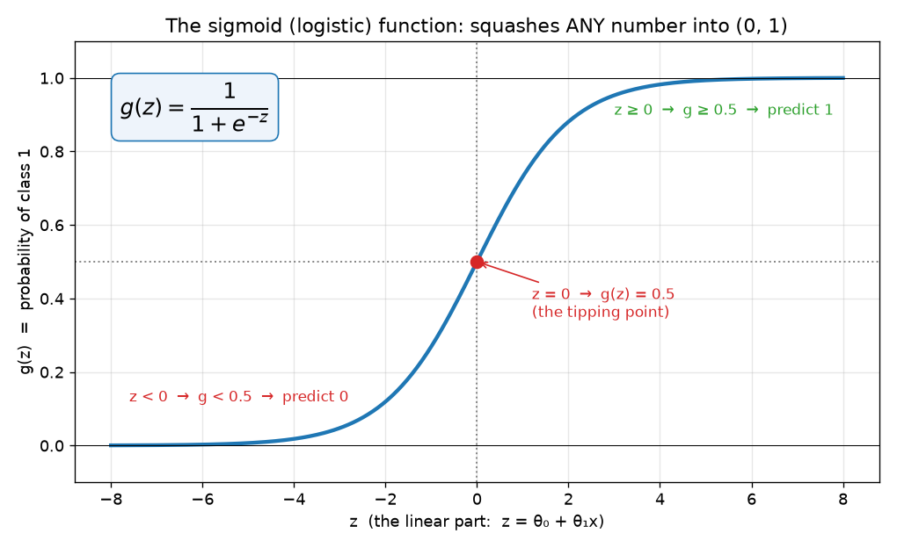
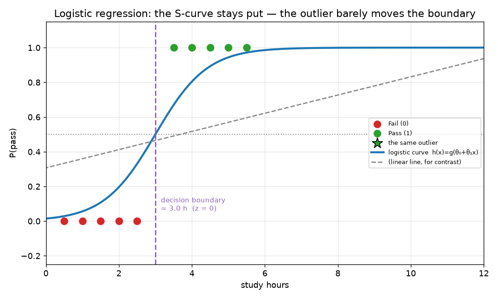
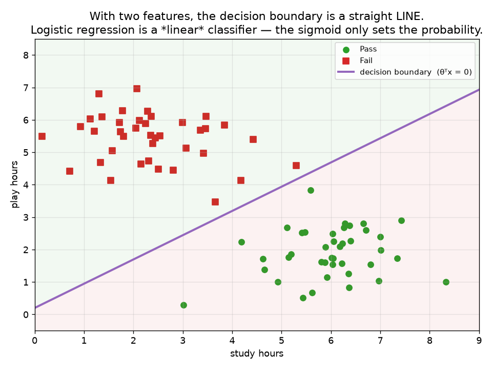
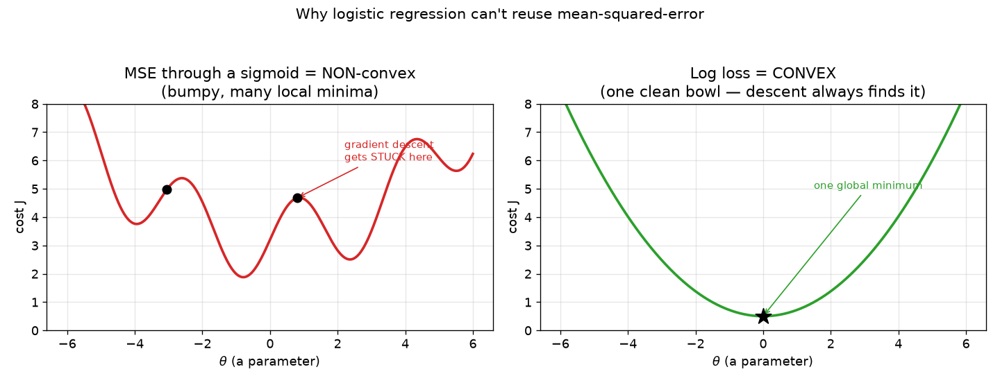
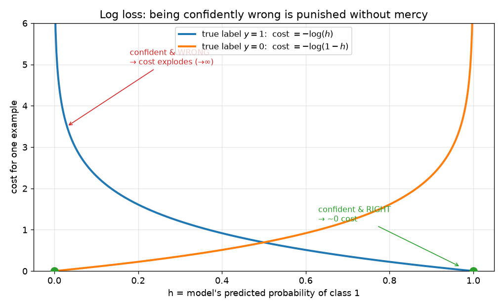
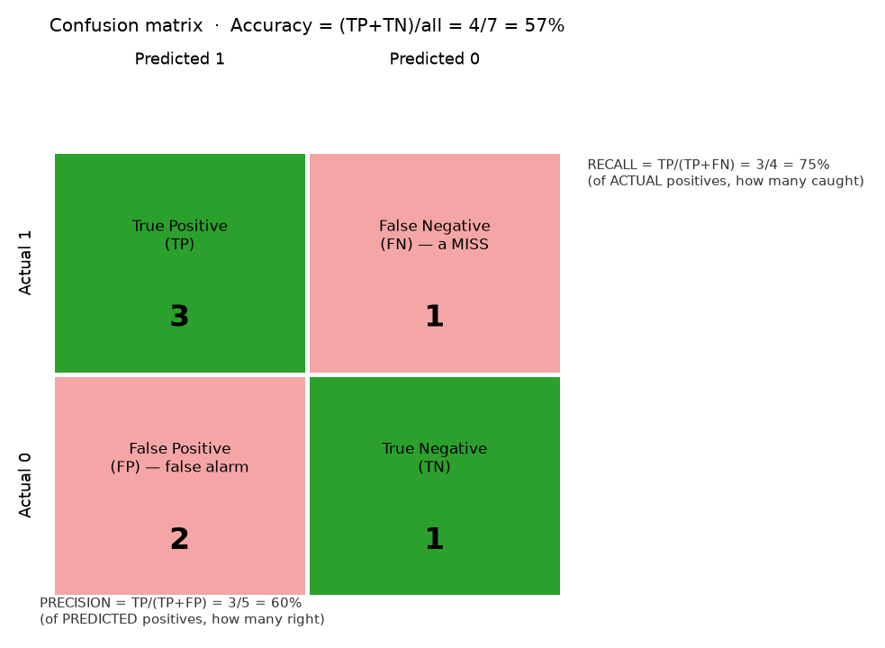

# ML Study 03 — Logistic Regression: the Classifier

**Covers:** classification vs regression → why linear fails at yes/no → the **sigmoid** → the **decision boundary** → **log loss** (the cost function) → the **confusion matrix**, **precision/recall**, and **F1**.
**Goal:** understand how a straight-line model gets turned into a **yes/no** predictor — and why the answer comes out as a *probability* between 0 and 1.

> **Bridge from Study 01 & 02.** Every model so far predicted a **number** (regression). Now we predict a **category** — pass/fail, spam/not-spam, fraud/legit. That's **classification**, and **logistic regression** is the first and most important algorithm for it. It reuses everything from Study 01 (a linear combination θᵀx, gradient descent) and — the neat part — it's built on the exact **logit / sigmoid** we met at the end of Study 02, where a plain log couldn't straighten an S-curve but the log-odds could.

---

## Part 1 — The problem: predicting a category

> Say you want to predict whether a student **passes or fails** from their **study hours**. The answer isn't a number on a scale — it's one of **two buckets**: Fail (call it **0**) or Pass (call it **1**). That's **binary classification.**

A few facts to set expectations:
- **The output is a category**, not a quantity. We encode it as 0 or 1.
- **Binary** = two categories (the main case here). Logistic regression also handles **multiclass** (3+ categories — e.g. digit 0–9) by combining several binary decisions (*one-vs-rest*, or the *softmax* generalization).
- What we actually want out of the model is a **probability** — "82% likely to pass" — which we then round to a decision.

---

## Part 2 — Why not just use linear regression?

A fair first instinct: plot Fail=0 / Pass=1 against study hours, fit a **straight line** (Study 01), and call anything above 0.5 a "Pass." It even *looks* reasonable — the line crosses 0.5 around 3 hours, so "study more than 3 hours → pass." So what's wrong?

*What this graph shows: two real problems. LEFT — a straight line runs off to ±∞, so it happily predicts **impossible probabilities**: below 0 (a negative chance of passing?) and above 1 (over 100%?). RIGHT — because the line is fit by least-squares, **one outlier tilts it**: a student who studied 20 hours (still just "Pass") drags the line, sliding the 0.5 threshold from 3.0h to 3.7h — enough to flip a **borderline** 3.5-hour student from Pass to Fail.*

**Two problems, in plain terms:**
1. **It predicts nonsense probabilities.** A straight line has no floor and no ceiling, so it sails below 0 and above 1. A "probability" of −0.3 or 1.8 is meaningless. *(This is the decisive, always-true problem.)*
2. **It's easily tilted.** Least-squares tries to sit near *every* point, including far-off ones, so an outlier rotates the line and moves the decision threshold. Borderline cases flip. *(Real, though for balanced data the shift is modest — the honest version of the "outliers ruin it" story.)*

> **What we need instead:** a model whose output is **trapped between 0 and 1** (so it's always a valid probability) and whose **S-shape** flattens out at the extremes (so far-off points can't keep dragging it). That shape is the **sigmoid.**

**🎯 Say it clearly — "Why can't you use linear regression for classification?"** *"Two reasons: its output isn't bounded, so it predicts probabilities below 0 and above 1, which are meaningless; and it's sensitive to outliers, which tilt the line and shift the decision threshold. Logistic regression fixes both by squashing the output through a sigmoid into the range (0, 1)."*

---

## Part 3 — The fix: the sigmoid (logistic) function

> Take the same linear combination from Study 01 — call it **z** — and **squash** it through a function that bends any number, no matter how large or small, into the open interval **(0, 1)**. That squashing function is the **sigmoid**, and it's shaped like a smooth **S**.

**The math — in three small steps.**

**Step 1** — the familiar linear part (Study 01), now renamed **z**:

$$z = \theta_0 + \theta_1 x_1 + \theta_2 x_2 + \dots + \theta_n x_n = \theta^\top x$$

📖 **Read it aloud:** *"z equals theta-transpose x"* — the same weighted sum of features we've used all along ($\theta^\top x$ is just the compact way to write $\theta_0 + \theta_1 x_1 + \dots$). On its own, z can be any number from −∞ to +∞.

**Step 2** — the sigmoid, which squashes z into (0, 1):

$$g(z) = \frac{1}{1 + e^{-z}}$$

📖 **Read it aloud:** *"g of z equals one over, one plus e to the minus z."* When z is a big positive number, $e^{-z}\to 0$ so $g\to 1$; when z is a big negative number, $e^{-z}\to\infty$ so $g\to 0$; when $z=0$, $g = \tfrac{1}{1+1} = 0.5$.

**Step 3** — put them together. The model outputs the **probability of class 1**:

$$h_\theta(x) = g(\theta^\top x) = \frac{1}{1 + e^{-(\theta_0 + \theta_1 x_1 + \dots)}}$$

📖 **Read it aloud:** *"h-theta of x equals g of theta-transpose x"* — "run the linear score through the sigmoid." The result is a number between 0 and 1: *the model's estimated probability that the answer is 1 (Pass).*

*What this graph shows: the sigmoid takes any z (horizontal) and returns a value in (0, 1) (vertical). It's 0.5 exactly at z = 0, rises toward 1 for positive z, falls toward 0 for negative z, and **flattens at both ends** — which is why a far-off point can't drag it the way it drags a straight line.*

> **The Study 02 callback (for the curious).** At the end of Study 02, a plain log couldn't straighten an S-curve, but the **logit** — the log-odds $\ln\frac{p}{1-p}$ — could. The sigmoid is the **exact inverse** of that logit: solving $p = \frac{1}{1+e^{-z}}$ for z gives $z = \ln\frac{p}{1-p}$. So logistic regression is really *"model the log-odds as a straight line, θᵀx"* — the same linearization from Study 02, now used to make predictions. Same idea, both directions.

---

## Part 4 — Making the decision: threshold at 0.5

The model hands you a probability; you turn it into a **yes/no** with a threshold — by default **0.5**:

$$\hat{y} = \begin{cases} 1\;(\text{Pass}) & \text{if } h_\theta(x) \ge 0.5 \\ 0\;(\text{Fail}) & \text{if } h_\theta(x) < 0.5 \end{cases}$$

📖 **Read it aloud:** *"predict 1 if h-theta of x is at least 0.5, otherwise predict 0."*

Here's the tidy part. Because the sigmoid crosses 0.5 **exactly at z = 0**, the whole decision collapses to the **sign of z**:

$$h_\theta(x) \ge 0.5 \iff z \ge 0 \iff \theta^\top x \ge 0$$

📖 **Read it aloud:** *"h is at least a half exactly when z is at least zero."* So you never even need to compute the sigmoid to *decide* — you just check whether the linear score θᵀx is positive. (You compute the sigmoid when you want the *probability*, not just the label.)

*What this graph shows: the same pass/fail data (with the same 20-hour outlier) fit by logistic regression. The blue S-curve is the predicted probability of passing; it stays pinned between 0 and 1. Its decision boundary — where P = 0.5 — sits at ~3.0 hours and **barely moves** despite the outlier, whereas the straight line (dashed) had drifted to 3.7. That stability is the sigmoid's flat tails at work.*

---

## Part 5 — The decision boundary

> The **decision boundary** is the dividing line between "predict 0" and "predict 1." From Part 4, that switch happens exactly where **z = θᵀx = 0** (equivalently, where the probability is 0.5). Everything on one side is Pass, everything on the other is Fail.

With **one feature**, θᵀx = 0 is a single point on the axis (≈ 3 hours above). With **two features** — say study hours *and* play hours — θᵀx = 0 is a **straight line** cutting the plane in two:

*What this graph shows: students plotted by study hours (across) and play hours (up), colored Pass/Fail. Logistic regression's decision boundary — the set of points where θᵀx = 0 — is a **straight line** separating the two groups. Study more / play less lands you on the Pass side.*

**This is the key idea to hold onto: the boundary is *linear*.** With n features it's a flat **hyperplane**, `θᵀx = 0`. The sigmoid only decides *how confident* the prediction is (how far from 0.5); it does **not** bend the boundary. That's why logistic regression is called a **linear classifier.** *(If your classes can't be split by a straight line, you either add polynomial features — the Study 01 §3.9 trick — or reach for a non-linear model.)*

**🎯 Say it clearly — "Is logistic regression a linear or non-linear model?"** *"Its decision boundary is linear — it separates classes with a straight line (or hyperplane), θᵀx = 0. The sigmoid is a non-linear squashing that turns the linear score into a probability, but it doesn't bend the boundary. So logistic regression is a linear classifier that outputs calibrated probabilities."*

**🎯 Say it clearly — "Why is it called 'regression' if it classifies?"** *"Because under the hood it regresses — fits a linear function θᵀx — to the log-odds of the outcome. The sigmoid maps that to a probability, and a threshold turns the probability into a class label. The fitting step is regression; the thresholding makes it a classifier."*

---

## Part 6 — Scoring a classifier: why not MSE, and what to use instead

> To *train* logistic regression we need a **cost function** — a badness score to roll downhill with gradient descent (Study 01). The obvious move is to reuse **mean squared error**. It doesn't work — and *why* it fails is the whole lesson.

**The problem: MSE through a sigmoid is non-convex.** In Study 01, squared error gave a clean **bowl** — one global minimum, gradient descent always finds it. But here $h_\theta(x)$ isn't linear, it's the sigmoid. Feed the sigmoid into squared error and the cost surface turns **bumpy**, full of the **local-minima traps** from Study 01 §3.8. Gradient descent gets stuck in a false bottom and never reaches the true one.

*What this graph shows: LEFT — squared error wrapped around a sigmoid is **non-convex**: multiple dips, so descent stalls in a local minimum. RIGHT — log loss is **convex**: one clean bowl, so descent always reaches the global minimum. That's the entire reason we swap the cost function.*

**The fix: log loss (cross-entropy).** Replace squared error with a cost built on **logarithms** — engineered to be convex *and* to punish confident mistakes brutally. It's defined by two cases, one per true label:

$$\text{cost}(h_\theta(x),\, y) = \begin{cases} -\log(h_\theta(x)) & \text{if } y = 1 \\ -\log(1 - h_\theta(x)) & \text{if } y = 0 \end{cases}$$

📖 **Read it aloud:** *"if the true label is 1, the cost is minus log of the predicted probability; if it's 0, minus log of one-minus that probability."* Read the two cases as penalties:
- **True label 1** → cost $= -\log(h)$. Model says $h\approx1$ (confident, right) → $-\log 1 = \mathbf{0}$. Says $h\approx0$ (confident, **wrong**) → $-\log 0 = \boldsymbol{\infty}$.
- **True label 0** → cost $= -\log(1-h)$, the mirror image.

*What this graph shows: the cost of a single prediction vs. the probability the model gave. Get it confidently right → cost ≈ 0. Get it confidently **wrong** → cost shoots to infinity. Log loss doesn't just want you right; it punishes false confidence.*

**The two cases fold into one line** (since $y$ is 0 or 1, one term always switches off):

$$J(\theta) = -\frac{1}{m}\sum_{i=1}^{m}\Big[\,y^{(i)}\log h_\theta(x^{(i)}) + (1-y^{(i)})\log\big(1 - h_\theta(x^{(i)})\big)\,\Big]$$

📖 **Read it aloud:** *"J of theta equals minus one-over-m, sum over all examples of: y times log h, plus (one minus y) times log (one minus h)."* When $y=1$ the second term vanishes; when $y=0$ the first vanishes — so each example is scored by exactly the right case, then averaged.

> **Notation note.** You'll sometimes see this written with $\frac{1}{2m}$ instead of $\frac{1}{m}$ — the **½ carried over from linear regression** by analogy. Both give the *same* best-fit θ (a constant multiplier can't move the minimum), so neither is "wrong." But the **standard log loss uses $\frac{1}{m}$**: the ½ in MSE was only there to cancel the **2 that squaring produces** (Study 01 §3.7), and log loss has **no square**, so there's nothing for a ½ to cancel. Use $\frac{1}{m}$ — it's what scikit-learn and every textbook report; the $\frac{1}{2m}$ form is equivalent for *finding* θ.

**Training is identical to Study 01.** Same loop: $\theta_j := \theta_j - \alpha\,\frac{\partial J}{\partial\theta_j}$, repeat to convergence. Remarkably, the gradient works out to the **exact same shape** as linear regression's — the average error weighted by $x$ — just with the sigmoid inside $h$. Everything you learned about gradient descent transfers directly.

**🎯 Say it clearly — "Why doesn't logistic regression use mean squared error?"** *"Because squared error wrapped around the sigmoid is non-convex — it has local minima, so gradient descent can get stuck. Log loss (cross-entropy) is convex, so descent reliably finds the global minimum, and it also penalises confident wrong predictions much harder than MSE would."*

---

## Part 7 — Was it right? The confusion matrix

> A classifier is right or wrong in **four** ways, not two — and laying them in a 2×2 grid, the **confusion matrix**, is the foundation of every classification metric.

Each prediction lands in one box:
- **True Positive (TP)** — predicted 1, actually 1 ✓
- **True Negative (TN)** — predicted 0, actually 0 ✓
- **False Positive (FP)** — predicted 1, actually 0 ✗ (a *false alarm*)
- **False Negative (FN)** — predicted 0, actually 1 ✗ (a *miss*)

*What this graph shows: the 2×2 grid of outcomes (green = correct, red = error). **Accuracy** is the correct cells over the total — here (TP+TN)/all = 4/7 ≈ 57%. The row and column define the two metrics in Part 8.*

$$\text{Accuracy} = \frac{TP + TN}{TP + TN + FP + FN}$$

---

## Part 8 — When accuracy lies: precision & recall

> Accuracy has a **dangerous blind spot** on **imbalanced** data. Say 900 legit transactions and 100 fraud. A lazy model that predicts "legit" for *everything* scores **90% accuracy** — while catching **zero fraud.** Useless, yet "90% accurate." So we need metrics that watch the errors that matter.

Split the question in two:

$$\text{Precision} = \frac{TP}{TP + FP} \qquad\qquad \text{Recall} = \frac{TP}{TP + FN}$$

- **Recall** (a.k.a. *sensitivity* / true-positive rate): *of all the actual positives, how many did we catch?* → punishes **misses (FN).**
- **Precision:** *of everything we flagged positive, how many were right?* → punishes **false alarms (FP).**

**Which one you optimise is a judgment about the cost of each error — not a formula:**

| Problem | Worse error | Optimise for |
|---|---|---|
| **Cancer screening** | missing a real cancer (FN) can be fatal | **Recall** |
| **Spam filter** | a real job offer sent to spam (FP) | **Precision** |
| **Fraud / stock-crash alert** | depends who it's for — miss vs. false alarm both costly | **balance both** |

**🎯 Say it clearly — "Precision vs. recall — when do you use which?"** *"Recall when a miss is the costly error — you can't afford a false negative, like cancer screening. Precision when a false alarm is costly — like a spam filter that mustn't bin real mail. When both matter, balance them with F1."*

---

## Part 9 — One number for both: the F-score

> Often you want a single score. That's the **F1 score** — the **harmonic mean** of precision and recall (unlike a plain average, it stays low if *either* is low, so you can't game it by maxing just one):

$$F_1 = \frac{2\cdot \text{Precision}\cdot \text{Recall}}{\text{Precision} + \text{Recall}}$$

**When they aren't equally important, use $F_\beta$** — β is a dial:

$$F_\beta = \frac{(1+\beta^2)\cdot \text{Precision}\cdot \text{Recall}}{\beta^2\cdot \text{Precision} + \text{Recall}}$$

- **β = 1** → F1, precision and recall weighted equally.
- **β = 0.5** → favours **precision** (false alarms hurt more — spam).
- **β = 2** → favours **recall** (misses hurt more — cancer).

**One more tool — the ROC curve & AUC.** The 0.5 threshold is just a default; slide it and you trade recall for precision. The **ROC curve** plots that trade-off across *every* threshold (true-positive rate vs. false-positive rate), and **AUC** — the area under it (0.5 = coin-flip, 1.0 = perfect) — scores the classifier *independent of any single threshold*. It's the standard "how good overall?" number — the very same **AUC = 0.70** that measured the World Bank / Togo targeting model.

---

## Companion labs — see it run
- **`hands-on/hello_logistic.py`** — the 3-line intro: fit a classifier, predict one case. Run it in Colab:  &nbsp; *(one-time GitHub sign-in; you're a collaborator on the repo)*
- **`hands-on/hello_logistic_worldbank.py`** — the full story on real World Bank data: predict *"is this a High-Income country?"*, then the **confusion matrix, accuracy, precision, recall, and F1** (Parts 6–9) — plus which countries fool the model.

---

## Quick Reference — say it in plain words
| Question | Plain-English answer |
|---|---|
| **What is logistic regression?** | "A linear score θᵀx squashed through a sigmoid into a probability (0–1), then thresholded at 0.5 to give a yes/no." |
| **Why not linear regression?** | "It predicts impossible probabilities (below 0, above 1) and gets tilted by outliers. The sigmoid bounds the output and flattens the tails." |
| **What's the sigmoid?** | "g(z) = 1/(1+e⁻ᶻ) — squashes any number into (0,1). It's 0.5 at z=0." |
| **What's the decision rule?** | "Predict 1 if the probability ≥ 0.5, which happens exactly when θᵀx ≥ 0." |
| **What's the decision boundary?** | "The line/hyperplane θᵀx = 0 where probability = 0.5 — it separates the two classes." |
| **Linear or non-linear?** | "Linear classifier: the boundary is a straight line. The sigmoid sets confidence, not the boundary's shape." |
| **Binary vs multiclass?** | "Natively binary; extends to multiclass via one-vs-rest or softmax." |
| **Why not MSE for the cost?** | "MSE + sigmoid is non-convex (local minima); log loss (cross-entropy) is convex and punishes confident wrong answers to ∞." |
| **Why can accuracy mislead?** | "On imbalanced data, 'always predict the majority' scores high while catching none of the rare class. Use precision/recall." |
| **Precision vs recall?** | "Recall = of actual positives, how many caught (punishes misses/FN). Precision = of predicted positives, how many right (punishes false alarms/FP)." |
| **What's F1?** | "Harmonic mean of precision and recall — one number that's only high if *both* are high." |

## All the equations in one place
- **Linear score (log-odds):** $z = \theta^\top x = \theta_0 + \theta_1 x_1 + \dots + \theta_n x_n$
- **Sigmoid:** $g(z) = \dfrac{1}{1+e^{-z}}$ — squashes to (0, 1); equals 0.5 at z = 0.
- **Model (probability of class 1):** $h_\theta(x) = g(\theta^\top x) = \dfrac{1}{1+e^{-(\theta_0+\theta_1 x_1 + \dots)}}$
- **Decision:** predict 1 if $h_\theta(x) \ge 0.5 \iff \theta^\top x \ge 0$.
- **Decision boundary:** $\theta^\top x = 0$.
- **Cost — log loss (cross-entropy):** $J(\theta) = -\dfrac{1}{m}\sum\big[y\log h_\theta(x) + (1-y)\log(1-h_\theta(x))\big]$ — convex; ∞ penalty for confident-wrong.
- **Accuracy:** $\dfrac{TP+TN}{TP+TN+FP+FN}$
- **Precision / Recall:** $\dfrac{TP}{TP+FP}\;$ / $\;\dfrac{TP}{TP+FN}$
- **F1 / F-beta:** $F_1 = \dfrac{2PR}{P+R}$; $\;F_\beta = \dfrac{(1+\beta^2)PR}{\beta^2 P + R}$

## Glossary (jargon → plain English)
| Term | Plain meaning |
|---|---|
| Classification | predicting a **category** (vs regression's number) |
| Binary classification | exactly two categories (0 / 1) |
| Logistic regression | linear score → sigmoid → probability → threshold |
| Sigmoid / logistic function | $g(z)=1/(1+e^{-z})$; the S-curve that squashes to (0,1) |
| z (logit / log-odds) | the linear score θᵀx fed into the sigmoid |
| Threshold | the cutoff (default 0.5) that turns a probability into a label |
| Decision boundary | where θᵀx = 0 (probability 0.5) — separates the classes |
| Linear classifier | a model whose decision boundary is a straight line / hyperplane |
| Log loss (cross-entropy) | logistic regression's cost function — convex; ∞ penalty for confident-wrong |
| TP / TN / FP / FN | the four confusion-matrix outcomes (true/false × positive/negative) |
| Confusion matrix | the 2×2 grid of TP/TN/FP/FN — foundation of every classification metric |
| Accuracy | (TP+TN)/all — misleading on imbalanced data |
| Precision | TP/(TP+FP) — of predicted positives, how many were right (punishes false alarms) |
| Recall (sensitivity, TPR) | TP/(TP+FN) — of actual positives, how many caught (punishes misses) |
| F1 / F-beta | harmonic mean of precision & recall; β tilts toward recall (β>1) or precision (β<1) |
| ROC curve / AUC | precision–recall trade-off across all thresholds; AUC scores the model threshold-free (0.5 = chance, 1.0 = perfect) |

---
**◄ Previous: [ML Study 02 — Overfitting, Ridge & Lasso](ML_Study_02_Overfitting_Ridge_Lasso.html)**  ·  **Next → [ML Study 04 — Time Series](ML_Study_04_Time_Series.html)**

*ML Study 03 — Logistic Regression (complete): classification → why linear fails → sigmoid → decision boundary → log loss → confusion matrix, precision/recall, F1. Builds on Study 01 (θᵀx, gradient descent) and Study 02 (the logit).*
