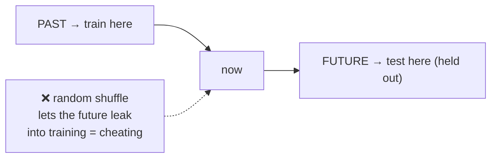
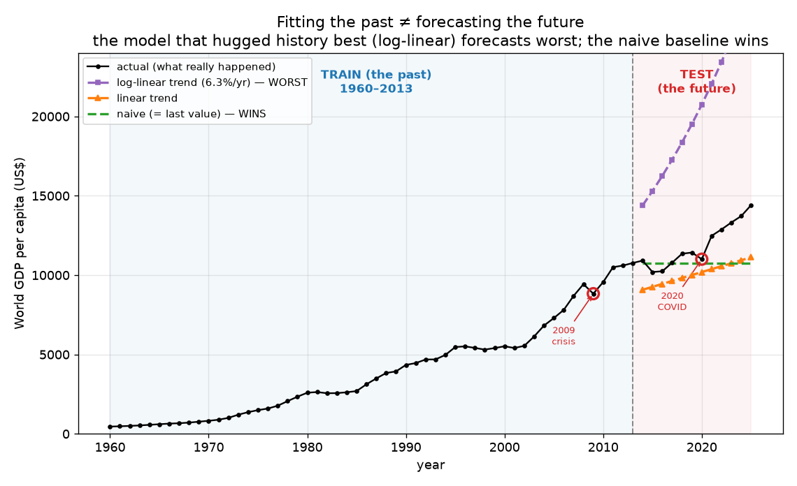

# ML Study 04 — Time Series: Forecasting the Future

**Covers:** what makes time-ordered data different → the one cardinal rule (train on the past, test on the future) → a trend model is just linear regression on time → the extrapolation trap → what no model can forecast → forecasting's twin, spotting anomalies (with a real World Bank data error we caught).
**Goal:** understand *why* forecasting is its own discipline — and internalise the humbling lesson that **fitting the past well is not the same as predicting the future well.**

**Series context:** builds directly on **[ML Study 01 — Linear Regression](ML_Study_01_Linear_Regression.html)** — a trend model *is* linear regression with **time** as the feature, and we reuse the **log trick** from §3.9. Runnable companion: **`hands-on/hello_timeseries.py`** on real World Bank data.

---

## Part 1 — What makes time series different

> Every model so far treated your rows as an unordered *bag* — shuffle them, and nothing changes. **Time series breaks that.** The data is a sequence — one value per day, month, or year — and **the order is the information.** Yesterday came before today; you're trying to guess *tomorrow* from what came before. You can't un-order it, and you can't peek ahead.

A time series is just **one number, measured repeatedly over time**: a country's GDP each year, a store's sales each day, a patient's heart rate each second. The question is always the same — **given the past, what comes next?**

That one property — order matters — changes everything about how you train and test.

---

## Part 2 — The cardinal rule: train on the past, test on the future

> In week 2 we split data **randomly** into train and test. For time series that is **cheating**, and it's the single most common beginner mistake. If you shuffle, some of 2024 lands in your *training* set — so your model "predicts" 2020 having already seen 2024. It looks brilliant in testing and then fails in the real world, where the future is genuinely unavailable.

**The rule: split by time.** Train on the earliest years, test on the latest — the way reality works. A real forecast never gets to peek at the answer.

**🎯 Say it clearly — "Why not shuffle a time series before splitting?"** *"Because it leaks the future into training. The model would be tested on dates it already trained on, so it looks accurate but can't actually forecast. Time series must be split chronologically — earliest data trains, latest data tests."*

---

## Part 3 — A trend model IS linear regression (on time)

> Here's the reassuring part: you already know how to forecast a trend. Make **the year** the input feature and **the value** the output, fit a straight line — that's the exact linear regression from ML Study 01, just with time on the x-axis. The line's slope is "how much it grows per year," and to forecast you read the line at a future year.

Two baselines you must always build first:
- **Naive:** predict next = the *last value you saw*. Dumb on purpose. **If a fancy model can't beat this, the fancy model is worthless.**
- **Trend line:** linear regression on `year → value`. Captures a steady rise or fall.

And, tempting after §3.9: since things like GDP grow *exponentially*, take the **log** first and fit a line to `year → ln(value)` — the log trick that straightened income before. Surely that's the best forecaster? **Part 4 puts that to the test.**

---

## Part 4 — The extrapolation trap (the surprise)

> We forecast **World GDP per capita** (real World Bank data, 1960–2025). Train on 1960–2013, test on the held-out future 2014–2025. Three models: naive, linear trend, and the log-linear (exponential) model that "should" win. The result is the most important lesson in forecasting.

| Model | error on the future (MAE) | verdict |
|---|:---:|---|
| **naive** (= last value) | **$1,312** | 🏆 wins |
| linear trend | $1,795 | close |
| **log-linear** (learned 6.3%/yr) | **$8,678** | 💥 worst by far |

*What this graph shows: black = what really happened. Past (blue) trains; future (pink) tests. The **log-linear** model (purple) hugged history perfectly, learned 6.3% growth/year, then extrapolated it into a **boom that never came** — shooting to ~$23k while reality stayed near $14k. The **linear** trend (orange) overshoots less. The **naive** flat line (green) — "next = last" — wins. The circles mark the 2009 and 2020 shocks.*

**Why the "smartest" model loses.** The log-linear model fit 1960–2013 beautifully — but that's *describing the past*. To forecast it must **extrapolate**, and it assumes 6.3%/year growth continues *forever*. Compounded over a decade, a wrong growth rate explodes. Growth slowed after 2013; the model didn't know that, so it confidently predicted a boom.

**The lessons — the ones every forecaster learns the hard way:**
1. **Fitting the past ≠ predicting the future.** A great in-sample fit says nothing about forecast skill.
2. **Extrapolation compounds error.** The further out and the more aggressive the curve, the harder it faceplants.
3. **Always beat the naive baseline.** If you can't beat "guess the last value," you don't have a forecast — you have a fancy way to be wrong.

> **Reconciling with §3.9:** the log trick is still right — for *describing* a relationship inside the data you have (interpolation). It becomes dangerous when you *extrapolate* it far into the future and bet the growth rate is eternal. Same tool, opposite risk. Knowing *which* situation you're in is the skill.

**🎯 Say it clearly — "Your model has 99% accuracy on the training data. Is it a good forecaster?"** *"Not necessarily — that's in-sample fit, not forecast skill. On time series you only trust performance on a held-out future period, and you compare it against a naive baseline. A model can fit the past perfectly and still forecast worse than 'guess the last value.'"*

---

## Part 5 — What no model can forecast: shocks

> Look at the circles on the graph. In **2009** (financial crisis) and **2020** (COVID) GDP *fell* — 2019→2020 dropped **−3.7%** after decades of rising. **Every** trend model predicted 2020 would go up. None saw it coming, because a model learns only from the past, and the past didn't contain next year's pandemic.

A trend model can only *extend the trend*. Crashes, wars, pandemics, policy shocks — these are, by definition, breaks from the past. This is not a flaw you can fix with a fancier model; it's the honest limit of learning from history. A good forecaster reports the trend **and** the humility.

**Where it goes next (the real tools) — simplest to fanciest:**
- **Moving average / exponential smoothing (Holt-Winters)** — the classical middle tier between naive and ARIMA: average recent values, weighting newer ones more. Cheap, strong baselines for trend + seasonality.
- **ARIMA** — models the momentum and mean-reversion in a series.
- **Prophet** — Facebook's tool for trend + seasonality (great for daily/monthly business data with weekly/yearly cycles).
- **RNN / LSTM** — the *AI route*: neural networks built for sequences (this is the deep-learning stretch track). More powerful, but they obey the same rules above — chronological split, beat the baseline, and no model forecasts a shock.

---

## Part 6 — Forecasting's twin: spotting anomalies

> A forecast predicts the next value. Turn it around: once you have a prediction, the **residual** — actual minus predicted — tells you *how surprised you are*. A small residual means the series behaved as expected; a **large residual means something is off.** That's anomaly detection — the same machinery pointed at a different question. Forecasting asks *"what comes next?"*; anomaly detection asks *"is this point surprising?"*

You already know the simplest version. The **naive forecast** says next = last, so its residual is just the **year-over-year change.** A value that jumps far from last year is a *volatility anomaly* — no fancy model, and **no hand-set "valid range" needed.**

**This is not hypothetical — it caught a real error in the World Bank data.** Building the capstone, a data-quality check flagged **Central African Republic, 2022: life expectancy = 18.8 years** — and the whole series sawtoothed: 51.9 → 45.2 → 52.3 → **31.5** → 50.6 → **40.3** → **18.8**. The model had been silently training on it.

**Shock or data error? — the sharp distinction:**
- A **shock** (2020 COVID, Part 5) is a *real* break from the past — a single-year dip that then recovers. Smooth and directional. No model forecasts it, but it genuinely happened.
- A **data error** *violates the series' own smoothness* — it oscillates up-down-up (52→31→50→40→18). Life expectancy at birth is a slow, modelled quantity; it **cannot** sawtooth ±15 years. That signature is a broken data point, not real mortality.

We confirmed it against an **independent source** (the WHO), which shows CAR at a smooth ~52 throughout. So: **shocks are real and unforecastable; data errors are catchable — because they break the series' own pattern**, which is exactly what a residual measures. The full toolkit (robust z-score, distribution drift, isolation forests, Great Expectations) lives in the **Data Quality & Anomaly Detection** companion.

**🎯 Say it clearly — "How would you find a bad value in a feature you have no intuition about?"** *"Don't rely on a hand-set range — use the series against itself. A forecast's residual (even a naive one: this year vs last year) flags points that break the pattern. Add a robust z-score across the column for far-from-the-bulk values. Both are domain-agnostic — they'd flag an anomaly in GDP or fertility just as well as in life expectancy."*

---

## Quick Reference — say it in plain words
| Question | Plain-English answer |
|---|---|
| **What is a time series?** | "One value measured repeatedly over time; the order carries the information." |
| **How do you split it for train/test?** | "Chronologically — past trains, future tests. Never shuffle; that leaks the future." |
| **Simplest forecast?** | "Naive: next = the last value. Always build it as the baseline to beat." |
| **Is a trend model new?** | "No — it's linear regression with time as the feature." |
| **Why did the exponential model forecast worst?** | "It extrapolated a past growth rate forever; compounded error explodes. Fitting the past ≠ predicting the future." |
| **Can a model forecast a crash/pandemic?** | "No. It learns from the past, and the past didn't contain the shock. Report the trend with humility." |
| **Real forecasting tools?** | "Moving average / exponential smoothing, ARIMA, Prophet, and RNN/LSTM (the AI route) — but they obey the same rules." |
| **How is forecasting related to anomaly detection?** | "Same machinery, opposite question. A forecast predicts the next value; its residual (how wrong it was) flags anomalies. A big residual = a surprising point." |
| **Shock vs data error?** | "A shock is a real one-year break that recovers (COVID). A data error breaks the series' own smoothness — it sawtooths. Volatility/residual checks catch the error; nothing forecasts the shock." |

---
*ML Study 04 — Time Series. Companion lab: `hands-on/hello_timeseries.py`. Next in the applied thread: putting it all together in the World Bank capstone.*
