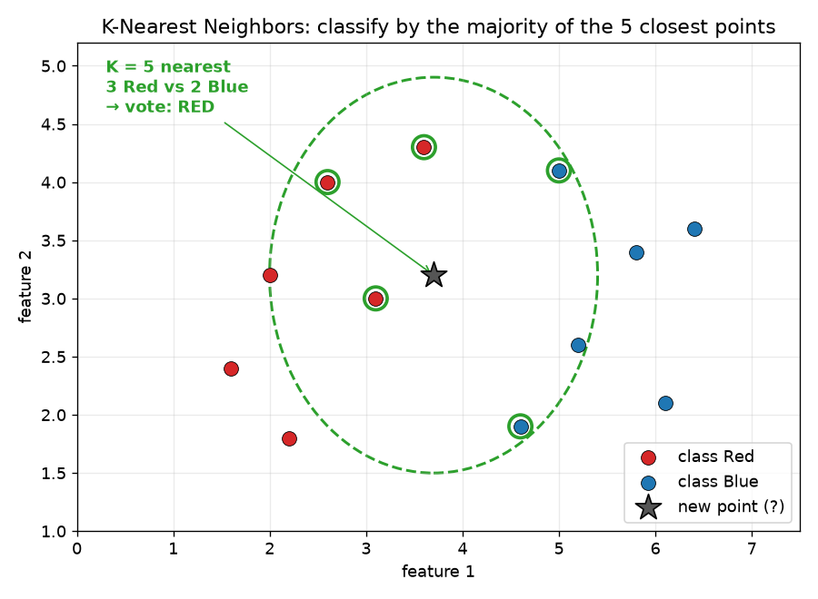
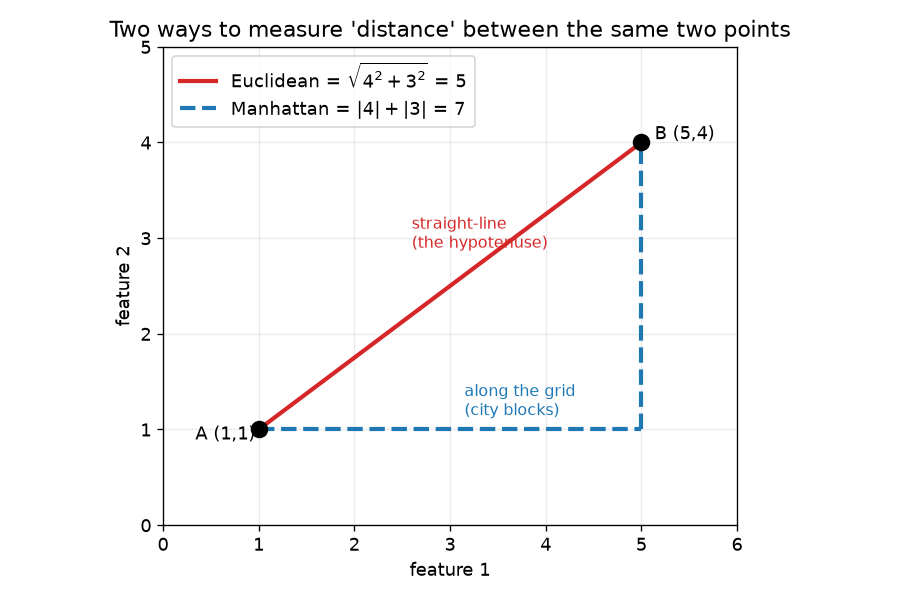
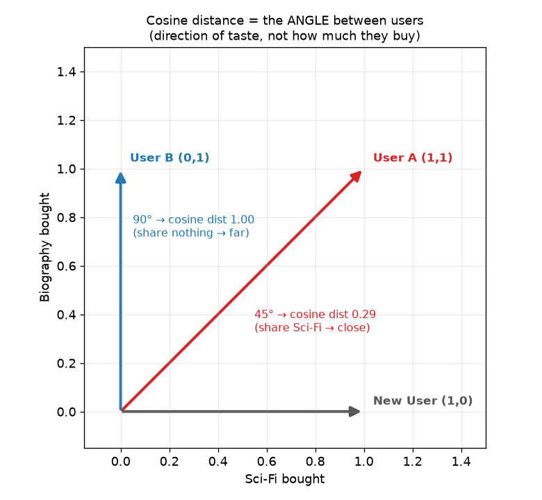
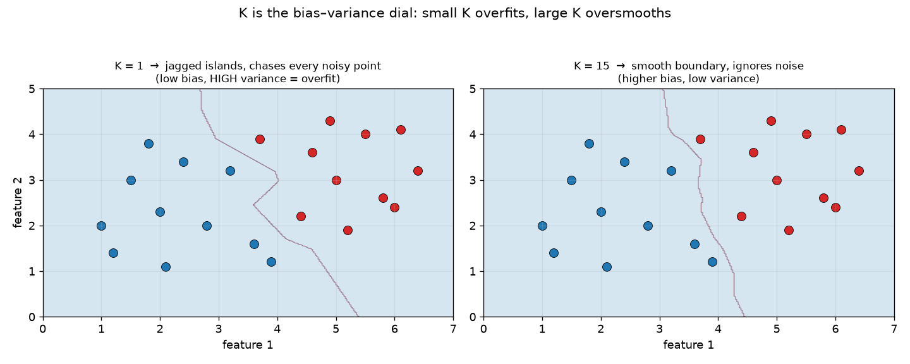

# ML Study 06 — K-Nearest Neighbors: "You Are the Company You Keep"

**Covers:** the idea (classify by your neighbors) → measuring "near" (Euclidean vs. Manhattan distance) → classification by majority vote → regression by averaging → choosing K → why scaling is mandatory → the catches (outliers, imbalance, dimensionality) → when to use it.
**Goal:** understand the most intuitive algorithm in ML — one that does **no training at all**. It just remembers every example, and to predict a new point it looks at the *K* closest ones it has seen. By the end you can classify or predict by hand, pick a sensible K, and know why KNN lives or dies on feature scaling.

**Series context:** like **[Naive Bayes (Study 05)](ML_Study_05_Naive_Bayes.html)**, KNN is a **classifier** — but it can *also* do **regression** (predict a number), so it's a two-for-one. Where logistic regression and Naive Bayes *learn* something from the data, **KNN learns nothing up front** — it's a "lazy learner" that just stores the training set and does all its work at prediction time. Runnable companion: **`hands-on/hello_knn.py`** (KNN on real World Bank data — classify a country's income group *and* predict its life expectancy from its most-similar neighbors).

---

## Part 1 — The problem: decide by looking at who's nearby

> A new data point shows up. Which class is it? Logistic regression would draw a boundary line and check which side you're on. **KNN doesn't draw anything.** It asks a simpler question: *"Of the training points I've already seen, which ones are **closest** to this new point — and what are they?"* Then it goes with the crowd. It's the algorithm version of **"you are the company you keep."**

KNN — **K-Nearest Neighbors** — works for **both** classification and regression, and the difference between the two is one line at the end. The whole algorithm is:

1. Pick a number **K** (say, 5).
2. For a new point, measure the **distance** to *every* training point.
3. Keep the **K nearest** ones.
4. **Classification:** take a *majority vote* of their labels. **Regression:** take the *average* of their values.

That's it. There is no equation to solve, no weights to learn, no gradient descent.

---

## Part 2 — The core idea, by picture

Imagine a scatter of two classes — 🔴 red and 🔵 blue — and a **new gray point** dropped in the middle. Set **K = 5**. Find the 5 nearest training points: here **3 are red, 2 are blue**. Majority wins → the new point is classified **red**.

*What this graph shows: the gray ★ is a new point to classify. The dashed green circle captures its 5 nearest neighbors (ringed in green) — 3 Red, 2 Blue. KNN takes the majority and labels the new point Red. That's the whole algorithm.*

That's the entire intuition. The only two things you have to pin down are: **(a) what does "nearest" mean** (Part 3), and **(b) how big is K** (Part 6).

> **"Lazy learner" — KNN's defining trait.** Logistic regression and Naive Bayes have a **training phase**: they crunch the data once and boil it down to a few learned numbers (weights, or frequency tables). KNN skips that entirely — **`.fit()` just memorizes the data.** All the work happens at **prediction** time, when it computes distances to every stored point. So KNN trains instantly but *predicts* slowly (it re-scans the whole dataset for each query). The opposite trade-off from every model so far.

---

## Part 3 — Measuring "nearest": distance

"Closest" needs a definition. KNN uses one of two distance formulas. Take two points $A=(x_1, y_1)$ and $B=(x_2, y_2)$:

**Euclidean distance** — the straight-line ("as the crow flies") distance, i.e. the hypotenuse:

$$d_{\text{Euclidean}} = \sqrt{(x_2 - x_1)^2 + (y_2 - y_1)^2}$$

**Manhattan distance** — the "city-block" distance: go along one axis, then the other (like walking Manhattan's grid — you can't cut through buildings). It's the sum of the **absolute** differences, *no* hypotenuse:

$$d_{\text{Manhattan}} = |x_2 - x_1| + |y_2 - y_1|$$

> **The picture that makes it stick:** to get from one street corner to another, **Euclidean** is the straight diagonal through the block; **Manhattan** is walking the two sides of the triangle. Same two points, two different "distances."

*What this graph shows: from A(1,1) to B(5,4), **Euclidean** (red) cuts straight across — the hypotenuse, √(4²+3²) = 5. **Manhattan** (blue, dashed) walks along the grid — 4 across then 3 up = 7. Same two points, two legitimate notions of "how far."*

Both extend to any number of features — just sum over all of them: Euclidean is $\sqrt{\sum_i (a_i - b_i)^2}$, Manhattan is $\sum_i |a_i - b_i|$. Euclidean is the default and usually fine; Manhattan can be steadier when you have many features. *(Which one to use is itself a hyperparameter — `metric` in scikit-learn.)*

**A third one you'll meet a lot: cosine distance.** Euclidean and Manhattan measure *how far apart* two points are. **Cosine** measures the **angle** between them — *are they pointing the same direction?* — and ignores magnitude. It's defined from cosine similarity:

$$\text{similarity} = \frac{A\cdot B}{\lVert A\rVert\,\lVert B\rVert}, \qquad d_{\text{cosine}} = 1 - \text{similarity}$$

Distance 0 = identical direction (perfect neighbors); distance 1 = nothing in common. **This is the metric behind recommendations and text.** *Example:* an online bookstore encodes each user as `[Sci-Fi, Biography, Mystery]` = 1/0 for bought/not. New user `[1,0,0]` vs User A `[1,1,0]` gives cosine distance **0.29** (they share Sci-Fi); vs User B `[0,1,1]` gives **1.00** (nothing shared) — so recommend what User A bought that the new user hasn't (Biography). Why cosine, not Euclidean? Because a user who buys *many* books shouldn't look "far" from one who buys few — only their **taste direction** should matter. *(Two more you'll hear named: **Jaccard** — overlap of two sets, "% of items both users touched"; **Mahalanobis** — Euclidean that accounts for feature *correlations*, used in fraud so correlated-but-normal behavior isn't falsely flagged.)*

*What this graph shows: each user is an arrow. Cosine looks at the **angle** between arrows, not their length. New User and User A sit 45° apart (they share Sci-Fi) → cosine distance 0.29 = close. New User and User B sit 90° apart (nothing shared) → distance 1.00 = maximally far. So the engine recommends from User A.*

### The fuller family (pick by data type)

Euclidean, Manhattan, and **Chebyshev** are actually *one* formula — **Minkowski distance** — at different settings:

$$d_{\text{Minkowski}} = \Big(\sum_i |a_i - b_i|^p\Big)^{1/p} \qquad p=1 \to \text{Manhattan}, \quad p=2 \to \text{Euclidean}, \quad p\to\infty \to \text{Chebyshev}$$

Chebyshev is just the single biggest coordinate gap, $\max_i |a_i - b_i|$ (the "king's move"). *(scikit-learn's KNN default is literally `metric="minkowski", p=2`.)* Past that family, you choose the metric by **what your data is**:

| Metric | Best for | One-line idea |
|---|---|---|
| **Minkowski** (Manhattan / Euclidean / Chebyshev) | continuous numbers | grid / straight-line / max-gap |
| **Cosine** | text, recommendations, sparse high-dim | angle — ignores magnitude |
| **Hamming** | categorical / binary / strings | count of positions that differ |
| **Jaccard** | sets ("which items overlap") | 1 − shared / total |
| **Mahalanobis** | correlated features (fraud) | Euclidean that accounts for covariance |
| **Haversine** | geographic lat/long | great-circle distance on a sphere |
| **Gower** | **mixed** numeric + categorical | per-column distance, averaged |

### Before you can measure distance: turn everything into comparable numbers

Every formula above needs **numbers on a common scale**. Two prep steps stand between raw data and a working distance model — both live in the [preprocessing lab](../notebooks/hello_preprocessing_worldbank.ipynb):

**1. Encode categories → numbers.**
- **One-hot encoding** — each category becomes its own 0/1 column (`Sunny → [1,0,0]`). Correct for **nominal** (unordered) categories; any two different categories land equally far apart. The default for distance models.
- **Ordinal / label encoding** — map to integers (`cold=0, mild=1, hot=2`). Valid **only when a real order exists**, because distance reads the numbers literally. On unordered categories (`red=1, blue=2, green=3`) it invents a fake *"green is twice as far as blue"* — a classic bug.
- **Text → vectors:** bag-of-words / **TF-IDF** (then pair with **cosine**), or learned **embeddings** for meaning.

**2. Put every numeric feature on a comparable scale** (Part 7's rule, made concrete):
- **Standardization (Z-score / StandardScaler)** — $(x-\mu)/\sigma$ → mean 0, std 1. The usual default.
- **Min-Max** — $(x-\min)/(\max-\min)$ → [0, 1]. Clean range, but one outlier squashes everything else.
- **Robust scaling** — uses median & IQR → shrugs off outliers.
- **Unit-vector (L2) normalization** — rescale each **row** to length 1; the natural partner of cosine.
- **Log-transform** a badly skewed feature first (Study 01 §3.9), *then* scale.

*Mixed data (numbers + categories together)?* Either **one-hot the categoricals and scale the numerics**, or reach for **Gower distance**, which handles each column in its own natural way.

---

## Part 4 — Classification: majority vote

Predict the class of a new point:

1. Compute its distance to every training point.
2. Sort, keep the **K** smallest.
3. **Vote:** whichever class appears most among those K neighbors is the prediction.

With **K = 5** and neighbors `{red, red, red, white, white}` → **3 red vs. 2 white → red**.

> **Use an odd K for two classes.** With an even K you can get a **tie** (2 red, 2 white). An odd K can't tie in a 2-class vote — a small, free way to avoid ambiguity.

---

## Part 5 — Regression: average the neighbors

KNN predicts a *number* with almost the same steps — only the last one changes. Find the K nearest points, then instead of voting, **average their values**:

$$\hat{y} = \frac{1}{K}\sum_{i \in \text{K nearest}} y_i$$

*Example:* to estimate a country's life expectancy, find the 5 most-similar countries (by their other indicators) and average *their* life expectancies. "Similar countries live similarly long." Classification votes; regression averages — that's the only difference.

---

## Part 6 — Choosing K: the one dial that matters

**K is a hyperparameter** (like λ in Study 02 or α in Study 01 — you set it, the model doesn't learn it). It controls the **bias–variance trade-off** directly (Study 02 §1.2):

- **K too small (e.g. K = 1):** the prediction is decided by the single closest point. Ultra-flexible → **low bias, high variance.** One noisy point or outlier right next door flips the answer. This **overfits.**
- **K too large (e.g. K = the whole dataset):** every prediction is just the overall majority/average — it ignores local structure. **High bias, low variance.** This **underfits.**
- **The sweet spot is in between.** The standard recipe: **try K = 1, 2, … up to ~50, measure the error rate on validation data for each, and pick the K where the error is lowest** (the "elbow"). Same cross-validation idea as picking λ.

*What this graph shows: the same two-class data, classified with **K=1** (left) and **K=15** (right). At K=1 the boundary forms jagged islands that wrap around every noisy point — it **overfits** (low bias, high variance). At K=15 the boundary is smooth and ignores the noise — steadier, but too large a K would start erasing real structure (**underfit**). K is the dial between them; the companion lab plots error-vs-K to find the elbow.*

> **Say it clearly — "How do you choose K?"** *"K is a hyperparameter. Small K overfits — it's swayed by single noisy neighbors; large K underfits — it washes out local detail. I sweep K from 1 to ~50, plot the validation error, and pick the K at the elbow. For binary problems I keep K odd to avoid tie votes."*

---

## Part 7 — The catches (this is where KNN bites you)

KNN is simple, but it has sharp edges. Three matter most:

**1. Feature scaling is MANDATORY — not optional.** KNN is built on *distance*, and distance is dominated by whichever feature has the biggest raw numbers. If one column is income ($0–100,000) and another is fertility rate (1–7), the income differences are *thousands of times larger*, so the distance is basically "difference in income" and fertility is ignored. **Fix: standardize every feature first** (StandardScaler / MinMax from the [preprocessing lab](../notebooks/hello_preprocessing_worldbank.ipynb)) so each contributes fairly. *KNN without scaling is usually broken — this is the #1 mistake.* *(Honest footnote: **if** the biggest-scale feature also happens to be your strongest signal — e.g. GDP when you're predicting income tier — unscaled KNN can even look **better**, by luck. You can't count on that luck, so the rule stands: always scale. The companion lab shows both sides — scaling **helps** predicting life expectancy, R² 0.70 → 0.83.)*

**2. Outliers wreck it.** Because a prediction leans on the nearest few points, a single mislabeled or extreme point sitting near your query can drag the answer into the wrong class. (KNN has no averaging-away of a bad point the way a global model does — if the outlier is *nearest*, it votes.)

**3. Imbalanced data biases the vote.** If 95% of training points are class A, then for almost any new point most of the K nearest will *happen* to be class A simply because A is everywhere — the minority class gets outvoted structurally. (Mitigate with resampling, or distance-weighted voting.)

*Two more worth knowing:* KNN slows down badly on **large datasets** (it computes distance to every point at prediction time), and it suffers the **curse of dimensionality** — with hundreds of features, everything becomes roughly equidistant and "nearest" stops meaning much.

---

## Part 8 — Where KNN actually shows up in the real world

KNN's "similar things cluster together" idea powers a surprising number of production systems. Each one is really *"encode the thing as a vector → find the nearest neighbors → vote or average"* — the differences are **what the vector is** and **which distance** fits:

| Domain | The vector (features) | Distance | What "neighbors" gives you |
|---|---|---|---|
| **Recommendations** (Amazon, Netflix, Spotify) | a user's ratings/purchases across every item | **cosine** | users with the same *taste direction* → suggest what they bought that you haven't |
| **Credit-card fraud** | `[amount, time, distance-from-home, velocity]` | **Euclidean / Mahalanobis** | a transaction with **no close neighbors** in your normal history → flag it |
| **Loan / credit risk** | debt-to-income, credit history, repayment record | Euclidean (scaled) | past borrowers most like this one → did *they* default? |
| **Healthcare** | gene-expression levels; pixel vectors of an X-ray/MRI | Euclidean | genetic clusters / prior scans that match → likely condition or anomaly |
| **Computer vision** | pixel-intensity vector; facial-landmark distances | Euclidean | handwritten-digit / zip-code recognition; basic face matching |
| **Missing-value imputation** *(callback!)* | the complete columns of a row with a hole | Euclidean (scaled) | the closest complete rows → fill the blank with their average (`KNNImputer`) |
| **Spatial / weather** | latitude/longitude, elevation | Euclidean (it's literally geometry) | nearest weather stations → estimate rainfall/temp for an unmonitored spot |

> **Two things this table quietly proves.** (1) **The distance metric is a design choice, not a default** — recommendations need *cosine* (direction), fraud needs *Euclidean/Mahalanobis* (magnitude + correlation). Pick the metric that matches what "similar" *means* for your problem. (2) **Feature scaling is everywhere** — in fraud, a `$5,000` amount would completely swamp a `time-of-day` (0–24) feature and the model would ignore *when* the crime happened. That's the [Part 7](#part-7--the-catches-this-is-where-knn-bites-you) rule, live in production. And notice **KNN imputation is a preprocessing step** — the same algorithm that classifies also fills holes for *other* models (it's an option in the [preprocessing lab](../notebooks/hello_preprocessing_worldbank.ipynb)).

---

## Part 9 — Judgment: when to reach for KNN

**Reach for it when:**
- You want a **fast, honest baseline** — it's the simplest possible model and needs almost no setup.
- The decision boundary is **irregular / non-linear** and you have no reason to assume a shape (KNN draws no boundary — it adapts to whatever the data looks like locally).
- The dataset is **small-to-medium** and **low-dimensional**, and you've **scaled** the features.
- You want the *same* algorithm for classification **and** regression.

**Be cautious when:**
- The dataset is **large** (prediction is slow — every query scans all points) or **high-dimensional** (curse of dimensionality).
- Features are on **wildly different scales** and you haven't standardized them (it will silently misbehave).
- Data is **noisy / has outliers** or is **badly imbalanced**.
- You need a model you can **inspect or explain** — KNN gives you no coefficients, no learned rule, just "these neighbors voted."

---

## Companion lab

 &nbsp; *(one-time GitHub sign-in; you're a collaborator on the repo)*

**`hands-on/hello_knn.py`** (and the Colab notebook above) does four things on real World Bank data:
1. **Classify** a country's income group from its most-similar neighbors — *"a country is like the company it keeps."*
2. **Regress** — predict life expectancy by averaging the K nearest countries.
3. **Proves scaling matters** — runs KNN with and without StandardScaler and shows accuracy jump.
4. **Sweeps K** — plots error rate vs. K and finds the elbow.

---

## Quick Reference — say it in plain words (then the term)

| Plain words | The term |
|---|---|
| "Classify me by my closest neighbors' majority vote." | K-Nearest Neighbors (classification) |
| "Predict my number by averaging my closest neighbors." | KNN regression |
| "Straight-line (hypotenuse) distance." | Euclidean distance |
| "City-block distance — along the grid, no diagonal." | Manhattan distance |
| "How many neighbors get a vote." | K (the hyperparameter) |
| "No training — just remember everything and compute at predict time." | lazy learner |
| "Put every feature on the same scale first, or distance is meaningless." | feature scaling (mandatory for KNN) |
| "Sweep K from 1 to 50 and pick the lowest-error one." | tuning K (cross-validation) |

## Glossary (jargon → plain English)

| Term | Plain English |
|---|---|
| K-Nearest Neighbors (KNN) | predict from the K closest training points — vote (classify) or average (regress) |
| K | how many neighbors vote; the key hyperparameter (small=overfit, large=underfit) |
| Euclidean distance | straight-line distance, $\sqrt{\sum(a_i-b_i)^2}$ |
| Manhattan distance | grid/city-block distance, $\sum\lvert a_i-b_i\rvert$ |
| Cosine distance | angle between two vectors ($1-$ similarity); ignores magnitude — the recommendations/text metric |
| Lazy learner | a model with no real training step; all work happens at prediction |
| Feature scaling | rescaling features to a common range so no single one dominates the distance |
| Curse of dimensionality | with too many features, all points look equidistant and "nearest" loses meaning |

---
**◄ Related: [ML Study 05 — Naive Bayes](ML_Study_05_Naive_Bayes.html)**  ·  **[ML Study 03 — Logistic Regression](ML_Study_03_Logistic_Regression.html)** (the other classifiers)  ·  **[ML Study 02 — Bias & Variance](ML_Study_02_Overfitting_Ridge_Lasso.html)** (what K trades off)

*ML Study 06 — K-Nearest Neighbors: classify by majority vote / regress by average of the K closest points → Euclidean vs. Manhattan distance → K is the bias-variance dial → scaling is mandatory → outliers & imbalance are its weak spots. A lazy learner: no training, all work at prediction. Companion lab: `hands-on/hello_knn.py`.*
