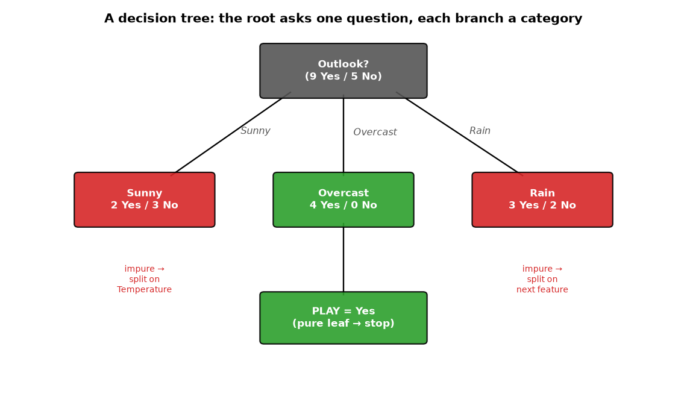
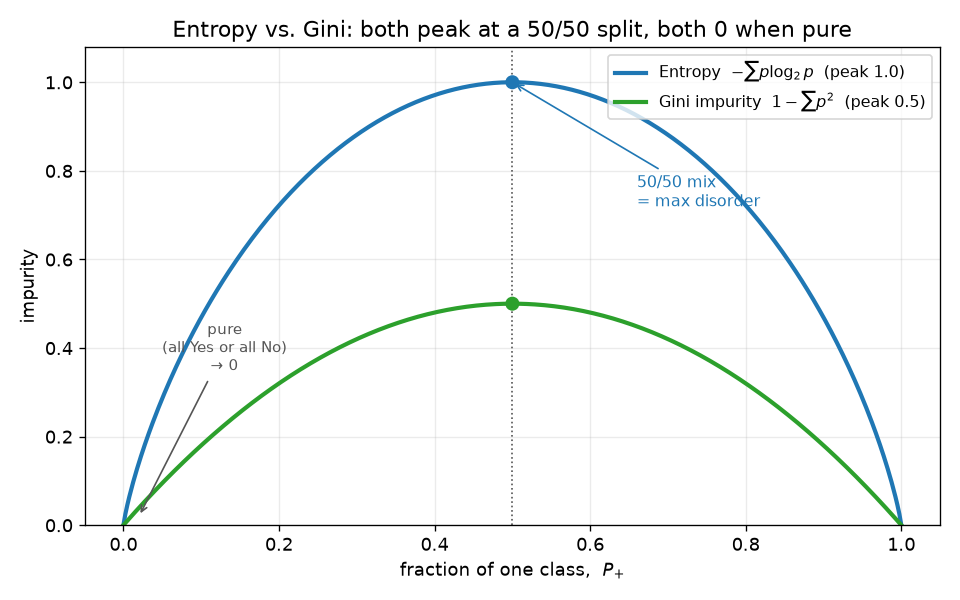
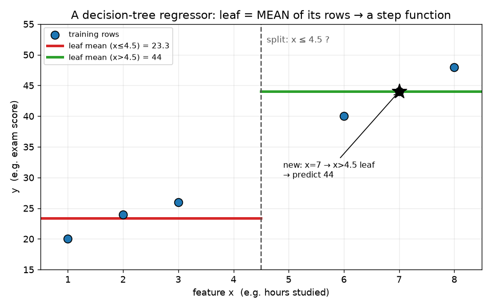

# ML Study 07 — Decision Trees: Learning the Questions to Ask

**Covers:** nested if/else → a tree → how it splits → pure vs. impure nodes → measuring purity (**entropy** & **Gini impurity**) → **which** feature to split on (**information gain**) → continuous features → the **regressor** (splits by MSE) → overfitting & **pruning** → a bridge to **random forests**.
**Goal:** understand the one classic-ML model you can *read* — a flowchart of yes/no questions the machine builds itself. By the end you can hand-build a split, compute entropy/Gini/information gain, and explain why a lone deep tree overfits (and what fixes it).

**Series context:** a decision tree does **both** classification and regression (like [KNN, Study 06](ML_Study_06_KNN.html)), and it's the building block of the ensembles (Random Forest, XGBoost) that win most tabular-data problems. It completes the classic-ML model family — after this you can *choose* between linear, logistic, Naive Bayes, KNN, and trees. Runnable companion: **`hands-on/hello_decision_tree.py`** (a tree on real World Bank data — classify income group *and* predict life expectancy, then see it overfit and get pruned).

---

## Part 1 — The idea: a nested if/else, drawn as a tree

> You already know decision trees — you just call them `if/else`. *"If age ≤ 18 → college; else if age ≤ 35 → work; else → retire."* A **decision tree** is that nested `if/else` **drawn as a diagram of nodes** — and, crucially, the machine **figures out the questions and the thresholds itself** from the data, instead of you hand-writing them.

We'll use the classic 14-day **Play Tennis** dataset (Outlook, Temperature, Humidity, Wind → Play?). Totals: **9 Yes, 5 No.**

The tree starts by picking a feature — say **Outlook** — and splitting the rows by its categories:

- **Sunny** → 2 Yes, 3 No
- **Overcast** → 4 Yes, 0 No
- **Rain** → 3 Yes, 2 No

*What this graph shows: the root asks "Outlook?" and sends each day down one of three branches. **Overcast is all Yes (4/0)** — a settled answer. Sunny and Rain are still mixed, so they need another question.*

---

## Part 2 — Pure vs. impure nodes (when to stop)

- **Pure node** — every row in it has the **same** label (e.g. Overcast: 4 Yes, 0 No). There's nothing left to decide → it becomes a **leaf**, and the tree **stops splitting** it. *"If it's Overcast tomorrow, they play — done."*
- **Impure node** — a mix (Sunny: 2 Yes, 3 No). The tree **picks the next feature** (say Temperature) and splits again — and keeps going **until every leaf is pure** (or a stopping rule kicks in, Part 8).

So a decision tree grows by repeatedly asking: *"which question splits this messy group into the purest possible children?"* That needs two tools: **(a) a way to measure purity** (Parts 3–4) and **(b) a way to pick the best feature** (Part 5).

---

## Part 3 — Measuring purity #1: Entropy

**Entropy** measures *disorder* — how mixed a node is. For a yes/no node:

$$H(S) = -P_{+}\log_2 P_{+} - P_{-}\log_2 P_{-}$$

where $P_{+}$ = fraction of Yes, $P_{-}$ = fraction of No. Two anchor cases:

- **Pure node** (3 Yes, 0 No): $P_{+}=1$, $P_{-}=0$ → $H = -1\cdot\log_2 1 - 0 = \mathbf{0}$. *(Zero disorder.)*
- **Perfectly mixed** (3 Yes, 3 No): $P_{+}=0.5$ → $H = -\tfrac12\log_2\tfrac12 - \tfrac12\log_2\tfrac12 = \mathbf{1}$. *(Maximum disorder.)*

So for a binary split, **entropy runs from 0 (pure) to 1 (50/50)**. A lower entropy child is a better split.

📖 **Read it aloud:** *"H of S equals minus P-plus log-two P-plus, minus P-minus log-two P-minus."* (Recognize $-p\log p$? It's the same shape as **log loss** from logistic regression, Study 03 — "surprise" content.)

---

## Part 4 — Measuring purity #2: Gini impurity

**Gini impurity** measures the same thing — how mixed a node is — but *without the logarithm*:

$$G = 1 - \sum_{i=1}^{n} p_i^{\,2} = 1 - \big(P_{+}^{2} + P_{-}^{2}\big)$$

- **Perfectly mixed** (2 Yes, 2 No): $G = 1 - \big[(\tfrac12)^2 + (\tfrac12)^2\big] = 1 - \tfrac12 = \mathbf{0.5}$.
- **Pure**: $G = 1 - (1^2 + 0^2) = \mathbf{0}$.

So **Gini runs from 0 (pure) to 0.5 (50/50)** — same story as entropy, just a different scale.

*What this graph shows: both curves peak at a 50/50 split and fall to 0 at the pure ends. Entropy (top) peaks at **1**; Gini (bottom) peaks at **0.5**. Same shape, same message — they just scale differently.*

> **When to use which? Gini is faster.** Entropy needs a **logarithm** for every candidate split; Gini is just squares. A tree can evaluate *thousands* of candidate splits (100+ features × many thresholds), so on big feature sets **Gini is the cheaper default** — which is why scikit-learn's `DecisionTreeClassifier` uses Gini by default. Entropy is fine for small feature sets; the resulting trees are usually near-identical.

---

## Part 5 — Which feature to split on: Information Gain

Purity tells you how good *one* node is. **Information gain** tells you which **feature** to split on — it's the *drop in entropy* a split buys you:

$$\text{Gain}(S, f) = H(S) - \sum_{v \in \text{values}(f)} \frac{|S_v|}{|S|}\, H(S_v)$$

In words: **parent's entropy** minus the **weighted average entropy of the children** (each child weighted by how many rows fall into it). Bigger gain = the split removed more disorder = better feature.

**Worked example (Play Tennis root, 9 Yes / 5 No):**

$$H(S) = -\tfrac{9}{14}\log_2\tfrac{9}{14} - \tfrac{5}{14}\log_2\tfrac{5}{14} \approx \mathbf{0.94}$$

Now try a feature $f_1$ that splits into child C1 (6 Yes, 2 No → $H=0.81$) and C2 (3 Yes, 3 No → $H=1$):

$$\text{Gain}(S, f_1) = 0.94 - \Big[\tfrac{8}{14}(0.81) + \tfrac{6}{14}(1)\Big] \approx 0.94 - 0.89 = \mathbf{0.049}$$

Suppose another feature $f_2$ gives $\text{Gain}(S, f_2) = 0.051$. Since $0.051 > 0.049$, **$f_2$ wins → it becomes the split.** The tree does this for *every* feature and **picks the highest information gain.** Then it repeats on each impure child. *That's the whole learning algorithm.*

> **This is what "the tree learns" means** — not weights like linear regression, but **which question to ask, in what order.** (You saw it live: on the customer data, the tree picked `prior_purchases` as its very first question, all by itself.)

---

## Part 6 — Continuous features: pick a threshold

Outlook is categorical (Sunny/Overcast/Rain). What about a *number* like income? The tree **sorts the values and tries thresholds**: for a sorted feature it tests *"≤ 1.3? ≤ 2.3? ≤ 3? …"*, computes the information gain for **each** candidate cut, and keeps the threshold with the **best** gain. So a numeric split becomes a yes/no question like *"income ≤ \$12,000?"* — chosen by the same information-gain rule. *(This is also why trees need no feature scaling — they compare within one feature at a time, never across features by distance.)*

---

## Part 7 — The regressor: same tree, predict a number

A **decision tree regressor** predicts a continuous value. Two things change from the classifier:

1. **The leaf outputs the *mean*** of the training values that landed in it (not a majority vote). Follow the questions down to a leaf → your prediction is that leaf's average.
2. **Splits are judged by MSE (or MAE), not entropy/Gini.** For each candidate split it computes the mean-squared error of the children and picks the split that **reduces MSE most** (the regression analog of information gain):
$$\text{MSE} = \frac{1}{m}\sum_{i=1}^{m}\big(\hat{y}_i - y_i\big)^2, \quad \text{where } \hat{y}_i = \text{the leaf's mean}$$
As MSE shrinks, the node is getting "purer" (its values are tightly clustered around their mean) → you're near a leaf.

### A worked regression example (with data)

Say we predict an **exam score** `y` from **hours studied** `x`. Six training rows, sorted by `x`:

| x (hours) | 1 | 2 | 3 | 6 | 7 | 8 |
|---|---|---|---|---|---|---|
| **y (score)** | 20 | 24 | 26 | 40 | 44 | 48 |

**Start at the root.** With no split, the tree's best single guess is the **overall mean** of all six scores, $\bar y = 33.7$. How bad is that? Its MSE (average squared miss from 33.7) is **≈ 115** — high, because the scores range from 20 to 48. The tree's job is to split so each side clusters tightly around *its own* mean.

**Three terms first, since the rest is just applying them:**
- A **threshold** is a cutoff that turns a *number* feature into a yes/no question — e.g. `x ≤ 4.5?`. The tree tries the **midpoints between consecutive sorted values** (sorted x = 1,2,3,6,7,8 → candidate thresholds **1.5, 2.5, 4.5, 6.5, 7.5**). *(Midpoints, because any value between two points gives the same grouping.)*
- A **split** is what that question does to the rows — it partitions them into two children. `x ≤ 4.5` sends {20,24,26} left and {40,44,48} right.
- **Weighted MSE** scores a split. Each child leaf predicts its **mean** and has its own MSE (how spread its values are around that mean = the leaf's variance). You combine the two, each **weighted by the fraction of rows it holds**:
$$\text{weighted MSE} = \frac{n_{\text{left}}}{n}\,\text{MSE}_{\text{left}} + \frac{n_{\text{right}}}{n}\,\text{MSE}_{\text{right}}$$

**How the split is chosen — greedy exhaustive search.** For *every* feature × *every* candidate threshold, the tree actually forms the split, computes its weighted MSE, and keeps the **lowest** one (the biggest error drop). Two candidates here:

- **`x ≤ 2.5`** → left {20, 24} mean 22 (MSE 4), right {26, 40, 44, 48} mean 39.5 (MSE 68.8). Weighted = (2/6)(4) + (4/6)(68.8) ≈ **47** — the right group is still spread out.
- **`x ≤ 4.5`** → left {20, 24, 26} mean **23.3** (MSE 6.2), right {40, 44, 48} mean **44** (MSE 10.7). Weighted = (3/6)(6.2) + (3/6)(10.7) ≈ **8.4** — both groups tight.

`x ≤ 4.5` wins by far (8.4 ≪ 47) — it drops MSE from ~115 all the way to ~8.4. *(This is exactly information gain's logic, swapped for numbers: entropy measured how **mixed the classes** were; weighted MSE measures how **spread the values** are — pick the split that minimizes it.)* So the tree splits there, and each leaf **outputs its own mean**:

- `x ≤ 4.5` → predict **23.3**
- `x > 4.5` → predict **44**

**Predict a new student** who studied **7 hours**: 7 > 4.5 → land in the right leaf → predicted score **44** (that leaf's average). A student who studied 2 hours → left leaf → **23.3**.

*What this graph shows: the six training rows (blue), the chosen split at x = 4.5 (dashed), and each leaf's prediction — a flat line at that leaf's **mean** (23.3 on the left, 44 on the right). The prediction is a **staircase**, not a smooth line: every input in a leaf gets that leaf's average. A new x = 7 lands in the right leaf → 44.*

So: **classifier votes the majority label; regressor averages the leaf's values.** And the split it picks: classifier maximizes information gain (entropy/Gini); regressor minimizes MSE. Same tree machinery, two swapped-out rules. (Deeper trees add more splits → more, narrower steps → a finer staircase.)

---

## Part 8 — The catch: trees overfit → pruning

**A decision tree left unchecked will overfit — badly.** It can keep splitting until *every leaf is one row* (a perfect memorization of the training data, training error 0) — the classic overfit from Study 02. Two fixes:

- **Post-pruning** — grow the full tree, then **cut back** branches that don't help. Example: a node with 7 Yes / 2 No is already ~80% Yes; splitting it further just chases noise, so **cut it and make it a leaf.**
- **Pre-pruning** — stop it *early* via **hyperparameters**, tuned with cross-validation (`GridSearchCV`):
  - **`max_depth`** — how many questions deep the tree may go (the biggest lever).
  - **`min_samples_leaf` / `min_samples_split`** — don't split a node with too few rows.
  - **`max_leaf_nodes`** — cap the total leaves.

> **The one-line intuition:** a shallow tree underfits (too few questions); an unbounded tree overfits (memorizes). `max_depth` is the **bias-variance dial** for a tree (Study 02 §1.2) — same trade-off as K in KNN and λ in Ridge/Lasso.

---

## Part 9 — From one tree to a forest: Random Forests (the bridge)

A single tree is **interpretable but unstable** — change a few rows and the whole tree can flip, and it overfits easily. The fix that made trees dominate tabular ML: **don't trust one tree — grow a *forest* and vote.**

A **Random Forest** builds many trees, each on:
- a **random sample of the rows** (bootstrap — "bagging"), and
- a **random subset of the features** at each split,

then **combines them** — *majority vote* for classification, *average* for regression. Because each tree overfits *differently*, their errors partly cancel; the forest is far **steadier** than any single tree (lower variance) while keeping low bias. You trade the single tree's readability for a big jump in accuracy and stability. *(XGBoost and gradient boosting are the next step up — trees built in sequence, each fixing the last one's mistakes.)*

*(Full random-forest treatment is its own topic; this is the intuition you need to see where trees lead.)*

---

## Part 10 — Judgment: when to reach for a decision tree

**Reach for it when:**
- You need a model you can **read and explain** — a tree *is* a flowchart. (A rare gift in ML; great for stakeholders and audits.)
- Features are on **wildly different scales or are categorical** — trees need **no scaling** and handle mixed types natively (unlike KNN or linear models).
- The relationship is **non-linear or interaction-heavy** — trees carve the space into boxes; they don't assume a shape.
- As the **building block** for a Random Forest / boosting (the usual winners on tabular data).

**Be cautious when:**
- You use **one tree** on real data — it **overfits and is unstable.** Prune it, or (better) use a forest.
- You need a **smooth** prediction — trees output stair-steps (piecewise-constant), not smooth curves.
- Data is **small and noisy** — deep trees chase the noise.

---

## Companion lab

 &nbsp; *(public repo — opens without sign-in)*

**`hands-on/hello_decision_tree.py`** (and the Colab notebook) on real World Bank data:
1. **Classify** income group — and **print the tree's rules** (the readable flowchart).
2. **Entropy vs. Gini** — compute both on a node by hand and confirm against sklearn.
3. **Overfit → prune** — an unbounded tree (train ~100%, test drops) vs. a `max_depth`-pruned one; watch the gap close.
4. **Regressor** — predict life expectancy; see the leaf = mean behavior.
5. **One tree vs. a forest** — a Random Forest beats the single tree on held-out data.

---

## Quick Reference — say it in plain words (then the term)

| Plain words | The term |
|---|---|
| "A nested if/else the machine builds itself." | decision tree |
| "A node where every row has the same label — stop." | pure node / leaf |
| "How mixed a node is (log version, 0–1)." | entropy |
| "How mixed a node is (squares, 0–0.5, faster)." | Gini impurity |
| "How much a split cuts the disorder — pick the biggest." | information gain |
| "For a number, try thresholds and pick the best cut." | continuous split |
| "Leaf outputs the average; splits judged by MSE." | decision tree regressor |
| "Cut back / stop early so it doesn't memorize." | pruning (post / pre) |
| "How deep the tree may go — the overfit dial." | max_depth (hyperparameter) |
| "Many trees, each different, then vote/average." | random forest |

## Glossary (jargon → plain English)

| Term | Plain English |
|---|---|
| Decision tree | a flowchart of learned yes/no questions; does classification or regression |
| Root / internal / leaf node | first question / a mid question / a final answer |
| Pure vs. impure split | children all one class vs. still mixed |
| Entropy $H(S)$ | disorder of a node, $-\sum p\log_2 p$; 0 (pure) to 1 (50/50) |
| Gini impurity | disorder, $1-\sum p^2$; 0 to 0.5; cheaper than entropy (no log) |
| Information gain | parent entropy − weighted child entropy; the split-selection score |
| Pruning | limiting the tree (post = cut back; pre = stop early via hyperparameters) to curb overfitting |
| Random forest | an ensemble of many varied trees that vote/average — steadier than one tree |

---
**◄ Related: [ML Study 06 — KNN](ML_Study_06_KNN.html)**  ·  **[ML Study 05 — Naive Bayes](ML_Study_05_Naive_Bayes.html)**  ·  **[ML Study 02 — Bias & Variance](ML_Study_02_Overfitting_Ridge_Lasso.html)** (what max_depth trades off)

*ML Study 07 — Decision Trees: a nested if/else the machine builds → split on the feature with the highest information gain → measure purity with entropy (0–1) or Gini (0–0.5) → regressor uses leaf-means and MSE → one tree overfits, so prune it or grow a random forest. Completes the classic-ML model family. Companion lab: `hands-on/hello_decision_tree.py`.*
