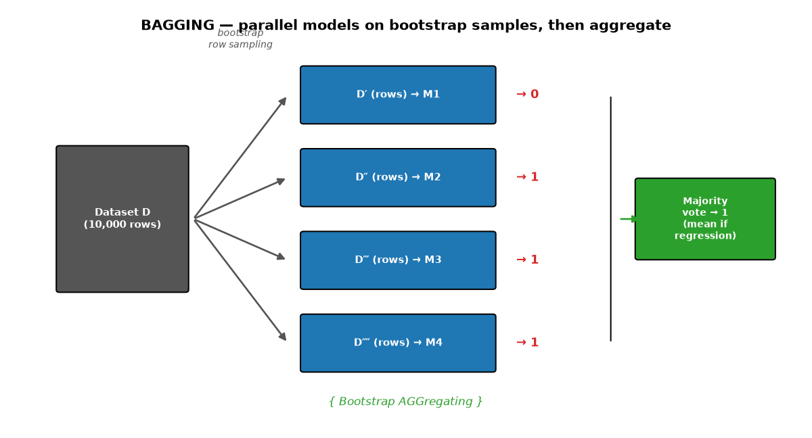
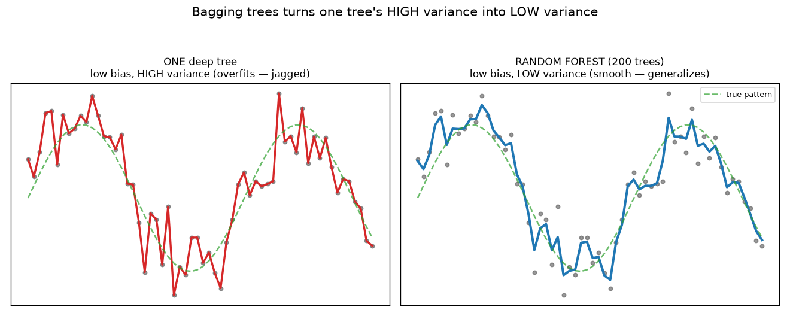
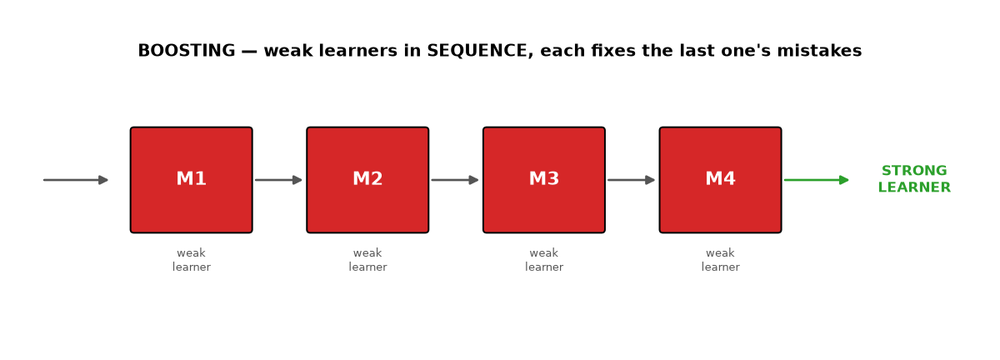
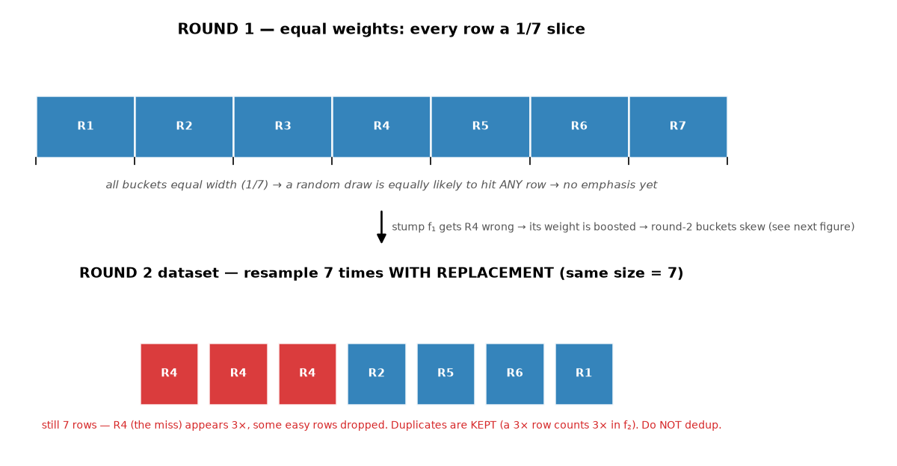
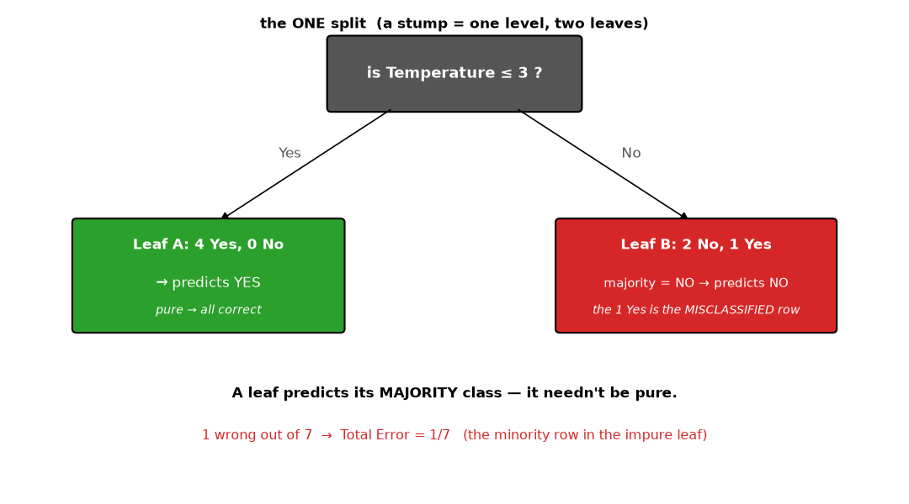
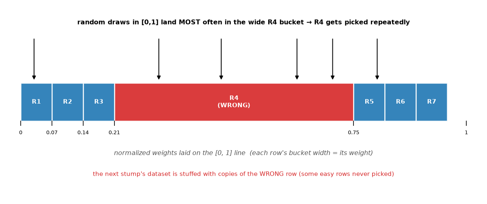
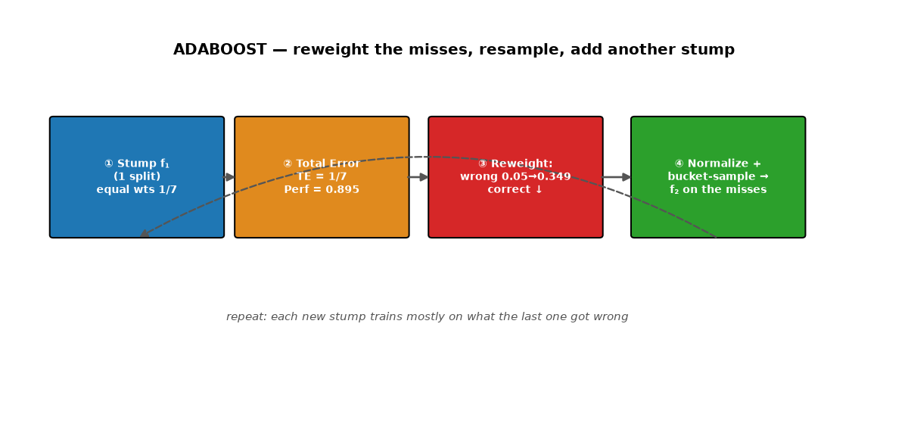

# ML Study 08 — Ensemble Techniques: Many Models Beat One

**Covers:** why combine models → **Bagging** (parallel, bootstrap-aggregate) → **Random Forest** (bagging of trees) → the scaling/outlier/white-box questions → **Boosting** (sequential weak→strong) → **AdaBoost** (stumps + the reweighting math) → **Gradient Boosting & XGBoost** → bagging vs. boosting, and when to use each.
**Goal:** understand the models that actually *win* on tabular data. Every algorithm so far used **one** model at a time; ensembles combine **many** — and that's why Random Forest and XGBoost dominate real-world and Kaggle problems.

**Series context:** the payoff of [Decision Trees (Study 07)](ML_Study_07_Decision_Trees.html). A single tree overfits; an *ensemble* of trees is the fix — and the standard answer to "which algorithm should I try first on a table of data?" Runnable companion: **`hands-on/hello_ensembles.py`** (single tree vs. Random Forest vs. AdaBoost vs. Gradient Boosting on real World Bank data).

---

## Part 1 — The idea: use *many* models, not one

> Every algorithm so far — linear/logistic regression, KNN, Naive Bayes, a decision tree — was **one model** solving the problem. **Ensemble techniques** ask a better question: *can we combine many models and let them vote?* The answer is yes, and it almost always beats any single model. It's the "wisdom of the crowd," made into an algorithm.

There are two ways to combine models, and the whole chapter is these two:

- **Bagging** — train many models **in parallel**, each on a different slice of the data, then **aggregate** their answers. → **Random Forest.**
- **Boosting** — train many weak models **in sequence**, each fixing the last one's mistakes, then combine them into one strong model. → **AdaBoost, Gradient Boosting, XGBoost.**

---

## Part 2 — Bagging (Bootstrap Aggregating)

**Bagging** builds many independent models, each on a **random sample of the rows**, and combines them.

1. From the full dataset **D** (say 10,000 rows), take a **row sample D′** (≪ D) *with replacement* — so some rows repeat, some are left out (a "bootstrap" sample). Give D′ to model M1.
2. Take another bootstrap sample → M2. Another → M3. And so on — often **100–200 models**.
3. Each model trains **independently and in parallel**. *(In "custom" bagging the models can even be different algorithms — logistic, a tree, KNN, Naive Bayes. Random Forest, next, uses all trees.)*
4. For a new point, every model predicts; then **aggregate**:
   - **Classification → majority vote.** (M1=0, M2=1, M3=1, M4=1 → **1**.)
   - **Regression → mean.** (120, 140, 122, 148 → **average**.)

*What this graph shows: the dataset is bootstrap-sampled into D′, D″, D‴… and each subset trains its own model in parallel. A new test point is fed to all of them; their outputs are combined by majority vote (classify) or mean (regress). That combine step is the "aggregate" in **Bootstrap AGGregating**.*

> **Why does voting help?** Each model, trained on a different sample, makes *different* mistakes. When you average/vote across 100+ of them, the individual errors partly cancel — the crowd is steadier than any member. (With 100–200 models, ties essentially never happen.)

---

## Part 3 — Random Forest = bagging with trees

**Random Forest is bagging where every model is a decision tree** — plus one extra twist.

**The problem it solves:** a single decision tree, grown freely, **overfits** — great on training data, poor on test → **low bias, high variance** (Study 07 Part 8). Pruning helps but is fragile on big/wide data. Random Forest converts that **high variance → low variance** while keeping the low bias.

**How:** for each tree, sample **both**:
- **rows** (bootstrap, like bagging), *and*
- **features** — each tree sees only a random subset of columns at each split (this is the "extra twist" vs. plain bagging).

Then **majority vote** (classifier) / **mean** (regressor) across all the trees.

*What this graph shows: one deep tree has **low bias but high variance** (it memorizes — overfits). Bagging many trees, each on a different row+feature sample, keeps the low bias but **averages the variance away** → a generalized model with **low bias AND low variance**. That's why the forest beats the single tree.*

> **Why sample features too?** If one feature is very strong, every tree would split on it first and the trees would look alike (correlated) — and averaging correlated models barely helps. Randomizing the features forces the trees to be *different*, so their errors are more independent and cancel better.

**Interview one-liner:** *"A decision tree overfits — low bias, high variance. Random Forest bags many trees on random rows and features and votes/averages them, turning high variance into low variance for a generalized model. It's my default on tabular data because it's accurate, robust, and needs almost no tuning."*

---

## Part 4 — Three questions people always ask about Random Forest

| Question | Answer | Why |
|---|---|---|
| **Does RF / a decision tree need feature scaling (normalize/standardize)?** | **No** | Trees split one feature at a time by threshold — rescaling doesn't change the order of values, so the split is unchanged. *(Contrast KNN.)* |
| **Does KNN need standardization?** | **Yes** | KNN is distance-based (Euclidean/Manhattan) — an unscaled big-range feature dominates the distance (Study 06 §7). |
| **Is Random Forest hurt by outliers?** | **Largely no** | Row/feature sampling + voting/averaging dilute any single weird point. *(KNN, by contrast — **yes**, a nearby outlier can flip the vote.)* |

> **White-box vs. black-box (a related idea).** **Linear regression** and a **single decision tree** are *white-box* — you can read the coefficients or the if/else rules and explain every decision. **Random Forest** (hundreds of trees) and **neural networks (ANN)** are *black-box* — accurate, but you can't trace one clean reason. You trade interpretability for performance. *(This is why the [feature-importance](ML_Study_07_Decision_Trees.html) view and tools like SHAP matter — they claw back some explainability from black-box models.)*

---

## Part 5 — Boosting: weak learners in sequence

Where bagging runs models **in parallel and independent**, **boosting** runs them **in sequence** — each new model tries to fix the **mistakes** of the one before it.

- M1 → M2 → M3 → M4 → output. Each Mᵢ is a **weak learner** (barely better than guessing on its own).
- Chained together, correcting each other, they become a **strong learner**.

*What this graph shows: training data flows through weak learners one after another; each focuses on what the previous got wrong. No single box predicts well, but the **sequence combined** is a strong learner. (Contrast bagging's parallel, independent models.)*

> **The analogy:** think of specialists in a row — a physics teacher, then chemistry, then maths, then geography. Any one alone can't solve every problem, but pass the problem down the line and *someone* handles each part. Boosting powers most winning Kaggle solutions.

**Boosting family:** **AdaBoost**, **Gradient Boosting**, and **XGBoost** (Extreme Gradient Boosting).

---

## Part 6 — AdaBoost (Adaptive Boosting), step by step

AdaBoost is the clearest way to *see* how boosting "fixes the previous model's mistakes." Its weak learners are **stumps**, and its whole trick is **weighting the training rows** — a mechanism you haven't met in any earlier algorithm. We'll build it up slowly, because every piece answers a real "wait, how does that work?"

### First, two things to be clear on

**What a stump is.** A **stump** is a decision tree cut down to a **single split** — one question, one level, **two** leaves (both branches, just no deeper). In code it's literally `max_depth=1`. Unlike a full tree (Study 07), which keeps splitting level after level until the leaves are pure (and overfits), a stump stops after the *first* split on purpose. That makes it a **weak learner** — barely better than a coin flip alone. Boosting's power is chaining *hundreds* of these.

> **Is the tree depth adjustable? Yes — it's a hyperparameter.** The stump (`max_depth=1`) is the *default*, but you can hand AdaBoost deeper base trees (`AdaBoostClassifier(estimator=DecisionTreeClassifier(max_depth=3), …)`). You keep them **shallow on purpose**, though: boosting needs *weak* learners, and a deep base tree becomes a *strong* learner that overfits the reweighted data, breaking the "each one patches the last's mistakes" logic. This is the exact opposite of **Random Forest** (Part 3), which uses **deep** trees and *averages* them. The one-liner: **bagging averages deep trees; boosting chains shallow ones** — depth is the lever that makes a tree "weak" vs. "strong." *(Gradient Boosting / XGBoost are boosting too, but typically use slightly deeper tuned trees, ~depth 3–6, rather than pure stumps.)*

**What gets weighted: the training rows.** AdaBoost assigns a **weight to every training row** — a number saying *"how much should the next stump care about getting this row right."* This is genuinely new: linear/logistic regression, KNN, Naive Bayes, and a plain tree all treat every training row **equally**. Row-weighting is the thing that will let each stump focus on the hard cases.

### The loop (worked on a 7-row example)

**Step 0 — Equal weights.** Every training row starts with the same weight, **1/n** (7 rows → **1/7 ≈ 0.143**). On the [0,1] line that's **7 equal buckets** — so before any stump has run, a random draw is equally likely to pick any row (round 1's sampled data ≈ the original, no emphasis yet):

*What this graph shows: **top** — round 1's equal buckets (1/7 each), no row favored. **Bottom** — after f₁ misses R4, the round-2 dataset is resampled 7 times *with replacement*, so it's **still 7 rows** but R4 (the miss) appears **3×** and some easy rows drop out. **Duplicates are kept** — a row appearing 3× counts 3× when f₂ picks its split. (Contrast the weighted bucket line further down, which shows *why* R4 gets drawn so often.)*

**Step 1 — Build the first stump.** For each feature, make a stump; keep the one with the best **information gain** (Study 07 Part 5). Say it splits on Temperature — that's stump f₁.

**Step 2 — Find who it got wrong, and how.** Here's the piece people trip on: *a stump predicts by taking the **majority class of each leaf** — the leaf does not need to be pure.* So the stump can label every row; it's just often wrong.

*What this graph shows: the split sends rows into two leaves. Leaf A is pure (4 Yes → predicts Yes, all correct). Leaf B is impure (2 No, 1 Yes → majority is No → predicts No), so the lone **Yes** row is **misclassified**. A row is "wrong" when its true label is the **minority** in its leaf. Here 1 of 7 is wrong.*

You measure this on the **same 7 training rows** — run them back through f₁ and compare each prediction to its true label. *(This is training error, used internally to build the next stump — not validation data. Validation comes in separately, one level up, to choose how many stumps to add; see the note at the end.)*

**Step 3 — Total Error (TE)** = the **sum of the weights of the misclassified rows.** One wrong row of weight 1/7 → TE = **1/7**.

**Step 4 — Performance of the stump** (its "amount of say," α):

$$\text{Performance} = \frac{1}{2}\,\ln\!\left(\frac{1 - TE}{TE}\right) = \frac{1}{2}\ln\!\left(\frac{1 - 1/7}{1/7}\right) \approx \mathbf{0.895}$$

*(Almost-always-right → big say; near 50/50 → almost no say; usually-wrong → negative say. This α is also how much this stump counts in the final vote.)*

**Step 5 — Reweight the rows — and *why*.** This is the heart of "adaptive." We want the **next** stump to focus on what this one missed, so we **raise the weight of the wrong rows and lower the weight of the correct ones:**

$$\text{correct rows: } w_{\text{new}} = w\cdot e^{-\text{Performance}} = \tfrac{1}{7}\,e^{-0.895} \approx \mathbf{0.05}\ (\text{down})$$
$$\text{wrong rows: } w_{\text{new}} = w\cdot e^{+\text{Performance}} = \tfrac{1}{7}\,e^{+0.895} \approx \mathbf{0.349}\ (\text{up})$$

Think of studying for an exam: after a practice test you don't re-study everything equally — you spend **more time on the questions you got wrong.** That's exactly what the weights encode. *(This is the real difference from bagging: Random Forest samples rows **randomly with equal weight**, so its trees are independent and parallel; AdaBoost **reweights by the last stump's errors**, so its stumps are sequential and adaptive.)*

**Step 6 — Normalize.** Divide each new weight by their sum (≈ 0.649) so the weights add to 1 again. The one wrong row jumps to ≈ **0.537**; each correct row drops to ≈ **0.07**.

**Step 7 — Resample by weight: the "buckets."** Now the question you'd actually ask: *how do the hard rows get **into** the next stump — do all rows carry over?* No. AdaBoost builds a **new** training set by **weighted random sampling**, using buckets:

*What this graph shows: lay the normalized weights end-to-end on the [0, 1] line, each row getting a **bucket** whose **width = its weight**. The misclassified row (0.537) owns a bucket covering **~54%** of the line; each correct row only 7%. To fill the next dataset, draw a random number in [0, 1] and pick whichever bucket it lands in — repeat n times. Because the wrong row's bucket is so wide, random draws land in it **most often**, so it's **selected many times**; some easy rows are **never** picked. It's a roulette wheel where the hard row has the biggest wedge.*

So the next stump **f₂ trains on a dataset stuffed with copies of the rows f₁ got wrong** (same size, sampled *with replacement*) — which forces f₂ to get them right. That's how "focus on the mistakes" physically happens.

> **"Does the dataset shrink? Do we dedup the duplicates?"** No to both. The resampled set is the **same size** as the original (7 draws → 7 rows), just with different *contents*: the wrong row appears **multiple times** and some easy rows fall out — so you might have only ~5 *distinct* rows but still **7 total rows**. **You keep every duplicate.** The duplicates *are* the mechanism — a row that appears 3× contributes 3× to f₂'s split/error math, which is exactly what makes f₂ concentrate on it. Deduping back to the distinct rows would erase that emphasis and break the algorithm.

**Step 8 — What feature does f₂ split on?** It's chosen **fresh**. f₂ is an independent one-split tree that picks the best feature **by information gain on this *reweighted / resampled* data** — not on the original data. Because the data now emphasizes the previously-wrong rows, the best-splitting feature usually **changes** (maybe Outlook or Humidity now), though it could also pick **Temperature again at a different threshold** — there's no rule either way. Each stump uses exactly **one** feature; across hundreds of stumps the ensemble uses many. And if some feature is never the best on any round, it simply **never gets picked** — that's fine (automatic feature selection; useless features end with zero importance). *(Two equivalent implementations: the **resampling** shown here, or — what scikit-learn actually does — a **weighted information gain** on the same rows where high-weight rows count more. Same effect: the hard rows drive the split.)*

**Step 9 — Repeat** for f₃, f₄, … each concentrating on the current hard cases.

**Prediction on a new point:** run it through *all* the stumps and take a **vote weighted by each stump's performance α** — better stumps count more.

> **Where validation fits (it's *not* inside this loop).** Everything above runs on the **training** set. A separate **validation** set (or cross-validation) sits one level up: you use it to tune the **hyperparameters** — chiefly *how many stumps* (`n_estimators`), the learning rate, and the base-stump depth — and to stop adding stumps once validation accuracy stops improving. Train = fit (incl. this whole loop); validation = pick the knobs; test = one final honest score.

> **Honest caveat (you'll see it in the lab):** AdaBoost's default stumps are built for **binary** problems and can *underperform* on multiclass or noisy data — in the companion lab, on a 4-class task, AdaBoost actually scores *below* a single tree while Random Forest and Gradient Boosting beat it. **An ensemble isn't automatically better** — the base learner and the problem type matter. That's why Random Forest (robust) and Gradient Boosting / XGBoost (higher ceiling) are the usual first choices.

*The loop in one picture: stump f₁ → find its errors (TE) → compute its say (0.895) → **raise** the weight of wrong rows (0.05→0.349) → normalize → bucket-sample so the next stump f₂ trains mostly on the misses → repeat. Each stump patches the previous stump's mistakes.*

---

## Part 7 — Gradient Boosting & XGBoost (the Kaggle winners)

Same boosting idea — sequential, error-correcting — but instead of *reweighting rows*, **Gradient Boosting** fits each new tree to the **residual errors** (what's left over) of the running prediction, nudging it downhill (gradient descent, Study 01, applied to the ensemble). **XGBoost** (Extreme Gradient Boosting) is a fast, regularized, industrial-strength version — for years the single most common winner of tabular-data competitions and a workhorse in industry. For the capstone and most tabular problems, **XGBoost or a Random Forest is the model to beat.**

> **Want the mechanics?** [Study 11 — XGBoost: Under the Hood](ML_Study_11_XGBoost.html) opens the black box: the **similarity score**, **gain**, **leaf output**, the **additive model + sigmoid**, and **λ** regularization — with the full worked classifier and regressor examples.

---

## Part 8 — Bagging vs. Boosting, and when to use each

| | **Bagging** (Random Forest) | **Boosting** (AdaBoost / GBM / XGBoost) |
|---|---|---|
| How models combine | **parallel**, independent | **sequential**, each fixes the last |
| What it mainly reduces | **variance** (fixes overfitting) | **bias** (fixes underfitting) — and variance |
| Base learners | full (overfit-prone) trees | **weak** learners (stumps / shallow trees) |
| Combine rule | vote / average | weighted vote (by performance) |
| Tuning & robustness | little tuning, very robust, hard to overfit | more tuning; can overfit if pushed; usually higher ceiling |
| Reach for it when | you want a strong, safe default fast | you want the **best** score and will tune |

**Judgment:** on tabular data, **start with Random Forest** (robust, near-zero tuning) as your strong baseline; reach for **XGBoost / Gradient Boosting** when you want to squeeze out the last few points and are willing to tune. Both beat any single model — which is why they, not deep learning, usually win on structured/tabular data.

---

## Companion lab

 &nbsp; *(public repo — opens without sign-in)*

**`hands-on/hello_ensembles.py`** (and the Colab notebook) on real World Bank data:
1. **Single tree vs. the ensembles** — one decision tree (overfits) vs. Random Forest vs. AdaBoost vs. Gradient Boosting on held-out data.
2. **Bagging cuts variance** — the single tree's train≫test gap vs. the forest's closed gap.
3. **Random Forest regressor** — predict life expectancy, and read feature importances.
4. **Boosting** — AdaBoost with stumps; Gradient Boosting; (XGBoost if installed).

---

## Quick Reference — say it in plain words (then the term)

| Plain words | The term |
|---|---|
| "Combine many models instead of trusting one." | ensemble |
| "Train many models in parallel on random row samples, then vote/average." | bagging (bootstrap aggregating) |
| "Bagging where every model is a tree (+ random features)." | random forest |
| "Train weak models in sequence, each fixing the last one's mistakes." | boosting |
| "A one-split tree used as a weak learner." | decision stump |
| "How much say a stump gets = ½·ln((1−error)/error)." | performance / alpha (AdaBoost) |
| "Raise the weight of the rows we got wrong, resample, repeat." | AdaBoost reweighting |
| "Fit each new tree to the leftover errors; regularized & fast." | Gradient Boosting / XGBoost |

## Glossary (jargon → plain English)

| Term | Plain English |
|---|---|
| Ensemble | many models combined into one predictor |
| Bagging / Bootstrap Aggregating | parallel models on bootstrap row samples, combined by vote/mean |
| Bootstrap sample | a random draw of rows *with replacement* (some repeat, some missing) |
| Random Forest | bagging of decision trees with random row + feature sampling |
| Boosting | sequential weak learners, each correcting the previous |
| Weak / strong learner | a model barely better than chance / an accurate combined model |
| Stump | a decision tree with a single split (AdaBoost's weak learner) |
| Performance (α) | a stump's weighted say, ½·ln((1−TE)/TE) |
| Gradient Boosting / XGBoost | boosting that fits residual errors; XGBoost = fast, regularized, Kaggle-winning |

---
**◄ Previous: [ML Study 07 — Decision Trees](ML_Study_07_Decision_Trees.html)**  ·  **Related: [ML Study 02 — Bias & Variance](ML_Study_02_Overfitting_Ridge_Lasso.html)** (what ensembles trade off)

*ML Study 08 — Ensemble Techniques: bagging (parallel, vote/mean) → Random Forest (bagged trees, fixes a tree's high variance) → boosting (sequential weak→strong) → AdaBoost (stumps + reweight the misses) → Gradient Boosting / XGBoost. Many models beat one — the winners on tabular data. Companion lab: `hands-on/hello_ensembles.py`.*
