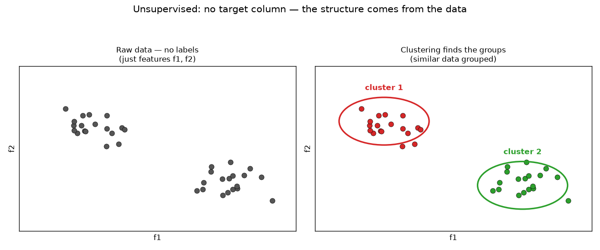
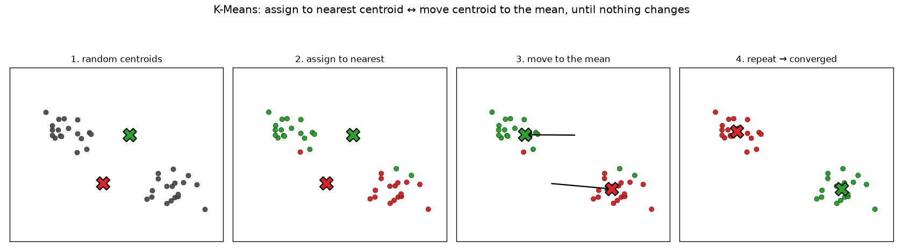
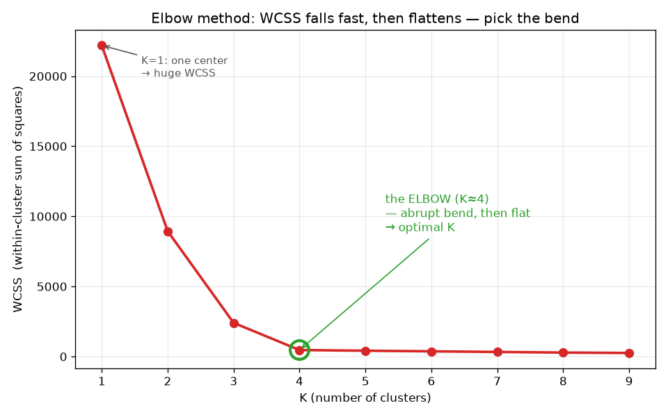

# ML Study 09 — K-Means Clustering: Finding Groups Without an Answer Key

**Covers:** what unsupervised learning is → clustering → K-Means (centroids, assign, update, repeat) → why scaling is mandatory → choosing **K** with the **elbow method** (WCSS) → validating with the **silhouette score** → the catches → where it's used (segmentation, the World Bank income-tier rediscovery, cluster-then-model).
**Goal:** understand your first algorithm that learns with **no labels at all.** Every model so far had an answer key; K-Means is handed raw data and finds the natural groups itself. By the end you can run the loop by hand, pick K from an elbow curve, and know when clustering is the right tool.

**Series context:** the big jump from **supervised** (Studies 01–08) to **unsupervised** learning. There's no target column, so there's no accuracy — you measure clusters differently (WCSS, silhouette). It's distance-based like [KNN (Study 06)](ML_Study_06_KNN.html), so scaling matters again. Runnable companion: **`hands-on/hello_kmeans_income.py`** — cluster 168 countries *blind*, then reveal the World Bank's official income tiers — and watch K-Means recover the same development gradient (richest→poorest), correlating with the tiers even though it never saw a label.

---

## Part 1 — Unsupervised learning: no output column

> Every algorithm so far predicted a **known target** — a price, a class, a yes/no. **Unsupervised learning has no target at all.** You hand it a table of features (`f1, f2, …`) with **no answer column**, and it finds *structure* on its own. The most common kind is **clustering**: group the rows into **clusters** of *similar* data.

Picture points scattered in 2-D (feature `f1` across, `f2` up). Your eye already sees two blobs — an upper-left group and a lower-right group. **Clustering is the algorithm that finds those groups automatically** — and it has to, because real data has *many* features (high-dimensional), where you *can't* just eyeball the blobs.

*What this graph shows: raw points with no labels (left) → the algorithm groups the similar ones into **cluster 1** and **cluster 2** (right). No target column was given; the structure came from the data itself. That's unsupervised learning.*

There are several clustering methods — **K-Means**, **Hierarchical**, **DBSCAN**. We start with K-Means, the most common.

---

## Part 2 — K-Means: the "K" is the number of centroids

The **K** in K-Means is the number of clusters you want — and each cluster is defined by a **centroid**, its center point. Set K = 2 and the algorithm finds two centroids; every point belongs to whichever centroid it's **closest** to. The centroid is literally the **mean** of its cluster's points (that's the "Means" in K-Means).

So the whole method is: *place K centers, assign each point to its nearest center, then move each center to the middle of its points — and repeat until nothing moves.*

---

## Part 3 — The algorithm (assign → update → repeat)

For a chosen K:

1. **Initialize K centroids** — drop K center points at random positions in the data.
2. **Assign** — for every data point, compute its **distance to each centroid** (Euclidean) and give it to the **nearest** one. Now every point is colored by its cluster.
3. **Update** — for each cluster, compute the **mean (average)** of its points and **move the centroid there.** (The centroid slides toward the center of its group.)
4. **Repeat** steps 2–3: re-assign every point to the *new* nearest centroid, re-compute the means, move again…
5. **Stop** when an assign step changes **nothing** — no point switches clusters and the centroids stop moving. **Converged.** Those are your final groups.

*What this graph shows: (1) two centroids start at random spots; (2) each point joins its nearest centroid (colored); (3) each centroid moves to the mean of its points; (4) re-assign + re-move… until the centroids settle and no point changes color. The centers "walk" into the middle of the natural groups.*

> **This is the same "iterate to convergence" shape as gradient descent** (Study 01) — but instead of nudging weights downhill, K-Means alternates *assign points* ↔ *recompute centers* until it stabilizes. No labels, no cost-curve to descend — just "keep tidying the groups until they stop changing."

**Watch it finalize — a worked trace.** The centroids aren't computed in one shot; they **start random and refine.** Take 6 points on a line — `1, 2, 3, 10, 11, 12` — with K = 2 and a deliberately **bad** random start (C1 = 2, C2 = 3):

| Round | Assign each point to its nearest centroid | Move each centroid to its group's mean |
|---|---|---|
| start | — | C1 = 2, C2 = 3 |
| 1 | {1, 2} → C1 · {3, 10, 11, 12} → C2 | C1 = **1.5**, C2 = **9** |
| 2 | {1, 2, 3} → C1 · {10, 11, 12} → C2 · *(point 3 **switched** to C1)* | C1 = **2**, C2 = **11** |
| 3 | {1, 2, 3} → C1 · {10, 11, 12} → C2 · *(nothing switched)* | C1 = 2, C2 = 11 → **converged** |

It recovered from the bad start: round 1 gave lopsided centers (1.5, 9), round 2 the boundary point (3) jumped clusters and the centers corrected to (2, 11), round 3 nothing moved → **finalized.** *For 100 records and K = 2 it's identical — just 100 points and 2 centroids: each round is 100 nearest-centroid assignments + 2 mean updates, repeated until no point switches.* Two notes: a centroid is usually **not** one of your actual records (it's a computed average — a virtual center); and because the start is random, K-Means is **run several times** (`n_init`) and the grouping with the lowest WCSS is kept, to avoid a bad local solution.

---

## Part 4 — Distance means scaling is mandatory (again)

K-Means assigns points by **Euclidean distance** to centroids — so, exactly like KNN (Study 06 §7), **a feature with a big raw range will dominate the distance** and hijack the clusters. If income is in dollars (0–100,000) and fertility is 1–7, the clusters will be "groups of similar income" and fertility won't matter. **Always standardize the features first** (StandardScaler) so every feature contributes fairly. *Un-scaled K-Means is usually wrong — this is the #1 mistake.*

---

## Part 5 — Choosing K: the elbow method

You set K, but how do you know the *right* K? You can't eyeball it in high dimensions. The standard answer is the **elbow method**, built on **WCSS — Within-Cluster Sum of Squares**: the total of each point's squared distance to *its own* centroid. Low WCSS = tight, compact clusters.

Run K-Means for **K = 1, 2, 3, … up to ~10**, record WCSS for each, and plot **WCSS vs. K**:
- **K = 1** (one centroid for everything): WCSS is **huge** — every point is far from the single center.
- As K grows, WCSS **drops** — more centroids → tighter clusters. *(At K = number of points, WCSS = 0: every point is its own cluster. So "just maximize K" is meaningless — of course more clusters fit tighter.)*
- The curve falls steeply, then **flattens.** The **"elbow"** — the K where the drop *abruptly* levels off — is the sweet spot: past it, adding clusters barely helps.

*What this graph shows: WCSS plotted against K. It plunges from K=1, then bends sharply at the **elbow** (here K≈4) and flattens. That bend is the optimal K — enough clusters to capture the structure, not so many that you're just chasing tighter fits.*

**Validating the choice — the silhouette score.** The elbow *picks* K; the **silhouette score** *validates* it. It measures, for each point, how much closer it is to its own cluster than to the nearest other cluster — ranging from **−1** (probably in the wrong cluster) through **0** (on a boundary) to **+1** (snugly in the right one). Average it across all points; a higher silhouette means cleaner, better-separated clusters. *(Since there are no labels, WCSS and silhouette replace "accuracy" for clustering.)*

---

## Part 6 — The catches

- **Scaling is mandatory** (Part 4) — the #1 mistake.
- **You must pick K** — it's not learned. Use the elbow + silhouette; there's no single "correct" answer, it's a judgment call.
- **Random initialization → different results.** Because centroids start at random spots, K-Means can land in different groupings on different runs (or a bad local solution). The fix: **k-means++** (smart initialization) and **running it several times and keeping the best** — scikit-learn's `n_init` does this for you.
- **It assumes round, similar-size blobs.** K-Means draws straight boundaries and likes compact, spherical clusters. For long, snake-shaped, or wildly different-density groups it struggles — that's where **DBSCAN** (density-based) or **Hierarchical** clustering do better.
- **Outliers pull centroids** — a few extreme points can drag a mean; consider handling outliers first.

---

## Part 7 — Where clustering is actually used

- **Customer / market segmentation** — group users by behavior to target each segment differently (the classic business use).
- **The World Bank development-gradient rediscovery** (the companion lab) — cluster 168 countries on their development indicators *with no labels*, and K-Means recovers the same **richest→poorest ordering** the World Bank's income tiers are built on. It doesn't reproduce the four official cutoffs *exactly* — and that's the point: the *mismatches* (a country whose cluster and official label differ) become a **"review these" list** where the label and on-the-ground reality diverge.
- **Aid targeting** — **Togo (2020)** clustered satellite-imagery grid cells to pick the **100 poorest cantons** for emergency cash — clustering literally deciding *where aid goes*.
- **Cluster-then-model ("custom ensemble")** — cluster the data into 2–3 groups first, then train a **separate supervised model per group** (each specialized for its segment). Clustering as a preprocessing step.

*Other clustering methods to know:* **Hierarchical** (builds a tree of nested clusters — no need to pick K up front) and **DBSCAN** (finds arbitrary shapes and labels outliers as noise).

---

## Part 8 — Judgment: when to reach for K-Means

**Reach for it when:**
- You have **no labels** and want to **discover natural groups** (segmentation, exploration).
- The clusters are roughly **round and similar-sized**, features are **scaled**, and the data isn't enormous.
- You want a **fast, simple, interpretable** first pass at structure.

**Be cautious when:**
- Clusters are **odd-shaped or very different densities** → DBSCAN / Hierarchical.
- You **can't standardize** meaningfully, or there are heavy **outliers**.
- You need a **guaranteed** number of clusters or a single "right" answer — clustering is inherently a judgment call (there's no ground truth to check against).

---

## Companion lab

 &nbsp; *(public repo — opens without sign-in)*

**`hands-on/hello_kmeans_income.py`** (and the Colab notebook): cluster **168 countries** on 8 development indicators with **no labels**, using standardization + the **elbow method** to pick K, then **reveal** the World Bank's official income tiers — and see K-Means recover the same development gradient (with a strong but imperfect match to the four tiers). The mismatches are the actionable payoff.

---

## Quick Reference — say it in plain words (then the term)

| Plain words | The term |
|---|---|
| "Learn structure from data with no answer column." | unsupervised learning |
| "Group similar rows together." | clustering |
| "K center points; each row joins its nearest center." | K-Means (K = number of centroids) |
| "Assign to nearest, move center to the mean, repeat." | the K-Means loop |
| "Total squared distance of points to their own center." | WCSS (within-cluster sum of squares) |
| "Plot WCSS vs K, pick the bend." | the elbow method |
| "How snugly each point sits in its cluster (−1…+1)." | silhouette score |
| "Scale first — it's distance-based." | standardization (mandatory) |

## Glossary (jargon → plain English)

| Term | Plain English |
|---|---|
| Unsupervised learning | finding structure in data that has **no labels/target** |
| Clustering | grouping rows into clusters of similar data |
| Centroid | a cluster's center point = the mean of its members |
| K | the number of clusters/centroids you choose |
| WCSS | within-cluster sum of squares; total squared distance of points to their centroid (lower = tighter) |
| Elbow method | run K=1..n, plot WCSS, pick the K at the bend |
| Silhouette score | −1…+1 measure of how well-separated the clusters are (validation) |
| k-means++ / n_init | smart init / multiple restarts to avoid bad random starts |
| DBSCAN / Hierarchical | other clustering methods (arbitrary shapes / a tree of clusters) |

---
**◄ Related: [ML Study 06 — KNN](ML_Study_06_KNN.html)** (also distance-based, also needs scaling)  ·  **[ML Study 00 — Foundations](ML_Study_00_ML_Foundations.html)** (supervised vs. unsupervised)

*ML Study 09 — K-Means Clustering: the first unsupervised algorithm. No labels → find natural groups by placing K centroids, assigning each point to its nearest, moving centroids to the mean, and repeating to convergence. Scale first; pick K with the elbow (WCSS) + silhouette. Companion lab: `hands-on/hello_kmeans_income.py` recovers the World Bank's development gradient (correlating with the income tiers) with no labels.*
