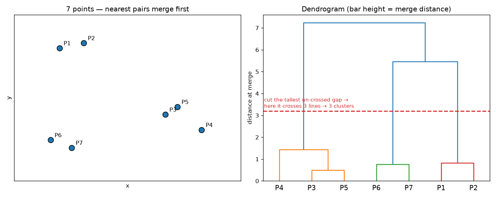
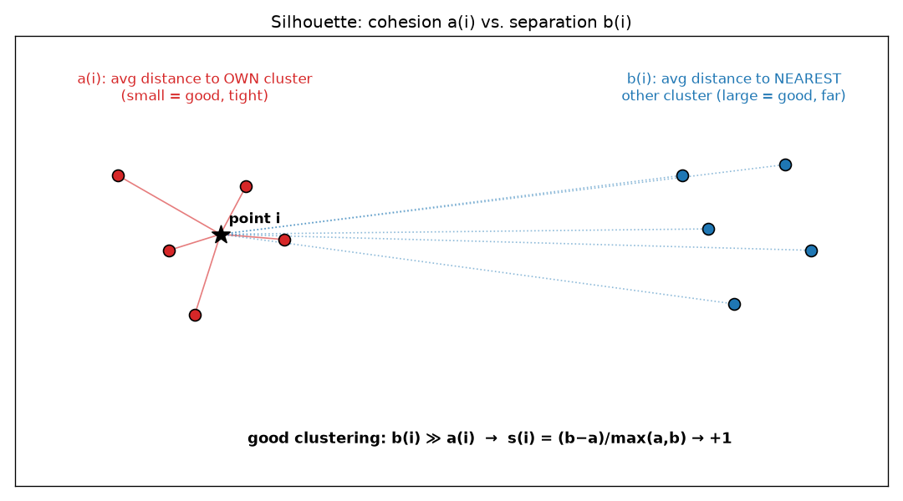
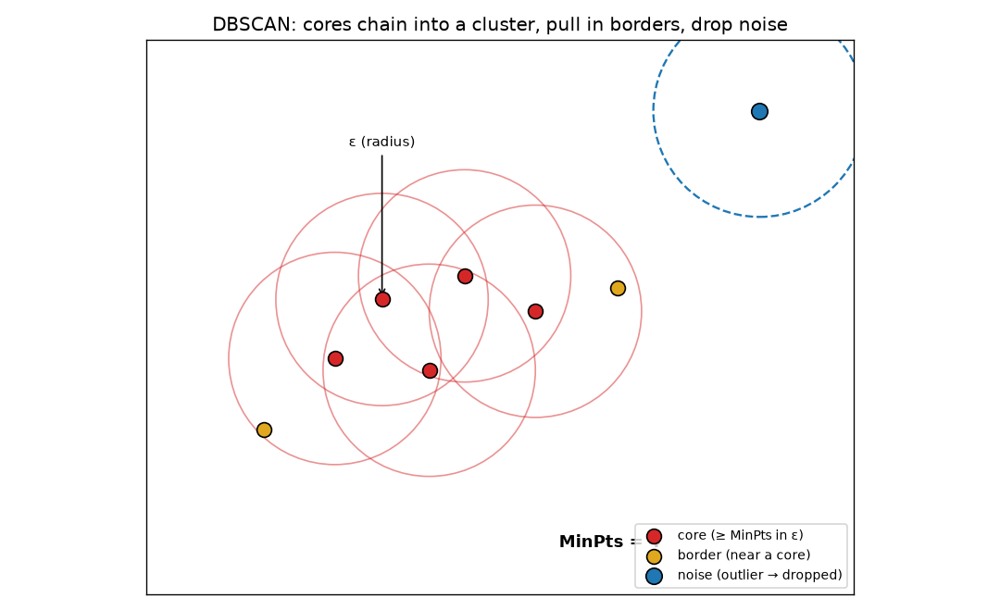
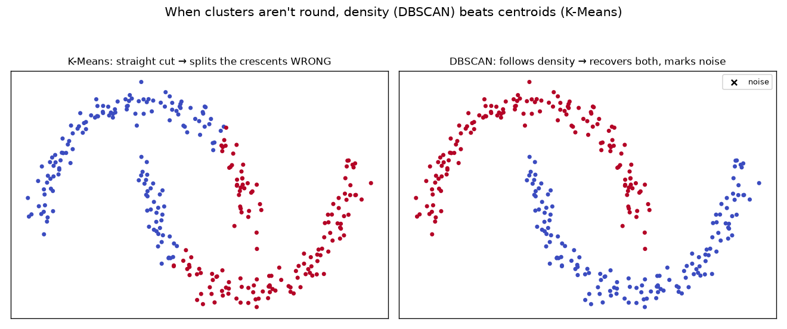

# ML Study 10 — More Clustering: Hierarchical, DBSCAN & the Silhouette Score

**Covers:** why K-Means isn't enough → **Hierarchical clustering** (merge into a dendrogram, cut to choose K) → **validating clusters** with the **silhouette score** (a(i), b(i)) → **DBSCAN** (density, ε & MinPts, core/border/noise) → arbitrary shapes + outliers → which method when.
**Goal:** round out unsupervised clustering. K-Means (Study 09) is fast but forces round clusters, makes you pick K, and drags every outlier into a group. Here are the tools that fix each of those — plus the score that tells you if *any* clustering is any good.

**Series context:** builds directly on [K-Means (Study 09)](ML_Study_09_KMeans_Clustering.html). All three methods are the **distance/similarity** idea (Study 00's lens #3), and — like K-Means and KNN — they need **scaled** features. Runnable companion: **`hands-on/hello_clustering_methods.py`** (K-Means vs. Hierarchical vs. DBSCAN, silhouette validation, and a shape where DBSCAN wins).

---

## Part 1 — Where K-Means falls short (and how these fix it)

K-Means is the workhorse, but it has three real limitations — each is why one of this chapter's tools exists:

| K-Means limitation | The fix in this chapter |
|---|---|
| You must **pick K** up front | **Hierarchical** builds a full tree; you choose K *after* by cutting it |
| It forces **round, similar-size** clusters | **DBSCAN** finds **arbitrary shapes** by density |
| It drags **outliers** into a cluster | **DBSCAN** labels outliers as **noise** and leaves them out |
| Bad random starts → wrong grouping | **k-means++** initializes centroids **far apart** (Study 09) |
| *"Is my clustering even good?"* — no accuracy without labels | The **silhouette score** validates *any* clustering |

---

## Part 2 — Hierarchical clustering: merge into a tree

**Hierarchical (agglomerative) clustering** is bottom-up: start with **every point as its own cluster**, then repeatedly **merge the two closest clusters**, recording each merge — until everything is one big cluster. The record of merges is a tree called a **dendrogram**.

Walk it: find the two nearest points → merge (a short link). Find the next-nearest pair → merge (a slightly taller link). Keep going; each merge happens at a **greater distance** than the last, so the tree grows upward from many leaves to one root.

*What this graph shows: LEFT — 7 points; the nearest pairs merge first (P1–P2, P6–P7, …). RIGHT — the **dendrogram**: each leaf is a point, each horizontal bar is a merge, and the bar's **height = the distance at which those clusters joined.* Short bars = very similar points merging early; tall bars = distant groups merging late.*

**Choosing K — cut the dendrogram.** You don't pick K first; you read it off the tree. The rule: **find the tallest vertical line that no horizontal (merge) line crosses, and cut across it.** The number of vertical lines your cut passes through = the number of clusters. (Cutting through the tallest un-crossed gap means you're splitting at the biggest jump in distance — the most natural place to stop merging.)

**But which points are in *which* cluster?** The same cut answers that too — it does double duty. Each vertical line the cut crosses is the top of a **sub-tree**, and that cluster is **every leaf-point hanging below it.** So the cut gives *both* the count *and* the membership: cutting at height *h* keeps every merge that happened **below** *h* and undoes every merge **above** it — points joined at a distance less than the cut stay together, groups that only merge above it stay apart. In the figure, cutting at ≈3 crosses 3 lines and the three sub-trees below them are the actual clusters: **{P1, P2}**, **{P3, P4, P5}**, and **{P6, P7}**. *(In code you don't eyeball it: `AgglomerativeClustering(n_clusters=3)` — or SciPy's `fcluster` — returns a label for every point, which is the membership.)*

**The catch — it's slow.** *"Which takes more time, K-Means or hierarchical?"* is a classic interview question, and the answer is **hierarchical.** Building the full merge-tree is expensive (roughly cubic in the number of points), and with many points/features you can't even draw a readable dendrogram. **So: small data → hierarchical is fine (and you get the tree for free); large data → K-Means** (faster, and usually performs better at scale).

---

## Part 3 — Validating clusters: the silhouette score

Classification has accuracy, precision, recall. Clustering has **no labels**, so how do you know a grouping is good? The **silhouette score** — and it works for K-Means, hierarchical, any method.

For each point **i**, compute two numbers:

- **a(i) — cohesion.** The **average distance from i to every other point in its own cluster.** Small = i sits snugly in its cluster.
$$a(i) = \frac{1}{|C_I| - 1}\sum_{j \in C_I,\, j \ne i} d(i, j)$$
- **b(i) — separation.** The average distance from i to all points in the **nearest *other* cluster** (the smallest such average over the other clusters). Large = i is far from any rival cluster.

Then the point's silhouette:
$$s(i) = \frac{b(i) - a(i)}{\max\{a(i),\, b(i)\}} \qquad \text{ranges from } -1 \text{ to } +1$$

*What this graph shows: for point i, **a(i)** is its average distance to its own cluster-mates (tight = good), and **b(i)** is its average distance to the nearest other cluster (far = good). A good clustering has **b(i) ≫ a(i)** → s(i) near **+1**. If a(i) ≫ b(i), the point is closer to a *different* cluster → s(i) is **negative** (it's likely mis-assigned). s(i) = 0 means it's on the boundary.*

**Reading it:**
- **s → +1**: well-clustered (close to own group, far from others) — *good.*
- **s → −1**: probably in the wrong cluster (a(i) > b(i)) — *bad.*
- **s ≈ 0**: on the border between two clusters.

Average s(i) over **all** points = the **overall silhouette score**; higher is better. Two practical tips from the lab:
- Don't just take the highest average — also **check the per-cluster silhouettes** and reject a K where **any** cluster has lots of **negative** points (some points mis-placed).
- When two K values tie, **prefer the larger K** (a more generalized split). *(On a clean synthetic dataset with 4 real blobs, elbow and silhouette will both land on K = 4. But note the honest wrinkle in the lab: on the real World Bank data, silhouette actually **peaks at K = 2** — the cleanest rich/poor split — because **silhouette rewards clean separation, which often means *fewer* clusters** than the finer story you might want. Metrics guide you; they don't decide for you.)*

---

## Part 4 — DBSCAN: clustering by density

**DBSCAN** = *Density-Based Spatial Clustering of Applications with Noise.* Instead of centroids, it grows clusters wherever points are **densely packed**, and it can find **any shape** and **flag outliers as noise** — the two things K-Means can't do. The four terms (ε, MinPts, core/border/noise) all lean on each other, so here's the clean way to hold them: **there are just 2 knobs you set, and then every point gets 1 of 3 labels.**

**The 2 knobs (hyperparameters):**
- **ε (epsilon) — a radius.** Around any point, draw a circle of radius ε; whoever falls inside are that point's **"neighbors."** (ε is a *distance*.)
- **MinPts — a head-count threshold.** How many points must be inside the ε-circle for that spot to count as **"crowded."** *(Convention: MinPts includes the point itself — so MinPts = 4 means the point + at least 3 neighbors.)*

**The 3 labels — classify each point by asking two questions, in order:**
1. **Are there ≥ MinPts points inside my ε-circle?** → **Core point** (I'm in a dense area; I anchor a cluster).
2. If not — **is at least one *core* point inside my ε-circle?** → **Border point** (I'm on the *edge* — next to a crowd, not crowded myself).
3. If neither → **Noise point** (an **outlier** — I belong to no cluster).

> **The party analogy (makes it click):** **ε** = how close you must stand to count as *with* someone; **MinPts** = how many people around you means you're *in the crowd*. **Core** = someone in the thick of the crowd; **Border** = someone at the edge, next to a crowd-person but not surrounded; **Noise** = someone off alone in the corner.

**A concrete pass (MinPts = 4):** Point A has 5 points inside its ε-circle → **core**. Point B has only 2 — but one of them is A, a core → **border**. Point C has nothing nearby → **noise**, dropped.

*What this graph shows (MinPts = 4): **red core points** each have ≥ 4 neighbors inside their ε-circle; overlapping cores chain together into one cluster, pulling in the **yellow border points** on the edge (near a core but not dense themselves). The **blue noise point** sits alone — no core nearby — so DBSCAN **leaves it out entirely** as an outlier.*

A cluster = a chain of **core points within ε of each other**, plus their **border points**. **Noise points are simply excluded** — which is exactly what you want when outliers shouldn't be forced into a group (fraud, sensor glitches, a lone remote village).

> **So why bother distinguishing core from border — both are "in" the cluster?** Because only **cores can *grow* the cluster.** DBSCAN expands a cluster by reaching out from a core point to everything within ε; if any of those are *also* core, it keeps chaining outward through them. A **border point gets absorbed but is a dead end** — DBSCAN does *not* reach out from it (it isn't dense enough to have the "authority" to extend the cluster). **The cluster stops at its borders.** This is the whole point of DBSCAN: it stops clusters from **leaking across sparse bridges.** Two dense blobs joined by a thin line of *border* points stay **separate** (the cluster can't cross a non-dense bridge); if those bridge points were dense enough to be *cores*, the blobs would **merge**. Dense middle (cores) → thin edge (borders) → outliers (noise). *(Edge case: a border within ε of two clusters just joins whichever reaches it first — it can't connect them.)*

**Why it beats K-Means on shape:**

*What this graph shows: two interleaving crescent shapes. **K-Means** (left) cuts them with a straight boundary — it splits each crescent wrong, because it only makes round blobs. **DBSCAN** (right) follows the **density**, recovers both crescents correctly, and marks the stray points as noise (×). When clusters aren't round, density beats centroids.*

**The trade-offs:** DBSCAN needs **no K**, handles **arbitrary shapes**, and **isolates outliers** — but you must choose **ε and MinPts** (ε especially is fiddly), and it struggles when clusters have **very different densities** (one ε can't fit both a dense and a sparse group).

---

## Part 5 — Which clustering method, when?

| | **K-Means** | **Hierarchical** | **DBSCAN** |
|---|---|---|---|
| Core idea | K centroids, assign+mean | merge nearest into a tree | grow dense regions |
| Pick the # clusters? | **yes, up front** (K) | **no** — cut the dendrogram after | **no** — tune ε & MinPts |
| Cluster shapes | round / spherical | any (depends on linkage) | **arbitrary** |
| Handles outliers? | no (forces them in) | no | **yes — labels as noise** |
| Scales to big data? | **yes** (fast) | **no** (slow, cubic-ish) | moderate |
| Gives a tree/hierarchy? | no | **yes** (dendrogram) | no |
| Validate with | silhouette / elbow | silhouette / dendrogram | silhouette |

**Judgment:** **start with K-Means** for speed on large, roughly-round data. Reach for **hierarchical** on smaller data when you want the dendrogram or don't want to commit to K. Reach for **DBSCAN** when clusters are **odd-shaped** or you must **separate outliers** (many practitioners now default to DBSCAN for exactly these reasons). And whichever you pick, **validate with the silhouette score** — it's the "accuracy" of clustering.

*(One K-Means note this closes out: bad random centroid starts can produce the wrong number of visible groups; **k-means++** fixes it by initializing centroids **far apart** so they settle into the true centers.)*

---

## Companion lab

 &nbsp; *(public repo — opens without sign-in)*

**`hands-on/hello_clustering_methods.py`** (and the Colab notebook):
1. **Silhouette validation** — sweep K on World Bank data, compute the silhouette for each, cross-check against the elbow.
2. **K-Means vs. Hierarchical** — same data, compare their groupings and silhouettes.
3. **DBSCAN finds outliers** — flag the noise-point countries K-Means would have forced into a tier.
4. **Shape demo** — two crescents where DBSCAN cleanly beats K-Means (silhouette proves it).

---

## Quick Reference — say it in plain words (then the term)

| Plain words | The term |
|---|---|
| "Merge nearest points into a tree, cut it to get clusters." | hierarchical (agglomerative) clustering |
| "The merge-tree; bar height = merge distance." | dendrogram |
| "Cut the tallest gap no merge-line crosses." | choosing K from a dendrogram |
| "How snug in its own cluster vs. the nearest other (−1…+1)." | silhouette score |
| "Avg distance to own cluster." | a(i) — cohesion |
| "Avg distance to the nearest other cluster." | b(i) — separation |
| "Cluster by dense regions; flag loners as noise." | DBSCAN |
| "The radius around a point." | epsilon (ε) |
| "Min neighbors in ε to be 'dense'." | MinPts |
| "Dense center / edge / outlier." | core / border / noise point |

## Glossary (jargon → plain English)

| Term | Plain English |
|---|---|
| Hierarchical clustering | bottom-up merging of nearest clusters into a tree (dendrogram) |
| Dendrogram | the merge-tree; leaf = point, bar height = distance at merge |
| Silhouette score | −1…+1 validity of a clustering: (b−a)/max(a,b), averaged over points |
| a(i) / b(i) | cohesion (avg dist to own cluster) / separation (avg dist to nearest other) |
| DBSCAN | density clustering that finds arbitrary shapes and marks outliers as noise |
| ε (epsilon) / MinPts | the neighborhood radius / the min points to be a dense "core" |
| Core / Border / Noise | dense center point / edge point near a core / excluded outlier |
| k-means++ | K-Means initialization that spreads starting centroids far apart |

---
**◄ Previous: [ML Study 09 — K-Means Clustering](ML_Study_09_KMeans_Clustering.html)**  ·  **Related: [ML Study 06 — KNN](ML_Study_06_KNN.html)** (distance + scaling)

*ML Study 10 — Hierarchical clustering (merge into a dendrogram, cut for K) · the silhouette score (validate any clustering, −1…+1) · DBSCAN (density, ε & MinPts, core/border/noise — arbitrary shapes + outliers). K-Means for scale, hierarchical for the tree, DBSCAN for shapes and noise. Companion lab: `hands-on/hello_clustering_methods.py`.*
