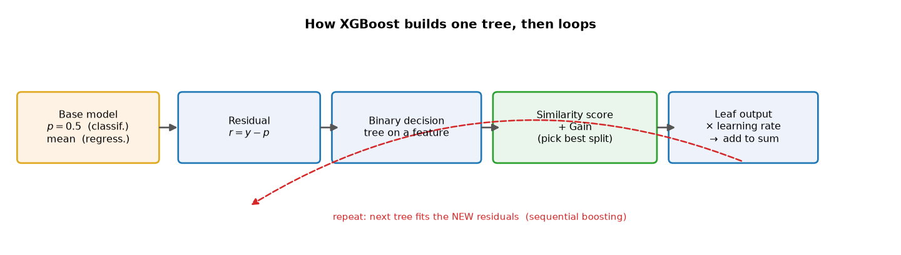
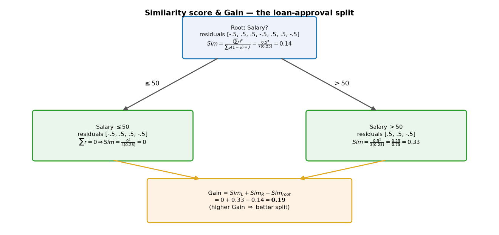
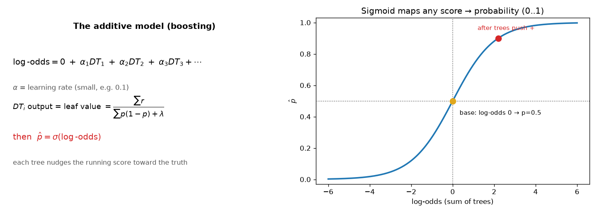
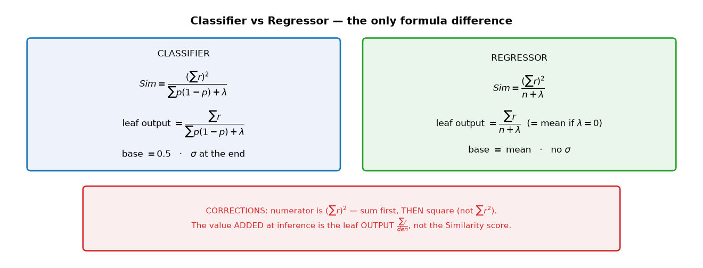

# ML Study 11 — XGBoost: Under the Hood (Similarity, Gain, and the Additive Model)

**Covers:** where XGBoost fits in the boosting family → the **base model** and **residuals** → the three-step tree loop (**binary tree → similarity score → information gain**) → the worked loan-approval example → **leaf output**, the **additive model**, **learning rate** and **sigmoid** → **λ (lambda)** regularization → the **regressor** variant → the two corrections to watch for → hyperparameters and when to reach for it.
**Goal:** open the black box. [Study 08](ML_Study_08_Ensemble_Techniques.html) told you *what* XGBoost is (boosting that fits residuals, regularized, the tabular-data winner). This doc shows *how it actually builds each tree* — the similarity-score machinery that makes XGBoost different from plain gradient boosting.

**Series context:** the deep-dive behind [Ensemble Techniques (Study 08), Part 7](ML_Study_08_Ensemble_Techniques.html). Read Decision Trees (07) and Ensembles (08) first — XGBoost is boosting (sequential, error-correcting) built from binary decision trees. Runnable companion: **`hands-on/ml05_xgboost.py`** and the notebook below (XGBoost classifier + regressor on real World Bank data, with the similarity/gain math verified from scratch).

---

## Part 1 — Where XGBoost sits

**XGBoost = eXtreme Gradient Boosting.** Same boosting idea from Study 08 — train trees **in sequence**, each one correcting what's left over — but with a specific, regularized way of scoring splits. It solves **both classification and regression**, and for years it has been the model to beat on tabular data.

**What kind of model is it?** An **ensemble of decision trees** — specifically **regression trees (CART)**, which output **numbers** (corrections), *even for classification*. And it **adds** those trees together, it doesn't vote. That's the contrast with Random Forest (Study 08): Random Forest **averages** many independent deep trees; XGBoost **adds** many shallow trees built one after another. Same building block (trees), opposite way of combining them.

The difference from the AdaBoost you saw in Study 08: AdaBoost **reweights rows**; XGBoost (like gradient boosting) **fits the residuals** — the leftover error of the running prediction — and scores every candidate split with a **similarity score**. That similarity score, and the **gain** built from it, are the whole story.

*What this diagram shows: XGBoost starts from a dummy **base model**, computes each row's **residual**, grows a **binary decision tree** whose splits are chosen by **similarity + gain**, converts the winning leaf to an **output value**, scales it by the **learning rate**, and adds it to the running prediction. Then it repeats — the next tree fits the **new** residuals. Sequential error-correction is what makes it boosting.*

---

## Part 1½ — In plain terms: a relay of consultants (read this first)

Before the formulas, the whole idea in business terms. Say you're estimating whether a sales lead will convert (1) or not (0).

- **Consultant 0 is lazy (the base model).** They say *"everyone's 50/50"* → prediction 0.5. **This is not a tree** — it's a hard-coded constant, literally `return 0.5`. Its only job is to give a starting line to measure against.
- **Measure how wrong that was — the residual.** $r = \text{actual} - \text{predicted}$. A lead who converted: $r = +0.5$; one who didn't: $r = -0.5$. The residuals are the **to-do list** for the next consultant.
- **Consultant 1 (the first tree) specializes in those errors.** It splits the leads into groups by their features and asks: *"which grouping gathers leads that are wrong in the **same direction**?"* That question is exactly what the **similarity score** measures — a group whose residuals *agree* ($[+0.5,+0.5,+0.5]$) is a clean, useful group; a group whose residuals *cancel* ($[+0.5,-0.5]$) is useless.
- **Each group gets one correction** (the leaf output, ≈ the group's average leftover error), applied **cautiously** — scaled by a small **learning rate** so nobody over-corrects.
- **Consultants 2, 3, … repeat** on the *new, smaller* leftover errors, nudging the estimate closer each round, until the errors shrink toward zero.
- **Translate the running score back to a probability** with the sigmoid (classification only).

> **One sentence:** start with a dumb constant guess, measure the leftover error (residual), then add a chain of small decision-tree corrections — each grouping rows *wrong in the same direction* (similarity) and nudging them the right way (learning rate) — until the error is gone. The rest of this doc is just the math for each step.

---

## Part 2 — Step 0: the base model and residuals

Before any tree, XGBoost makes a deliberately weak first guess. **Important: the base model is *not* a decision tree — it's a single constant** (a dummy "always return the same thing" model). It exists only so there's something to measure error against:

Before any tree, XGBoost makes a deliberately weak first guess:

- **Classification:** predict **probability 0.5** for everyone. (Equivalently **log-odds 0**, since $\log\frac{0.5}{1-0.5}=\log 1 = 0$ — we'll need the log-odds form in Part 6.)
- **Regression:** predict the **mean** of the target.

Then every row gets a **residual** — how wrong the base model was:

$$r = y_{\text{actual}} - p_{\text{predicted}}$$

For the loan-approval dataset (target **Approval** ∈ {0,1}, base $p=0.5$): an Approval of 1 gives $r = 1 - 0.5 = +0.5$; an Approval of 0 gives $r = 0 - 0.5 = -0.5$. Those residuals — **not** the original labels — are what the first tree is built to explain.

---

## Part 3 — The three-step tree loop

After the base model, every tree is built by repeating three steps (note them down — they *are* the algorithm):

1. **Create a binary decision tree** on a feature. (Even a 3-category feature is split *binary* — Part 5.)
2. **Calculate the similarity score** of each node (Part 4).
3. **Calculate the information gain** of the split, and keep the split with the highest gain (Part 5).

Everything else — leaf outputs, the additive model — comes after the tree is grown.

---

## Part 4 — The similarity score (the core formula)

For a node, the **similarity score** (a.k.a. similarity weight / quality score) for **classification** is:

$$Sim = \frac{\left(\sum r\right)^2}{\sum \big[\,p(1-p)\,\big] + \lambda}$$

- **Numerator:** sum the residuals in the node, **then square**. (This is the #1 thing people get wrong — see Part 9.)
- **Denominator:** for each row, take $p(1-p)$ using its **previous** probability (here the base model's $0.5$, so $0.5\times0.5 = 0.25$), sum those, then add **λ** (regularization, Part 7).

**Why this shape?** The numerator rewards a node whose residuals **agree** (all pushing the same way → big sum → big square). If residuals cancel (mix of $+0.5$ and $-0.5$), the sum is near zero and the node is "unhelpful" — low similarity. The denominator is a confidence/scale term.

*What this shows: the 7 residuals sit at the **root** (Sim = 0.14). Splitting on Salary sends four residuals left (they cancel: $\sum r=0 \Rightarrow Sim=0$) and three right ($\sum r=0.5 \Rightarrow Sim=0.33$). Notice the left node's residuals cancel — that split isolates a "pure-ish" group on the right. The **Gain** (next) turns these three numbers into a single score for the split.*

Worked numbers (λ = 0):

- **Root** (all 7 residuals, $\sum r = 0.5$): $\;Sim=\dfrac{0.5^2}{7(0.25)}=\dfrac{0.25}{1.75}=\tfrac{1}{7}=0.14$
- **Left, Salary ≤ 50** ($\sum r = 0$): $\;Sim=\dfrac{0^2}{4(0.25)}=0$
- **Right, Salary > 50** ($\sum r = 0.5$): $\;Sim=\dfrac{0.5^2}{3(0.25)}=\dfrac{0.25}{0.75}=0.33$

---

## Part 5 — Information gain (choosing the split)

**Gain** measures how much a split *improved* similarity over not splitting:

$$\text{Gain} = Sim_{\text{left}} + Sim_{\text{right}} - Sim_{\text{root}}$$

For the Salary split: $\;0 + 0.33 - 0.14 = \mathbf{0.19}$.

XGBoost tries this for **every feature and every threshold**, and keeps the split with the **highest gain** — exactly the greedy, best-split-wins logic of a normal decision tree (Study 07), but scored with similarity instead of Gini/entropy. Say Salary wins the first split; the process then **repeats inside each child** to grow the tree deeper.

**A 3-category feature (Credit ∈ {Bad, Good, Normal})** is still split **binary** — XGBoost tries the groupings ({Good, Normal} vs Bad), ({Bad, Normal} vs Good), etc., scores each by gain, and keeps the best. Categorical features become binary questions; nothing about the formula changes.

---

## Part 6 — Leaf output, the additive model, learning rate, and sigmoid

Once the tree is grown, each **leaf** produces an **output value** (this is what the tree actually contributes — and it is **not** the similarity score, see Part 9):

$$\text{leaf output} = \frac{\sum r}{\sum \big[\,p(1-p)\,\big] + \lambda}$$

(Same denominator as similarity, but the numerator is $\sum r$ — **not** squared.)

Now inference. A record runs through the base model and every tree, and the outputs are **added** — in **log-odds** space for classification:

$$\log\text{-odds} = \underbrace{0}_{\text{base}} + \alpha_1 DT_1 + \alpha_2 DT_2 + \alpha_3 DT_3 + \cdots$$

- **$\alpha$ = learning rate** — a small multiplier (e.g. 0.1) so each tree nudges the score gently. Small steps + many trees generalize better than a few big steps.
- Finally, squash the summed log-odds back to a probability with the **sigmoid**: $\;\hat p = \sigma(\log\text{-odds}) = \dfrac{1}{1+e^{-(\log\text{-odds})}}$.

*What this shows: predictions accumulate as a **sum** of learning-rate-scaled tree outputs (left). The base model sits at log-odds 0 → $p=0.5$ (yellow dot, right); as trees push the score positive, the sigmoid maps it toward 1 (red). This "keep adding small corrections" is literally why it's called **boosting** — trees stack until a weak start becomes a strong learner.*

---

## Part 7 — λ (lambda): the regularizer

**λ** is a hyperparameter in the denominator of both similarity and leaf output. Turning it up:

- **shrinks** every similarity score and leaf output (bigger denominator),
- makes gains smaller → fewer splits survive → **shallower, simpler trees**,
- so it **fights overfitting**. (XGBoost is powerful and *prone to overfit*; λ, plus max_depth and the learning rate, are the pre-pruning levers.)

We used **λ = 0** above just to keep the arithmetic clean. In practice λ is tuned by cross-validation.

---

## Part 8 — The regressor: one formula change

XGBoost regression is the **same loop**, with three swaps:

- **Base model** = the **mean** of the target (not 0.5).
- **Similarity / leaf denominator** = the **count of residuals $n$** (plus λ), not $\sum p(1-p)$:
$$Sim=\frac{\left(\sum r\right)^2}{\,n+\lambda\,}, \qquad \text{leaf output}=\frac{\sum r}{\,n+\lambda\,}$$
  (With λ = 0 the leaf output is just the **mean of the residuals** in that leaf.)
- **No sigmoid** — the summed outputs *are* the prediction: $\;\hat y = \text{base} + \alpha_1 DT_1 + \alpha_2 DT_2 + \cdots$

*What this shows: the two variants side by side. The **only** structural differences are the base value, the denominator ($\sum p(1-p)$ vs $n$), and whether a sigmoid is applied at the end. The gain formula, the sequential boosting, and the learning rate are identical.*

---

## Part 9 — Two corrections to lock in

Two things are easy to get wrong (and one popular lecture gets them wrong on the board — call it out so you don't inherit the mistake):

1. **The similarity numerator is $(\sum r)^2$ — sum first, then square — not $\sum r^2$.** They give very different answers: for residuals $[-0.5, 0.5, 0.5]$, $(\sum r)^2 = 0.5^2 = 0.25$ (used), whereas $\sum r^2 = 0.75$ (wrong). The whole point is that **residuals that cancel should score low**; squaring each residual first would defeat that.
2. **The value ADDED at inference is the leaf *output* $\frac{\sum r}{\text{den}}$ — not the Similarity score.** They look similar (same denominator) but the numerator differs ($\sum r$ vs $(\sum r)^2$). For a leaf with a single residual $0.5$ and $p=0.5$: output $=\frac{0.5}{0.25}=2$, while similarity $=\frac{0.25}{0.25}=1$. XGBoost adds **2** (scaled by the learning rate), not 1. *(Tell-tale check: for a regression leaf with λ=0 the output must equal the **mean of the residuals** — if your formula doesn't give that, you used similarity by mistake.)*

---

## Part 10 — In practice

- **When to reach for it:** tabular/structured data where you want the highest accuracy and are willing to tune. On a table, **Random Forest** is the robust no-tuning baseline; **XGBoost** is what you tune to beat it.
- **Key hyperparameters:** `n_estimators` (number of trees), `learning_rate` ($\alpha$), `max_depth` (usually 3–6), `reg_lambda` (λ), `subsample` / `colsample_bytree` (row/feature sampling). These are the **pre-pruning** knobs that keep it from overfitting.
- **It's a black box.** Hundreds of additive trees can't be read like one tree — reach for feature importance / SHAP when you must explain a prediction (a real trade-off if a regulator needs a reason for every decision).
- **Not magic.** An ensemble isn't automatically better (you saw AdaBoost lose to a single tree in Study 08). XGBoost's edge is real on tabular data, but it still needs tuning and honest evaluation.

---

## Companion notebook

 &nbsp; *(public repo — opens without sign-in)*

The notebook **verifies the similarity/gain math from scratch** (reproducing the 0.14 / 0 / 0.33 → gain 0.19 above), then trains an **XGBoost classifier** (predict whether a country is higher-income) and an **XGBoost regressor** (predict life expectancy) on real World Bank data — comparing against a single tree and showing the learning-rate / n_estimators effect. Self-contained (data embedded); falls back to scikit-learn's gradient boosting if `xgboost` isn't installed.

---

## Quick reference

| Term | Meaning |
|---|---|
| Base model | dummy first guess: **0.5** (classify) / **mean** (regress) |
| Residual | $r = y - p$ — what each tree is built to explain |
| Similarity score | $\dfrac{(\sum r)^2}{\sum p(1-p)+\lambda}$ (classify) / $\dfrac{(\sum r)^2}{n+\lambda}$ (regress) — sum **then** square |
| Gain | $Sim_L + Sim_R - Sim_{root}$ — pick the highest |
| Leaf output | $\dfrac{\sum r}{\text{denominator}}$ — the value the tree adds (**not** the similarity) |
| Additive model | $\log\text{-odds}=0+\alpha_1 DT_1+\alpha_2 DT_2+\cdots$, then $\sigma$ (classify) |
| $\alpha$ (learning rate) | small multiplier per tree — small steps, many trees |
| $\lambda$ (lambda) | regularizer in the denominator — shrinks splits, fights overfit |

*ML Study 11 — XGBoost under the hood: base model → residuals → (binary tree → similarity → gain) → leaf output × learning rate, summed and passed through sigmoid. Similarity uses $(\sum r)^2$; the leaf **output** (not similarity) is what's added; classifier uses $\sum p(1-p)$, regressor uses $n$; λ regularizes. The deep-dive behind Study 08 Part 7. Companion: `hands-on/ml05_xgboost.py` + `notebooks/hello_xgboost.ipynb`.*
