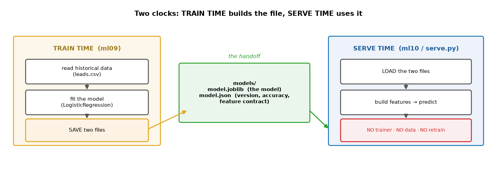
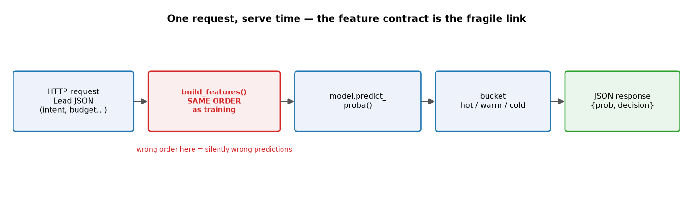
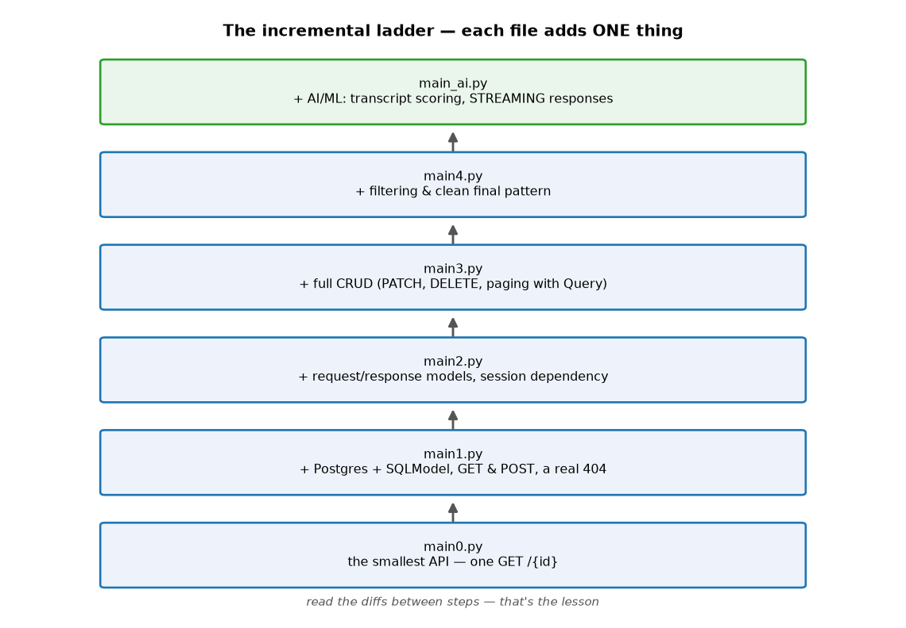
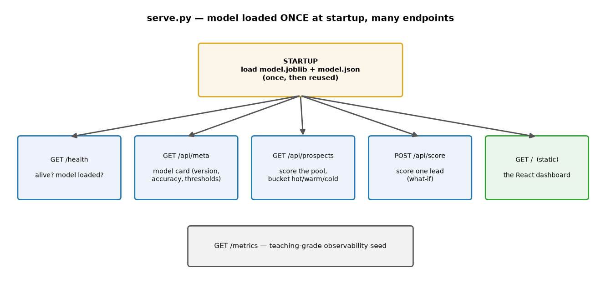
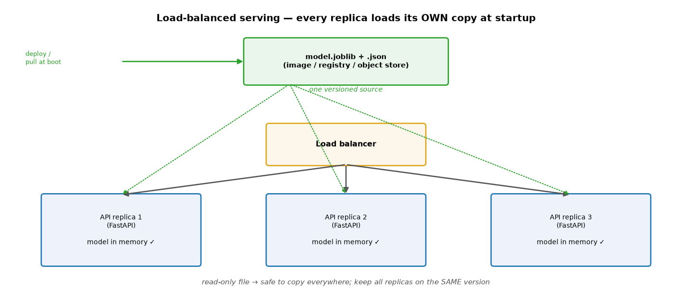

# ML Study 12 — Serving a Model: From File to API (FastAPI)

**Covers:** the gap between "a model in a notebook" and "a model other people can call" → **train time vs serve time** → **saving** a model (joblib + a metadata sidecar) → **loading and predicting** with no trainer and no data → the **feature contract** (the #1 serving bug) → **FastAPI** and the incremental `main0→main4` ladder → **wrapping the model in an API** (`serve_step1` → `serve`) → production thinking (small images, health, metrics, retraining).
**Goal:** turn a trained model into a live HTTP service, the way real systems do it. Studies 01–11 got you a *good model*; this is how it earns its keep — as something a website, another service, or a teammate can call and get an answer from.

**Series context:** the **deploy rung** of the course. Everything before this ends at "here's an accurate model object in memory." Real value starts when that object is a **file on disk** and an **endpoint on the network**. Companion code (no notebook — this is a *server*, you run it locally): the incremental files `main0.py … main4.py`, `main_ai.py`, and the model chain `ml09_train_and_save.py → ml10_load_and_predict.py → serve_step1.py → serve.py` in `hands-on/`.

---

## Part 1 — The gap: a model in a notebook is stranded

A trained model sitting in a notebook variable is useless to everyone except you, right now, in that kernel. To make it *do work*, two things have to happen — and they happen at **two different times, in two different programs**:

- **Train time** — read historical data, fit the model, and **save it to a file**. Runs occasionally (once a week, once a month).
- **Serve time** — **load that file** and answer prediction requests. Runs constantly, and **never touches the training data or the trainer again**.


*What this shows: train time (`ml09`) reads `leads.csv`, fits, and writes two files to `models/`. Serve time (`ml10` / `serve.py`) **loads** those files and predicts — no scikit-learn trainer, no CSV, no retraining. The **model file is the entire handoff** between the two worlds. Getting this separation is the whole mental model of deployment.*

> **Why separate them?** Training is slow, needs the data and the full ML toolchain, and happens rarely. Serving must be fast, tiny, and always-on. Bolting them together means every prediction drags the training machinery along — slow, bloated, and fragile. Keep them apart and each stays simple.

---

## Part 2 — Saving a model *is* just writing a file

"Save the model" sounds mysterious; it's one line. This is the actual save code from `ml09_train_and_save.py` — train, evaluate, then **write two files**:

```python
import json, joblib
from datetime import datetime, timezone
from pathlib import Path
from sklearn.linear_model import LogisticRegression
from sklearn.model_selection import train_test_split

FEATURES = ["intent_signal", "budget", "prior_purchases", "ad_tv", "ad_social", "ad_email"]
MODEL_PATH = Path("models/lead_model.joblib")   # the model itself
META_PATH  = Path("models/lead_model.json")     # the metadata sidecar

# 1) train
train, test = train_test_split(df, test_size=0.2, random_state=42, stratify=df["converted"])
model = LogisticRegression(max_iter=2000)
model.fit(train[FEATURES].values, train["converted"])
accuracy = model.score(test[FEATURES].values, test["converted"])   # honest held-out accuracy

# 2) SAVE the model to a file  ← this is the whole "persist the model" step
MODEL_PATH.parent.mkdir(exist_ok=True)
joblib.dump(model, MODEL_PATH)                  # serialize the fitted model → bytes on disk

# 3) SAVE the metadata sidecar next to it
metadata = {
    "model_version": "1.0",
    "model_type": "LogisticRegression",
    "trained_at": datetime.now(timezone.utc).isoformat(timespec="seconds"),
    "test_accuracy": round(accuracy, 4),
    "features": FEATURES,          # the feature contract (Part 4)
    "training_rows": len(train),
}
META_PATH.write_text(json.dumps(metadata, indent=2))
```

**`joblib.dump(model, path)`** is the line that saves the model — **joblib** (or `pickle`) serializes the fitted model's learned weights/coefficients to bytes on disk. That file *is* the model, portable to any machine.

The second file is the **metadata sidecar** — the model's **ID card**:

```json
{ "model_version": "1.0", "model_type": "LogisticRegression",
  "test_accuracy": 0.82, "features": ["intent_signal","budget","prior_purchases","ad_tv","ad_social","ad_email"],
  "trained_at": "2026-08-10T...", "training_rows": 1600 }
```

Which version, how accurate, when trained, and — critically — **the exact feature list and order** (Part 4). Serve time reads it to know what it's running and to build inputs correctly.

---

## Part 3 — Loading and predicting: notice what's *missing*

`ml10_load_and_predict.py` is a **separate program**. Read it for what it does *not* do:

```python
model = joblib.load("models/lead_model.joblib")   # load the file
prob  = model.predict_proba([features])[0][1]      # predict
```

- It does **not** import scikit-learn's trainers.
- It does **not** read `leads.csv`.
- It does **not** retrain anything.

It loads a file and predicts. **That is exactly what a serving API does** — `serve.py` is this same code wrapped in HTTP. If you understand `ml10`, you already understand serving; the rest is plumbing.

---

## Part 4 — The feature contract (the #1 serving bug)

Here is the mistake that silently breaks real ML systems. A model doesn't see column *names* — it sees a list of numbers **in a fixed order**. Training built that order; serving must reproduce it **exactly**.

`ml09` declares the contract, and both `ml10` and `serve.py` honor it in `build_features()`:

```python
FEATURES = ["intent_signal", "budget", "prior_purchases", "ad_tv", "ad_social", "ad_email"]
# build_features must return values in THIS order, every time.
```


*What this shows: a request becomes a feature vector via `build_features()`, then `predict_proba`, then a hot/warm/cold bucket, then JSON out. If `build_features()` puts `budget` where the model expects `intent_signal`, there's **no error** — you just get confidently wrong answers. That's why the feature order lives in the metadata and is treated as a contract.*

> **The teaching moment:** a wrong feature order doesn't crash. The API returns 200 OK with garbage predictions. The metadata sidecar's `features` list is the written contract that keeps train time and serve time in sync.

---

## Part 5 — FastAPI in 60 seconds, and the incremental ladder

**FastAPI** turns a Python function into a web endpoint. The smallest possible app is `main0.py`:

```python
from fastapi import FastAPI
app = FastAPI()

@app.get("/{id}")
async def welcome(id: int):          # FastAPI converts the URL value to int, validates it
    return {"message": f"Hi, my id is, {id}"}
```

Run it: `uvicorn main0:app --reload`, then open `http://127.0.0.1:8000/5` (and `/docs` for auto-generated Swagger). A URL called a Python function and got JSON back — that's the whole idea.

From there, the course adds **one concept per file** — the incremental-build methodology. Read the *diffs* between steps; each diff is a lesson.



| File | Adds |
|---|---|
| `main0.py` | the smallest API — one `GET /{id}` with automatic type conversion |
| `main1.py` | + Postgres & SQLModel, a `Student` table, `GET`/`POST`, a real `404` |
| `main2.py` | + separate request/response models, session **dependency injection** |
| `main3.py` | + full **CRUD** — `PATCH`, `DELETE`, paging with `Query` |
| `main4.py` | + filtering and the clean final pattern |
| `main_ai.py` | + AI/ML: transcript scoring and **streaming** responses (the bridge to LLM serving) |

*Why teach it as a ladder? Each file is small enough to hold in your head, and the change from one to the next is the actual concept. It's the same idea as the ML `hello_*` scripts — build understanding by increments, not by dropping a 300-line app on day one.*

---

## Part 6 — Wrapping the model in an API

Now combine the two halves. `serve_step1.py` is `ml10` (load + predict) with an HTTP endpoint bolted on — the **minimum viable model API**:

```python
model = joblib.load("models/prospect_model.joblib")   # load once, at import

@app.post("/api/score")
def score(lead: Lead) -> ScoredLead:
    prob = float(model.predict_proba([build_features(lead)])[0][1])
    decision = "hot" if prob >= 0.66 else "warm" if prob >= 0.33 else "cold"
    return ScoredLead(probability=round(prob, 4), decision=decision)
```

Run `uvicorn serve_step1:app --reload` and open **`/docs`** — Swagger gives you a live form to POST a lead and see the score. No UI yet; just the API and its auto-docs. A **Pydantic** `Lead` model validates the incoming JSON for free (bad input → a clean `422`, not a crash).

---

## Part 7 — A real API: `serve.py`

`serve.py` is the production shape of the same idea — the model loaded **once at startup** and reused for every request, behind several endpoints:



- **`GET /health`** — is the process alive and the model loaded? (readiness — what a load balancer pings)
- **`GET /api/meta`** — the model card: version, accuracy, thresholds (straight from the metadata sidecar)
- **`GET /api/prospects?limit=N`** — score a whole pool of leads, bucket them hot/warm/cold, sort hottest-first
- **`POST /api/score`** — score one lead (the "what-if" form)
- **`GET /metrics`** — a teaching-grade observability snapshot (the seed of real monitoring)
- **`GET /`** — serve the React dashboard (`StaticFiles`) so a human can click around

*Load-once-at-startup matters: unpickling a model is comparatively slow, so you pay it a single time when the server boots, not on every request. Each request is then just `build_features → predict → respond` — fast.*

---

## Part 7½ — The model in a load-balanced deployment

Real traffic doesn't hit one server — a **load balancer** spreads requests across **many identical replicas**. So the natural question: *does every server have its own copy of the model file?*

**Yes — and that's the correct design.** Each replica loads its **own copy of the model into its own memory at startup** (the load-once from Part 7, per replica). The model is a small read-only file, so copying it everywhere is cheap and safe.


*What this shows: one **versioned source** of the model (baked into the container image, or pulled from a registry / object store) fans out to N API replicas. The load balancer routes each request to any replica; that replica already has the model in memory and answers locally. No per-request network hop to fetch the model.*

**Why a local copy per replica, not one shared model?**
- **It's read-only at serve time.** Nobody writes to the model file during inference — so replicating it across servers has **no sync, no locking, no consistency problem** (unlike a database, which is why the database *is* shared but the model *isn't*).
- **No single point of failure / no network hop.** A shared/networked model file would add latency to every prediction and a component that can take all replicas down at once. A local in-memory copy keeps each replica self-sufficient and fast.
- **It's small.** A joblib model is kilobytes-to-megabytes; duplicating it across 3 or 300 replicas costs almost nothing.

**How the file actually gets onto every server** — three common patterns:

| Pattern | How each replica gets the model | Trade-off |
|---|---|---|
| **Baked into the image** (simplest) | `COPY models/ /app/models/` in the Dockerfile → every replica runs the same image | Immutable & version-locked to the image; retraining = rebuild + redeploy |
| **Object store / shared storage** (S3, GCS, blob) | replica downloads the file at startup into local memory | Update the model without rebuilding the image; needs a versioned pointer |
| **Model registry** (MLflow, SageMaker, Vertex) | replica pulls the referenced "production" version at startup | Adds governance — which version is live, rollbacks, lineage |

> **The one rule that matters: version consistency.** All replicas must serve the **same model version at the same time** — otherwise the *same request* could get *different answers* depending on which server it lands on. Baking into the image guarantees this (all replicas = the same image). With object store / registry, you need a coordinated rollout (update the version pointer, then roll replicas) so you never mix versions mid-flight. This is where the **metadata sidecar's `model_version`** earns its keep — `/api/meta` lets you check *which* version a given replica is actually running.

*(A fourth pattern for large models — a dedicated **model server** like Triton/TorchServe that the thin API replicas call over the network — centralizes the model instead of copying it. Overkill for a small tabular model; standard for big deep-learning models.)*

---

## Part 8 — Production thinking (why this isn't just `pickle` + Flask)

- **Separate serve dependencies.** `requirements-serve.txt` contains *only* what inference needs (web framework, server, pandas, scikit-learn + joblib) — **not** the Postgres drivers or the training stack (xgboost, etc.). Smaller image → faster deploys, smaller attack surface, fewer things to break.
- **No retraining at serve time.** Training is a separate, scheduled job. The API only ever *reads* the model file.
- **Health & readiness.** `/health` answers "am I alive and is the model loaded?" — the hook every orchestrator (Kubernetes, a load balancer) needs.
- **Observability seed.** `/metrics` is where request counts, latencies, and score distributions live — the beginning of "is the model still behaving in production?"
- **The next step up.** Containerize (`Dockerfile` + `docker-compose.yml` are in `hands-on/`), then deploy the image to a cloud runtime (Azure OpenAI / Bedrock / Vertex, or any container host). The serving code doesn't change — that's the payoff of the train/serve split.

> **Honest scope:** this is a *teaching-grade* serving stack — enough to understand every moving part and deploy a real model. Production at scale adds authentication, rate limiting, model registries, canary rollouts, and real monitoring (Prometheus/Grafana). The mental model here — file handoff, feature contract, load-once, separate deps — is exactly the same at any scale.

---

## Run it (local)

```bash
cd hands-on
source venv/bin/activate
pip install -r requirements-serve.txt          # uvicorn + inference deps

python ml09_train_and_save.py                  # TRAIN TIME → writes models/
python ml10_load_and_predict.py                # PREDICT TIME → loads + predicts, no retrain
python ml11_train_and_save_prospect_model.py   # save the model the API serves

uvicorn serve_step1:app --reload               # minimal API → http://127.0.0.1:8000/docs
uvicorn serve:app --reload                      # full API + dashboard → http://127.0.0.1:8000
```

*(Run `ml09`/`ml11` before the servers — they create `models/`. Stop a server with Ctrl+C.)*

---

## Quick reference

| Term | Meaning |
|---|---|
| Train time | read data, fit, **save** the model file (occasional job) |
| Serve time | **load** the file, predict on requests (always-on) — no trainer, no data, no retrain |
| joblib / pickle | serialize a fitted model to a file on disk |
| Metadata sidecar | the model's ID card: version, accuracy, and the **feature contract** |
| Feature contract | features built in the **exact training order** — wrong order = silent bad predictions |
| FastAPI | turns a Python function into a validated web endpoint (+ Swagger at `/docs`) |
| Pydantic model | validates incoming JSON automatically (bad input → `422`) |
| Load-once | unpickle the model at startup, reuse for every request |
| `/health`, `/metrics` | readiness + the observability seed for production |

*ML Study 12 — Serving a model: train time saves a file (joblib + metadata sidecar); serve time loads it and predicts with no trainer, no data, no retraining; the feature contract keeps the two in sync; FastAPI (`main0→main4` incremental ladder) exposes it over HTTP; `serve_step1→serve` wraps the model in a real API with load-once, health, and metrics. Companion code: `hands-on/` (`ml09→ml10`, `serve_step1→serve`, `main0→main_ai`).*
