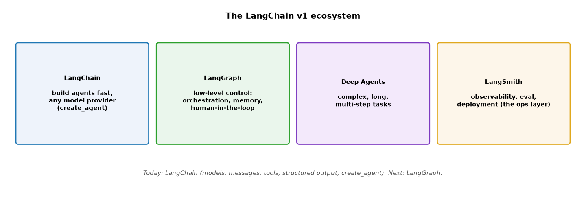
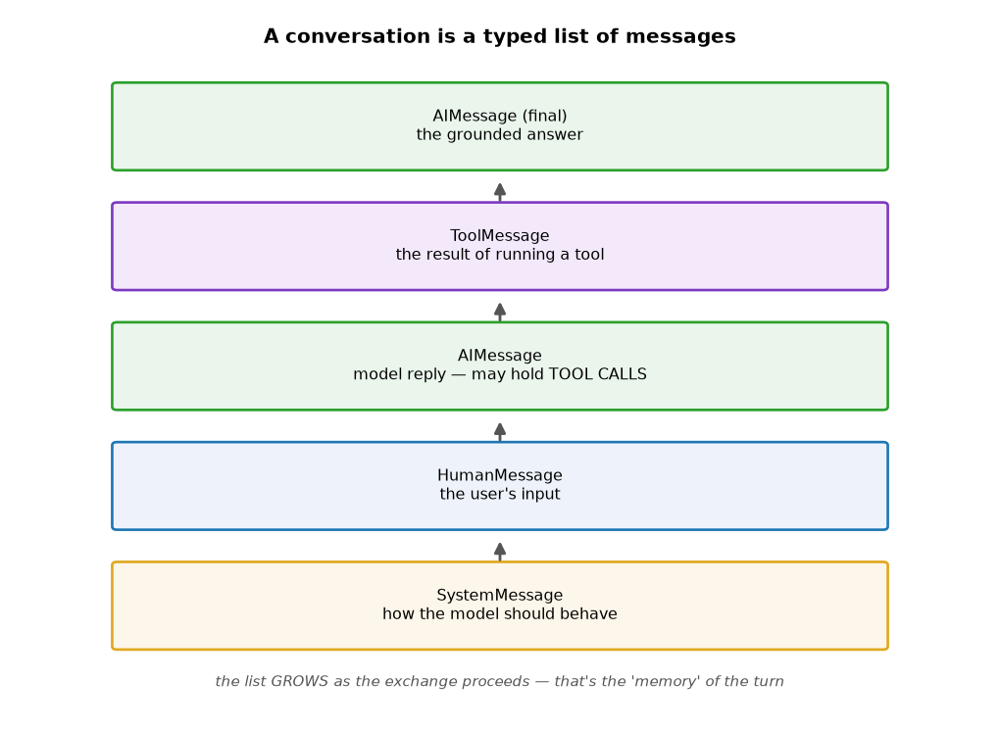
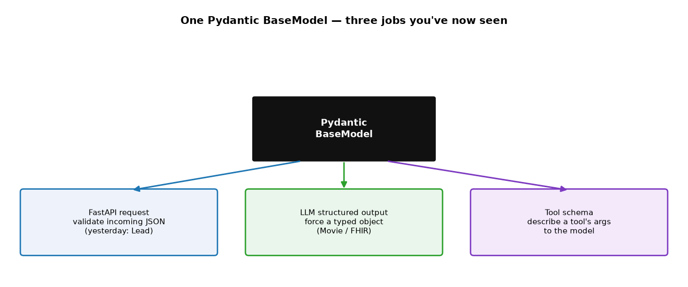
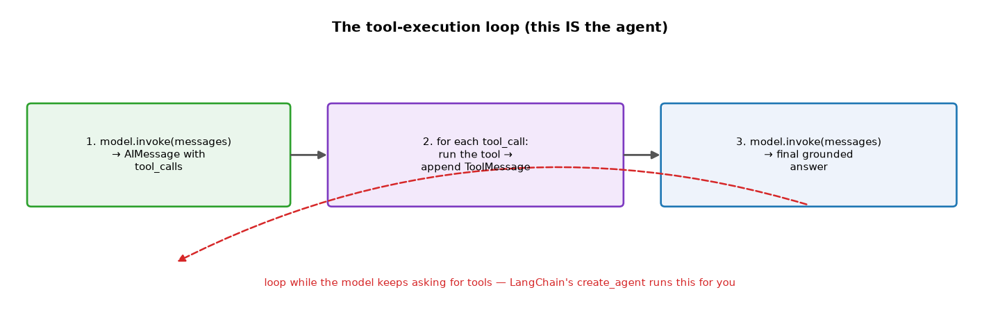
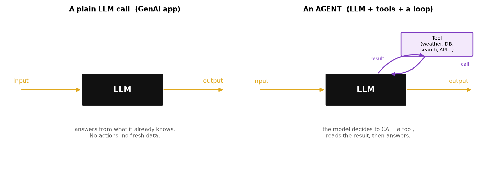
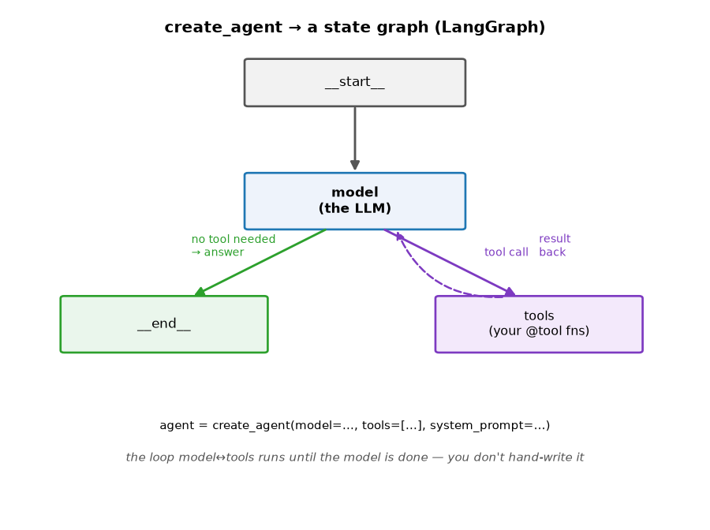
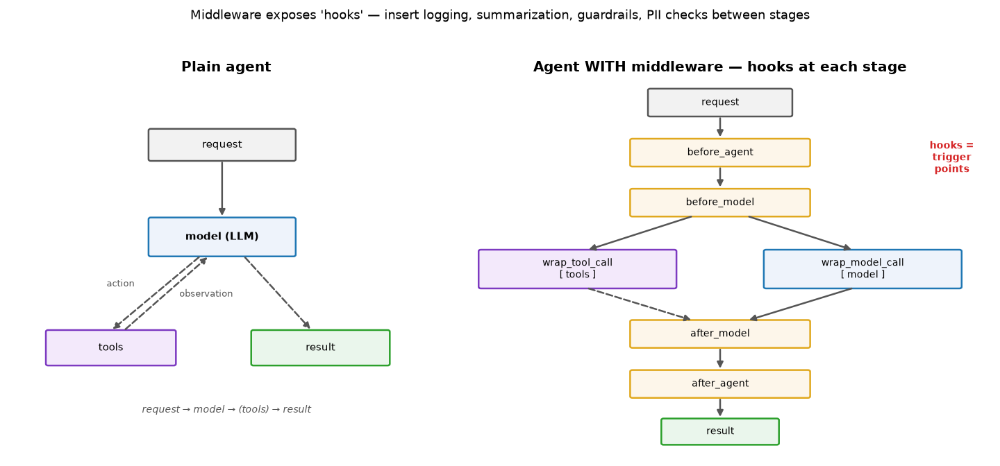

# ML Study 13 — LangChain & Agents: From an LLM Call to a Tool-Using Agent

**Covers:** what LangChain is (and the v1 ecosystem) → `uv` setup → talking to a model (`init_chat_model`, `.invoke`) → streaming & batch → **messages** (System/Human/AI/Tool) → **structured output with Pydantic** → **tools** and the tool-execution loop → **agents** (`create_agent`) and why the loop *is* the agent → **middleware** (hooks, summarization, guardrails) → where it goes next (LangGraph, MCP, human-in-the-loop).
**Goal:** go from "call an LLM once" to "an LLM that decides to use tools and acts" — the definition of an **agent** — and see how it connects to the FastAPI + Pydantic serving you already built.

**Series context:** the **LLM-app + agent rungs** (R4 + R6). In [Study 12](ML_Study_12_Serving_Models_FastAPI.html) a *classical* model is served over FastAPI, using **Pydantic** to validate requests. Here the model *is* an LLM, and Pydantic does a second job — shaping the LLM's output. Companion notebooks: the `updatedlangchain` set (`1-intro` → `5-structuredoutput`).

---

## Part 1 — What is LangChain?

**Definition.** **LangChain** is a framework that gives you *one consistent way* to build LLM applications — talk to any model provider, manage the conversation, call tools, get structured output, and assemble **agents** — without rewriting your code for each provider.

Why it exists: raw provider SDKs (OpenAI, Anthropic, Google, Groq) all differ. LangChain puts a **standard interface** on top, so `model.invoke("...")` works the same whether the model behind it is Claude, GPT, Gemini, or a Groq-hosted open model.

The **v1 ecosystem** has four pieces — know what each is for:


*What this shows: **LangChain** = build agents fast. **LangGraph** = low-level control — orchestration, memory, human-in-the-loop. **Deep Agents** = long, complex, multi-step tasks. **LangSmith** = the ops layer — observability, evaluation, deployment. LangChain covers the fundamentals; LangGraph is where a production agent's orchestration lives.*

> **The one-line frame:** *"An LLM answers. An **agent** answers **and acts** — it can call tools, read the results, and decide what to do next. LangChain is how we build both."*

---

## Part 2 — Setup with `uv` (the fast package manager)

**`uv`** is a fast Python package/project manager (written in Rust) — a drop-in for `pip` + `venv` + `virtualenv`. Same concepts you already know, faster.

```bash
uv init                       # initialize the project (creates pyproject.toml, .python-version)
uv venv                       # create a virtual environment (.venv)
.venv\Scripts\activate        # (Windows)   or:  source .venv/bin/activate   (macOS/Linux)
uv add -r requirements.txt    # install everything in requirements.txt (like pip install -r)
```

A minimal `requirements.txt` for this session:
```
langchain
langchain-community
langchain-openai
langchain-groq
langchain-google-genai
python-dotenv
```

*Note: this is the same "env + requirements" discipline from the FastAPI setup — `uv` just does it in milliseconds. Keep API keys in a `.env` file, never in code.*

---

## Part 3 — Talking to a model: one API, many providers

The core call is **`init_chat_model`** → **`.invoke(...)`**:

```python
import os
from langchain.chat_models import init_chat_model

model = init_chat_model("groq:qwen/qwen3-32b")     # provider:model
response = model.invoke("Why do parrots talk?")
response                                            # → an AIMessage
```

Swap the string, swap the provider — **the rest of your code doesn't change**:
```python
init_chat_model("openai:gpt-4.1")
init_chat_model("google_genai:gemini-2.5-flash-lite")
init_chat_model("anthropic:claude-opus-4-8")       # ← our course default (best + latest)
```

> **Definition — `invoke`:** send input, get one complete response back (an `AIMessage`). This is the LLM equivalent of `model.predict()` from the classical days — you call a function and get an answer. The difference: the "model" is a language model, and the answer is text (plus metadata).

*Model note: Groq (free, fast) and OpenAI both work; for production AI engineering, default to **Claude** (`claude-opus-4-8`). The code is identical — that's the whole point of LangChain.*

---

## Part 4 — Streaming & batch

Two ways to call a model beyond a single `invoke`:

- **`.stream()`** — get the answer **token-by-token as it's generated**. Better UX for long answers (the user sees words appear instead of waiting).
  ```python
  for chunk in model.stream("Write a 200-word paragraph on AI"):
      print(chunk.text, end="", flush=True)
  ```
  *(This is exactly the streaming you saw in `main_ai.py` on the FastAPI ladder.)*
- **`.batch()`** — send **many prompts at once**, processed in parallel. Faster and cheaper for independent requests.
  ```python
  responses = model.batch(["Why are feathers colorful?", "How do planes fly?", "What is quantum computing?"])
  ```

> **Business framing:** streaming = *responsiveness* (perceived speed); batch = *throughput + cost* (do 100 scorings in one shot). Both are levers you pull on purpose.

---

## Part 5 — Messages: the conversation as a typed list

A real chat isn't one string — it's a **list of typed messages**. LangChain gives you four types:

| Message type | What it is |
|---|---|
| **SystemMessage** | instructions that set the model's behavior/role ("You are a helpful assistant") |
| **HumanMessage** | the user's input |
| **AIMessage** | the model's reply — **may contain tool calls** |
| **ToolMessage** | the **result** of running a tool, passed back to the model |

```python
from langchain.messages import SystemMessage, HumanMessage, AIMessage
messages = [
    SystemMessage("You are a concise travel assistant."),
    HumanMessage("Suggest one thing to do in Denver."),
]
model.invoke(messages)
```


*What this shows: the message list **grows** through an exchange — system sets behavior, human asks, the AI may ask for a tool, a ToolMessage carries the result back, and a final AIMessage answers. This list is the "memory" of the turn — and it's exactly what an agent loops over.*

---

## Part 6 — Structured output with Pydantic (the bridge from serving)

By default an LLM returns free text. Often you need a **typed object** you can use in code — this is where **Pydantic** returns.

**Definition — Pydantic `BaseModel`:** a Python class that declares typed fields (with validation and descriptions). You've already used it twice — now a third time.

```python
from pydantic import BaseModel, Field

class Movie(BaseModel):
    title: str = Field(description="The title of the movie")
    year: int = Field(description="The year the movie was released")
    director: str = Field(description="The director of the movie")
    rating: float = Field(description="The movie's rating out of 10")

model_with_structure = model.with_structured_output(Movie)
model_with_structure.invoke("Provide details about the movie Inception")
# → Movie(title='Inception', year=2010, director='Christopher Nolan', rating=8.8)
```

**Nested structures** work too — a model can contain a list of other models:
```python
class Actor(BaseModel):
    name: str
    role: str

class MovieDetails(BaseModel):
    title: str
    year: int
    cast: list[Actor]
    genres: list[str]
    budget: float | None = Field(None, description="Budget in millions USD")
```


*What this shows — the bridge from the serving lesson: the **same** `BaseModel` does three jobs. (1) **FastAPI** validates an incoming request (the serving lesson's `Lead`). (2) **LLM structured output** forces the model to return a typed object (`Movie`). (3) **Tool schema** describes a tool's arguments to the model (next part). Learn Pydantic once; use it everywhere.*

> **The bridge:** the same Pydantic that validated a FastAPI request now forces an LLM to hand back clean, typed data instead of a paragraph you'd have to parse — same tool, new job.

---

## Part 7 — Tools: giving the model hands

**Definition — a tool** is a pairing of (1) a **schema** (name, description, argument types — often JSON) and (2) a **function to execute**. The model reads the schema, decides when to call it, and supplies the arguments.

```python
from langchain.tools import tool

@tool
def get_weather(location: str) -> str:
    """Get the weather at a location."""      # the docstring IS the description the model reads
    return f"It's sunny in {location}"
```

The model doesn't run the tool — **your code does**. The **tool-execution loop** is three steps:



```python
# Step 1: the model generates tool calls
messages = [{"role": "user", "content": "What's the weather in Boston?"}]
ai_msg = model_with_tools.invoke(messages)
messages.append(ai_msg)

# Step 2: execute each requested tool, append the result
for tool_call in ai_msg.tool_calls:
    tool_result = get_weather.invoke(tool_call)
    messages.append(tool_result)                 # a ToolMessage

# Step 3: pass results back → final grounded answer
final = model_with_tools.invoke(messages)
print(final.text)   # "The current weather in Boston is 72°F and sunny."
```

> **The key idea:** the model *asks* for a tool; your code runs it and feeds the result back; the model answers using that result. Loop while it keeps asking. **That loop is what makes something an agent.**

---

## Part 8 — Agents: the loop, wrapped

Now put it together. An **agent** = **an LLM + tools + the loop** that lets it decide, act, and repeat until done.


*What this shows: a plain LLM answers from what it knows (left). An agent (right) can **call a tool**, read the result, and then answer — it can reach fresh data and take actions. That's the whole difference.*

You *could* hand-write the loop from Part 7. LangChain gives you **`create_agent`** to do it for you:

```python
from langchain.agents import create_agent

def get_weather(city: str) -> str:
    """Get the weather for a city."""
    return f"The weather in {city} is sunny."

agent = create_agent(
    model="claude-opus-4-8",                      # (video uses gpt-5; use Claude for the course)
    tools=[get_weather],
    system_prompt="You are a helpful assistant.",
)
agent.invoke({"messages": [{"role": "user", "content": "What is the weather in New York?"}]})
```

Under the hood, `create_agent` builds a **state graph** (this is **LangGraph**):


*What this shows: start → **model**. If the model needs no tool, it goes to **end** (answer). If it emits a tool call, it goes to **tools**, runs them, and loops the result back to the model. It repeats until the model is done. `create_agent` runs this loop so you don't hand-write it — but it's the exact loop from Part 7.*

> **Tie to your world:** this loop is the shape of CSI's *observe → plan → act → evaluate → learn*, and of the capstone triage agent. An agent is not magic — it's the tool loop with a graph around it.

---

## Part 8½ — Middleware: controlling what happens inside the agent

A bare agent runs `request → model → tools → result`. **Middleware** lets you **tightly control what happens inside that loop** — inserting your own logic at each stage. It's the difference between an agent and a *production* agent. Middleware is useful for:

- **Observability** — logging, analytics, debugging of the agent's behavior.
- **Transformation** — reshaping prompts, tool selection, or output formatting.
- **Reliability** — retries, fallbacks, early-termination logic.
- **Safety** — rate limits, **guardrails**, and **PII detection**.

**The airport-security analogy:** a passenger doesn't walk straight onto the plane. They pass through **checkpoints** — security check → immigration → boarding pass → flight. Each checkpoint is a piece of middleware between "passenger" (request) and "flight" (result). You can add as many as you need.

Technically, middleware exposes **hooks** — trigger points you can attach logic to:


*What this shows: the plain agent (left) is just request→model→tools→result. With middleware (right), the agent exposes hooks — **before_agent, before_model, wrap_model_call, wrap_tool_call, after_model, after_agent** — where you can insert logging, summarization, guardrails, or PII checks. Same agent, now controllable at every stage.*

### Built-in middleware (you rarely write your own)

LangChain ships **provider-agnostic** middleware for common needs — just drop them into `create_agent(..., middleware=[...])`:

| Middleware | What it does |
|---|---|
| **Summarization** | auto-summarize conversation history as it approaches token limits |
| **Human-in-the-loop** | pause for human approval before a tool call (mandatory in healthcare/finance) |
| **Model call limit** | cap the number of model calls — prevents runaway cost |
| **Tool call limit** | cap tool executions |
| **Model fallback** | switch to a backup model if the primary fails |
| **PII detection** | detect & handle personally-identifiable information |
| **LLM tool selector** | use an LLM to pick relevant tools before the main call |
| **Tool / model retry** | retry on transient failures |

### Example: Summarization middleware (the memory fix)

A long conversation eventually blows past the model's context window. **Summarization middleware** watches the running history and, when it hits a threshold, **compresses older messages into a summary while keeping the recent ones**:

```python
from langchain.agents import create_agent
from langchain.agents.middleware import SummarizationMiddleware
from langchain.checkpoint.memory import InMemorySaver

agent = create_agent(
    model="claude-opus-4-8",                  # (video uses gpt-4o-mini)
    checkpointer=InMemorySaver(),             # remembers the conversation across turns
    middleware=[
        SummarizationMiddleware(
            model="claude-opus-4-8",
            trigger=("messages", 10),         # when history reaches 10 messages…
            keep=("messages", 4),             # …summarize, keeping the last 4
        ),
    ],
)
config = {"configurable": {"thread_id": "test-1"}}   # a conversation id for memory
```

Run a stream of questions and watch the message count climb — `2, 4, 6, 8, 10` — then, at the trigger, the middleware replaces the old messages with a summary (*"Here is a summary of the conversation to date…"*) and the count drops back down. The **LLM does the summarizing**, automatically, without you touching the loop. (You can also trigger on **tokens** — e.g. `trigger=("tokens", 550), keep=("tokens", 200)`.)

> **Why this matters:** `checkpointer` (here `InMemorySaver`) is what gives an agent **memory** across turns; `thread_id` names the conversation. Summarization middleware then keeps that memory from overflowing — a real production concern, solved by dropping one line into the agent.

---

## Part 9 — Where this goes next

This covered LangChain fundamentals. The rest of the arc — **the next two docs build both of these as code**:

- **LangGraph** ([Study 13a](ML_Study_13a_LangGraph.html)) — when you need real control: branching, **memory** across turns, **human-in-the-loop** approval (mandatory in healthcare/finance), multi-step state. That doc opens up the box `create_agent` builds and rebuilds the ReAct loop from primitives.
- **MCP (Model Context Protocol)** ([Study 13b](ML_Study_13b_MCP.html)) — a standard way to expose tools/data to the model, so a tool written once (by you or a third party) plugs into any agent.
- **Multi-agent** — several agents (planner → executor → reviewer) collaborating.
- **Deployment** — the agent behind a FastAPI endpoint (Study 12) → containerized → cloud. Same serving discipline as any model.
- **Observability & eval (LangSmith)** — because an agent that acts must be watched and measured.

> **The through-line:** classical model → serve it (Study 12) → LLM app → tools → **agent** → orchestrate + govern it. Each step adds one capability to the same production spine.

---

## Quick reference / glossary

| Term | Meaning |
|---|---|
| LangChain | framework for building LLM apps with a consistent interface across providers |
| `init_chat_model("provider:model")` | get a model object; swap the string to swap providers |
| `.invoke()` / `.stream()` / `.batch()` | one response / token-by-token / many prompts in parallel |
| Message types | **System** (behavior), **Human** (input), **AI** (reply, may hold tool calls), **Tool** (tool result) |
| Structured output | `model.with_structured_output(PydanticModel)` → a typed object, not free text |
| Pydantic `BaseModel` | typed, validated schema — used for FastAPI requests, LLM output, and tool args |
| Tool | a schema + a function the model can choose to call |
| Tool-execution loop | model asks → run tool → feed result back → answer; repeat |
| Agent | **LLM + tools + the loop** — answers *and* acts |
| `create_agent(model, tools, system_prompt)` | builds the agent (a LangGraph state graph) for you |
| LangGraph | low-level orchestration: control, memory, human-in-the-loop |

*ML Study 13 — LangChain & Agents: one interface over any provider (`init_chat_model` → `invoke/stream/batch`); a conversation is a typed message list (System/Human/AI/Tool); **Pydantic** shapes structured output (the bridge from FastAPI); a **tool** is a schema + function; the **tool-execution loop** (ask → run → feed back → answer) is what makes an **agent**; `create_agent` wraps that loop as a LangGraph state graph. Next: LangGraph, MCP, human-in-the-loop.*
