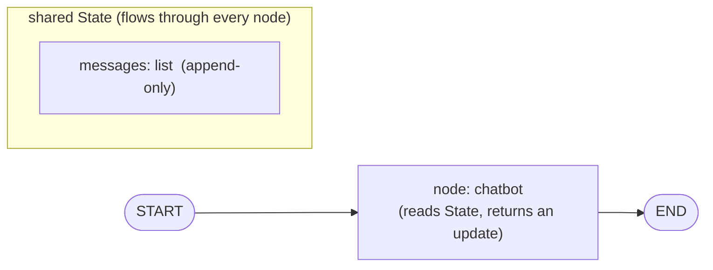
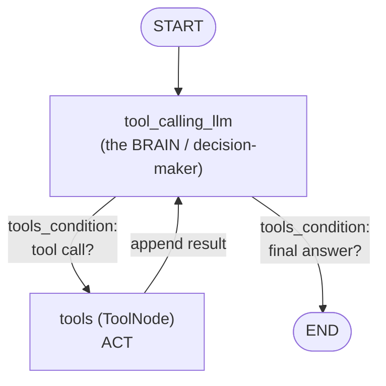
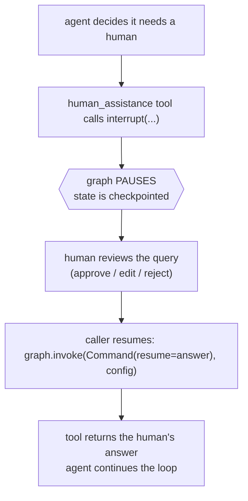

# ML Study 13a — LangGraph: Building the Agent Loop by Hand (State, Nodes, ReAct, Memory, Streaming, Human-in-the-Loop)

**Covers:** why drop below `create_agent` → the **graph model** (`State` = `TypedDict` + `add_messages` reducer, nodes, edges, `StateGraph`, `.compile()`) → a **basic chatbot** graph → adding tools with `ToolNode` + `tools_condition` → the **ReAct loop** built by hand → **memory** across turns (`MemorySaver` + `thread_id`) → **streaming** (`values` vs `updates` vs token-level `astream_events`) → **human-in-the-loop** (`interrupt` / `Command`).
**Goal:** open up the box that [Study 13](ML_Study_13_LangChain_Agents.html)'s `create_agent` builds for you. You already have an agent that works; here you build the *same* agent from primitives, so when a production requirement (approval gates, custom branching, streamed tokens, persisted memory) doesn't fit the high-level helper, you can drop one level and control it.

**Series context:** the **agent-orchestration rung** (R6, one level down). Study 13 gave you `create_agent(model, tools)` — the fast path. This is what that helper compiles to: a **LangGraph state graph**. Built from the second half of Krishna Naik's Agentic-AI walkthrough (the LangGraph section). Companion notebooks: `1-basicchatbot.ipynb`, `humanintheloop.ipynb`. Next: [Study 13b — MCP](ML_Study_13b_MCP.html).

---

## Part 1 — Why go below `create_agent`?

**The problem.** In Study 13, `create_agent(model, tools, system_prompt)` gave you a working agent in one line. That's the right default. But the moment a real requirement lands, you need the seams:

- *"Pause and get a human's approval before this tool runs."* (healthcare, finance, anything irreversible)
- *"Stream the answer token-by-token to the UI, not one blob at the end."*
- *"Remember the last three turns of this specific user's conversation."*
- *"After the search tool, branch to a different node depending on what it found."*

`create_agent` does all of this — because underneath it is **LangGraph**, and LangGraph exposes every one of those seams. Learning the primitives isn't busywork: it's how you read the [Study 13 ecosystem figure](ML_Study_13_LangChain_Agents.html) line "LangGraph = low-level control: orchestration, memory, human-in-the-loop" as *code you can write*, not a marketing bullet.

> **The one-line frame:** `create_agent` is the microwave dinner; LangGraph is the kitchen. Study 13 fed you fast. This is where you learn to cook when the menu doesn't have what the client ordered.

**The CS pattern.** LangGraph models your agent as a **directed graph of a shared state** — the same idea as a finite state machine or a dataflow graph. You define *what the state is*, *the nodes that transform it*, and *the edges that route between them*. Then you compile and run it. Everything else in this doc is a variation on that one structure.

---

## Part 2 — The three components: State, Nodes, Edges

A LangGraph program is exactly three things:



1. **State** — a shared dictionary that flows through the whole graph. *Every node can read it and write to it.* This is the "memory of the run" — how a value produced in one node becomes visible to the next.
2. **Nodes** — plain Python functions. Each takes the current state and returns an *update* to it. A node is "the work" (call the LLM, run a tool, summarize).
3. **Edges** — the wiring. They say "after this node, go to that node." Every graph starts at the special `START` node and finishes at `END`.

> **The one-line frame:** *"This entire graph we call a **state graph** — because it maintains the state at every node."* The state is the whole point. It's why the pattern is named after it.

### The State is a `TypedDict` — with a twist called a *reducer*

Here's the state for a chatbot. Read the annotation carefully — it's the one genuinely non-obvious line in all of LangGraph:

```python
from typing import Annotated
from typing_extensions import TypedDict
from langgraph.graph.message import add_messages

class State(TypedDict):
    # messages is a list. The `add_messages` annotation says HOW to update this
    # key: APPEND new messages, don't OVERWRITE the list.
    messages: Annotated[list, add_messages]
```

Why the `Annotated[list, add_messages]` and not just `list`? Because of what a conversation *is*. Turn 1: you say "hi," the bot replies "hello." Turn 2: you ask "what's your name?" You do **not** want turn 2 to *replace* turn 1's messages — you want it *appended*, so the full history survives.

`add_messages` is a **reducer**: a function that says how to merge a node's output into the existing state key. The default behavior for a state key is "overwrite." The `add_messages` reducer changes it to "append." That single annotation is the difference between a bot with memory-of-this-run and a bot that forgets every previous message.

> **The one-line frame:** a **reducer** answers "when a node returns a new value for this key, do I *replace* or *combine*?" `add_messages` = combine (append). Without it, your chatbot's history overwrites itself every turn.

---

## Part 3 — A basic chatbot graph (START → chatbot → END)

Now assemble the three parts. This is the "hello world" of LangGraph — one node that calls the LLM.

```python
import os
from dotenv import load_dotenv
from langchain.chat_models import init_chat_model

load_dotenv()
# One interface, any provider (Study 13, Part 3). Groq here; swap the string for OpenAI/Anthropic.
llm = init_chat_model("groq:llama-3.1-8b-instant")

# --- the node: a function State -> update ---
def chatbot(state: State):
    # Read the running history, ask the LLM, return the reply.
    # Because `messages` uses the add_messages reducer, this reply is APPENDED.
    return {"messages": [llm.invoke(state["messages"])]}
```

Read the node signature like a sentence: *takes the state, returns a `{"messages": [...]}` update.* The reducer does the appending — the node just hands back the new message.

```python
from langgraph.graph import StateGraph, START, END

graph_builder = StateGraph(State)          # the graph is typed by our State

graph_builder.add_node("chatbot", chatbot) # name -> function
graph_builder.add_edge(START, "chatbot")   # entry: START goes to chatbot
graph_builder.add_edge("chatbot", END)     # exit:  chatbot goes to END

graph = graph_builder.compile()            # MUST compile before you can run it
```

Two things worth naming:

- **`add_node("chatbot", chatbot)`** — the first arg is the *name* (a string you'll reference in edges); the second is the *function*. Don't confuse them: edges route by name, not by the function object.
- **`.compile()` is mandatory.** An uncompiled graph is a blueprint; compiling turns it into something runnable. *"Unless the graph is compiled, you cannot execute it."*

### See it and run it

```python
# Visualize — LangGraph renders itself as a Mermaid diagram
from IPython.display import Image, display
try:
    display(Image(graph.get_graph().draw_mermaid_png()))
except Exception:
    pass   # rendering needs extra deps; the graph still runs without it

# Run it
result = graph.invoke({"messages": [{"role": "user", "content": "Hi, who are you?"}]})
print(result["messages"][-1].content)
```

`graph.get_graph().draw_mermaid_png()` is a small gift: the graph draws its own topology. When your graph grows to a dozen nodes, this is how you verify the wiring matches your intent.

---

## Part 4 — Adding tools: the ReAct loop, built by hand

The basic chatbot can only talk. To let it *act* (search, calculate, call an API) you add tools — and this is where you rebuild, by hand, exactly what `create_agent` did for you in Study 13.

### Step 1 — bind the tools to the model

```python
from langchain_tavily import TavilySearch

tool = TavilySearch(max_results=2)
tools = [tool]

# bind_tools tells the LLM which tools exist and their schemas.
# The LLM can now RESPOND WITH a tool call instead of a final answer.
llm_with_tools = llm.bind_tools(tools)

def tool_calling_llm(state: State):
    return {"messages": [llm_with_tools.invoke(state["messages"])]}
```

`bind_tools` is the same move from Study 13, Part 7: the model now knows the tools' schemas and can *decide* to emit a tool call. Binding doesn't run anything — it just makes the tool call a possible output.

### Step 2 — add a node that *runs* the tools, and a router that *decides*

LangGraph ships two prebuilt helpers so you don't hand-write these:

```python
from langgraph.prebuilt import ToolNode, tools_condition

graph_builder = StateGraph(State)
graph_builder.add_node("tool_calling_llm", tool_calling_llm)
graph_builder.add_node("tools", ToolNode(tools))   # executes whatever tool the LLM asked for

graph_builder.add_edge(START, "tool_calling_llm")

# THE conditional edge: after the LLM node, look at its output.
#   - did it emit a tool call? -> go to "tools"
#   - did it give a final answer? -> go to END
graph_builder.add_conditional_edges("tool_calling_llm", tools_condition)

# after tools run, loop BACK to the LLM so it can read the results and continue
graph_builder.add_edge("tools", "tool_calling_llm")

graph = graph_builder.compile()
```

Two new primitives, both doing exactly what their names say:

- **`ToolNode(tools)`** — a node that reads the LLM's tool call from state, executes the matching function, and appends the result as a **Tool** message. It replaces the hand-written "look at `.tool_calls`, dispatch, feed the result back" loop from Study 13.
- **`tools_condition`** — a prebuilt **router function** for a *conditional edge*. A normal `add_edge` always goes to the same place; `add_conditional_edges` calls a function that *decides* the next node from the current state. `tools_condition` encodes the one decision that matters: "tool call → `tools`, otherwise → `END`."

### The shape this makes — this is ReAct



Trace one lap of the loop and you'll recognize it:

1. **Reason** — the LLM node looks at the conversation and decides: answer, or call a tool?
2. **Act** — if it chose a tool, `ToolNode` runs it.
3. **Observe** — the tool's result is appended to state and fed *back* to the LLM.
4. …the LLM reasons again with the new observation, and either loops or finishes.

That ACT → Observe → Reason cycle **is** the **ReAct** (Reason + Act) architecture. The LLM is the *brain* — it doesn't compute the answer to "what's the weather in New York," it *decides* to call the weather tool, reads the result, and speaks. The edges are the nervous system.

> **The one-line frame:** an **agent is a loop, and here is the loop.** `create_agent` in Study 13 compiled to exactly this graph. You just built the engine you were driving.

---

## Part 5 — Memory: remembering across turns

The graph above remembers within *one* `.invoke` (that's what the state is for). But call `.invoke` again and it starts blank — the state doesn't survive between runs. Production agents need to remember the *conversation*, across many calls. That's a **checkpointer**.

```python
from langgraph.checkpoint.memory import MemorySaver

memory = MemorySaver()                     # saves state after every node
graph = graph_builder.compile(checkpointer=memory)

# a thread_id names WHICH conversation this is
config = {"configurable": {"thread_id": "user-42"}}

graph.invoke({"messages": [{"role": "user", "content": "My name is Sunil."}]}, config)
graph.invoke({"messages": [{"role": "user", "content": "What's my name?"}]}, config)
# -> "Your name is Sunil." — because both calls share thread_id "user-42"
```

Two ideas, cleanly separated — don't merge them:

- **The checkpointer (`MemorySaver`)** is the *storage*: it snapshots the state after each node so a later call can resume it. `MemorySaver` keeps it in RAM (great for dev/tests); production swaps in a database-backed saver (Postgres, Redis) with the *same interface*.
- **The `thread_id`** is the *key*: it says which saved conversation you're continuing. Two users get two `thread_id`s and never see each other's history; the same user across two API calls uses one `thread_id` and gets continuity.

> **The one-line frame:** don't confuse **state** (memory *within* one run — that's the reducer's job) with **the checkpointer** (memory *across* runs, keyed by `thread_id`). Study 13's middleware summarization sat on top of exactly this.

---

## Part 6 — Streaming: watching the graph think

`.invoke` returns only the final state — the user stares at a spinner until it's all done. `.stream` emits progress as each node finishes, so a UI can render it live. LangGraph gives you two granularities plus a token-level firehose.

```python
# stream_mode="values" — after each node, get the FULL current state
for event in graph.stream({"messages": [{"role": "user", "content": "Search recent AI news"}]},
                          config, stream_mode="values"):
    event["messages"][-1].pretty_print()

# stream_mode="updates" — get only the DELTA each node produced (what changed)
for event in graph.stream(inputs, config, stream_mode="updates"):
    print(event)
```

Pick by what the consumer needs:

| mode | you get | use when |
|---|---|---|
| `"values"` | the **whole state** after each node | you want to re-render the full conversation each step |
| `"updates"` | only **what that node changed** | you want a log/trace of "node X produced Y" |

For a true typing-effect UI, you need *tokens*, not nodes. That's `astream_events`:

```python
async for event in graph.astream_events(inputs, config, version="v2"):
    if event["event"] == "on_chat_model_stream":
        print(event["data"]["chunk"].content, end="", flush=True)  # token by token
```

`astream_events` reaches *inside* the LLM node and surfaces each generated chunk (`on_chat_model_stream`) — the same character-by-character effect you see in ChatGPT. Reach for it only when you need token-level UX; `"values"`/`"updates"` are enough for most orchestration logging.

> **The one-line frame:** `values` = "show me everything so far," `updates` = "show me what just changed," `astream_events` = "show me every token as it's born." Three zoom levels on the same run.

---

## Part 7 — Human-in-the-loop: pausing for a person

This is the capability that makes LangGraph non-negotiable for regulated domains. *Some tool calls should not fire without a human saying yes* — issuing a refund, sending a clinical order, deleting records. LangGraph lets a graph **pause mid-run**, hand control to a person, and **resume** with their input.

The native primitives are `interrupt` (pause here) and `Command` (resume with this value):

```python
from langchain_core.tools import tool
from langgraph.types import Command, interrupt

@tool
def human_assistance(query: str) -> str:
    """Request help from a human."""
    # interrupt PAUSES the whole graph and surfaces `query` to the caller.
    # Execution stops here until someone resumes with a value.
    human_response = interrupt({"query": query})
    return human_response["data"]
```

The flow, and the two-call shape it forces on the caller:



```python
# 1) First call runs until the interrupt, then STOPS.
#    stream_mode="values" so you can see the interrupt surface.
for ev in graph.stream({"messages": [{"role": "user", "content": "Get expert help on X"}]},
                       config, stream_mode="values"):
    ev["messages"][-1].pretty_print()

# ... show ev's interrupt payload to a human, collect their answer ...

# 2) Second call RESUMES the same thread with the human's answer.
human_answer = "Approved — use approach B."
for ev in graph.stream(Command(resume={"data": human_answer}), config, stream_mode="values"):
    ev["messages"][-1].pretty_print()
```

Two production gotchas worth burning in:

- **Resume needs the same `config` (`thread_id`).** The pause is only resumable because the checkpointer (Part 5) saved the state. Human-in-the-loop *requires* a checkpointer — no memory, no pause to come back to.
- **Disable parallel tool calls** when interrupting. If the model fires several tool calls at once and one interrupts, resuming can *re-run the already-completed ones*. Force one-at-a-time (`llm.bind_tools(tools, parallel_tool_calls=False)`) so resume is clean.

> **The one-line frame:** Study 13's middleware gave you human-in-the-loop as a *hook*; this is the *primitive* underneath it — `interrupt` freezes the graph, `Command(resume=...)` thaws it. High-stakes actions get a person in the loop by construction, not by convention.

---

## Part 8 — Where this connects

You now have, as code you can modify, everything `create_agent` was hiding:

- **State + reducer** → memory within a run
- **Nodes + conditional edges** → the ReAct loop, branch-able
- **`ToolNode` + `tools_condition`** → the act/observe half of the loop
- **`MemorySaver` + `thread_id`** → memory across runs
- **`stream` / `astream_events`** → live UX
- **`interrupt` / `Command`** → governed, human-gated actions

The through-line back to your platform: this graph is what sits *behind a FastAPI endpoint* ([Study 12](ML_Study_12_Serving_Models_FastAPI.html)) — you `graph.invoke(...)` in the handler exactly as you called a classical model's `.predict(...)`. Same serving discipline, richer engine. The one thing still missing is **where the tools come from** when they live in another team's service or a third-party server — that's the **Model Context Protocol**, and it's next in [Study 13b](ML_Study_13b_MCP.html).

> **The through-line:** LLM call → tools → agent (Study 13) → **build the agent loop from primitives so you can govern it** (here) → standardize how tools are supplied (13b, MCP). Each rung adds control without changing the spine.

---

## Quick reference / glossary

| Term | Meaning |
|---|---|
| `StateGraph(State)` | the graph, typed by your State schema |
| `State` (`TypedDict`) | the shared dict that flows through every node |
| `Annotated[list, add_messages]` | a **reducer** — merge new messages by **appending**, not overwriting |
| reducer | function deciding replace-vs-combine when a node writes a state key |
| node | a function `State -> update`; the unit of work |
| `add_node("name", fn)` | register a node (name for edges, function for work) |
| edge | fixed wiring: after node A, go to node B |
| `add_conditional_edges(node, router)` | dynamic wiring: a function chooses the next node |
| `START` / `END` | the graph's fixed entry and exit |
| `.compile()` | turn the blueprint into a runnable graph (mandatory) |
| `bind_tools(tools)` | let the LLM emit tool calls (schemas attached) |
| `ToolNode(tools)` | node that executes the LLM's chosen tool, appends the result |
| `tools_condition` | prebuilt router: tool call → tools, else → END |
| ReAct | Reason + Act loop — the shape tools + conditional edge make |
| `MemorySaver` (checkpointer) | snapshots state after each node so runs can resume |
| `thread_id` | key naming *which* conversation to continue |
| `stream(..., stream_mode="values"/"updates")` | full state / deltas per node |
| `astream_events` | token-level stream (`on_chat_model_stream`) |
| `interrupt(payload)` | pause the graph, surface payload to a human |
| `Command(resume=value)` | resume a paused graph with the human's input |

*ML Study 13a — LangGraph is what `create_agent` compiles to: a **State** (a `TypedDict` whose `messages` key uses the `add_messages` **reducer** to append), **nodes** (functions `State→update`), and **edges** (`add_edge` fixed, `add_conditional_edges` dynamic via `tools_condition`); `ToolNode` + a conditional edge back to the LLM node **is** the ReAct loop; `MemorySaver` + `thread_id` add memory across runs; `stream`/`astream_events` add live UX; `interrupt`/`Command` add human-gated actions. Next: MCP (13b).*
