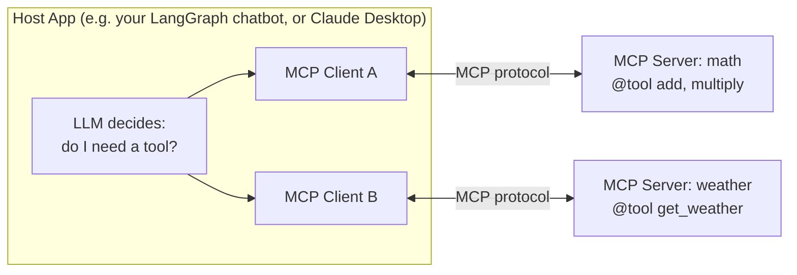
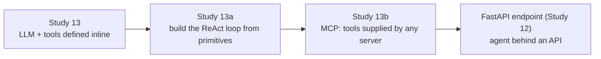

# ML Study 13b — MCP (Model Context Protocol): A Standard Plug for Tools

**Covers:** the problem MCP solves (every tool integration is bespoke) → the **three roles** (server, client, host app) → **building an MCP server** with `FastMCP` (`@mcp.tool()`) → **transports** (`stdio` vs `streamable-http`) and when to use each → a **client** that discovers tools with `MultiServerMCPClient` + `langchain-mcp-adapters` and hands them to a LangGraph agent (`create_react_agent`) → how this plugs back into everything from Study 13 / 13a.
**Goal:** stop hand-wiring tools into every agent. MCP is a *standard interface for tools* — the same idea LangChain applied to model providers, now applied to tools/data — so a tool written once (by you or a third party) is usable by any MCP-aware app.

**Series context:** the **tool-supply rung**. [Study 13](ML_Study_13_LangChain_Agents.html) defined tools inline; [Study 13a](ML_Study_13a_LangGraph.html) wired them into the ReAct loop by hand. Both assume the tool lives *in your codebase*. MCP is what you use when the tool lives in **another process, another team's service, or a third-party server**. Built from the MCP section of Krishna Naik's Agentic-AI walkthrough. Companion project: `mcpdemolangchain` (`mathserver.py`, `weather.py`, `client.py`).

---

## Part 1 — The problem: tools don't travel

By Study 13a you can give an agent tools. But look at *how*: the tool's Python function lives in your file, you `bind_tools` it, you wire it into the graph. That's fine for one app. It falls apart at scale:

- Your company has a **weather service**, a **billing service**, a **records service** — each a separate system, owned by a separate team. You do *not* want to copy their code into every agent.
- A **third-party vendor** ships useful tools (a maps API, a database connector). You want to *consume* them, not reimplement them.
- You have **five different agent apps**. Re-defining the same ten tools in each is five copies to keep in sync.

The pattern is the one LangChain already solved once. Raw provider SDKs all differed → LangChain put a *standard interface* over models (`init_chat_model` — Study 13, Part 1). **MCP does the identical thing for tools and data**: a standard protocol so a tool exposed once is callable by any MCP-aware host, regardless of who wrote it or what language it's in.

> **The one-line frame:** MCP is **USB-C for AI tools.** Before USB-C every device had its own plug; after it, one port fits everything. MCP is one plug between *any* agent and *any* tool/data source. Write the tool once, plug it in anywhere.

---

## Part 2 — The three roles

MCP has exactly three parts. Keep them straight and the rest is detail.



1. **MCP Server** — exposes capabilities: **tools** (functions to run), plus **context/resources** and **prompts**. Think of it as "a team, or a third-party company, offering services" — math, a weather API, a database. It can hold *many* tools.
2. **MCP Client** — lives *inside the host app* and maintains a **one-to-one connection** to a server. One client per server. Its job is the plumbing: discover what the server offers, forward calls, return results.
3. **Host App** — the thing you're building: a LangGraph chatbot, Claude Desktop, Cursor, whatever. It holds the LLM (the decision-maker) and the client(s).

The runtime story, end to end:

1. User asks *"what's the weather in New York?"*
2. The host asks its MCP client(s) *"what tools exist?"* — the server describes them.
3. The **LLM decides** a tool call is needed (it has no live weather data on its own — same reasoning as the ReAct loop in 13a).
4. The call travels to the server **over the MCP protocol**; the server runs the tool and returns the result.
5. The LLM reads the result and answers.

> **The one-line frame:** **server = offers tools, client = one-to-one wire to a server, host = your app holding the LLM.** The LLM still *decides*; MCP only standardizes *how the tool is reached*.

---

## Part 3 — Building an MCP server with `FastMCP`

`FastMCP` makes a server almost boilerplate-free — it's to MCP what FastAPI is to web APIs. Decorate a function with `@mcp.tool()` and it becomes a callable tool, docstring and type hints included (the LLM reads those to know when and how to call it — the same schema-from-docstring idea as Study 13's `@tool`).

**`mathserver.py`** — a math server on the `stdio` transport:

```python
from mcp.server.fastmcp import FastMCP

mcp = FastMCP("Math")           # name the server

@mcp.tool()
def add(a: int, b: int) -> int:
    """Add two numbers."""
    return a + b

@mcp.tool()
def multiply(a: int, b: int) -> int:
    """Multiply two numbers."""
    return a * b

if __name__ == "__main__":
    # stdio: this server runs as a LOCAL SUBPROCESS, talking over stdin/stdout
    mcp.run(transport="stdio")
```

**`weather.py`** — a weather server on the `streamable-http` transport:

```python
from mcp.server.fastmcp import FastMCP

mcp = FastMCP("Weather")

@mcp.tool()
async def get_weather(location: str) -> str:
    """Get the current weather for a location."""
    return f"It's always sunny in {location}."   # stand-in for a real API call

if __name__ == "__main__":
    # streamable-http: this server runs as its own HTTP SERVICE on a port
    mcp.run(transport="streamable-http")          # serves on http://localhost:8000/mcp
```

Same decorator, same shape — the *only* difference is the transport in `mcp.run(...)`. That's the next part.

> **The one-line frame:** `@mcp.tool()` is the whole server. A function with a docstring becomes a tool any MCP client can discover and call.

---

## Part 4 — Transports: `stdio` vs `streamable-http`

A **transport** is *how the client and server physically talk*. MCP defines two you'll actually use, and the choice is an architecture decision, not a preference.

| | `stdio` | `streamable-http` |
|---|---|---|
| **How it runs** | client launches the server as a **local subprocess**; they talk over stdin/stdout | server runs as an **independent HTTP service** on a host/port |
| **Where** | same machine, same box as the host | anywhere reachable over the network |
| **Lifecycle** | starts/stops *with* the host app | long-lived, started separately, shared by many clients |
| **Use when** | local tools, dev, a tool bundled with your app (a calculator, a file reader) | a shared/remote service, a tool owned by another team, anything networked |

Think of it exactly as local function call vs. remote API:

- **`stdio`** — like importing a local module. Cheap, private, dies when your app dies. Perfect for a math tool that ships *inside* your agent.
- **`streamable-http`** — like calling a microservice. The weather server runs on `:8000` on its own; ten different agents can point at it; it's deployed and scaled independently.

> **The one-line frame:** `stdio` = the tool lives *with* your app (subprocess, stdin/stdout); `streamable-http` = the tool lives *somewhere else* (its own port, networked). Pick by *where the tool should run*, not by taste.

---

## Part 5 — The client: discover tools, hand them to a LangGraph agent

Now the payoff. `langchain-mcp-adapters` bridges MCP servers into LangChain/LangGraph: it *discovers* the tools a server exposes and returns them as ordinary LangChain tools — the same objects you fed `bind_tools`/`ToolNode` in Study 13a. One `MultiServerMCPClient` can wire up *several* servers at once, each with its own transport.

**`client.py`:**

```python
import asyncio
from langchain_mcp_adapters.client import MultiServerMCPClient
from langgraph.prebuilt import create_react_agent
from langchain_groq import ChatGroq

async def main():
    # One client, MANY servers — each with its own transport.
    client = MultiServerMCPClient({
        "math": {
            "command": "python",
            "args": ["mathserver.py"],
            "transport": "stdio",                 # launched as a subprocess
        },
        "weather": {
            "url": "http://localhost:8000/mcp",   # already running as an HTTP service
            "transport": "streamable_http",
        },
    })

    # Discover every tool from every server, as LangChain tools.
    tools = await client.get_tools()

    model = ChatGroq(model="qwen-qwq-32b")

    # Same ReAct agent from Study 13a — but its tools came from MCP servers,
    # not from your codebase. create_react_agent builds the exact graph you
    # hand-wired in 13a (LLM node + ToolNode + tools_condition loop).
    agent = create_react_agent(model, tools)

    # math -> routed to the stdio server
    r1 = await agent.ainvoke({"messages": [{"role": "user", "content": "what's (3 + 5) x 12?"}]})
    print(r1["messages"][-1].content)

    # weather -> routed to the http server
    r2 = await agent.ainvoke({"messages": [{"role": "user", "content": "weather in California?"}]})
    print(r2["messages"][-1].content)

asyncio.run(main())
```

**`requirements.txt`:**

```
langchain-groq
langchain-mcp-adapters
mcp
```

Read what just happened, because it's the whole point of MCP:

- You defined tools in **`mathserver.py` / `weather.py`** — *separate processes*, on *different transports*.
- `client.get_tools()` **discovered** them. You wrote no tool schemas in the agent, no `bind_tools`, no `ToolNode` wiring.
- `create_react_agent(model, tools)` built the **same ReAct graph** from [Study 13a](ML_Study_13a_LangGraph.html) — LLM node, tool node, conditional loop — but the tools were *supplied by MCP*.
- The agent **routed automatically**: a math question hit the math (stdio) server, a weather question hit the weather (http) server. The LLM picks the tool; MCP + the adapter deliver the call to the right server.

> **The one-line frame:** `MultiServerMCPClient` + `get_tools()` turns "tools someone else runs, over whatever transport" into "an ordinary list you hand to `create_react_agent`." The agent doesn't know or care that the tools live in other processes.

---

## Part 6 — Where this connects

Stack the three docs and the whole arc is one sentence per rung:



- **Study 13** — an LLM that can call tools *you write in the same file*.
- **Study 13a** — the agent loop as a LangGraph state graph you can govern (memory, streaming, human-in-the-loop).
- **Study 13b (here)** — the tools no longer have to be yours or local; **MCP** is the standard plug, and `langchain-mcp-adapters` snaps MCP tools into the *same* agent.

And it all still ends where the [platform](ML_Study_12_Serving_Models_FastAPI.html) does: this agent sits behind a FastAPI endpoint, containerized, deployed — the same serving spine as any model. MCP just means the agent's *capabilities* can grow (add a server) without redeploying the agent.

> **The through-line:** LangChain standardized **model providers**; LangGraph standardized the **agent loop**; MCP standardizes **tool/data supply**. Three standard interfaces over the three things that used to be bespoke — provider, orchestration, tools. That's the whole production stack for agents.

---

## Quick reference / glossary

| Term | Meaning |
|---|---|
| MCP (Model Context Protocol) | a standard protocol for exposing tools/data/prompts to LLM apps |
| MCP **server** | offers tools/context/prompts; can hold many tools; owned by you or a third party |
| MCP **client** | lives in the host app; **one-to-one** connection to a server; does the plumbing |
| **host app** | your app (LangGraph chatbot, Claude Desktop, Cursor) holding the LLM + client(s) |
| `FastMCP` | library to build an MCP server fast (`from mcp.server.fastmcp import FastMCP`) |
| `@mcp.tool()` | decorator turning a function (with docstring/types) into a discoverable tool |
| `mcp.run(transport=...)` | start the server on a transport |
| transport `stdio` | server runs as a **local subprocess** over stdin/stdout; dies with the host |
| transport `streamable-http` | server runs as an **independent HTTP service** on a port; networked, shared |
| `langchain-mcp-adapters` | bridges MCP servers into LangChain tools |
| `MultiServerMCPClient({...})` | one client wiring up several servers, each with its own transport |
| `client.get_tools()` | **discover** all servers' tools as LangChain tools |
| `create_react_agent(model, tools)` | builds the Study-13a ReAct graph from a model + tool list |

*ML Study 13b — MCP is a standard interface for **tools**, the way LangChain is one for **model providers**: an MCP **server** (built with `FastMCP` + `@mcp.tool()`) exposes tools over a **transport** (`stdio` = local subprocess, `streamable-http` = networked service); a **client** (`MultiServerMCPClient`) inside the host **discovers** them via `langchain-mcp-adapters` (`get_tools()`) and hands them to `create_react_agent` — the same ReAct loop from 13a, now fed by tools any server supplies. Write a tool once, plug it in anywhere.*
