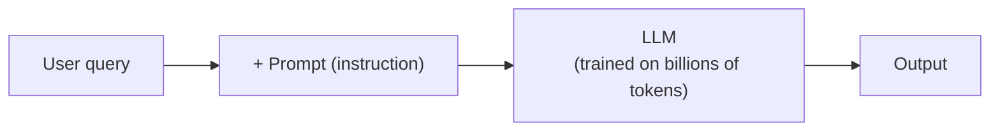
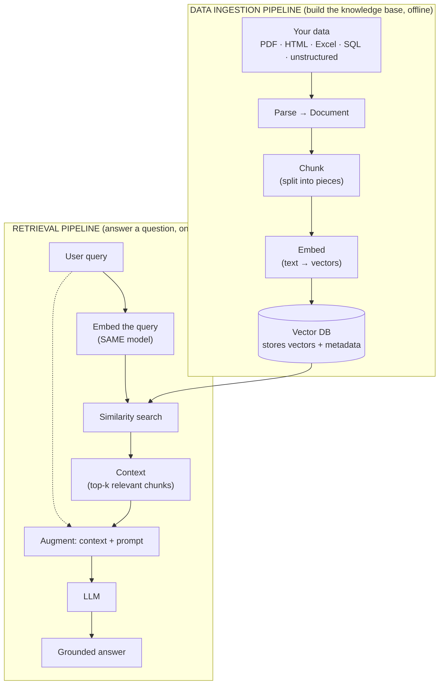
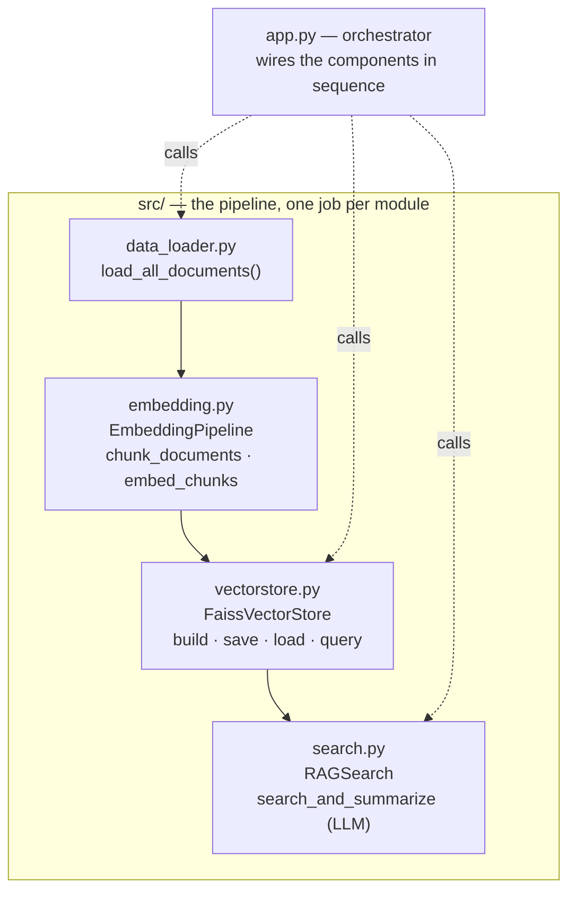
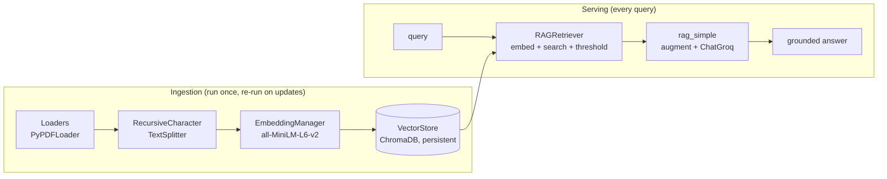

# ML Study 13c — RAG (Retrieval-Augmented Generation): Giving the LLM a Memory It Can Trust

**Covers:** *why* RAG exists (the two failures of a bare LLM — stale knowledge/hallucination, and private data you can't fine-tune in cheaply) → the **two pipelines** (data ingestion + retrieval) and how they map to the letters **R-A-G** → the **Document** structure (`page_content` + `metadata`) and **loaders** (`TextLoader`, `DirectoryLoader`, `PyPDFLoader`/`PyMuPDFLoader`) → **chunking** with `RecursiveCharacterTextSplitter` → **embeddings** with a `SentenceTransformer` (`all-MiniLM-L6-v2`, 384-dim) wrapped in an `EmbeddingManager` → a **ChromaDB** `VectorStore` (persistent) → a `RAGRetriever` (query → embed → similarity search → threshold) → **generation** (augment context into a prompt, call the LLM) → an **enhanced** pipeline (`rag_advanced`: sources, confidence, thresholds) → the **modular refactor** from notebook to a real `src/` package (FAISS store, build-once/load-many, swappable vector backends).
**Goal:** build a complete, modular traditional-RAG pipeline end to end — and, more importantly, understand *where it breaks in production*, because RAG almost never fails at the model. It fails at the seams between these steps.

**Series context:** the **grounding rung**. [Study 13](ML_Study_13_LangChain_Agents.html) gave the LLM tools; [13a](ML_Study_13a_LangGraph.html) gave it a controllable loop; [13b](ML_Study_13b_MCP.html) gave it a standard way to reach tools. RAG gives it something different: **access to knowledge it was never trained on, without retraining.** Built from a hands-on Agentic-AI walkthrough, enriched with the production patterns from the RAG playbook in `systems-in-production`. Companion notebook: `pdf_loader.ipynb` (workspace `YTRAG`).

> One number to sit with before we start: in most enterprises today, **the majority of the LLM work is RAG work.** Not fine-tuning, not training — retrieval. If you learn one applied-LLM pattern deeply, make it this one.

---

## Part 1 — Why RAG exists: two things a bare LLM can't do

Start with the simplest possible generative-AI app: a user sends a **query**, you wrap it in a **prompt** (an instruction), the **LLM** generates an answer.



That works right up until it doesn't — in two specific, expensive ways.

**Failure 1 — Stale knowledge → hallucination.** Every model has a training cutoff. Ask GPT-class model about an event *after* its cutoff and it won't say "I don't know." It will **hallucinate** — invent a confident, plausible answer — because the objective it was trained on rewards fluent completion, not calibrated uncertainty. (Put bluntly: the model *"does not want to look like a fool."*) That's not a bug you prompt your way out of; it's structural.

**Failure 2 — Private, ever-changing data.** You run a company. You have HR policy, finance policy, internal docs — none of it public, none of it in the model's training set, and **all of it changing constantly.** You want a chatbot that answers "what's the leave policy?" from *your* documents.

The obvious fix — **fine-tune the model on your data** — is a trap for this use case:

- Fine-tuning tweaks billions of parameters: **expensive, slow, and specialized.**
- Your policies change weekly. You are not re-fine-tuning a model every week.
- It bakes knowledge into weights, where you can't easily **cite**, **update**, or **delete** a fact (which matters for compliance and for that one document that got retracted).

RAG solves both by a different move entirely: **don't put the knowledge in the model — put it in an external store the model consults at answer time.**

> **Judgment — RAG vs. fine-tuning is not "which is better," it's "which problem."** Fine-tune to change *behavior, format, tone, or a narrow skill*. Reach for RAG to supply *knowledge that changes, needs a citation, or differs per user/tenant.* Most real systems do **both**: fine-tune the style, retrieve the facts. If someone frames it as either/or, they've mis-scoped the problem.

---

## Part 2 — The shape of RAG: two pipelines, three letters

RAG is **R**etrieval-**A**ugmented **G**eneration, and the name is the architecture. It runs as two pipelines that meet at a vector database.



Map it to the letters:
- **R — Retrieval:** the query hits the vector DB and pulls back the most relevant chunks. That's the **context**.
- **A — Augmentation:** you *augment* the prompt by stuffing that context in alongside the user's question and an instruction.
- **G — Generation:** the LLM generates the answer **from the supplied context**, not from memory.

Does this eliminate hallucination? No — it *reduces* it. If the answer is in the store, you'll likely get it grounded and correct. If it isn't, the model can still make something up. (That's why, in Part 8, we add an explicit "no relevant context found" guard — a small thing that separates a demo from a product.) Perplexity is a public example of this pattern at scale: retrievers + tools + web search + an LLM summarizing over the retrieved context. This baseline is called **traditional RAG**; agentic RAG (retrievers as tools an agent chooses) builds on top of it.

> **The thesis to carry through the whole build:** the LLM is rarely where RAG fails. **RAG fails at the intersections** — the wrong chunk got retrieved, the index was stale, the query was embedded with a different model than the documents, distance got read as similarity, the context came back empty and nobody checked. Every part below is one of those seams. Watch them.

---

## Part 3 — The `Document`: the data structure the whole pipeline speaks

Everything in the ingestion pipeline converges on one structure. Every loader outputs it; the splitter consumes and re-emits it; the vector store is fed from it. Learn it once and the rest is plumbing.

A LangChain **`Document`** has exactly two parts:
- **`page_content`** (str) — the actual text, the thing that gets embedded and searched.
- **`metadata`** (dict) — everything *about* the text: source file, page number, author, timestamp, and anything else you add.

```python
from langchain_core.documents import Document

doc = Document(
    page_content="this is the main text content I am using to create RAG",
    metadata={
        "source": "example.txt",
        "pages": 1,
        "author": "A. Researcher",
        "date_created": "2025-01-01",
    },
)
```

Why does metadata deserve equal billing with the content? Because at retrieval time you can **filter** on it. "Find text about RAG **where author = A. Researcher**" is a metadata filter stacked on top of the semantic search — and that combination is often what makes retrieval actually usable.

> **Judgment — metadata is under-rated leverage.** Teams spend weeks chasing a "better embedding model" when the real win was a `source`, `page`, or `date` filter that removes 90% of the wrong candidates before similarity even runs. It's also what powers **citations** ("from manual.pdf, p.42") and **per-tenant isolation** (`filter: tenant_id == X`) — both non-negotiable in a real product. Design your metadata schema deliberately, not as an afterthought.

### Loaders: any file → `Document`

You rarely build `Document`s by hand. **Loaders** read a source and hand you `Document`s. LangChain ships dozens (PDF, CSV, web, directory, S3, Notion, Slack, Wikipedia, Arxiv…). The pattern is identical for all of them: construct with a path/config, call `.load()`.

**Text file:**
```python
from langchain_community.document_loaders import TextLoader

loader = TextLoader("../data/text_files/python_intro.txt", encoding="utf-8")
document = loader.load()   # -> [Document(page_content=..., metadata={'source': ...})]
```
*(Note the two import paths you'll see in the wild: `langchain.document_loaders` and `langchain_community.document_loaders`. Prefer `langchain_community`; the old path still works until it deprecates. LangChain reorganizes packages often — expect this and don't panic when an import moves.)*

**A whole directory at once:**
```python
from langchain_community.document_loaders import DirectoryLoader

dir_loader = DirectoryLoader(
    "../data/text_files",
    glob="**/*.txt",              # pattern to match files (recursive)
    loader_cls=TextLoader,        # which loader to use per file
    loader_kwargs={"encoding": "utf-8"},
    show_progress=True,           # needs tqdm installed; set False to skip
)
documents = dir_loader.load()     # -> one Document list across all matched files
```

**PDFs** — two loaders, and the choice matters: `PyPDFLoader` and `PyMuPDFLoader`. `PyMuPDF` is generally the stronger parser (layout, speed). Both yield **one `Document` per page**, with rich auto-populated metadata (source path, total pages, creation date, author).

```python
from langchain_community.document_loaders import PyPDFLoader   # or PyMuPDFLoader
```

Here's the real ingestion function from the build — read all PDFs in a folder, and **add your own metadata** as you go:

```python
import os
from pathlib import Path
from langchain_community.document_loaders import PyPDFLoader

def process_all_pdfs(pdf_directory):
    """Read every PDF in a directory into a flat list of page-Documents."""
    all_documents = []
    pdf_dir = Path(pdf_directory)
    pdf_files = list(pdf_dir.glob("**/*.pdf"))          # recursive
    print(f"Found {len(pdf_files)} PDF files to process")

    for pdf_file in pdf_files:
        print(f"\nProcessing: {pdf_file.name}")
        try:
            loader = PyPDFLoader(str(pdf_file))
            documents = loader.load()                    # one Document per page
            for doc in documents:                        # enrich metadata
                doc.metadata["source_file"] = pdf_file.name
                doc.metadata["file_type"] = "pdf"
            all_documents.extend(documents)
            print(f"  Loaded {len(documents)} pages")
        except Exception as e:
            print(f"  Error: {e}")                        # one bad file shouldn't kill the run

    print(f"\nTotal documents loaded: {len(all_documents)}")
    return all_documents

all_pdf_documents = process_all_pdfs("../data")
# Found 4 PDF files -> attention.pdf (15 pages), embeddings.pdf (27),
# objectdetection.pdf (21), proposal.pdf (1)  ->  64 page-Documents total
```

Two production-shaped details are hiding in that simple function: the **`try/except` per file** (in a real corpus, *some* PDF is always corrupt — you log it and keep going, you don't crash the batch), and the **metadata enrichment loop** (you almost always want provenance beyond what the loader gives you). Both are the difference between a notebook and an ingestion job you can run on 10,000 files.

> **Judgment — data parsing is the step that decides RAG quality, and it's the one everyone rushes.** Put plainly: *crack parsing and RAG becomes easy.* A clean text extraction with good structure and metadata makes every downstream step better; a sloppy one (tables mangled into word soup, headers lost, two columns interleaved) poisons the embeddings and no amount of prompt-tuning recovers it. When a RAG system "just isn't accurate," the root cause is upstream of the model far more often than teams expect — usually here.

---

## Part 4 — Chunking: why you can't embed a whole PDF

You have 64 page-`Document`s. You can't just embed each page (or the whole doc) as-is. **Every embedding model and every LLM has a fixed context size.** Hand a 100-page PDF to an embedding model and it refuses — too much text for one vector. So you **chunk**: split documents into smaller pieces that fit, and that each carry a coherent idea.

```python
from langchain.text_splitter import RecursiveCharacterTextSplitter

def split_documents(documents, chunk_size=1000, chunk_overlap=200):
    """Split Documents into overlapping chunks for retrieval."""
    text_splitter = RecursiveCharacterTextSplitter(
        chunk_size=chunk_size,            # target characters per chunk
        chunk_overlap=chunk_overlap,      # characters shared between neighbors
        length_function=len,
        separators=["\n\n", "\n", " ", ""],   # try to split on these, in order
    )
    split_docs = text_splitter.split_documents(documents)
    print(f"Split {len(documents)} documents into {len(split_docs)} chunks")
    return split_docs

chunks = split_documents(all_pdf_documents)
# Split 64 documents into 359 chunks
```

Two knobs and one clever default:
- **`chunk_size=1000`** — the target size of each piece.
- **`chunk_overlap=200`** — neighboring chunks **share** 200 characters. This is deliberate: a sentence that straddles a chunk boundary would otherwise be cut in half and lose its meaning in *both* chunks. Overlap keeps the seam readable.
- **`separators=["\n\n", "\n", " ", ""]`** — "recursive" means it tries to split on paragraph breaks first, then line breaks, then spaces, then (last resort) mid-word. It prefers to break where humans would.

> **Judgment — chunking is where most RAG quality is won or lost, and `1000/200` is a starting point, not a truth.** Chunks **too big** dilute the embedding (one vector trying to represent five unrelated ideas) and bloat the context you later pay the LLM to read. Chunks **too small** sever the context needed to answer. The right size depends on your content: dense legal/technical prose wants smaller chunks; narrative wants larger. Beyond fixed-size, there's **structure-aware** chunking (split on the document's own headings/sections) and **semantic** chunking (split where the topic actually shifts) — both usually beat character-count splitting, at more cost. If your retrieval is returning "close but not quite" chunks, tune *here* before you touch the model. This is the highest-leverage knob in the system.

---

## Part 5 — Embeddings: turning text into vectors you can compare

Now convert each chunk's text into a **vector** — a list of numbers — so you can measure *similarity* mathematically (cosine similarity, nearest-neighbor search). Similar meaning → nearby vectors.

The build uses an **open-source** embedding model so anyone can run it: `all-MiniLM-L6-v2` from Hugging Face, via `sentence-transformers`. It maps any text to a **384-dimensional** vector. (You could swap in OpenAI or Google embedding models — same interface, different cost/quality/hosting trade-offs.)

Wrapped in a small class so the pipeline stays modular (this is the shift from script to reusable component — the same discipline as [13a](ML_Study_13a_LangGraph.html)/[13b](ML_Study_13b_MCP.html)):

```python
import numpy as np
from typing import List
from sentence_transformers import SentenceTransformer

class EmbeddingManager:
    """Handles document embedding generation using SentenceTransformer."""

    def __init__(self, model_name: str = "all-MiniLM-L6-v2"):
        self.model_name = model_name
        self.model = None
        self._load_model()

    def _load_model(self):
        """Load the SentenceTransformer model (leading _ = 'internal use')."""
        try:
            print(f"Loading embedding model: {self.model_name}")
            self.model = SentenceTransformer(self.model_name)
            dim = self.model.get_sentence_embedding_dimension()
            print(f"Model loaded successfully. Embedding dimension: {dim}")
        except Exception as e:
            print(f"Error loading model {self.model_name}: {e}")
            raise

    def generate_embeddings(self, texts: List[str]) -> np.ndarray:
        """text (list of strings) -> np.ndarray of shape (len(texts), 384)."""
        if not self.model:
            raise ValueError("Model not loaded")
        print(f"Generating embeddings for {len(texts)} texts...")
        embeddings = self.model.encode(texts, show_progress_bar=True)
        print(f"Generated embeddings with shape: {embeddings.shape}")
        return embeddings

embedding_manager = EmbeddingManager()
# Loading embedding model: all-MiniLM-L6-v2
# Model loaded successfully. Embedding dimension: 384
```

> **Judgment — the single most common RAG bug lives in this step: you MUST embed the query with the *same* model you embedded the documents with.** Vectors from two different models live in two different, incompatible spaces; comparing them yields confident nonsense. This is why the retriever (Part 7) calls the *same* `EmbeddingManager`. The corollary bites later: the day you decide to upgrade your embedding model, you must **re-embed your entire corpus** — the old vectors are now garbage relative to the new query vectors. That's a migration, not a config change. Version your embedding model alongside your index and plan for it.

---

## Part 6 — The vector store: where vectors live and get searched

Store the vectors (plus their text and metadata) in a **vector database** so you can run similarity search over them. The build uses **ChromaDB**, open-source and **persistent** — it writes to disk, so you ingest once and reuse forever without re-embedding.

```python
import os
import uuid
from typing import Any, List
import numpy as np
import chromadb

class VectorStore:
    """Manages document embeddings in a persistent ChromaDB collection."""

    def __init__(self, collection_name: str = "pdf_documents",
                 persist_directory: str = "../data/vector_store"):
        self.collection_name = collection_name
        self.persist_directory = persist_directory
        self.client = None
        self.collection = None
        self._initialize_store()

    def _initialize_store(self):
        os.makedirs(self.persist_directory, exist_ok=True)
        self.client = chromadb.PersistentClient(path=self.persist_directory)  # writes to disk
        self.collection = self.client.get_or_create_collection(
            name=self.collection_name,
            metadata={"description": "PDF document embeddings for RAG"},
        )
        print(f"Vector store initialized. Collection: {self.collection_name}")
        print(f"Existing documents in collection: {self.collection.count()}")

    def add_documents(self, documents: List[Any], embeddings: np.ndarray):
        """Store chunks + their embeddings together, keyed by unique id."""
        if len(documents) != len(embeddings):
            raise ValueError("Number of documents must match number of embeddings")

        ids, metadatas, documents_text, embeddings_list = [], [], [], []
        for i, (doc, embedding) in enumerate(zip(documents, embeddings)):
            ids.append(f"doc_{uuid.uuid4().hex[:8]}_{i}")     # unique id per record
            meta = dict(doc.metadata)
            meta["doc_index"] = i
            meta["content_length"] = len(doc.page_content)
            metadatas.append(meta)
            documents_text.append(doc.page_content)            # keep the text, not just the vector
            embeddings_list.append(embedding.tolist())
        try:
            self.collection.add(
                ids=ids,
                embeddings=embeddings_list,
                metadatas=metadatas,
                documents=documents_text,
            )
            print(f"Successfully added {len(documents)} documents to vector store")
            print(f"Total documents in collection: {self.collection.count()}")
        except Exception as e:
            print(f"Error adding documents to vector store: {e}")

vectorstore = VectorStore()
```

Notice the collection stores **four parallel things** per record: the `id`, the `embedding` (for search), the `document` text (so you can return it as context), and the `metadata` (for filtering and citations). That's the whole point — the vector is how you *find* it; the text and metadata are what you *use*.

Now wire the three components together — this is the ingestion pipeline in three lines:

```python
texts = [doc.page_content for doc in chunks]           # 359 chunk texts
embeddings = embedding_manager.generate_embeddings(texts)   # (359, 384)
vectorstore.add_documents(chunks, embeddings)          # -> Total documents in collection: 359
```

> **Judgment — a few things the happy path hides.** (1) **Idempotency:** random UUID ids mean re-running ingestion *duplicates* every chunk. For a real job you want deterministic ids (hash of source+page+chunk) so re-ingesting updates instead of double-counting — otherwise your index quietly rots. (2) **The vector store now contains your source text in plaintext** — if any of it is PII or confidential, the store is now a place that data lives, with all the access-control and retention consequences that implies. (3) **Persistence is a feature, not a given** — `PersistentClient` writing to disk is what lets this survive a restart; the in-memory default would vanish. Small line, big operational difference.

---

## Part 7 — Retrieval: query → context

Ingestion is done; the knowledge base exists. Retrieval is the online half: take a user query, embed it **with the same model**, search the store, return the best chunks.

```python
from typing import Any, Dict, List

class RAGRetriever:
    """Query-based retrieval over the vector store."""

    def __init__(self, vector_store: VectorStore, embedding_manager: EmbeddingManager):
        self.vector_store = vector_store
        self.embedding_manager = embedding_manager      # SAME manager used for ingestion

    def retrieve(self, query: str, top_k: int = 5,
                 score_threshold: float = 0.0) -> List[Dict[str, Any]]:
        # 1. Embed the query with the SAME model the documents used
        query_embedding = self.embedding_manager.generate_embeddings([query])

        # 2. Similarity search in the vector DB
        results = self.vector_store.collection.query(
            query_embeddings=query_embedding.tolist(),
            n_results=top_k,
        )

        # 3. Package results: convert DISTANCE -> SIMILARITY, filter by threshold
        retrieved_docs = []
        if results["documents"] and results["documents"][0]:
            for doc_id, doc, metadata, distance in zip(
                results["ids"][0],
                results["documents"][0],
                results["metadatas"][0],
                results["distances"][0],
            ):
                similarity = 1 - distance           # Chroma returns distance; similarity = 1 - distance
                if similarity >= score_threshold:
                    retrieved_docs.append({
                        "id": doc_id,
                        "content": doc,
                        "metadata": metadata,
                        "similarity_score": similarity,
                        "distance": distance,
                    })
        return retrieved_docs

rag_retriever = RAGRetriever(vectorstore, embedding_manager)
results = rag_retriever.retrieve("what is attention is all you need")
# -> top-k chunks, each with content + metadata + similarity_score
```

Three things worth naming:
- **`top_k`** — how many chunks to pull back. Too few and you miss the answer; too many and you drown the LLM (and pay for the tokens).
- **distance vs. similarity** — Chroma returns a **distance** (smaller = closer). Humans think in **similarity** (bigger = more alike), so we convert: `similarity = 1 - distance`. Getting this backwards silently ranks your results in reverse — a classic seam bug.
- **`score_threshold`** — drop chunks below a similarity floor. This is your first defense against the failure in the next note.

> **Judgment — the retriever ALWAYS returns something, even when nothing relevant exists.** Ask about a topic that isn't in your corpus and similarity search still hands back the *k* least-bad chunks — they're just all wrong. If you pass those to the LLM unguarded, you've *reintroduced* hallucination through the back door, now dressed up as a grounded answer. The `score_threshold` (and the "no relevant context" guard in Part 8) exist precisely for this. **Similarity is not correctness.** A production RAG system needs to be able to say "I don't have that" — and that ability is something you build, not something retrieval gives you for free.

---

## Part 8 — Generation: augment the context, then answer

The last step turns retrieved context into an answer. This is the **A** and **G**: *augment* the prompt with context, then *generate*. The build uses `ChatGroq` (fast, free tier) but any chat model works.

```python
import os
from dotenv import load_dotenv
from langchain_groq import ChatGroq

load_dotenv()
llm = ChatGroq(
    groq_api_key=os.getenv("GROQ_API_KEY"),
    model_name="gemma2-9b-it",
    temperature=0.1,        # low temp: we want faithful, not creative
    max_tokens=1024,
)

def rag_simple(query, retriever, llm, k=3):
    # 1. RETRIEVE
    results = retriever.retrieve(query, top_k=k)

    # 2. AUGMENT: join the retrieved chunks into one context block
    context = "\n\n".join(doc["content"] for doc in results) if results else ""
    if not context:                                   # the guard from Part 7's note
        return "No relevant context found to answer the question."

    # 3. GENERATE: instruct the LLM to answer FROM the context
    prompt = (
        "Use the following context to answer the question concisely.\n\n"
        "Context:\n{context}\n\n"
        "Question: {query}\n\n"
        "Answer:"
    )
    response = llm.invoke(prompt.format(context=context, query=query))
    return response.content

answer = rag_simple("What is attention mechanism?", rag_retriever, llm)
print(answer)
# -> "Attention mechanism is a function that maps a query ..." (grounded in attention.pdf)
```

That's the whole loop: **retrieve → augment → generate.** The prompt is doing real work — *"Use the following context to answer"* is an instruction to prefer the supplied text over the model's own memory. Keep `temperature` low so the model stays faithful to the context rather than embellishing.

From here, the natural extensions (the video calls it `rag_advanced`) return **sources, confidence scores, and the full context** alongside the answer — not extras, but requirements: an answer you can't trace to a source is an answer you can't trust in production.

> **Judgment — evaluate retrieval and generation separately, because they fail separately.** A RAG answer can be wrong two very different ways: **retrieval** fetched the wrong chunk (the answer was never in the context), or **generation** got the right chunk and still ignored or misread it. These have different fixes (chunking/embedding/filters vs. prompt/model), so a single "is the final answer good?" score tells you nothing about *where* to look. Measure "did we retrieve the chunk that contains the answer?" independent of "did the model use it faithfully?" And remember the deeper limit: **grounding is not reasoning.** RAG makes the model *informed*, not *smart* — it will still fail at multi-hop questions where the answer requires combining facts the retriever pulled as separate, unlinked chunks.

---

## Part 9 — Enhanced RAG: sources, confidence, and a threshold that means "I don't know"

`rag_simple` returns a bare string. That's a demo. A product needs to answer three more questions every time: **where did this come from, how sure are we, and what did we actually read?** `rag_advanced` returns all of it — a structured result instead of a sentence.

```python
def rag_advanced(query, retriever, llm, top_k=5, min_score=0.2, return_context=False):
    """
    RAG pipeline with extra features:
    - Returns answer, sources, confidence score, and optionally full context.
    """
    # Retrieval now enforces a real floor: below min_score, a chunk is not "context"
    results = retriever.retrieve(query, top_k=top_k, score_threshold=min_score)
    if not results:
        return {"answer": "No relevant context found.", "sources": [], "confidence": 0.0, "context": ""}

    # Prepare context AND a structured trail of where each piece came from
    context = "\n\n".join(doc["content"] for doc in results)
    sources = [{
        "source":  doc["metadata"].get("source_file", doc["metadata"].get("source", "unknown")),
        "page":    doc["metadata"].get("page", "unknown"),
        "score":   doc["similarity_score"],
        "preview": doc["content"][:300] + "...",
    } for doc in results]
    confidence = max(doc["similarity_score"] for doc in results)

    # Generate
    prompt = (
        "Use the following context to answer the question concisely.\n"
        "Context:\n{context}\n\nQuestion: {query}\n\nAnswer:"
    )
    response = llm.invoke([prompt.format(context=context, query=query)])

    output = {"answer": response.content, "sources": sources, "confidence": confidence}
    if return_context:
        output["context"] = context      # opt-in: the full context, for debugging/audit
    return output

result = rag_advanced("What is attention mechanism?", rag_retriever, llm,
                      top_k=3, min_score=0.1, return_context=True)
print("Answer:",  result["answer"])
print("Sources:", result["sources"])        # [{source, page, score, preview}, ...]
print("Confidence:", result["confidence"])
print("Context Preview:", result["context"][:300])
```

Three upgrades, each of which is a production requirement, not a nicety:
- **`sources`** — every answer now carries its provenance (file, page, score, preview). This is what lets a user *verify* the answer, and what lets you *debug* a wrong one ("it cited page 4 of the wrong document").
- **`confidence`** — a single number you can act on: route low-confidence answers to a human, suppress them, or show a "low confidence" badge.
- **`min_score` as a real gate** — the threshold from Part 7, now wired in. Ask about something not in the corpus and `rag_advanced` returns *"No relevant context found."* with confidence `0.0` — it declines instead of hallucinating.

The video also gestures at a third tier (streaming, citations, conversation history, summarization) — same skeleton, more features bolted on. The pattern to internalize isn't the feature list; it's the *progression*: **simple → traceable → governable.** Each rung adds something you need before you'd put it in front of a real user.

> **Judgment — "confidence = max similarity" is a *weak* signal, and treating it as truth is a classic RAG mistake.** A chunk can be highly similar to the query and still not contain the answer (similar *words*, wrong *fact*), and a correct answer can come from a modestly-scored chunk. So `confidence` here is a useful *floor for triage*, not a calibrated probability of correctness. In a serious system you'd complement it with an LLM-as-judge check ("does this context actually answer the question?") or a groundedness score. Ship the simple version, but don't tell stakeholders the number means more than it does — that overclaim is how RAG systems lose trust.

---

## Part 10 — From notebook to pipeline: the modular refactor

Everything so far lived in one notebook. That's fine for learning and useless for production — you can't test it, reuse it, deploy it, or let a second person work on it. The final move is the most important one, and it's the one most tutorials skip: **turn the notebook into a package with clear component boundaries.**



The directory:

```text
YTRAG/
├── data/                 # source documents (PDF, TXT, CSV, ...)
├── faiss_store/          # persisted index + metadata (built once)
├── src/
│   ├── __init__.py
│   ├── data_loader.py    # load_all_documents(data_dir) -> List[Document]
│   ├── embedding.py      # EmbeddingPipeline: chunk_documents, embed_chunks
│   ├── vectorstore.py    # FaissVectorStore: build_from_documents, save, load, search, query
│   └── search.py         # RAGSearch: search_and_summarize (retrieval + LLM)
└── app.py                # orchestrator: the only file that knows the whole flow
```

Nothing about the *logic* changed — the loader still loads, the splitter still splits, the retriever still retrieves. What changed is that each step is now a **named component with one responsibility and a stable interface**, so you can test it, swap it, and reuse it. That is the entire difference between a demo and a system.

**One swap worth noticing: the vector store changed from ChromaDB to FAISS** — and almost nothing else had to. FAISS is a fast in-process similarity library (`IndexFlatL2` = exact brute-force search); the metadata rides alongside in a pickle file. The `search`/`query` methods present the *same* shape the rest of the pipeline expects.

```python
# src/vectorstore.py  (the core of the FAISS store)
import os, pickle
import faiss
from sentence_transformers import SentenceTransformer

class FaissVectorStore:
    def __init__(self, persist_dir="faiss_store", embedding_model="all-MiniLM-L6-v2"):
        self.persist_dir = persist_dir
        os.makedirs(self.persist_dir, exist_ok=True)
        self.index = None
        self.metadata = []
        self.model = SentenceTransformer(embedding_model)

    def add_embeddings(self, embeddings, metadatas=None):
        dim = embeddings.shape[1]
        if self.index is None:
            self.index = faiss.IndexFlatL2(dim)     # exact L2 nearest-neighbor
        self.index.add(embeddings)
        if metadatas:
            self.metadata.extend(metadatas)

    def save(self):                                  # persist index + metadata to disk
        faiss.write_index(self.index, os.path.join(self.persist_dir, "faiss.index"))
        with open(os.path.join(self.persist_dir, "metadata.pkl"), "wb") as f:
            pickle.dump(self.metadata, f)

    def load(self):                                  # reload without re-embedding
        self.index = faiss.read_index(os.path.join(self.persist_dir, "faiss.index"))
        with open(os.path.join(self.persist_dir, "metadata.pkl"), "rb") as f:
            self.metadata = pickle.load(f)

    def query(self, query_text, top_k=5):
        query_emb = self.model.encode([query_text]).astype("float32")
        D, I = self.index.search(query_emb, top_k)
        return [{"index": idx, "distance": dist,
                 "metadata": self.metadata[idx] if idx < len(self.metadata) else None}
                for idx, dist in zip(I[0], D[0])]
```

And `app.py` — the orchestrator — captures the operational shape of a real RAG service in a few lines:

```python
from src.data_loader import load_all_documents
from src.vectorstore import FaissVectorStore
from src.search import RAGSearch

if __name__ == "__main__":
    # FIRST run: build the index once (expensive: embeds everything) and persist it
    docs = load_all_documents("data")
    store = FaissVectorStore("faiss_store")
    store.build_from_documents(docs)

    # EVERY run after: skip building — just load and query (cheap, instant)
    # store = FaissVectorStore("faiss_store")
    # store.load()
    # print(store.query("What is attention mechanism?", top_k=3))

    # With the LLM (full retrieval + generation):
    # search = RAGSearch("faiss_store")
    # print(search.search_and_summarize("What is attention mechanism?"))
```

> **Judgment — the "build once, load many" split is the single most important operational insight in RAG, and the refactor is what makes it possible.** Embedding your whole corpus is the expensive step; you do it *once* and persist the index, then every query just loads and searches. The `if index exists: load, else: build` pattern is what turns a 30-second-startup notebook into a service that answers in milliseconds. You only re-build when the *documents* change — and even then, incrementally, not from scratch. A notebook can't express this cleanly; a package can. This is the whole reason to do the refactor, and it's the same principle as every other durable system: **separate the expensive one-time work from the cheap repeated work, and put a clean seam between them.**

> **Judgment — two more things the video does that you must NOT copy into production.** (1) It **hardcodes the API key in `search.py`** (`groq_api_key = "gsk_..."`). Never do this — a key in source is a key in your git history forever, readable by anyone who ever clones the repo. Load it from `.env`/environment or a secrets manager (`os.getenv("GROQ_API_KEY")`), and add `.env` to `.gitignore`. (2) It ships **`IndexFlatL2` (exact brute-force search)** — perfect for a few hundred chunks, but it scans *every* vector on every query, so it degrades linearly and won't hold up at millions of chunks. That's your cue for an approximate index (FAISS IVF/HNSW) or a managed vector DB (pgvector, Typesense, Pinecone). The point isn't that FAISS is wrong — it's that **the vector store is a real architecture decision with a scaling cliff**, and "it worked in the demo" is exactly when that cliff is invisible.

**On swappable stores:** ChromaDB, FAISS, Typesense, pgvector, Pinecone — the tutorial uses three of them almost interchangeably, and that's the lesson. Behind a stable `build / load / query` interface, the vector backend is a *pluggable choice*, not a rewrite — the same "standard interface over varied implementations" pattern you saw LangChain apply to models (Study 13) and MCP apply to tools (Study 13b). Choose the backend by your real constraints (scale, ops burden, filtering needs, cost), not by which one the tutorial happened to use.

---

## Part 11 — Where this goes, and where it breaks

You've built **traditional RAG** end to end: a data-ingestion pipeline (load → chunk → embed → store) and a retrieval pipeline (embed query → search → augment → generate), assembled from modular components (`EmbeddingManager`, `VectorStore`, `RAGRetriever`) so the same code becomes a real `src/` pipeline instead of notebook cells.

The map of what you built:



**Where it goes next:** agentic RAG — instead of *always* retrieving, an agent (Study 13/13a) *decides* whether to retrieve, which store to hit, whether to also web-search, and whether the answer is good enough to return or needs another pass. The retriever becomes a **tool** (Study 13b) the agent chooses. Everything here stays; it just stops being unconditional.

**Where it breaks — the intersection checklist.** Come back to this when a RAG system "isn't accurate." In production, the culprit is almost never the LLM; it's one of these seams, in roughly this order of likelihood:

1. **Parsing** dropped structure (tables, columns, headers) → the text was wrong before it was ever embedded.
2. **Chunking** split answers apart or diluted them → the right idea isn't in any single chunk.
3. **Embedding mismatch** — query and documents embedded by different models → search is comparing incompatible spaces.
4. **No threshold / no "I don't know"** → irrelevant chunks pass through and the model hallucinates over them.
5. **Distance read as similarity** → results ranked backwards.
6. **Stale index** — the source changed, the vectors didn't → confidently outdated answers.
7. **Metadata missing** → can't filter, can't cite, can't isolate tenants.
8. Only *then*, occasionally, the model itself.

Notice that seven of the eight are *pipeline* problems, not *model* problems. That's the whole lesson of RAG, and it's the same lesson that runs through every complex system: **the components are rarely where things fail — the connections between them are.** Get the seams right and RAG is dependable. Ignore them and no model, however large, will save you.

---

**Next → LLM-integrated retrieval, then agentic RAG** — turning `rag_simple` into an agent that decides when and how to retrieve. Reference library for going deeper on any step above: the RAG playbook in `systems-in-production/playbooks/ai/rag/` (chunking strategies, retrieval failure modes, evaluation, production patterns).
