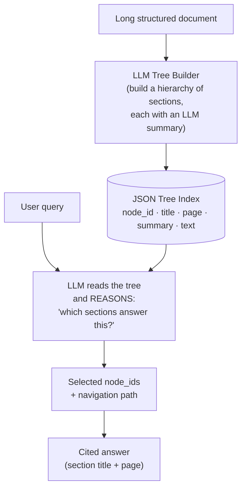
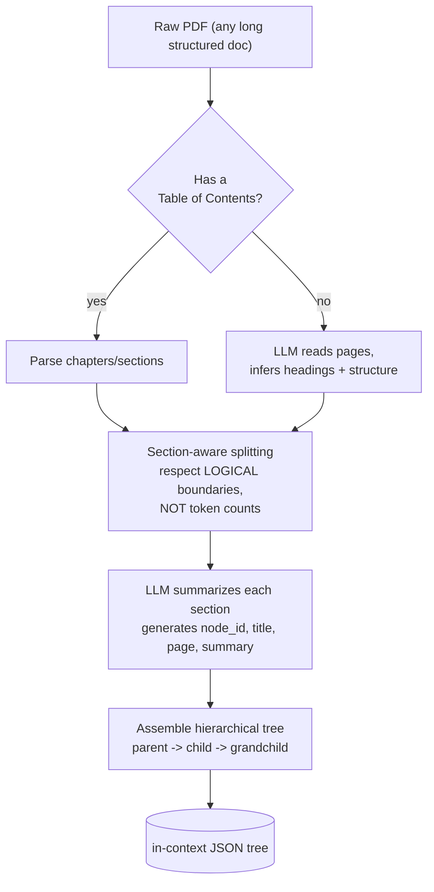
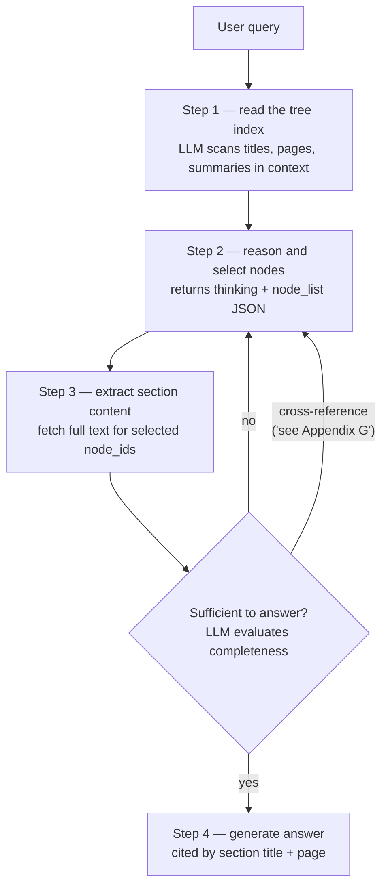

# ML Study 13d — Vectorless RAG: Retrieval by Reasoning, Not Similarity

**Covers:** *why* vector RAG fails on long professional documents (**similarity ≠ relevance**, chunking destroys context, opaque cosine scores, embedding drift) → the core idea of **vectorless / reasoning-based RAG**: skip embeddings entirely and let the LLM **navigate a document tree like a human reading a table of contents** → building the **LLM tree index** (TOC detection → section-aware splitting → per-node summaries → a JSON hierarchy) → **retrieval by reasoning** (the LLM reads the tree, reasons about which sections are relevant, returns node IDs + a navigation path) → a full **PageIndex** pipeline (`submit_document` → `get_tree` → `llm_tree_search` → cited answer) → the **honest comparison** with traditional RAG and when each wins.
**Goal:** understand a genuinely different retrieval paradigm — and, more importantly, learn *the judgment for choosing between them*, because the interesting question is never "which is better" but "which fits *this* document and *this* constraint."

**Series context:** the **relevance rung**. [Study 13c](ML_Study_13c_RAG.html) built traditional RAG and ended on "RAG fails at the intersections" — chunking severs context, similarity retrieves the wrong thing. Vectorless RAG is a direct answer to those exact failures: it removes the chunking seam entirely and replaces similarity with *reasoning*. Built from a hands-on Agentic-AI walkthrough (the PageIndex / vectorless-RAG section). Companion notebook: `PageIndex_Vectorless_RAG.ipynb`.

> The one-line frame: **traditional RAG finds what's *similar*; vectorless RAG reasons about what's *relevant*.** Hold that distinction — it's the whole chapter, and it's a distinction that matters far beyond RAG.

---

## Part 1 — The problem: similarity is not relevance

Recall traditional vector RAG from [13c](ML_Study_13c_RAG.html): chunk the document, embed the chunks, store the vectors, and at query time embed the question and pull back the *most similar* chunks by cosine distance.

```text
query -> embed -> cosine_similarity(query_vec, all_chunk_vecs) -> top-k chunks
```

That works beautifully for short, factoid lookups over messy, mixed corpora. But on a long, *structured* professional document — a 10-K, a legal contract, a research paper, an annual report — it has four failure modes that no amount of tuning fully fixes:

1. **Chunking destroys context.** A chunk that says *"as defined in Section 3.2..."* is meaningless when retrieved alone — the reference is severed. Fixed-size splitting cuts a single section into three arbitrary pieces, and the idea that spanned them is lost.
2. **Similarity ≠ relevance.** Embeddings match on *surface likeness*, not *actual answer-bearing*. A chunk about "market conditions" can score higher than the real answer just because it shares more words with your query. The retriever can be *confidently wrong*.
3. **No cross-section reasoning.** Ask *"compare the risk factors in Section 7 to the mitigations in Section 12"* and pure similarity can't do it — the answer requires *relating* two distant sections, not finding one similar chunk.
4. **Opaque + fragile.** *Why* was this chunk picked? "Cosine score 0.83" is not an explanation. And the day you change embedding models, every vector is invalidated — **embedding drift** forces you to re-embed the entire corpus.

> **Judgment — "similarity ≠ relevance" is the deepest idea in this whole series, and it reaches far past RAG.** A tool that optimizes for *similarity* will confidently hand you the nearest-looking thing and call it done. Getting the *relevant* thing — the one that actually answers the question in context — takes *reasoning*. That gap is exactly where human judgment has always lived, and it's why "the model found something" and "the model found the right thing" are different claims. Every part below is one attempt to close that gap with reasoning instead of arithmetic.

---

## Part 2 — The core idea: let the LLM navigate like a human

Here's how *you* answer a question from a 500-page book: you don't scan every sentence for similarity. You **open the table of contents**, reason about which chapter is most likely to hold the answer, turn to that page, and read the section whole. You navigate *structure*.

Vectorless RAG does exactly that. **No embeddings, no vector database, no chunking.** Instead:



The document becomes a **tree** that mirrors its own structure — Document → Chapters → Sections → Sub-sections — and **each node carries an LLM-written summary** of what's in it. At query time, the LLM is handed the *whole tree as context* and asked to reason: *which nodes most likely contain the answer?* It descends the tree the way a human expert scans a table of contents, picks the relevant sections, reads them **whole**, and answers — **citing the section and page it used.**

Compare the two retrievals directly:

```text
Vector RAG:   query -> embed -> cosine_similarity -> top-k chunks
              (finds what's SIMILAR)

PageIndex:    query + tree -> LLM reasons -> "nodes 0007 and 0008 contain the answer"
              (finds what's RELEVANT — and tells you why)
```

The LLM understands document *structure, context, and intent* — not just vector proximity.

---

## Part 3 — Building the tree: structure, not chunks

The index is built **once, offline**, and it's the heart of the approach. Two cases:

**If the document has a table of contents** (with or without page numbers): parse the chapters/sections directly into a hierarchy.

**If it doesn't:** the LLM *reads the pages*, infers the headings and structure, and builds the hierarchy itself. This is the crucial contrast with chunking:



The pivotal phrase is **section-aware splitting: respect logical boundaries, not token counts.** Traditional chunking splits a coherent section into three arbitrary pieces because it counts to 1000 characters and cuts. The tree builder splits on the document's *own* structure — one node per real section — so a section stays **whole**. Each node ends up looking like this:

```json
{
  "title": "Financial Stability",
  "node_id": "0006",
  "page_index": 21,
  "summary": "This section covers monitoring of systemic vulnerabilities and the role of international cooperation...",
  "text": "<the full section text>",
  "nodes": [
    { "title": "Monitoring Vulnerabilities", "node_id": "0007", "page_index": 22, "summary": "...", "text": "..." },
    { "title": "International Cooperation",   "node_id": "0008", "page_index": 28, "summary": "...", "text": "..." }
  ]
}
```

> **Judgment — "sections stay whole" is the direct fix for 13c's "chunking destroys context."** In [13c](ML_Study_13c_RAG.html) we named chunking as the highest-leverage knob *and* a top failure mode — cut in the wrong place and the answer is scattered across chunks that never retrieve together. Vectorless RAG doesn't tune that knob; it *removes* it. The information for one section lives in exactly one node, and cross-references survive because the section is intact. That's a real architectural win for the right document — and, like every win, it comes with a bill (Part 7).

---

## Part 4 — Where the tree lives (no vector DB)

A common question: *where do you store the tree?* Answer: **anywhere that holds JSON.** The index is just a JSON structure — a filesystem, an S3 bucket, MongoDB, any key-value store. There is **no vector database to provision, tune, or keep in sync.** For *N* documents you build *N* JSON trees and hand the relevant one to the LLM as context at query time.

> **Judgment — "no embedding pipeline" is a real operational saving, and it's underrated.** Half the production pain in [13c](ML_Study_13c_RAG.html) lived in the vector-store seam: idempotent ingestion, re-embedding on model change, the scaling cliff of a flat index, PII sitting in the store. Vectorless RAG deletes that entire subsystem. No embed/index/refresh complexity, no embedding drift, no vector DB ops. For a team drowning in vector-store maintenance on a modest set of structured documents, that deletion *is* the value.

---

## Part 5 — Retrieval by reasoning (the loop)

Query time is where the paradigm shows itself. It's not a lookup — it's a small reasoning loop:



Two things make this more than a fancy lookup:
- **Step 2 returns its reasoning.** The LLM emits a `thinking` field (why these sections) alongside the `node_list`. That reasoning *is* the explanation — the **navigation path**, not a cosine score.
- **The loop can follow cross-references.** If a selected section says *"see Appendix G,"* the LLM can loop back, navigate to Appendix G, and pull it in — something pure similarity search structurally cannot do.

> **Judgment — explainable retrieval is the feature that sells this in regulated work, and it's your "show your work" ethos as an algorithm.** In compliance, audit, legal, and financial advisory, the *answer* is not enough — you must show *where it came from and why*. A cosine score can't defend a decision to a regulator; a navigation path ("I read the Risk Factors chapter, section 7.2 on page 41, and here's the cited claim") can. This is the same principle that separates a durable system from a black box: **a result you can trace is a result you can trust.** When the cost of being wrong is real, explainability stops being a nice-to-have and becomes the requirement.

---

## Part 6 — The code: a vectorless RAG pipeline (PageIndex)

One open implementation of this pattern is **PageIndex** (`pageindex` SDK). You could build the same thing by hand with any LLM — the concepts are what matter — but PageIndex gives you the tree builder for free.

**Setup:**
```python
# pip install -U pageindex openai python-dotenv
import os, json, time
from dotenv import load_dotenv
load_dotenv()

PAGEINDEX_API_KEY = os.getenv("PAGEINDEX_API_KEY")   # load from env — NEVER hardcode
OPENAI_API_KEY    = os.getenv("OPENAI_API_KEY")

from pageindex import PageIndexClient
from openai import OpenAI
pi_client     = PageIndexClient(api_key=PAGEINDEX_API_KEY)
openai_client = OpenAI(api_key=OPENAI_API_KEY)
```

**Upload and index (the tree builds asynchronously — ~30–90s for a 50-page PDF):**
```python
PDF_PATH = "./sample_document.pdf"       # great candidates: annual reports, filings, textbooks
result   = pi_client.submit_document(PDF_PATH)
doc_id   = result["doc_id"]              # save this — it identifies the built tree

# Poll until the tree index is ready
while True:
    status = pi_client.get_document(doc_id)
    if status.get("status") == "completed":
        break
    time.sleep(5)
```

**Inspect the tree** — each node is one retrievable section:
```python
tree_result    = pi_client.get_tree(doc_id, node_summary=True)
pageindex_tree = tree_result.get("result", [])
print(f"Top-level sections: {len(pageindex_tree)}")
print(json.dumps(pageindex_tree[0] if pageindex_tree else {}, indent=2))

def count_nodes(nodes):
    total = len(nodes)
    for n in nodes:
        if n.get("nodes"):
            total += count_nodes(n["nodes"])      # recurse into children
    return total
print(f"Total nodes in tree: {count_nodes(pageindex_tree)}   # each = one retrievable section")

def print_tree(nodes, indent=0):
    for node in nodes:
        prefix = "  " * indent + ("└ " if indent > 0 else "")
        print(f"{prefix}[{node['node_id']}] {node['title']}  (p.{node.get('page_index', '?')})")
        if node.get("nodes"):
            print_tree(node["nodes"], indent + 1)
print_tree(pageindex_tree)
```

**The core — LLM tree search.** This is where PageIndex fundamentally differs from vector RAG: the query + tree go to an LLM, which *reasons* over the structure and returns node IDs.
```python
def llm_tree_search(query: str, tree: list, model: str = "gpt-4o") -> dict:
    """Sends query + document tree to an LLM; it reasons and returns relevant node_ids.
       Returns a dict with 'thinking' (reasoning) and 'node_list' (node IDs)."""

    # Compress the tree to save tokens — send only titles + short summaries, not full text
    def compress(nodes):
        out = []
        for n in nodes:
            entry = {"node_id": n["node_id"], "title": n["title"],
                     "summary": n.get("summary", "")[:200]}
            if n.get("nodes"):
                entry["nodes"] = compress(n["nodes"])
            out.append(entry)
        return out
    compressed_tree = compress(tree)

    prompt = f"""You are given a query and a document structure (like a table of contents).
Your task: identify which nodes most likely contain the answer to the query.
Think step-by-step about which sections are relevant.

Query: {query}

Document Tree:
{json.dumps(compressed_tree, indent=2)}

Reply ONLY in this exact JSON format:
{{
  "thinking": "<your step-by-step reasoning>",
  "node_list": ["node_id1", "node_id2"]
}}"""

    response = openai_client.chat.completions.create(
        model=model,
        messages=[{"role": "user", "content": prompt}],
        response_format={"type": "json_object"},      # force valid JSON back
    )
    return json.loads(response.choices[0].message.content)
```

**Retrieve the selected nodes, then generate a cited answer:**
```python
def find_nodes_by_id(nodes, target_ids, found=None):
    if found is None:
        found = []
    for node in nodes:
        if node["node_id"] in target_ids:
            found.append(node)
        if node.get("nodes"):
            find_nodes_by_id(node["nodes"], target_ids, found)
    return found

def generate_answer(query, nodes, model="gpt-4o"):
    if not nodes:
        return "No relevant sections found in the document."     # the honest "I don't know"
    context_parts = []
    for node in nodes:
        context_parts.append(
            f"[Section: '{node['title']}' | Page {node.get('page_index', '?')}]\n"
            f"{node.get('text', 'Content not available.')}"
        )
    context = "\n\n---\n\n".join(context_parts)

    prompt = f"""You are an expert document analyst.
Answer the question using ONLY the provided context.
For every claim you make, cite the section title and page number in parentheses.
Be concise and precise.

Question: {query}

Context:
{context}

Answer:"""
    response = openai_client.chat.completions.create(
        model=model, messages=[{"role": "user", "content": prompt}])
    return response.choices[0].message.content
```

**The full end-to-end pipeline:**
```python
def vectorless_rag(query: str, tree: list, verbose: bool = True) -> str:
    """Step 1: LLM tree search -> node_ids.  Step 2: fetch section content.
       Step 3: generate a cited answer."""
    search_result = llm_tree_search(query, tree)          # reason over structure
    node_ids      = search_result.get("node_list", [])
    nodes         = find_nodes_by_id(tree, node_ids)      # pull whole sections
    return generate_answer(query, nodes)                  # cited answer

answer = vectorless_rag("What is the syllabus covered in modern LLM fine-tuning?", pageindex_tree)
print(answer)
# -> a cited answer drawn from exactly the sections whose node_ids the LLM reasoned toward
```

Notice what never appears: no embedding model, no vector store, no chunker, no similarity score. The "retriever" is an LLM reasoning over a JSON table of contents.

> **Judgment — same anti-pattern to refuse as in 13c: don't hardcode the API key.** The walkthrough pastes a live PageIndex key straight into the notebook. Load it from `.env`/environment (`os.getenv`), keep `.env` in `.gitignore`, and rotate any key that ever touched source. A key in a notebook is a key in your git history forever.

---

## Part 7 — The honest comparison, and when each wins

Neither approach is "better." They optimize for different things. Eight dimensions that matter in production:

| Dimension | Traditional RAG | Vectorless RAG |
|---|---|---|
| **Scale** | Millions of docs ✓ | Tens to thousands |
| **Latency / query** | Milliseconds ✓ | Hundreds of ms – seconds |
| **Cost / query** | Cheap ✓ (1 embed + lookup) | Higher (multiple LLM calls) |
| **Cross-section reasoning** | Weak | Strong ✓ |
| **Explainability** | Cosine score (opaque) | Navigation path ✓ |
| **Best for** | Factoid Q&A, mixed corpora | Long structured docs |
| **Setup complexity** | Embedding pipeline + DB | Tree builder, no DB |
| **Ecosystem maturity** | Very mature ✓ | Emerging |

**Reach for traditional (vector) RAG when:**
- **Massive heterogeneous corpora** — millions of mixed-format docs (blogs, tickets, transcripts, KB articles).
- **Latency-critical apps** — chatbots, search-as-you-type, voice; every millisecond counts.
- **Short factoid queries** — "What's the warranty period?" "Who's the CEO?" The answer lives in one chunk.
- **Cost-sensitive at scale** — thousands of queries/minute where embedding lookups cost pennies and LLM-tree-walks don't.

**Reach for vectorless RAG when:**
- **Long, structured documents** — annual reports, 10-Ks, legal contracts, regulatory filings, research papers, textbooks.
- **Reasoning matters more than similarity** — cross-section compare/contrast/synthesize.
- **Explainability is required** — compliance, audit, legal, financial advisory. Show your work, not just the answer.
- **Chunking would destroy meaning** — cross-references like "as defined in Section 3.2" that go meaningless when split.

> **Judgment — the cost/latency line is the honest catch, and it's an engineering decision, not a preference.** Every query in vectorless RAG makes *multiple* LLM calls to traverse the tree — several hundred milliseconds to a few seconds each, versus a single cheap embedding lookup. And the tree itself doesn't scale to millions of documents; it's a tens-to-thousands tool. So the choice is a real trade, made against *your* document set and *your* SLA — not by which one trended on GitHub this week. "It reasons better" is true and irrelevant if your workload is a million tickets answered in 50ms.

---

## Part 8 — They're not competitors: the hybrid future

The framing that actually holds up in production: **traditional RAG = scale + speed; vectorless RAG = reasoning + structure. They are complementary, not competitors.** Pure vector search and pure tree navigation are both *extremes*. Real systems are going **hybrid** — vectors to *narrow the search space* across a huge corpus, then tree navigation to do the *precise, explainable reasoning* inside the handful of documents that survived.

Five things to carry out of this chapter:
1. **Traditional RAG = scale + speed** — vector similarity is unbeatable for millions of docs and millisecond lookups.
2. **Vectorless RAG = reasoning + structure** — LLM tree navigation preserves context and explains itself.
3. **They're complementary** — both pure extremes leave value on the table.
4. **The right pick depends on the *doc*, not the *hype*** — long structured filing → vectorless; mixed knowledge base → vector; big mixed system → hybrid.
5. **Production is going hybrid** — vectors narrow, trees reason inside.

> **Judgment — "the right pick depends on the doc, not the hype" is the whole engineering posture, compressed.** The junior move is to adopt the newest paradigm because it's trending; the senior move is to hold both in hand and choose against the actual constraints — document structure, scale, latency budget, explainability requirement, cost per query. The answer is almost never "always A" — it's "A here, B there, both where it pays." That both/and judgment, deployed calmly while everyone else argues extremes, is exactly what separates someone who *chases* tools from someone who *directs* them. The tools keep changing; the discipline of matching the tool to the real problem does not.

---

**Next → Deep Agents** — where retrieval (vector *and* vectorless) becomes one capability an agent chooses among, alongside tools and planning. Reference library for going deeper on retrieval quality and failure modes: the RAG playbook in `systems-in-production/playbooks/ai/rag/`.
