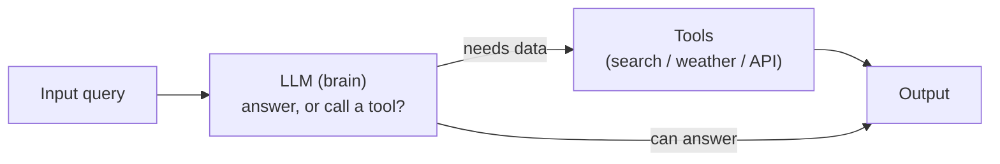
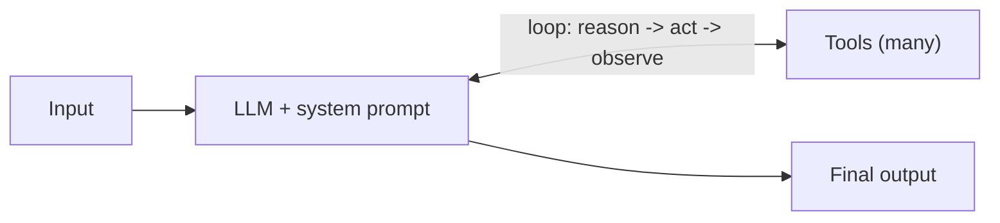
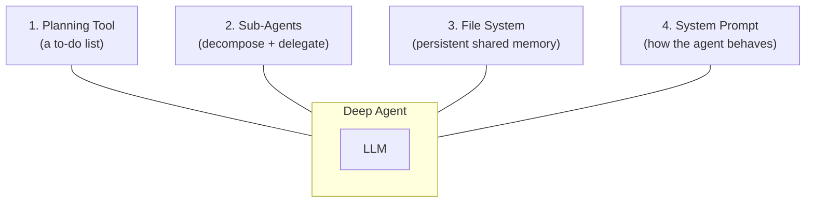
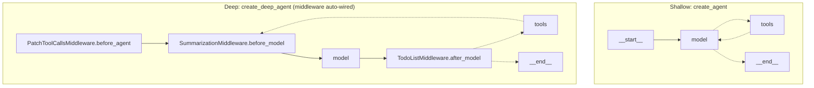

# ML Study 13e — Deep Agents: Planning, Sub-Agents, and a File System

**Covers:** the progression **LLM → shallow agent → deep agent** → why a **shallow (ReAct) agent** hits a ceiling (no explicit planning, can't decompose complex queries, limited context retention) → the **four pillars** of a deep agent (**planning tool**, **sub-agents**, **file system / persistent memory**, **system prompt**) → building one with the **`deepagents`** library (built on LangGraph): a Tavily `web_search` tool, `create_agent` (shallow) vs `create_deep_agent` (deep), the **middleware graph** it wires in automatically (patch-tool-calls → summarization → model → todo-list), and the **virtual file system** where large tool results are auto-saved.
**Goal:** understand what makes an agent "deep" — and the judgment for when that depth is worth it versus when a shallow loop (or no agent at all) is the right call.

**Series context:** the **orchestration rung**, and the capstone of the agent arc. [Study 13](ML_Study_13_LangChain_Agents.html) gave the LLM tools; [13a](ML_Study_13a_LangGraph.html) gave it a controllable graph/loop; [13b](ML_Study_13b_MCP.html) standardized tool access; [13c](ML_Study_13c_RAG.html)/[13d](ML_Study_13d_Vectorless_RAG.html) made retrieval a capability. A **deep agent** composes all of it: it *plans*, *decomposes*, *delegates* to sub-agents, and *persists* state — the same jump from *reacting* to *orchestrating* that separates a capable individual from someone who runs a program. Built on LangGraph; the canonical examples are **Claude Code, Deep Research, and Manus**. Built from a hands-on Agentic-AI walkthrough. Companion notebook: `1-basics-deep-agent.ipynb`.

> The frame for the whole chapter: a shallow agent **reacts** — query in, tool out, done. A deep agent **holds the whole** — it makes a plan, splits it into tracked sub-tasks, hands each to a specialist, and keeps a shared memory so nothing is lost. That's not a bigger prompt; it's a different architecture.

---

## Part 1 — The progression: from LLM to shallow agent

Recall the simplest agent (Study 13). The LLM is the **brain**: it takes input and decides whether to answer directly or call a **tool** (a search API, a weather API, Tavily). The tool returns a result, and the agent produces output.



The **ReAct agent** (Study 13/13a) improves on this: the LLM is wired to *many* tools, and after each tool result the **context loops back** to the LLM, which decides whether to call another tool. *Reason → Act → observe → Reason again*, any number of times, until the query is solved. Ask *"what is 2+2, then multiply by 5"* and it can chain the steps.



Both of these are **shallow agents** — and the ReAct loop, powerful as it is, is still just *LLM + tools in a loop*. That ceiling shows up on real work:

- **No explicit planning.** A query arrives, the LLM reacts. There's no step where it *lays out a plan* before acting.
- **Complex queries can't be decomposed.** Ask *"find today's AI news, relate it to economics, and to the latest in physics"* and there's no mechanism to break that into sub-problems, assign each to a worker, and combine the results.
- **Limited context retention.** One flow, one pass. There's no durable place to accumulate and share what's been learned across many steps.

> **Judgment — shallow vs. deep is the same distinction as fighting fires vs. running a program, and it's the heart of delivery.** The shallow loop is the engineer who reacts to whatever's in front of them, one ticket at a time — genuinely useful, and exactly right for simple work. But hand it something big and ambiguous and it has nowhere to put a *plan*, no way to *split and delegate*, no *shared memory* to hold the whole. Those three gaps — planning, decomposition/delegation, and persistence — are precisely what separates someone who executes tasks from someone who can carry a complex program. A deep agent is that jump, encoded.

---

## Part 2 — The four pillars of a deep agent

A deep agent works completely differently. Around the LLM it adds **four core components** — and together they turn "react to a query" into "run a project."



**1. Planning tool — a to-do list.** When a query arrives, the agent doesn't jump straight to a tool. It first **makes a plan**: an explicit to-do list of the steps required. Give it *"book a 3-night, 4-day Paris trip on a ₹100k budget"* and it writes: day 1 — fly + hotel; day 2 — Eiffel Tower; day 3 — museums; day 4 — return; plus what to book, what not to, and the per-day cost. The plan is *written down and tracked*, not held implicitly in one forward pass.

**2. Sub-agents — decompose and delegate.** Someone has to *execute* each to-do item, so the deep agent spawns **specialized sub-agents**, one per task. For a *"research and write a blog"* job: sub-agent 1 researches on the internet, sub-agent 2 pulls from research papers (arXiv), sub-agent 3 writes, sub-agent 4 checks copyright — and they can work in parallel. Each sub-agent gets a **bounded piece** and its own isolated context, so no single context has to hold everything.

**3. File system — persistent shared memory.** A **file system** (real or virtual) serves as persistent memory that *all* sub-agents can read and write. One sub-agent's research is saved where the writer sub-agent can use it. This is what lets work accumulate and be shared across steps and agents — and it's how the agent manages *large* context without stuffing everything into the prompt.

**4. System prompt — the operating discipline.** A detailed **system prompt** defines how the agent behaves — its role, standards, tone, what it must and must not do. The canonical example is **Claude Code's** system prompt (public, and famously long and detailed): *"You are Claude Code… an interactive CLI tool that helps users with software engineering tasks… Assist with defensive security tasks only. Refuse to create, modify, or improve code that may be used maliciously…"* That prompt is what makes a general model behave like a disciplined engineer.

> **Judgment — the four pillars are a delivery playbook wearing an AI costume.** Look at what they actually are: **make the plan explicit and trackable** (the to-do list), **decompose and delegate to specialists with clear ownership** (sub-agents with isolated context), **keep a shared source of truth so nothing lives only in one head** (the file system), and **set the standards up front** (the system prompt). That is how you run any complex program — human or agentic. It's also the concrete form of a principle from every turnaround: *turn ambiguity into something clear, repeatable, and not dependent on one hero.* The planning tool makes the work legible; the file system makes it survive; the sub-agents make it scale past one context. The technology is new; the discipline is not.

---

## Part 3 — Building one: `deepagents` on LangGraph

The **`deepagents`** library is a standalone package for building agents that tackle complex, multi-step tasks. It's **built on LangGraph** (Study 13a) — so it inherits state, stateful workflows, and the graph model — and it ships the four pillars pre-wired.

**Setup** (keys in `.env`, loaded — never in source):
```python
# requirements.txt: deepagents langchain langchain-openai langchain-groq
#                   tavily-python python-dotenv ipykernel
import os
from dotenv import load_dotenv
load_dotenv()

os.environ["OPENAI_API_KEY"] = os.getenv("OPENAI_API_KEY")
os.environ["GROQ_API_KEY"]   = os.getenv("GROQ_API_KEY")
os.environ["GOOGLE_API_KEY"] = os.getenv("GOOGLE_API_KEY")
os.environ["TAVILY_API_KEY"] = os.getenv("TAVILY_API_KEY")
```

**A tool** — real-time web search via Tavily (the sub-agents' window to the internet):
```python
from typing import Literal
from tavily import TavilyClient

tavily_client = TavilyClient(api_key=os.getenv("TAVILY_API_KEY"))

def web_search(query: str,
               max_results: int = 5,
               topic: Literal["general", "news", "finance"] = "general",
               include_raw_content: bool = False):
    """Run a web search."""
    return tavily_client.search(
        query,
        max_results=max_results,
        include_raw_content=include_raw_content,
        topic=topic,          # keep the argument ORDER the client expects
    )
```

**A model** — any provider; here Groq via LangChain's universal initializer:
```python
from langchain.chat_models import init_chat_model
model = init_chat_model("groq:qwen/qwen3-32b")
```

**Shallow vs. deep — the same shape, one word different:**
```python
# Shallow agent (Study 13): LLM + tools, plain loop
from langchain.agents import create_agent
simple_agent = create_agent(model=model, tools=[web_search])

# Deep agent: adds planning, sub-agents, file system, system prompt
from deepagents import create_deep_agent
deep_agent = create_deep_agent(
    tools=[web_search],
    system_prompt="Act as a researcher.",
    model=model,
)
```

That's the entire API difference: `create_agent` → `create_deep_agent`. But look at the **graph each produces** — this is where "deep" lives.



The deep agent auto-attaches **middleware hooks** (the same middleware idea from the LangChain module):
- **`TodoListMiddleware` (after model)** — automatically creates and tracks the **to-do list**, splitting the task into sub-tasks and tracking execution. This *is* pillar 1, wired in for free.
- **`SummarizationMiddleware` (before model)** — as the conversation grows, it **summarizes** to keep context manageable. This is part of pillar 3 (context management).
- **`PatchToolCallsMiddleware` (before agent)** — repairs/normalizes tool calls before they run.

**Invoke it:**
```python
result = deep_agent.invoke({"messages": [{"role": "user", "content": "What is deepagent?"}]})
print(result["messages"][-1].content)      # the researched, cited answer

# The result ALSO carries a virtual file system:
result["files"]
# e.g. {'/large_tool_results/3fetmqatt': {'content': [...], 'created_at': ..., 'modified_at': ...}}
```

That `files` key is pillar 3 in action: when a tool result is **too large for context**, the deep agent *automatically writes it to its virtual file system* and keeps a reference, instead of blowing the context window. You'll literally see a `ToolMessage` like *"Tool result too large, the result of this tool call was saved in the filesystem at this path: /large_tool_results/…"*. The agent is managing its own memory.

> **Judgment — the auto-wired middleware is the tell: "deep" is a set of disciplines, not a smarter model.** Notice that nothing about the *model* changed between the shallow and deep agent — same LLM, same tools. What changed is the **harness**: automatic planning (to-do tracking), automatic context management (summarize + spill-to-file), tool-call repair. That's the whole lesson of production AI restated: **the intelligence is table stakes; the reliability comes from the scaffolding around it.** A deep agent is disciplined *structure* wrapped around a model — which is exactly what a senior engineer is, wrapped around raw capability.

---

## Part 4 — When to go deep (and when not to)

Deep agents are powerful and *expensive* — more LLM calls, more latency, more moving parts. The skill is knowing when the depth earns its cost.

**Reach for a deep agent when the task needs:**
- **Complex, multi-step work that requires planning and decomposition** — not "answer this," but "research, synthesize, and produce."
- **Large context managed through a file system** — work that would overflow a single context window.
- **Delegation to specialized sub-agents for context isolation** — distinct sub-jobs, each best handled with its own focused context.
- **Persistent memory across conversations and threads** — state that must survive.

**Stay shallow (or use no agent) when:**
- The task is a single step or a short tool-loop — a shallow `create_agent` (or a plain LLM call) is simpler, cheaper, faster, and easier to debug. The library's own guidance: *for simpler use cases, use `create_agent` or a custom LangGraph workflow.*

> **Judgment — "use the deepest thing available" is a junior instinct; matching depth to the task is the senior one.** This is the same discipline as [13d](ML_Study_13d_Vectorless_RAG.html)'s "the right pick depends on the doc, not the hype." A deep agent on a trivial query is slower, pricier, and *harder to reason about* than a single call — you've added planning, sub-agents, and a file system to answer "what's 2+2." Every layer of autonomy you add is a layer you must also observe, bound, and be able to debug at 2 a.m. So add depth deliberately, where the task genuinely requires plan-decompose-delegate-persist — and no sooner. The measure of an engineer isn't how much machinery they can deploy; it's how little they can get away with and still be right.

---

## Part 5 — Where the whole arc lands

Step back across the series. You went from a single LLM call, to giving it tools (13), to a controllable loop (13a), to standardized tools (13b), to retrieval by similarity (13c) and by reasoning (13d), to — here — an agent that **plans, decomposes, delegates, and remembers**. The trajectory has one shape: **more capability, held together by more discipline.**

The through-line worth keeping:
- **The model is never the hard part.** From "chunking destroys context" to "similarity ≠ relevance" to "deep = the scaffolding, not the model," every chapter located the difficulty in the *structure around* the model — the seams, the retrieval strategy, the planning, the memory.
- **The winning move is always to turn something ambiguous into something clear, repeatable, and not dependent on one hero.** A RAG pipeline, a reasoning tree, a deep agent's to-do list and file system — they're all the same instinct: make the work legible and durable.
- **Judgment is the constant.** Which retrieval? Which agent depth? What to automate and what to keep a human on? The tools changed every chapter; the discipline of matching the tool to the real problem never did.

That discipline is what outlasts any library in this series. Learn the tools; keep the judgment.

---

**Next → Guardrails** — bounding what an agent (deep or shallow) is allowed to do, and making its behavior safe and predictable in production. Reference library for the patterns underneath all of this: `systems-in-production/playbooks/ai/`.

---

> **Security note (applies whenever you follow along):** the walkthrough's `.env` is shown on screen with **live** OpenAI, Groq, Google, and Tavily keys. Using a `.env` is the *right* pattern — but keep it in `.gitignore`, never paste real keys into a notebook or screen-share, and rotate any key that becomes visible. A key shown in a video or committed to git is a key to treat as compromised.
