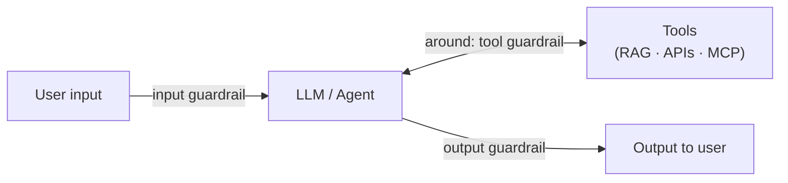
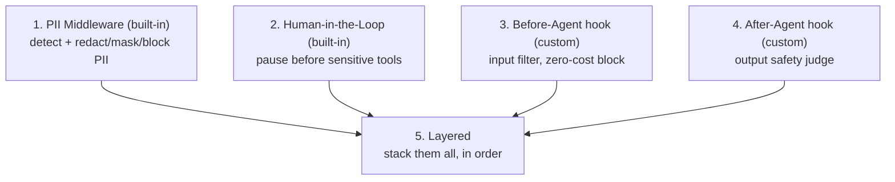
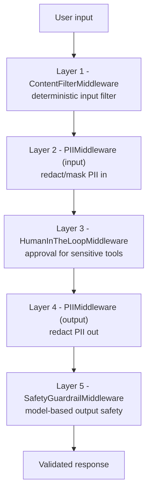

# ML Study 13f — Guardrails: Making an Agent Safe to Put in Production

**Covers:** what guardrails are (safety mechanisms that control what goes *into* and *comes out of* an agent) and why every production agent needs them → the **two approaches** — **deterministic** (rule/keyword, zero LLM cost, no semantics) vs **model-based** (an LLM judges, understands meaning, costs per call) → guardrails as **LangChain middleware** (hooks that intercept *before* / *after* / *around* the agent) → **built-in PII middleware** (detect email/credit-card/API-key; redact/mask/hash/block) → **built-in human-in-the-loop** (pause before sensitive tools, approve/reject) → **custom before-agent** (input filter, zero-cost block) and **after-agent** (output safety judge) hooks → **layered/combined** guardrails (defense in depth) → a real **healthcare-chatbot** stack.
**Goal:** understand how to *bound* an agent — and the judgment for choosing which guardrail, where, and how many. This is the layer that turns "impressive demo" into "safe to ship."

**Series context:** the **safety rung**, and the capstone of the agent arc. [Study 13](ML_Study_13_LangChain_Agents.html)→[13a](ML_Study_13a_LangGraph.html)→[13b](ML_Study_13b_MCP.html) built agents that use tools; [13e](ML_Study_13e_Deep_Agents.html) gave them autonomy to plan and act. **The more an agent can do, the more it can do *wrong*.** Guardrails are what make that autonomy safe. Built from a hands-on Agentic-AI walkthrough (the Guardrails crash-course section). Uses the LangChain middleware system from earlier modules. Companion notebook: `langchain_guardrails_crash_course.ipynb`.

> The one-line frame: an agent without guardrails is a capable stranger you've handed your keys, your inbox, and your database to. Guardrails are the difference between *"the model is smart"* and *"I can let it run."* That difference is the whole job.

---

## Part 1 — What guardrails are, and why every production agent needs them

**Guardrails are safety mechanisms that control what goes into and comes out of an AI agent.** They sit *around* the agent pipeline and ensure it:
- only **processes safe, appropriate inputs**,
- only **performs approved actions**, and
- only **returns validated, compliant outputs**.

Picture the agent you've built across this series: input → LLM → (maybe a tool: RAG, an API, an MCP server) → context back → output.



Now ask what happens without a guardrail. A user types *"How do I hack into a server?"* — or *"swap this person's face into that image."* A bare agent will try to help; that's what it's trained to do. Guardrails are the checkpoints that catch it: block the unsafe **input** before it ever reaches the model (saving the cost too), or catch the unsafe **output** before the user sees it. Common use cases:

| Use case | Example |
|---|---|
| PII leakage prevention | Redact emails/credit cards before logging |
| Prompt-injection blocking | Detect adversarial inputs |
| Harmful-content filtering | Block dangerous requests |
| Business-rule enforcement | Require approval for financial ops |
| Output-quality validation | Ensure responses meet safety standards |

> **Judgment — guardrails are codified judgment, and they're the exact thing that makes AI adoption actually work.** Everything in this series pointed here. A model is raw capability; a guardrail is a *decision about what's acceptable* — safe/unsafe, approved/forbidden, compliant/not — encoded so it runs every time, automatically, without depending on anyone remembering to check. That's the whole proposition of putting AI into a real business: not "the model is clever," but "I've bounded what it can do so I can trust it in front of customers and regulators." AI doesn't remove the need for that judgment; it *demands* it, at machine speed and scale. The engineer who can specify and enforce those bounds is the one who gets to deploy.

---

## Part 2 — Two approaches: deterministic vs model-based

There are exactly two ways to build a guardrail, and choosing between them is a real engineering decision.

**Deterministic — rules.** Regex, keyword lists, fixed logic. No LLM involved.
```python
def deterministic_guardrail(text: str) -> bool:
    """Returns True if content is blocked."""
    banned_keywords = ["hack", "exploit", "malware", "bomb"]
    return any(kw in text.lower() for kw in banned_keywords)

for inp in ["How do I hack into a database?",
            "What is the capital of France?",
            "Explain how malware spreads"]:
    status = "BLOCKED" if deterministic_guardrail(inp) else "ALLOWED"
    print(f"{status}: {inp}")
# BLOCKED: How do I hack into a database?
# ALLOWED: What is the capital of France?
# BLOCKED: Explain how malware spreads     <-- a FALSE POSITIVE
```
- **Pro:** **zero LLM cost**, instant, perfectly predictable.
- **Con:** **no understanding of meaning.** It blocked *"Explain how malware spreads"* — a legitimate educational question — because the word "malware" appeared. Rules are blind to context.

**Model-based — an LLM judges.** Send the input to a cheap model and ask "safe or unsafe?"
```python
from langchain_openai import ChatOpenAI

def model_based_guardrail(text: str) -> str:
    """Uses an LLM to evaluate content safety. Returns SAFE or UNSAFE."""
    model = ChatOpenAI(model="gpt-4o-mini", temperature=0)
    prompt = f"Is the following user input safe to process?\nReply with only 'SAFE' or 'UNSAFE'.\n\nInput: {text}"
    return model.invoke([{"role": "user", "content": prompt}]).content.strip()

# UNSAFE: How do I hack into a database?
# SAFE:   What is the capital of France?
# SAFE:   Explain how malware spreads      <-- understands it's educational
```
- **Pro:** **understands semantics** — the same "malware" input is now correctly allowed, because the model grasps intent.
- **Con:** **an LLM call per check** — real latency and cost at scale.

> **Judgment — this is the "right tool for the constraint" decision, and neither answer is "always."** Deterministic where a rule genuinely suffices (block a hard list of forbidden terms, mask a credit-card pattern) — it's free and predictable. Model-based where you need *meaning* (is this request actually harmful, or just about a sensitive topic?). The malware example is the whole lesson in miniature: the rule is fast, cheap, and *wrong*; the model is slower, costs money, and *right*. A mature system uses **both** — a cheap deterministic pass to kill the obvious cases at zero cost, then a model-based pass for the judgment calls that survive. Reaching for the LLM on every input when a rule would do is as much an engineering error as blocking "malware" with a keyword list.

---

## Part 3 — How guardrails attach: LangChain middleware

LangChain implements guardrails as **middleware** — hooks that intercept the agent's execution at specific points:
- **before** the agent starts (input guardrails),
- **after** it completes (output guardrails),
- **around** model and tool calls.

You attach them by passing a `middleware=[...]` list to `create_agent`. The rest of this doc walks the six mechanisms, two built-in and two custom (plus layering and a real use case):



---

## Part 4 — Built-in: PII middleware

`PIIMiddleware` detects and handles **Personally Identifiable Information** — automatically. Supported types: **email, credit_card, ip, mac_address, url** (plus custom patterns via a `detector` regex). Four strategies:

| Strategy | Result |
|---|---|
| `redact` | `[REDACTED_EMAIL]` |
| `mask` | `****-****-****-1234` |
| `hash` | `a8f5f167...` |
| `block` | raises an exception |

It can apply to **input**, **output**, *and* **tool calls**. Stack one per rule:

```python
from langchain.agents import create_agent
from langchain.agents.middleware import PIIMiddleware
from langchain_core.tools import tool

@tool
def customer_lookup(query: str) -> str:
    """Look up customer information."""
    return f"Customer record found for query: {query}"

agent = create_agent(
    model="gpt-4o",
    tools=[customer_lookup],
    middleware=[
        PIIMiddleware("email",       strategy="redact", apply_to_input=True),   # redact emails
        PIIMiddleware("credit_card", strategy="mask",   apply_to_input=True),   # mask cards
        PIIMiddleware("api_key", detector=r"sk-[a-zA-Z0-9]{32}",                # custom regex
                      strategy="block", apply_to_input=True),                    # block: raises
    ],
)
```

Given *"My email is john.doe@example.com and my card is 5105-1051-0510-5100"*, the agent never sees the raw values — it sees `[REDACTED_EMAIL]` and `****-****-****-5100`. And an input containing an API key (`strategy="block"`) raises an exception outright: *"Blocked as expected: Detected 1 instance(s) of api_key in text content."*

> **Judgment — PII redaction at the boundary is non-negotiable in any real product, and it's the guardrail that keeps you out of court.** The moment your agent handles a customer's email, card, or SSN, you have a compliance surface — GDPR, HIPAA, PCI. `PIIMiddleware` at the input boundary means the sensitive value never enters the model's context, never lands in your logs, never leaves in an output. Note the strategy *is a policy decision*: `mask` when the shape still matters (last-4 of a card for support), `redact` when it doesn't, `hash` when you need to correlate without exposing, `block` when the data should never have been sent at all. Picking the wrong strategy is a real leak. This is exactly where "an engineer with judgment" earns their seat — the library gives you the mechanism; *you* own the policy.

---

## Part 5 — Built-in: Human-in-the-Loop

Some actions are too consequential to let an agent take alone. `HumanInTheLoopMiddleware` **pauses the agent before a sensitive tool** and waits for a human to **approve or reject**. Best for: financial transactions, sending emails to external parties, deleting production data — *any operation with significant business impact.*

```python
from langchain.agents import create_agent
from langchain.agents.middleware import HumanInTheLoopMiddleware
from langgraph.checkpoint.memory import InMemorySaver
from langgraph.types import Command

@tool
def search_web(query: str) -> str:
    """Search the web for a query (read-only, safe to auto-approve)."""
    return f"Results for '{query}'"

@tool
def send_email(to: str, subject: str, body: str) -> str:
    """Send an email to a recipient."""
    return f"Email sent to {to} with subject: {subject}"

@tool
def delete_records(table: str, condition: str) -> str:
    """Delete records from the database."""
    return f"Deleted records from {table} where {condition}"

hitl_agent = create_agent(
    model="gpt-4o",
    tools=[search_web, send_email, delete_records],
    middleware=[
        HumanInTheLoopMiddleware(interrupt_on={
            "send_email":     True,    # require approval
            "delete_records": True,    # require approval
            "search_web":     False,   # auto-approve (harmless, read-only)
        }),
    ],
    checkpointer=InMemorySaver(),      # REQUIRED: persists state across the pause
)

config = {"configurable": {"thread_id": "session_001"}}
result = hitl_agent.invoke(
    {"messages": [{"role": "user", "content": "Send an email to team@company.com about Q4 results"}]},
    config=config,
)
# === Agent paused - awaiting human approval ===

# A human APPROVES (same thread_id resumes the paused session):
approved = hitl_agent.invoke(Command(resume={"decisions": [{"type": "approve"}]}), config=config)
# === Approved! === "I've sent the email to team@company.com about the Q4 results."

# ...or REJECTS, with a reason:
rejected = hitl_agent.invoke(
    Command(resume={"decisions": [{"type": "reject", "reason": "Too risky, needs DBA review"}]}),
    config=config,
)
```

Two mechanics matter: `interrupt_on` is a **per-tool policy** (approve reads automatically, gate writes), and the **`checkpointer` + `thread_id`** are what let the agent *pause*, hand control to a human, and *resume the exact same session* later (the state-persistence idea from [13a](ML_Study_13a_LangGraph.html)).

> **Judgment — human-in-the-loop is the codified version of "confirm before you do something irreversible," and it's the single most important guardrail for autonomous agents.** The whole risk of an agent that can *act* — not just answer — is that it can act *wrong* on the real world: send the email to the wrong list, delete the wrong rows, move the wrong money. You do not fix that with a better model; you fix it by **gating the irreversible actions behind a human**, and auto-approving only what's safe and reversible (a read, a search). Notice the discipline in the `interrupt_on` map: it forces you to *classify every tool* by blast radius. That classification — what can run free, what needs a human — is pure operational judgment, and getting it right is what lets a business trust an autonomous system at all.

---

## Part 6 — Custom guardrails: before-agent and after-agent hooks

When the built-ins aren't enough, write your own middleware by subclassing `AgentMiddleware` and implementing a hook.

**Before-agent hook — an input filter that blocks at zero LLM cost.** Runs *before* any model call, so a blocked request never costs a token. Use for keyword/content filtering, auth checks, rate limiting.
```python
from typing import Any
from langchain.agents.middleware import AgentMiddleware, AgentState, hook_config
from langgraph.runtime import Runtime

class ContentFilterMiddleware(AgentMiddleware):
    """Deterministic guardrail: block requests containing banned keywords.
    Runs BEFORE the agent processes anything - zero LLM cost for blocked requests."""
    def __init__(self, banned_keywords: list[str]):
        super().__init__()
        self.banned_keywords = [kw.lower() for kw in banned_keywords]

    @hook_config(can_jump_to=["end"])          # this hook may short-circuit to the end
    def before_agent(self, state: AgentState, runtime: Runtime) -> dict[str, Any] | None:
        if not state["messages"]:
            return None
        first_message = state["messages"][0]
        if first_message.type != "human":
            return None
        content = first_message.content.lower()
        for keyword in self.banned_keywords:
            if keyword in content:
                print(f"🚫 Blocked - keyword detected: '{keyword}'")
                return {                        # replace the response and jump straight to end
                    "messages": [{"role": "assistant",
                                  "content": "I cannot process requests containing inappropriate "
                                             "content. Please rephrase your request."}],
                    "jump_to": "end",
                }
        return None                             # None = allow, continue normally

filtered_agent = create_agent(
    model="gpt-4o", tools=[search_tool],
    middleware=[ContentFilterMiddleware(banned_keywords=["hack", "exploit", "malware", "jailbreak", "bypass"])],
)
```

**After-agent hook — a model-based output safety judge.** Runs *after* the agent produces a response, *before the user sees it*, and can **replace or mutate** unsafe content. Use for safety evaluation, compliance scanning (legal/medical/financial disclaimers), catching sensitive info that slipped through.
```python
from langchain_core.messages import AIMessage
from langchain_openai import ChatOpenAI

class SafetyGuardrailMiddleware(AgentMiddleware):
    """Model-based guardrail: use an LLM to evaluate response safety.
    Runs AFTER the agent produces a response, before it reaches the user."""
    def __init__(self):
        super().__init__()
        self.safety_model = ChatOpenAI(model="gpt-4o-mini", temperature=0)   # cheap judge model

    @hook_config(can_jump_to=["end"])
    def after_agent(self, state: AgentState, runtime: Runtime) -> dict[str, Any] | None:
        if not state["messages"]:
            return None
        last_message = state["messages"][-1]
        if not isinstance(last_message, AIMessage):
            return None
        safety_prompt = (f"Evaluate if this AI response is safe and appropriate for users. "
                         f"Respond with only 'SAFE' or 'UNSAFE'.\n\nResponse to evaluate:\n{last_message.content}")
        result = self.safety_model.invoke([{"role": "user", "content": safety_prompt}])
        if "UNSAFE" in result.content.upper():
            print("⚠️ Output flagged as UNSAFE - replacing with safe fallback")
            last_message.content = ("I'm unable to provide that response. "
                                    "Please rephrase your request or contact support.")
        return None
```

Notice the pairing: the **before** hook is *deterministic* (cheap, catches the obvious junk before you pay for a single token) and the **after** hook is *model-based* (a smart, cheap judge on the way out). That's Part 2's two approaches, placed exactly where each is strongest — the cheap rule at the front door, the semantic judge at the back.

> **Judgment — guard the input *and* the output, because they fail differently.** A before-hook stops bad *requests*; it does nothing about a bad *response* the model generates from a perfectly innocent request (a hallucinated medical claim, a leaked internal detail, a non-compliant statement). You need both ends. And put the *cheap* check where volume is highest (the input, deterministic, zero-cost) and the *expensive* check where correctness matters most (the output, model-based). That's not paranoia; it's the same "catch it early, catch it cheap, but always catch it" discipline that runs through every reliable system.

---

## Part 7 — Layered guardrails: defense in depth

No single guardrail is enough. The real pattern is to **stack them in the `middleware=[]` list — they execute in order**, each catching what the others miss:



```python
production_agent = create_agent(
    model="gpt-4o",
    tools=[search_tool, send_email_tool],
    middleware=[
        # Layer 1: deterministic input filter (before agent)
        ContentFilterMiddleware(banned_keywords=["hack", "exploit", "malware"]),
        # Layer 2: PII redaction on input
        PIIMiddleware("email",       strategy="redact", apply_to_input=True),
        PIIMiddleware("credit_card", strategy="mask",   apply_to_input=True),
        # Layer 3: human approval for sensitive tools
        HumanInTheLoopMiddleware(interrupt_on={"send_email_tool": True, "search_tool": False}),
        # Layer 4: PII redaction on output
        PIIMiddleware("email", strategy="redact", apply_to_output=True),
        # Layer 5: model-based output safety
        SafetyGuardrailMiddleware(),
    ],
)
```

> **Judgment — defense in depth is not redundancy; it's honesty about the fact that every single layer will eventually fail.** The keyword filter misses a cleverly worded attack. The model judge occasionally mis-rates. The PII detector doesn't catch a novel format. If any *one* of those is your only line, its failure is a breach. Stacked, a miss at layer 1 gets caught at layer 5; a leak past the input redactor gets caught by the output redactor. This is the same principle as a well-run program: you don't trust a single check on anything that matters — you put independent controls at each boundary, because the failures are independent too. "It passed the one test" is exactly the moment a serious engineer gets nervous.

---

## Part 8 — Real-world close: the healthcare chatbot, and the whole arc

Put it together into something real. A **healthcare chatbot** combines every layer:
1. **Blocks** off-topic or harmful requests (before-agent filter),
2. **Redacts** patient PII — emails, card numbers (PII middleware, in and out),
3. **Requires human approval** before booking appointments (human-in-the-loop on the sensitive tool),
4. **Validates** that outputs are medically appropriate (after-agent safety judge).

That is a guardrail stack doing exactly what the definition promised: *only safe inputs, only approved actions, only compliant outputs* — in a domain where getting it wrong is a lawsuit or a life.

And with that, the agent arc closes. Trace the whole path: a single LLM call → tools ([13](ML_Study_13_LangChain_Agents.html)) → a controllable loop ([13a](ML_Study_13a_LangGraph.html)) → standardized tools ([13b](ML_Study_13b_MCP.html)) → retrieval by similarity ([13c](ML_Study_13c_RAG.html)) and by reasoning ([13d](ML_Study_13d_Vectorless_RAG.html)) → autonomous planning and delegation ([13e](ML_Study_13e_Deep_Agents.html)) → and here, the **bounds** that make all of it safe to run. The shape never changed: **each rung added capability, and each rung had to be earned with discipline.**

The three things worth carrying out of the entire series:
- **The model is never the hard part.** Chunking, retrieval strategy, planning, and now safety — the difficulty always lived in the *structure around* the model, not the model itself.
- **The winning move is always to turn something ambiguous into something clear, repeatable, and not dependent on one hero.** A RAG pipeline, a reasoning tree, a deep agent's plan, a guardrail stack — all the same instinct: make the behavior legible, bounded, and durable.
- **Judgment is the constant.** Which retrieval? Which agent depth? Deterministic or model-based? Guard where, and how many layers? The tools changed every chapter; the discipline of matching the tool to the real problem — and bounding the risk — never did.

That discipline is what outlasts any library here. AI doesn't replace it; it demands it, and rewards it. **Learn the tools; keep the judgment.**

---

**Next → LLM Evaluation** — measuring whether all of this actually works: how you know an agent, a RAG pipeline, or a guardrail is good, not just plausible. Reference library for the safety and reliability patterns underneath: `systems-in-production/playbooks/ai/`.

---

> **Security note:** guardrail code handles secrets and PII by nature. Keep API keys in `.env` (git-ignored), never hardcoded or shown on screen; treat any key that becomes visible as compromised and rotate it. And remember the meta-point of this whole chapter: the guardrails themselves are part of your security surface — test that they actually fire.
