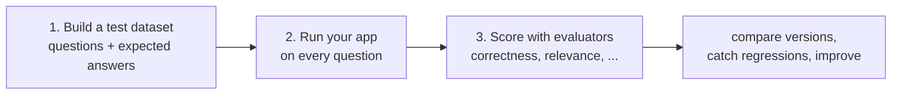
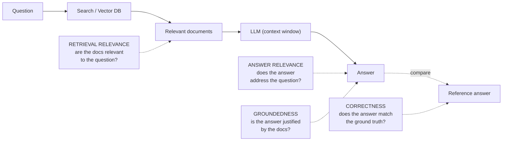
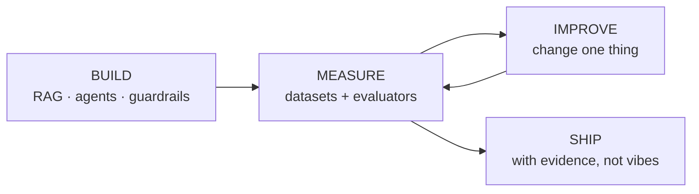

# ML Study 13g — LLM Evaluation: Don't Ship on Vibes

**Covers:** *why* you evaluate LLM apps (you cannot improve what you cannot measure) → the **three-step workflow** (build a test dataset → run your app on it → score with evaluators) → **LLM-as-judge** and its deterministic counterpart → the **four RAG evaluation metrics** (correctness, answer relevance, groundedness, retrieval relevance) and which need a reference answer → a full **chatbot** evaluation (dataset, correctness judge, concision check, `client.evaluate`) → a full **RAG** evaluation (structured-output graders with `TypedDict`, the four evaluators, one run) → doing this with **LangSmith** (and the tool-agnostic principles underneath it).
**Goal:** learn how to know whether an AI system is actually *good* — not just plausible — and to make its improvement a measured, repeatable process instead of a hunch.

**Series context:** the **measurement rung**, and the loop-closer for the whole series. You built RAG ([13c](ML_Study_13c_RAG.html)/[13d](ML_Study_13d_Vectorless_RAG.html)), agents ([13e](ML_Study_13e_Deep_Agents.html)), and guardrails ([13f](ML_Study_13f_Guardrails.html)). Evaluation is how you find out if any of it *works* — and it makes the earlier principles concrete: "similarity ≠ relevance" becomes a **retrieval-relevance** metric; "grounding is not reasoning" becomes a **groundedness** metric. Built from a hands-on Agentic-AI walkthrough (the LLM-evaluation section). Companion notebook: `1-rag_evaluation.ipynb`.

> The one-line frame, borrowed from the tool this lesson uses: **don't ship on "vibes" alone.** A demo that looks right in three hand-picked queries tells you almost nothing. Evaluation is the difference between "it seemed fine when I tried it" and "it scores 0.86 on correctness across 50 cases, up from 0.71 last version."

---

## Part 1 — Why evaluate, and the three-step workflow

Everything in this series so far *builds*. This chapter *checks*. And it's the step most people skip, because a working demo feels like done — until it fails on the query you didn't try. You cannot improve what you cannot measure, and you cannot trust what you have not tested.

Every LLM evaluation, whether for a chatbot or a full RAG pipeline, is the same three steps:



1. **Build a test dataset** — a set of example inputs (questions), and for some metrics, the *reference* (ground-truth) answers you expect.
2. **Run your application** on every example to produce its actual outputs.
3. **Score the outputs** with *evaluators* — functions that grade each output on some dimension.

The evaluators come in the same two flavors you saw in [guardrails (13f)](ML_Study_13f_Guardrails.html):
- **Deterministic** — a rule. Fast, free, exact. (e.g., "is the answer shorter than 2× the reference?")
- **LLM-as-judge** — a model grades the output against criteria. Understands meaning; costs a call. (e.g., "is this answer factually correct relative to the ground truth?")

> **Judgment — "don't ship on vibes" is your engineering conscience, encoded.** The instinct to eyeball a few outputs and call it good is exactly how unreliable systems reach production. Evaluation replaces the hunch with a number you can *move* — and, more importantly, a number you can *regress against* when you change the prompt, the model, or the chunking. The senior move isn't running the eval once; it's making it the gate every change has to pass. You can't claim "this is better" without it — you can only *feel* it, and feelings don't survive contact with real users.

---

## Part 2 — The four RAG evaluation metrics

RAG has a canonical evaluation picture. A question flows through search → relevant documents → the LLM → an answer, which you can also compare to a reference answer. Each arrow is a different thing that can go wrong, and each gets its own metric:



| Metric | Compares | Question it answers | Needs a reference? |
|---|---|---|---|
| **Correctness** | answer ↔ **reference** | Is the answer factually right? | **Yes** (ground-truth dataset) |
| **Answer relevance** | answer ↔ **question** | Did it actually address the question? | No |
| **Groundedness** | answer ↔ **retrieved docs** | Is it justified by the docs (not hallucinated)? | No |
| **Retrieval relevance** | retrieved docs ↔ **question** | Did search fetch the right documents? | No |

> **Judgment — these four metrics are the earlier chapters made measurable, and separating them is the whole point.** In [13c](ML_Study_13c_RAG.html) I argued you must "evaluate retrieval and generation separately, because they fail separately." Here's that argument as a scorecard. **Retrieval relevance** is "similarity ≠ relevance" ([13c](ML_Study_13c_RAG.html)/[13d](ML_Study_13d_Vectorless_RAG.html)) turned into a number — did search fetch the right thing? **Groundedness** is "grounding is not reasoning" ([13d](ML_Study_13d_Vectorless_RAG.html)) turned into a number — did the model stick to the facts or invent? A single "is the final answer good?" score would blur all four and tell you *nothing* about where to fix. When a RAG system scores badly, this table tells you *which arrow broke* — retrieval, or generation, or grounding. That's the difference between debugging and guessing.

---

## Part 3 — Doing it with LangSmith (one implementation)

The walkthrough uses **LangSmith** — a hosted observability-and-evaluation platform ("a unified observability & evals platform… whether building with LangChain or not"). It gives you **datasets & experiments**, **evaluators**, tracing, and a UI to compare runs. Its testing surface: AI-judge evaluation, gold-standard evaluation, functional tests, human annotation; plus dataset construction, regression testing, and online evaluation.

Setup is a few environment variables (keys in `.env`, never hardcoded):
```python
import os
from dotenv import load_dotenv
load_dotenv()

os.environ["LANGSMITH_API_KEY"] = os.getenv("LANGSMITH_API_KEY")   # from your LangSmith account
os.environ["OPENAI_API_KEY"]    = os.getenv("OPENAI_API_KEY")
os.environ["LANGSMITH_TRACING"] = "true"                            # send traces to LangSmith
```

> **Judgment — LangSmith is one tool for these ideas, not the ideas themselves — and it's a hosted SaaS, so weigh that.** The *concepts* here — a test dataset, LLM-as-judge, the four RAG metrics, regression testing — are universal. You can run them in plain Python (as the chatbot `correctness` below does with a raw OpenAI call), or with `ragas`/`deepeval`, or with LangSmith's `client.evaluate`. What LangSmith adds is the **platform**: a hosted store for datasets/experiments, a UI to compare versions, tracing, and online (production) evaluation — real value, at the cost of an account, an API key, and a vendor dependency (note the "exceeded your per-month trace usage limits" banner in the demo — it's freemium). For a *course*, teach the principle and use whatever's simplest; for a *team shipping to production*, an observability+eval platform (LangSmith or an alternative) is usually worth it. Choose it as an observability decision, not because a tutorial did.

---

## Part 4 — Worked example: evaluating a chatbot

Start simple: a plain chatbot, two evaluators.

**Build the dataset** — questions with expected answers:
```python
from langsmith import Client
client = Client()

dataset_name = "Simple Chatbot Evaluation"
dataset = client.create_dataset(dataset_name)
client.create_examples(
    dataset_id=dataset.id,
    examples=[
        {"inputs": {"question": "What is LangChain?"},
         "outputs": {"answer": "A framework for building LLM applications"}},
        {"inputs": {"question": "What is LangSmith?"},
         "outputs": {"answer": "A platform for observing and evaluating LLM applications"}},
        {"inputs": {"question": "What is OpenAI?"},
         "outputs": {"answer": "A company that creates Large Language Models"}},
        # ...more examples...
    ],
)
```

**Define the evaluators** — one LLM-as-judge, one deterministic:
```python
import openai
from langsmith import wrappers

openai_client = wrappers.wrap_openai(openai.OpenAI())   # wrap = trace every call in LangSmith
eval_instructions = "You are an expert professor specialized in grading students' answers to questions."

# LLM-as-judge: is the response factually correct vs the reference?
def correctness(inputs: dict, outputs: dict, reference_outputs: dict) -> bool:
    user_content = f"""You are grading the following question:
{inputs['question']}
Here is the real answer:
{reference_outputs['answer']}
You are grading the following predicted answer:
{outputs['response']}
Respond with CORRECT or INCORRECT:
Grade:"""
    response = openai_client.chat.completions.create(
        model="gpt-4o-mini", temperature=0,             # temp 0 = consistent grading
        messages=[{"role": "system", "content": eval_instructions},
                  {"role": "user",   "content": user_content}],
    ).choices[0].message.content
    return response == "CORRECT"

# Deterministic: is the answer not more than 2x the reference length? (no LLM, free)
def concision(outputs: dict, reference_outputs: dict) -> bool:
    return int(len(outputs["response"]) < 2 * len(reference_outputs["answer"]))
```

**Define the target** (the app under test) and **run**:
```python
default_instructions = "Respond to the user's question in a short, concise manner (one short sentence)."

def my_app(question, model="gpt-4o-mini", instructions=default_instructions):
    return openai_client.chat.completions.create(
        model=model, temperature=0,
        messages=[{"role": "system", "content": instructions},
                  {"role": "user",   "content": question}],
    ).choices[0].message.content

def ls_target(inputs: dict) -> dict:                     # adapt app -> eval's expected shape
    return {"response": my_app(inputs["question"])}

experiment_results = client.evaluate(
    ls_target,                                           # your AI system
    data=dataset_name,
    evaluators=[correctness, concision],
    experiment_prefix="openai-4o-mini-chatbot",
)
```

`client.evaluate` runs your app on every dataset example, applies both evaluators to each output, and (with LangSmith) posts a comparable experiment you can inspect. Notice the pairing again: **`correctness` is an LLM-judge** (needs to understand meaning) and **`concision` is a rule** (a length check needs no model) — the cheap check where a rule suffices, the smart check where it doesn't.

**The payoff — compare models and *decide*.** The reason you built all this scaffolding isn't to grade one run; it's to **choose**. Change one thing — here, the model — re-run the identical evaluation, and compare:
```python
def my_app(question, model="gpt-4-turbo", instructions=default_instructions):   # swap the model
    ...

experiment_results = client.evaluate(
    ls_target, data=dataset_name,
    evaluators=[correctness, concision],
    experiment_prefix="openai-4-turbo-chatbot",     # a different experiment name
)
```
Now two experiments sit side by side on the same dataset. In the walkthrough, **gpt-4o-mini and gpt-4-turbo tied on correctness (~0.6), but 4o-mini won on concision** — so the decision was 4o-mini: *same accuracy, tighter answers, and cheaper.* That is the entire point of evaluation: it turns "which model should we use?" from a vibe and a price-list into a **measured comparison on your own data.** Same machinery answers "did my prompt change help?" and "did the new chunking regress groundedness?" — you change one thing and let the numbers, not your gut, tell you.

> **Judgment — measured comparison is how you replace opinion with evidence, and it's the difference between an engineer and an advocate.** Everyone has a favorite model. The person who can say "4o-mini and 4-turbo tie on correctness here, but mini is tighter and a fraction of the cost, so we ship mini" has *evidence* — and evidence is what survives a review, a budget question, or a regression six weeks later. Without the eval, "which model?" is a debate settled by whoever is most confident in the room; with it, it's settled by the dataset. Build the comparison, and you stop arguing and start knowing.

---

## Part 5 — Worked example: evaluating RAG (the four metrics)

Now the full RAG scorecard. The upgrade from Part 4 is **structured output**: instead of parsing a raw "CORRECT/INCORRECT" string, each grader returns a typed object with an `explanation` *and* a boolean — forcing the judge to reason before it rules.

Each evaluator follows the same shape: a `TypedDict` schema, an instruction prompt, a grader LLM bound to that schema, and a function that builds the comparison and returns the boolean.

```python
from typing_extensions import Annotated, TypedDict
from langchain_openai import ChatOpenAI

# ---- 1. CORRECTNESS: answer vs reference answer ----
class CorrectnessGrade(TypedDict):
    # NOTE the three-arg Annotated form: the `...` (Ellipsis) placeholder is REQUIRED.
    # Writing Annotated[str, "..."] (two args) throws an "invalid schema" error under strict=True.
    explanation: Annotated[str,  ..., "Explain your reasoning for the score"]
    correct:     Annotated[bool, ..., "True if the answer is correct, False otherwise"]

correctness_instructions = """You are a teacher grading a quiz.
You will be given a QUESTION, the GROUND TRUTH (correct) ANSWER, and the STUDENT ANSWER.
Grade criteria:
(1) Grade ONLY on factual accuracy relative to the ground truth answer.
(2) Ensure the student answer contains no conflicting statements.
(3) It is OK if the student answer contains more information, as long as it is factually accurate.
Explain your reasoning step by step. Avoid simply stating the correct answer at the outset."""

# with_structured_output forces the model to return the typed schema, not free text
grader_llm = ChatOpenAI(model="gpt-4o-mini", temperature=0).with_structured_output(
    CorrectnessGrade, method="json_schema", strict=True)

def correctness(inputs: dict, outputs: dict, reference_outputs: dict) -> bool:
    answers = (f"QUESTION: {inputs['question']}\n"
               f"GROUND TRUTH ANSWER: {reference_outputs['answer']}\n"
               f"STUDENT ANSWER: {outputs['answer']}")
    grade = grader_llm.invoke([{"role": "system", "content": correctness_instructions},
                               {"role": "user",   "content": answers}])
    return grade["correct"]

# ---- 2. ANSWER RELEVANCE: answer vs question (no reference needed) ----
class RelevanceGrade(TypedDict):
    explanation: Annotated[str,  ..., "Explain your reasoning for the score"]
    relevant:    Annotated[bool, ..., "Whether the answer addresses the question"]

def relevance(inputs: dict, outputs: dict) -> bool:
    answer = f"QUESTION: {inputs['question']}\nSTUDENT ANSWER: {outputs['answer']}"
    grade  = relevance_llm.invoke([{"role": "system", "content": relevance_instructions},
                                   {"role": "user",   "content": answer}])
    return grade["relevant"]

# ---- 3. GROUNDEDNESS: answer vs retrieved docs (no reference needed) ----
def groundedness(inputs: dict, outputs: dict) -> bool:
    doc_string = "\n\n".join(doc.page_content for doc in outputs["documents"])
    answer = f"FACTS: {doc_string}\nSTUDENT ANSWER: {outputs['answer']}"
    grade  = grounded_llm.invoke([{"role": "system", "content": grounded_instructions},
                                  {"role": "user",   "content": answer}])
    return grade["grounded"]

# ---- 4. RETRIEVAL RELEVANCE: retrieved docs vs question ----
def retrieval_relevance(inputs: dict, outputs: dict) -> bool:
    doc_string = "\n\n".join(doc.page_content for doc in outputs["documents"])
    answer = f"FACTS: {doc_string}\nQUESTION: {inputs['question']}"
    grade  = retrieval_relevance_llm.invoke([{"role": "system", "content": retrieval_relevance_instructions},
                                             {"role": "user",   "content": answer}])
    return grade["relevant"]
```

Then run **all four at once** against your RAG bot. (The `rag_bot` itself — a web-loader + vector store + LLM built exactly as in [13c](ML_Study_13c_RAG.html) — is decorated `@traceable` so every call shows up in LangSmith, and it returns *both* the `answer` and the retrieved `documents`, because groundedness and retrieval-relevance need the docs, not just the answer.)
```python
def target(inputs: dict) -> dict:
    return rag_bot(inputs["question"])       # @traceable rag_bot -> {"answer": ..., "documents": [...]}

experiment_results = client.evaluate(
    target,
    data=dataset_name,
    evaluators=[correctness, groundedness, relevance, retrieval_relevance],
    experiment_prefix="rag-doc-relevance",
    metadata={"version": "LCEL context, gpt-4-0125-preview"},   # tag the run so you can compare later
)
```

The `metadata` tag matters more than it looks: it's what makes this a **regression test**. Change your chunking or model, re-run, and you can compare "rag-doc-relevance v2" against v1 across all four metrics — and see, concretely, whether your "improvement" actually improved anything or quietly broke groundedness while lifting relevance.

> **Judgment — force the judge to explain before it grades, and remember: who grades the grader?** Two non-obvious disciplines are baked into this code. First, **structured output with an `explanation` field before the boolean** — this isn't decoration; making the model *reason step-by-step before ruling* measurably reduces snap-judgment bias (the prompts literally say "avoid simply stating the answer at the outset"). Second, and deeper: **your evaluator is itself an LLM, with its own failure modes.** An LLM-as-judge can be wrong, inconsistent, or biased toward verbose answers. So you run it at `temperature=0` for consistency, you constrain it with `strict` schemas, and — for anything high-stakes — you *validate the judge against human labels* before you trust its scores. Evaluation is not a magic oracle; it's another system that itself needs evaluating. The engineer who forgets that just moved the trust problem one level up and stopped looking.

---

## Part 6 — Where this lands: the loop closes

With evaluation, the series completes a full cycle. You don't just *build* an AI system anymore — you **build it, measure it, and improve it against numbers**:



That loop — build, measure, improve, and only then ship — is what "production" actually means. Everything earlier in the series gave you capability; evaluation gives you the **confidence to change things without breaking them**, which is the thing that lets a system get *better* over time instead of drifting.

The through-line, one last time:
- **The model is never the hard part.** Even judging quality turns out to be a *systems* problem — datasets, separated metrics, regression tracking, validating the judge — not a matter of a smarter model.
- **Turn the unmeasurable into the measured.** "Is it good?" is a vibe. "Correctness 0.86, groundedness 0.91, up from last version" is a system you can steer. That's the same instinct — make the ambiguous clear and repeatable — that ran through every chapter.
- **Judgment is the constant.** Deterministic or LLM-judge? Which metric caught the failure? Do I trust this grader? The tools changed every chapter; the discipline of asking the right question — and *measuring* the answer — never did.

Build the tools. Measure everything. Keep the judgment. That's the job — in the AI era and every era before it.

---

**Next → this is the final chapter of the agentic-AI series.** For deeper reliability, observability, and eval patterns in production, see the playbooks in `systems-in-production/playbooks/ai/`.

---

> **Security note:** the walkthrough's `.env` is shown on screen with **live** OpenAI, Google, Groq, and LangSmith keys. Keep keys in `.env` (git-ignored), never hardcode them or expose them on a screen-share, and rotate any key that becomes visible. A key in a video or a commit is a compromised key.
