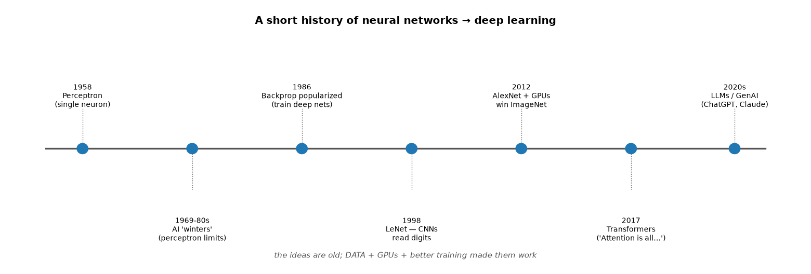
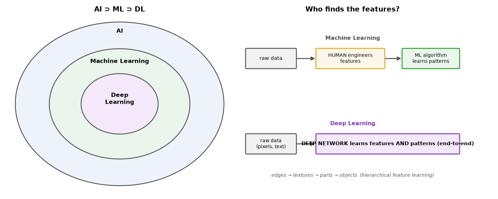
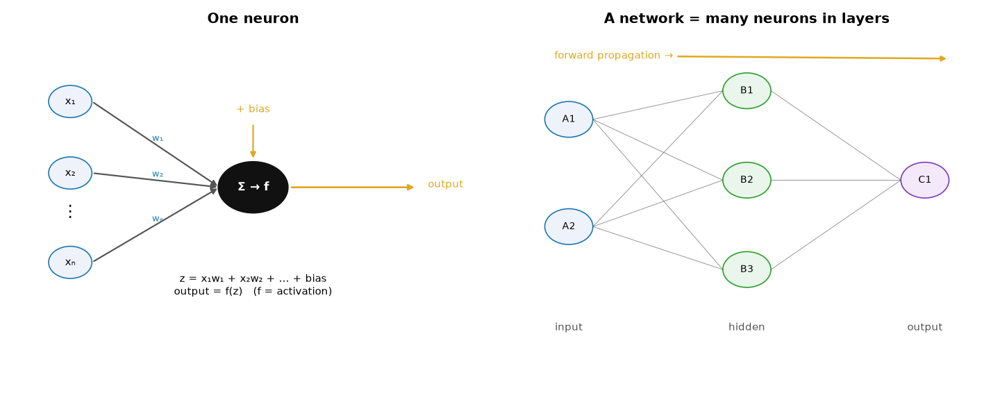
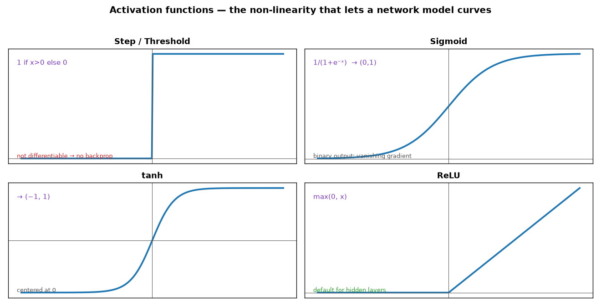
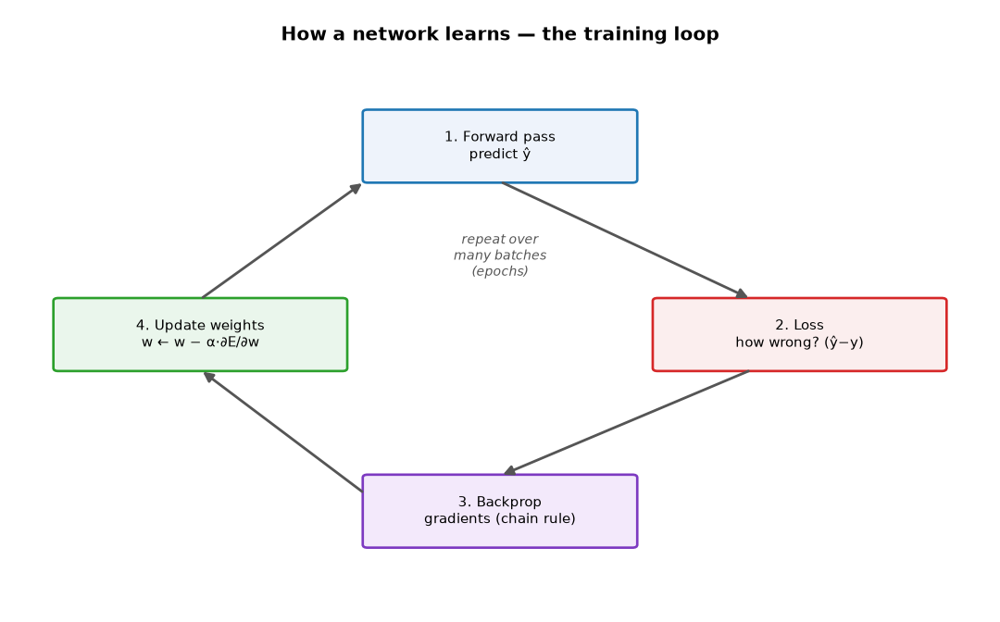
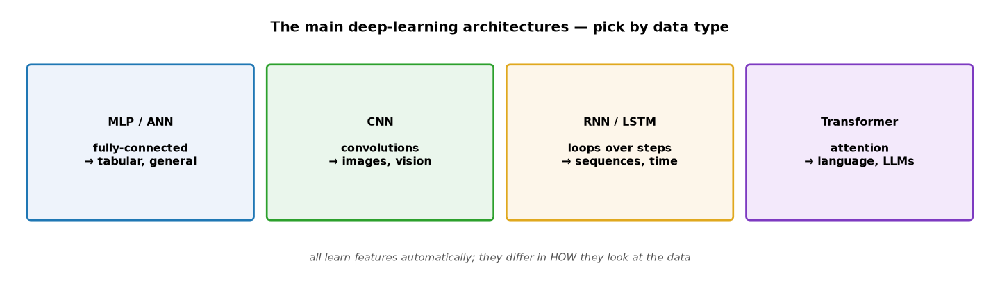
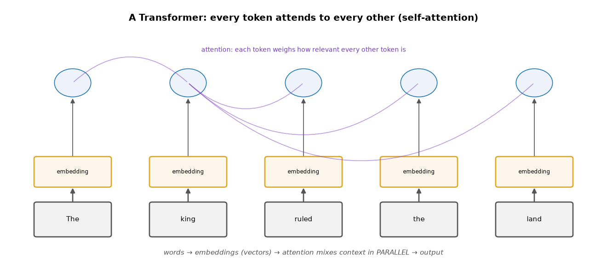
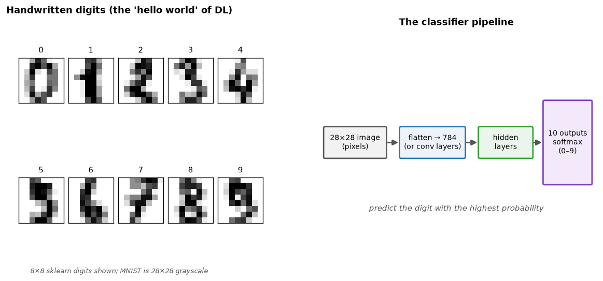
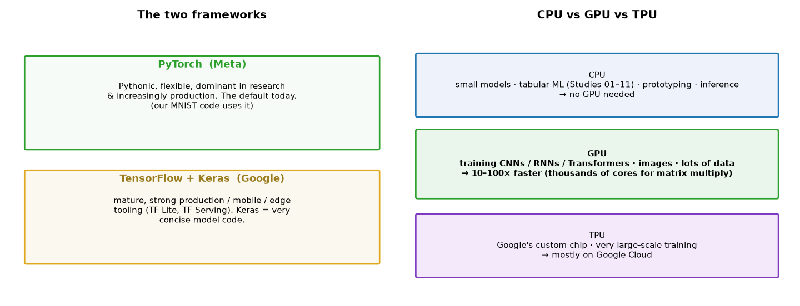

# ML Study 14 — Deep Learning: Neurons, Networks, and How They Learn

**Covers:** a short **history** of neural networks → **why** deep learning (automatic feature learning) → the **AI ⊃ ML ⊃ DL** hierarchy → the **neuron** and a **network** → **forward propagation** → **activation functions** → **loss** → **backpropagation** and **gradient descent** (how it learns) → the **architecture zoo** (MLP/CNN/RNN/Transformer) → **MNIST** with runnable **PyTorch** code.
**Goal:** understand what a neural network *is*, how it makes a prediction, and how it *learns* — enough to read, run, and reason about a deep-learning model, and to know when to reach for DL vs. the classical models from Studies 01–11.

**Series context:** the **Deep Learning rung (R3)**. Studies 01–11 were classical ML (you engineered features, the model learned patterns). Deep learning learns *both*. This is the bridge from tabular models to the LLMs and agents of Studies 13+. Runnable companion: the PyTorch MNIST code in Part 11 and `notebooks/hello_deeplearning.ipynb`.

---

## Part 1 — A short history (why now, not in 1958?)


*What this shows: the **ideas are old**. The perceptron (a single artificial neuron) is from 1958; backpropagation was popularized in 1986. Neural nets then stalled for decades. What changed wasn't the math — it was three things arriving together (Part 4): **big data, GPUs, and better training tricks**. That's why "deep learning" exploded after ~2012 (AlexNet) and led to Transformers (2017) and today's LLMs.*

**The one-line story:** we've known *how* to build neural networks for a long time; only recently did we have the **data and compute** to make deep ones actually work.

---

## Part 2 — Where deep learning sits, and why it's different

**Definition — Deep Learning:** a subset of machine learning that uses **neural networks with many layers** ("deep" = many layers). It belongs inside ML, which belongs inside AI.


*What this shows — the key difference: in **classical ML**, a **human** decides which features matter (word counts, ratios, flags) and the algorithm learns patterns over them. In **deep learning**, you feed **raw data** (pixels, text) and the network **learns the features *and* the patterns end-to-end** — early layers find edges, deeper layers find objects. That automatic, hierarchical feature learning is deep learning's superpower.*

> **The trade-off (say it plainly):** DL needs **much more data and compute**; classical ML often **wins on small or tabular data** with well-chosen features. DL isn't "better" — it's the right tool when features are hard to hand-craft (images, audio, language).

*(Note: "supervised vs. unsupervised" is a **different axis** — it asks "do we have labels?" ML-vs-DL asks "who finds the features?" The three paradigms — supervised, unsupervised, reinforcement — apply to both ML and DL.)*

---

## Part 3 — What deep learning is used for (things you use every day)

Deep learning is already in your pocket and your car. Concrete, recognizable examples — with the architecture each one leans on:

| You know it as… | What DL does | Architecture |
|---|---|---|
| **Tesla Autopilot / Waymo** | read cameras → detect lanes, cars, pedestrians, signs in real time | CNN (vision) |
| **Face ID / phone face unlock** | recognize your face in any lighting | CNN |
| **Siri / Alexa / Google Assistant** | turn speech into text, understand the request | RNN / Transformer |
| **Netflix / YouTube / Spotify / TikTok** | recommend what to watch or play next | deep recommenders |
| **Google Translate** | translate between languages | Transformer |
| **ChatGPT / Claude / Gemini** | understand and generate language | Transformer (LLM) |
| **Google Photos** | search "photos of my dog"; portrait & night mode | CNN |
| **Bank fraud alerts** | flag an unusual transaction instantly | anomaly detection |
| **DALL·E / Stable Diffusion / Midjourney** | generate images from a text prompt | diffusion |
| **Medical imaging / AlphaFold** | spot tumors in scans; predict protein structure | CNN / Transformer |
| **Apple Watch / Fitbit** | detect an irregular heartbeat or a fall | CNN / RNN on sensor data |

**The common thread:** every one takes in **raw, high-dimensional data** — camera pixels, audio waveforms, words — where a human could never hand-write the rules. That's exactly where deep learning wins (and where classical ML, Studies 01–11, does not fit).

---

## Part 4 — The neuron, and a network

Everything is built from one tiny unit: the **neuron** (perceptron). It does three things — **weighted sum → add bias → activation**:



$$z = x_1 w_1 + x_2 w_2 + \dots + x_n w_n + b \qquad \text{output} = f(z)$$

- **Weights (w)** — how important each input is (learned).
- **Bias (b)** — lets the neuron shift, like the intercept in $y = mx + b$ (learned).
- **Activation f** — a non-linear function (Part 6).

Stack neurons into **layers**, connect every neuron to every neuron in the next layer, and you have a **network**:

| Layer | Size set by | Your choice? |
|---|---|---|
| **Input** | number of features | no — fixed by the data |
| **Hidden** | experimentation | **yes — this is *the* design choice** |
| **Output** | the task | no — fixed by the task |

**Output layer rules:** binary → **1** neuron (sigmoid); N classes → **N** neurons (softmax); regression → **1** neuron (linear).

**What made deep learning possible — the 3 things:** (1) **better training algorithms** (good initialization, batch norm, Adam), (2) **GPUs** (thousands of cores for parallel matrix multiply), (3) **understanding hierarchical feature extraction** (edges → textures → parts → objects).

> **Counting parameters** (helps demystify "billions of parameters"): for layers `[3, 4, 1]` → weights `(3×4)+(4×1)=16`, biases `4+1=5` → **21 parameters**. Real networks just scale this up massively.

---

## Part 4½ — You already know a neuron: linear & logistic regression

This should feel familiar — because you've already built a neuron. **Linear regression and logistic regression are each a *single neuron*.** Deep learning just stacks many of them.

- **Linear regression** = one neuron with **no activation**: $\text{output} = w_1x_1 + \dots + w_nx_n + b$. That's the neuron from Part 4 *without* the f. (Study 01.)
- **Logistic regression** = one neuron with a **sigmoid** activation: $\text{output} = \sigma(w_1x_1 + \dots + b)$ — a weighted sum, a bias, and sigmoid. Literally one perceptron doing binary classification. (Study 03.)
- **A neural network** = **many** such units, stacked in **layers**, with non-linear activations between them.

| | Linear regression | Logistic regression | Neural network (DL) |
|---|---|---|---|
| Activation | none (linear) | sigmoid | ReLU (hidden) + sigmoid/softmax (out) |
| Layers | 1 neuron | 1 neuron | many hidden layers |
| Can model | a straight line / plane | **one** straight decision boundary | **curved, complex boundaries** |
| Trained by | gradient descent + MSE | gradient descent + cross-entropy | **backprop** + gradient descent |
| Finds features? | no — you engineer them | no | **yes — learns them** |

**So why stack them?** A single neuron — linear *or* logistic — can only draw **one straight line**. It cannot separate data that isn't linearly separable (the classic **XOR** problem). Add a hidden layer with a non-linear activation and the network can **bend the space** to draw curves and learn features automatically. That added representational power is the *entire* reason "deep" matters.

> **The reassuring part:** the machinery is **identical to what you already learned** — weighted sum → activation → a loss → gradient descent (Studies 01 & 03). A neural network is those same ideas, **stacked and trained end-to-end with backpropagation**. If you understood logistic regression, you already understand a neuron.

---

## Part 5 — Forward propagation (making a prediction)

**Forward propagation = push the input through the network, layer by layer. No learning — just computation.** For a 2→2→1 network:

```
# hidden layer
NetB1 = b1 + A1·W1 + A2·W3 ;   B1 = sigmoid(NetB1)
NetB2 = b2 + A1·W2 + A2·W4 ;   B2 = sigmoid(NetB2)
# output layer
NetC1 = b3 + B1·W5 + B2·W6 ;   Z  = sigmoid(NetC1)   ← the prediction ŷ
```

Worked (A1=1, A2=0): NetB1 = 0.6 → B1 ≈ 0.646; NetB2 = −0.5 → B2 ≈ 0.378; NetC1 ≈ 0.537 → **Z ≈ 0.631**. That 0.631 is the model's answer for this input.

---

## Part 6 — Activation functions (the non-linearity)

**Without activation functions, a whole network collapses to one linear equation** — no matter how many layers, it could only draw straight lines. Activations bend the space so the network can model curves.



| Function | Formula | Range | Note |
|---|---|---|---|
| **Step** | 1 if x>0 else 0 | {0,1} | not differentiable → can't train with backprop (historical) |
| **Sigmoid** | $1/(1+e^{-x})$ | (0,1) | binary output layer; "vanishing gradient" at extremes |
| **tanh** | $\tanh(x)$ | (−1,1) | centered at 0 |
| **ReLU** | $\max(0,x)$ | [0,∞) | **the default for hidden layers** — fast, avoids cancellation |

> **Why ReLU wins:** if one neuron says +5 and another −5, their sum cancels to 0 — the signal is lost. ReLU zeros the −5, preserving the useful +5. And **sigmoid vs softmax** at the output: sigmoid = one probability (binary); softmax = N probabilities that sum to 1 (multi-class).

---

## Part 7 — Loss: how wrong is the prediction?

A **loss (cost) function** measures the gap between the prediction ŷ and the truth y — the number training tries to shrink.

- **MSE** (regression): $\frac{1}{n}\sum(\hat y - y)^2$ — square so + and − errors don't cancel.
- **Binary cross-entropy** (2-class): $-\frac{1}{m}\sum[\,y\log\hat y + (1-y)\log(1-\hat y)\,]$ — punishes *confident wrong* answers hard.
- **Categorical cross-entropy** (multi-class, softmax + one-hot labels).

---

## Part 8 — Backpropagation: who caused the error?

**Backpropagation = work backward through the network with the chain rule to find how much each weight contributed to the loss** — the gradient $\partial E / \partial w$ for every weight.

$$\frac{\partial E}{\partial W_5} = \frac{\partial E}{\partial Z}\cdot\frac{\partial Z}{\partial NetC1}\cdot\frac{\partial NetC1}{\partial W_5} = (Z-Y)\cdot Z(1-Z)\cdot B_1$$

Every gradient starts with **(Z−Y)·Z(1−Z)** — the output error times the output's sigmoid slope — then chains one more link per layer going deeper. A handy fact used throughout: the **sigmoid derivative is $\sigma'(x) = \sigma(x)(1-\sigma(x))$** — you only need the output to get the slope (if σ=0.8, σ'=0.16).

> **Plain-terms:** forward pass makes a guess; loss says how wrong; backprop distributes the "blame" for that error back to every weight. That blame *is* the gradient.

---

## Part 9 — Gradient descent (the actual learning)

Now nudge every weight **downhill** on the loss:

$$w_{\text{new}} = w_{\text{old}} - \alpha \cdot \frac{\partial E}{\partial w}$$

- **α = learning rate** — step size. Too big → overshoot/diverge; too small → painfully slow; just right → smooth convergence.
- The **minus sign** moves opposite the gradient (toward the minimum). At the optimum, the gradient is 0.


*What this shows: the loop that **is** learning — **forward** (predict) → **loss** (how wrong) → **backprop** (gradients) → **update** (gradient descent) → repeat over many batches. One full pass over the data is an **epoch**; you run many.*

**Three flavors** (how much data per update): **Batch** (whole dataset — smooth, slow), **SGD** (one sample — fast, noisy), **Mini-batch** (e.g. 32/128 — the practical default, "best of both").

---

## Part 10 — The architecture zoo (pick by data type)

The neuron and training loop are the same everywhere; architectures differ in *how they look at the data*. **Match the architecture to the data type** — this table is the one to memorize:



| Architecture | Core idea | **Use it for** | Example task |
|---|---|---|---|
| **MLP / ANN** (feedforward) | fully-connected layers | tabular / general vectors | fraud score from features |
| **CNN** (convolutional) | filters scan for **local** patterns | **images & vision** | classify a photo, read a scan |
| **RNN / LSTM / GRU** | a **loop** carrying state across steps | **sequences & time** | text, speech, sensor/time-series |
| **Transformer** | **attention** — every token sees every other | **language** (and now vision) | LLMs, translation (Study 13) |
| **Autoencoder** | compress → reconstruct | **anomaly detection**, denoising | flag unusual transactions |
| **GAN / Diffusion** | learn to **generate** data | image/audio generation | synthetic images, Stable Diffusion |

> **Clear up the common mix-up:** **images → CNN**, not RNN. **RNN/LSTM → sequences** (text, time series, audio) — anything with an *order* where the previous step matters. A quick rule: *is the data a grid of pixels?* → CNN. *A sequence over time/position?* → RNN or Transformer. *A flat row of features?* → MLP. Modern practice increasingly uses **Transformers for both** language and images (Vision Transformers), but the CNN-for-images / RNN-for-sequences split is the right mental model to start from.

### The four core architectures, compared

| Type | Full name | How it works | Best for | Watch out for |
|---|---|---|---|---|
| **Feedforward / ANN / MLP** | Artificial Neural Network / Multi-Layer Perceptron | every neuron connects to every neuron in the next layer; data flows one way, input → output | tabular data, general feature vectors | ignores structure — treats a pixel grid as a flat list, so it's weak on images & sequences |
| **CNN** | **C**onvolutional **N**eural **N**etwork | small **filters slide across** the input detecting local patterns (edges → shapes → objects) and reuse the same weights everywhere | **images & vision** (also audio spectrograms) | needs many labeled examples; not built for ordered sequences |
| **RNN / LSTM / GRU** | **R**ecurrent **N**eural **N**etwork / **L**ong **S**hort-**T**erm **M**emory / **G**ated **R**ecurrent **U**nit | reads a sequence **step by step**, carrying a **memory** (hidden state) forward | **sequences & time**: text, speech, sensor / time-series | slow (must go in order); forgets long-range context — LSTM/GRU ease this |
| **Transformer** | *(not an acronym)* | **self-attention** — every token looks at **every other token at once**, in parallel | **language** (LLMs), and increasingly vision | compute-hungry; needs lots of data |

*Read it as a decision: flat row → Feedforward; grid of pixels → CNN; ordered sequence → RNN (or Transformer); language / long-range context → Transformer.*

---

## Part 10½ — Where the World Bank (and development work) may need deep learning

The sharpest deep-learning use cases are ones where the input is **raw and high-dimensional** and labels are scarce or expensive — common in development and public-sector data:

| Development problem | DL approach | Architecture |
|---|---|---|
| **Poverty mapping** where survey data is sparse | predict wealth from **satellite / night-lights imagery** | CNN |
| **Crop yield & food security** monitoring | estimate yield from satellite/drone imagery over time | CNN (+ time) |
| **Disaster damage assessment** (floods, quakes) | before/after imagery → damaged buildings | CNN |
| **Infrastructure & building detection** for census/planning | detect roads/buildings in aerial imagery | CNN |
| **Deforestation / land-use change** | segment satellite imagery over seasons | CNN |
| **Low-resource-language NLP** (surveys, documents) | classify/translate policy text & open-ended survey responses | Transformer |
| **Health**: X-ray / retinal screening where clinicians are scarce | classify medical images | CNN |

> **A landmark example:** Jean et al., *"Combining satellite imagery and machine learning to predict poverty"* (**Science, 2016**) — a CNN estimates local economic wellbeing from daytime + night-lights satellite images, filling gaps where household surveys don't reach. It's the canonical "deep learning for development" story. **Where DL is *not* needed:** most indicator/tabular analysis (the kind of data in Studies 01–11) — a Random Forest or XGBoost is still the right, explainable tool. Reach for DL when the input is **imagery, audio, or language**.

---

## Part 10¾ — Words to numbers: embeddings, tokens & the Transformer

A model can only do math on **numbers** — so the first job of any language model is to turn words into numbers. This section shows *exactly* how, with a runnable tool.

### Embeddings — turning a word into numbers

An **embedding** maps a word (or sentence) to a **list of numbers** (a vector) so that **similar meanings sit close together**. Here is the tool — real pretrained word vectors, a few lines:

```python
# pip install gensim   (Colab already has it)
import gensim.downloader as api
wv = api.load("glove-wiki-gigaword-50")     # every word -> 50 numbers

print(wv["king"][:8])     # the first 8 of king's 50 numbers
```

What "king", "queen", and "laptop" actually become (first 8 of 50 numbers):

| word | first 8 numbers of its 50-number vector |
|---|---|
| **king** | `0.505  0.686  −0.595  −0.023  0.600  −0.135  −0.088  0.474` |
| **queen** | `0.379  1.823  −1.265  −0.104  0.358  0.600  −0.175  0.838` |
| **laptop** | `0.598  −0.212  2.172  0.157  0.384  −0.479  −0.061  −0.958` |

Those numbers *are* the model's understanding of each word. Now **measure the distance** between them with **cosine distance** (`1 − cosine similarity`; **0 = identical meaning**, larger = more different):

```python
print(1 - wv.similarity("king", "queen"))    # 0.22  -> CLOSE
print(1 - wv.similarity("king", "laptop"))   # 0.80  -> FAR
print(1 - wv.similarity("cat",  "dog"))      # 0.08  -> very close
```

| pair | cosine distance | meaning |
|---|---|---|
| **king ↔ queen** | **0.22** | close — both royalty |
| king ↔ laptop | **0.80** | far — unrelated |
| cat ↔ dog | 0.08 | very close |

Even *relationships* become arithmetic: **king − man + woman ≈ queen**. Meaning becomes geometry. **Runnable demo (shows all of this live + a 2-D plot): `notebooks/hello_embeddings.ipynb`.** This same "embed → compare by distance" idea is the engine of **semantic search and RAG** — embed the question, retrieve the nearest chunks of text.

### From words to tokens

Real models don't split on words exactly — they split text into **tokens**. A token can be **a whole word, a piece of a word, a punctuation mark, or a space**. Each token gets its own embedding (plus a **positional** signal so the model knows the order). "Tokenize → embed → feed to the network" is the front door of every LLM.

### The Transformer & attention

The **Transformer** (2017, "Attention Is All You Need") is the architecture behind every LLM. Its core is **self-attention**: every token looks at **every other token** in the input and weighs how relevant each is — capturing context and long-range meaning **in parallel**, in one pass.


*What this shows: words become **embeddings**, then **attention** lets each token mix in information from every other token. Older models only matched surface **patterns** ("the return dept." vs "refund dept." looked different); attention captures **semantics** — that they mean the same thing.*

### How an LLM writes: next-token prediction

An LLM does **not** generate a whole sentence at once. It predicts **one token at a time**, then feeds everything back in and predicts the next:

> Prompt *"Write an email to my HR manager"* → the model outputs `Dear` → feed `…manager Dear` back → it outputs `manager` → feed back → `I` → `hope` → `you` → `are` → `doing` → `well` …

Each step runs the whole context through the Transformer, produces the single most-likely next token, appends it, and repeats. That loop is why answers **stream** in word by word — and why it needs a **GPU**: billions of calculations per token, done in milliseconds.

**Why it all mattered:** RNNs/LSTMs read sequences slowly and forgot long-range context. Transformers read everything at once and **scale** with data + compute ("scaling laws") — the unlock behind LLMs, multimodal, and code models. **Every major LLM is a Transformer.** This is the bridge from deep learning into the generative-AI half of the series (LangChain, agents, RAG).

---

## Part 11 — MNIST: the "hello world" of deep learning

**MNIST** = 70,000 handwritten digits (28×28 grayscale), labels 0–9. The classic first neural-net task.


*What this shows: an image (28×28 = 784 pixels) is fed to the network; hidden layers learn features; a final **softmax** layer outputs 10 probabilities (one per digit); the highest wins. (Real digits shown are the 8×8 sklearn set; MNIST is 28×28.)*

[](https://colab.research.google.com/github/sunilmogadati/production-ai-engineering/blob/main/notebooks/hello_deeplearning.ipynb) &nbsp; *(runs a real neural net offline on the digits dataset; the PyTorch/MNIST version below runs in Colab)*

### The complete PyTorch MNIST classifier (train → evaluate → predict)

Every line maps to a concept from this doc — **PyTorch is the training loop, automated.** Runs as-is in Colab (torch + torchvision preinstalled):

```python
import torch, torch.nn as nn
from torch.utils.data import DataLoader
from torchvision import datasets, transforms

# 1) DATA — 28x28 images → tensors, in mini-batches (Part 9)
tf = transforms.ToTensor()
train_ds = datasets.MNIST(".", train=True,  download=True, transform=tf)
test_ds  = datasets.MNIST(".", train=False, download=True, transform=tf)
train = DataLoader(train_ds, batch_size=64, shuffle=True)
test  = DataLoader(test_ds,  batch_size=1000)

# 2) MODEL — a small MLP  (784 → 128 → 10)
model = nn.Sequential(
    nn.Flatten(),                       # 28x28 → 784
    nn.Linear(784, 128), nn.ReLU(),     # hidden layer + activation (Part 6)
    nn.Linear(128, 10),                 # 10 outputs (softmax handled by the loss)
)
loss_fn   = nn.CrossEntropyLoss()                          # loss (Part 7)
optimizer = torch.optim.Adam(model.parameters(), lr=1e-3) # gradient descent (Part 9)

# 3) TRAIN — the loop: forward → loss → backprop → update
for epoch in range(3):
    for images, labels in train:
        optimizer.zero_grad()
        preds = model(images)           # forward pass  (Part 5)
        loss  = loss_fn(preds, labels)  # how wrong     (Part 7)
        loss.backward()                 # backprop      (Part 8)
        optimizer.step()                # update weights(Part 9)
    print(f"epoch {epoch+1}  loss {loss.item():.3f}")

# 4) EVALUATE — accuracy on the held-out test set
correct = total = 0
with torch.no_grad():
    for images, labels in test:
        guess = model(images).argmax(1)         # highest-probability digit
        correct += (guess == labels).sum().item(); total += labels.size(0)
print(f"test accuracy: {100*correct/total:.1f}%")   # ~97% after 3 epochs

# 5) PREDICT one image
img, label = test_ds[0]
print("predicted:", model(img.unsqueeze(0)).argmax(1).item(), " actual:", label)
```

Read the mapping: `nn.Linear` = a layer of neurons · `ReLU` = the activation · `CrossEntropyLoss` = the loss · `Adam` = smarter gradient descent · `loss.backward()` = backprop · `optimizer.step()` = the weight update. **~97% accuracy** from a model you can read top to bottom.

*(The companion notebook trains the **same idea** on the offline 8×8 digits with scikit-learn's `MLPClassifier` — a real neural network — so it runs anywhere without a GPU or a download.)*

---

## Part 11½ — Good examples on GitHub (curated, real)

To go deeper — all active, well-known repos:

| Repo / site | What's there |
|---|---|
| **github.com/pytorch/examples** | official PyTorch examples — MNIST, CNNs, more (the reference) |
| **github.com/yunjey/pytorch-tutorial** | PyTorch models in **<30 lines each** — excellent for reading |
| **keras.io/examples** | 100+ runnable Keras examples by task (vision, text, timeseries) |
| **github.com/fastai/fastbook** | the fast.ai book — practical DL, notebook-first |
| **github.com/huggingface/transformers** | the Transformer models behind modern NLP/LLMs (ties to Study 13) |
| **drivendata.org** | data-science-for-good **competitions** — several use satellite/imagery for development problems |

---

## Part 11¾ — The frameworks: TensorFlow & PyTorch (and when you need a GPU)

You never hand-code backpropagation — a **framework** does it for you (automatic differentiation). Two dominate:



- **PyTorch** (Meta) — Pythonic, flexible, the default in research and increasingly production. Our MNIST code above is PyTorch.
- **TensorFlow + Keras** (Google) — mature, with strong production / mobile / edge tooling (TF Lite, TF Serving); **Keras** makes model code very concise.

The concepts are identical — layers, an activation, a loss, an optimizer, the training loop — only the syntax differs. The same tiny model, both ways:

```python
# Keras (TensorFlow)                        # PyTorch
from tensorflow import keras                import torch.nn as nn
model = keras.Sequential([                  model = nn.Sequential(
    keras.layers.Dense(128, "relu"),            nn.Linear(784,128), nn.ReLU(),
    keras.layers.Dense(10, "softmax"),          nn.Linear(128,10),
])                                          )
```
*A reasonable path: learn **PyTorch** first (most common now, cleanest mental model); Keras is easy to pick up afterward.*

### When do you actually need a GPU?

A neural network is mostly **huge matrix multiplications**. A **GPU** has thousands of cores that do those in parallel — **10–100× faster** than a CPU for deep learning. But you don't always need one:

- **CPU is fine for:** classical ML (Studies 01–11), small models, prototyping, and **inference** on small models. The whole classical half of this course runs on a laptop.
- **Reach for a GPU when:** training **CNNs, RNNs, or Transformers**, working with **images** or **large datasets**, or **fine-tuning** models. (Training the tiny MNIST MLP is fine on CPU; training a vision model or an LLM is not.)
- **TPU** — Google's custom chip for very large-scale training, mostly on Google Cloud.

**How to get a GPU:** **Google Colab gives one free** (Runtime → Change runtime type → GPU) — ideal for learning. In PyTorch you move work to it explicitly:

```python
device = "cuda" if torch.cuda.is_available() else "cpu"   # use the GPU if present
model.to(device);  images = images.to(device)
```

> **The honest rule:** you do **not** need a GPU to learn deep learning or to run classical ML — everything in this course runs on CPU or free Colab. GPUs matter once **models and data get big**. The constraint on a GPU is its memory (**VRAM**); if you hit "out of memory," reduce the **batch size** or the model.

---

## Part 12 — When to use deep learning (honest judgment)

- **Reach for DL** when the input is **raw and high-dimensional** and features are hard to hand-craft: **images, audio, language**. And when you have **lots of data** and compute.
- **Stay with classical ML** (Studies 01–11) for **tabular/structured data**, **small datasets**, or when you need an **explainable** model — a Random Forest or XGBoost often *beats* a neural net on a spreadsheet, trains in seconds, and is easier to defend.
- **The bridge ahead:** the Transformer (Part 10) is the architecture behind the LLMs in Study 13 — so this lesson is the foundation under agents, RAG, and everything GenAI.

> **The honest one-liner:** deep learning is not the successor to classical ML — it's the right tool for a *different* kind of data. Know both; pick on purpose.

---

## Part 13 — Where the field is heading (frontiers & latest research)

Deep learning moves fast. The active directions worth knowing:

- **Scale & foundation models.** Bigger models trained on more data keep getting more capable ("scaling laws"). One large **foundation model** (GPT, Claude, Gemini) is adapted to many tasks instead of training one model per task.
- **Reasoning models.** Newer models "think" before answering — spending extra compute at answer time to work through steps — improving math, code, and planning.
- **Multimodal models.** A single model that handles **text + images + audio + video** together, rather than separate models per modality.
- **Agents & tool use.** Models that don't just answer but **act** — call tools, browse, run code, complete multi-step tasks (Study 13). The current frontier of applied AI.
- **Retrieval-Augmented Generation (RAG).** Ground a model in *your* data by retrieving relevant documents at answer time — fewer hallucinations, current facts.
- **Efficiency: smaller, cheaper, on-device.** **Distillation**, **quantization**, and **Mixture-of-Experts (MoE)** shrink cost so capable models run on a laptop or phone.
- **Generative media.** **Diffusion** models for images/video/audio (Stable Diffusion, and text-to-video) — creation, not just classification.
- **Alignment & safety.** **RLHF** (Reinforcement Learning from Human Feedback) and successors make models helpful, honest, and safe — plus interpretability research to understand *why* a model does what it does.
- **AI for science.** AlphaFold (protein structure), weather forecasting, materials discovery, drug design — deep learning as a scientific instrument.

> **The honest caveat:** progress is real but so is the hype. The durable skill is not chasing every release — it's understanding the fundamentals in this doc, because every one of these frontiers is still **neurons, gradients, and attention**, scaled and recombined.

---

## Quick reference / glossary

| Term | Meaning |
|---|---|
| Neuron / perceptron | weighted sum + bias → activation → output |
| Weight / bias | learned importance of an input / learned offset |
| Forward propagation | push input through layers to get a prediction (no learning) |
| Activation function | non-linearity (ReLU default; sigmoid/softmax at output) |
| Loss / cost | how wrong the prediction is (MSE, cross-entropy) |
| Backpropagation | chain rule backward → gradient of loss for each weight |
| Gradient descent | `w ← w − α·∂E/∂w` — step downhill on the loss |
| Learning rate α | step size — too big diverges, too small crawls |
| Epoch / batch | one full pass over data / a chunk processed per update |
| **ANN** | **A**rtificial **N**eural **N**etwork — a network of neurons (the umbrella term) |
| **MLP** | **M**ulti-**L**ayer **P**erceptron — a plain feedforward, fully-connected network |
| **CNN** | **C**onvolutional **N**eural **N**etwork — filters scan local patterns → **images** |
| **RNN** | **R**ecurrent **N**eural **N**etwork — loops over a sequence step by step → **text/time** |
| **LSTM / GRU** | **L**ong **S**hort-**T**erm **M**emory / **G**ated **R**ecurrent **U**nit — RNNs that remember longer |
| **Transformer** | attention-based network — every token sees every other → **language, LLMs** |
| **GAN** | **G**enerative **A**dversarial **N**etwork — two nets compete to generate realistic data |
| Autoencoder | compress → reconstruct; used for anomaly detection & denoising |
| Embedding | text → a vector; similar meaning → nearby vectors (semantic search, RAG) |
| **LLM** | **L**arge **L**anguage **M**odel — a big Transformer trained on text (GPT, Claude) |
| **RAG** | **R**etrieval-**A**ugmented **G**eneration — ground an LLM in retrieved documents |
| **GPU / TPU** | **G**raphics / **T**ensor **P**rocessing **U**nit — parallel hardware for training |
| MNIST | 28×28 handwritten digits — the classic first DL task |

*ML Study 14 — Deep Learning: old ideas, made to work by data + GPUs + better training. A neuron is weighted-sum→bias→activation; a network stacks them in layers. **Forward** propagation predicts; a **loss** scores it; **backprop** finds each weight's blame (chain rule); **gradient descent** nudges weights downhill. Activations (ReLU/sigmoid/softmax) add the non-linearity. Architectures (MLP/CNN/RNN/Transformer) differ by data type. MNIST + a PyTorch MLP shows the loop in code. Use DL for raw high-dimensional data; classical ML still wins on tabular. Foundation for Study 13's Transformers/LLMs.*
