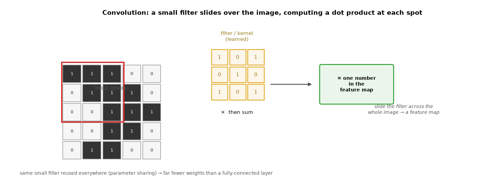
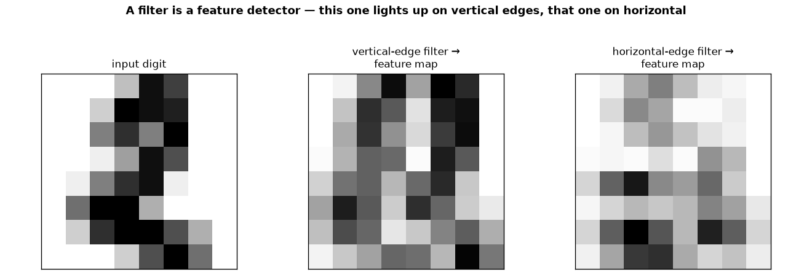
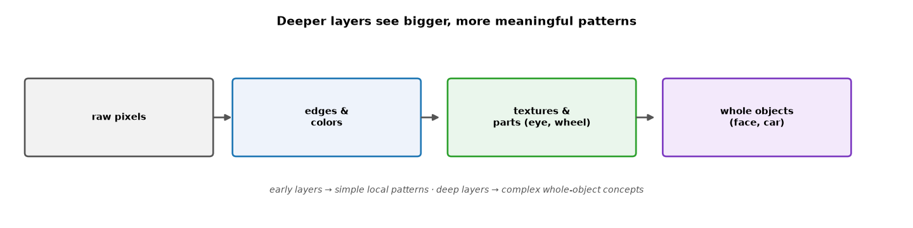
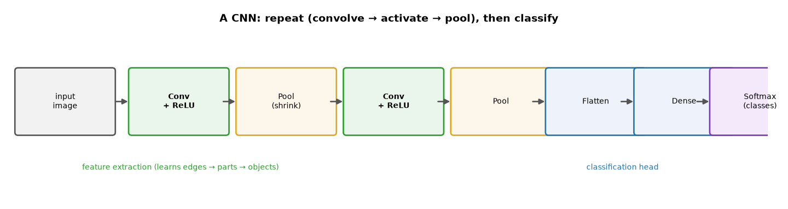

# ML Study 15 — CNNs & Computer Vision

**Covers:** why a plain network fails on images → the **convolution** operation (filters as feature detectors) → **feature maps** & channels → **stride** & **padding** → **ReLU** → **pooling** → **parameter sharing** → the **feature hierarchy** (edges → objects) → the **classification head** (flatten → dense → softmax) → a full **CNN in PyTorch** → **1×1 convolutions** → famous architectures → **transfer learning** → where CNNs are used.
**Goal:** understand how a Convolutional Neural Network *sees* — how a small learned filter sliding over pixels turns raw images into features a classifier can use — and be able to read and build one.

**Series context:** the **computer-vision** branch of the deep-learning series ([Study 14](ML_Study_14_Deep_Learning.html) foundations; [Study 17](ML_Study_17_Embeddings_and_Transformers.html) is the language branch). A **CNN** is the go-to architecture whenever the input is an **image** (self-driving cameras, medical scans, face unlock, satellite imagery).

---

## Part 1 — Why not just use a plain network (MLP) on images?

You *could* flatten a 28×28 image into 784 numbers and feed a fully-connected network (Study 14). It works on tiny digits — but it breaks down on real images, for two reasons:

1. **Too many parameters.** A 200×200 color image is 120,000 numbers. A single fully-connected hidden layer of 1,000 neurons would need **120 million weights** — for one layer. It won't scale.
2. **It throws away structure.** Flattening destroys the fact that **nearby pixels belong together** (an edge, an eye, a wheel). The network has to relearn "these pixels are neighbors" from scratch, and a pattern learned in one corner isn't shared with another.

A **CNN (Convolutional Neural Network)** fixes both by using small filters that scan the image — reusing the same few weights everywhere, and respecting spatial structure. *(Before 2012, computer vision used hand-engineered features like SIFT/HOG fed to a classifier. In 2012 a deep CNN fed **raw pixels** crushed every benchmark — the moment deep learning took over vision.)*

---

## Part 2 — The convolution: a filter is a feature detector

The core operation is **convolution**: slide a small grid of numbers — a **filter** (or **kernel**), typically 3×3 — across the image. At each position, multiply the filter by the pixels under it and **sum** → one output number. Slide across the whole image → a grid of outputs called a **feature map**.


*What this shows: the 3×3 filter (yellow) sits over a patch of the image (red box), multiplies element-by-element, and sums to a single number in the feature map. Then it slides one step and repeats. The **same filter is reused at every position** — that's **parameter sharing**, and it's why a CNN needs far fewer weights than a fully-connected layer.*

**Why "feature detector"?** The filter's numbers determine *what it responds to*. A filter tuned to vertical edges lights up wherever there's a vertical edge:


*What this shows: the same digit run through a **vertical-edge** filter and a **horizontal-edge** filter. Each feature map is bright exactly where that pattern occurs. Crucially, in a real CNN **these filters are learned, not hand-set** — training discovers whatever detectors are useful (edges early, then eyes, wheels, faces deeper).*

---

## Part 3 — Channels, stride, and padding

Three knobs make convolution practical:

- **Multiple filters → multiple feature maps.** One filter finds one pattern; a conv layer uses **many** filters (e.g., 32), producing 32 feature maps — 32 different detectors. (Color images also start with 3 **channels** — red, green, blue.)
- **Stride** — how far the filter jumps each step. Stride 1 = every pixel; stride 2 = skip every other → a smaller output.
- **Padding** — adding a border of zeros so the filter can cover the edges and the output stays the same size (otherwise each conv shrinks the image).

---

## Part 4 — ReLU and pooling

After each convolution:

- **ReLU** (Study 14) zeroes out negatives — keeping the "this feature is present here" signal and adding the non-linearity.
- **Pooling** shrinks each feature map to keep the strong signals and drop detail. **Max pooling** with a 2×2 window keeps the largest value in each 2×2 block → **half the width and height**. This makes the network faster, more memory-efficient, and a bit **translation-invariant** (a cat is a cat whether it's slightly left or right).

---

## Part 5 — The feature hierarchy (why "deep" helps for images)

Stacking conv → ReLU → pool blocks builds a **hierarchy of features** — each layer combines the previous layer's patterns into bigger ones:


*What this shows: early layers detect **edges and colors**; middle layers combine those into **textures and parts** (an eye, a wheel); deep layers assemble **whole objects** (a face, a car). Nobody programs this — it emerges from training. This automatic, hierarchical feature learning is exactly the deep-learning superpower from Study 14, specialized for images.*

---

## Part 6 — The classification head

The conv/pool stack turns an image into a stack of high-level feature maps. To make a decision, add a **classification head**:



**Flatten** the final feature maps into a vector → one or two **fully-connected (dense)** layers → **softmax** over the classes. The whole thing trains end-to-end with backprop and gradient descent (Study 14) — the filters and the classifier are learned **together**.

---

## Part 7 — A CNN in PyTorch

The same MNIST task from Study 14, now with convolutions — every line maps to a concept above:

```python
import torch.nn as nn

model = nn.Sequential(
    nn.Conv2d(1, 32, kernel_size=3, padding=1), nn.ReLU(),  # 32 filters → 32 feature maps
    nn.MaxPool2d(2),                                        # 28x28 → 14x14
    nn.Conv2d(32, 64, kernel_size=3, padding=1), nn.ReLU(), # 64 filters
    nn.MaxPool2d(2),                                        # 14x14 → 7x7
    nn.Flatten(),                                           # → a vector
    nn.Linear(64*7*7, 128), nn.ReLU(),                      # dense
    nn.Linear(128, 10),                                     # 10 classes (softmax via the loss)
)
```
The training loop is **identical** to Study 14 (forward → loss → `backward()` → `step()`) — only the model changed. A CNN like this reaches **~99%** on MNIST vs. ~97% for a plain MLP, and the gap grows fast on real images. `Conv2d` = a convolution layer, `MaxPool2d` = pooling, `Flatten` + `Linear` = the classification head.

---

## Part 8 — 1×1 convolutions (a useful trick)

A **1×1 convolution** uses a filter that's a single pixel — so it doesn't look at neighbors at all. What's the point? It mixes **across channels/feature maps** at each location: it can **reduce the number of feature maps** (cheaper computation) or recombine them into new ones. It's a cheap way to control depth, used heavily inside modern architectures.

---

## Part 9 — Famous architectures & transfer learning

- **LeNet-5 (1998)** — the original digit-reader; the conv → pool → dense template everything still follows.
- **AlexNet (2012)** — deeper + GPUs; won ImageNet by a huge margin and started the deep-learning era.
- **ResNet (2015)** — "skip connections" let networks go **very** deep (100+ layers) without breaking.

**Transfer learning** — you rarely train from scratch. Take a CNN already trained on millions of images (ImageNet), keep its learned feature extractors, and **retrain only the last layer** on your (often small) dataset. You get a strong image model with little data and little compute — the practical default for real vision projects.

---

## Part 10 — Where CNNs are used

- **Self-driving** (Tesla, Waymo) — detect lanes, cars, pedestrians from camera frames.
- **Medical imaging** — tumors in scans, diabetic retinopathy screening.
- **Face unlock** (Face ID), photo search & portrait mode.
- **Satellite imagery** — crop monitoring, disaster damage, and **poverty mapping** where surveys are sparse (the development use case from Study 14).
- **Manufacturing** — visual defect detection on a line.

Anywhere the input is a **grid of pixels**, a CNN (or a Vision Transformer) is the tool.

---

## Quick reference / glossary

| Term | Meaning |
|---|---|
| Convolution | slide a small filter over the image, dot-product at each spot |
| Filter / kernel | the small grid of learned weights — a feature detector |
| Feature map | the output grid produced by one filter over the image |
| Channel | a stack of feature maps (color input = 3 channels: R, G, B) |
| Stride | how far the filter jumps each step (bigger = smaller output) |
| Padding | zero border so the filter covers edges / keeps size |
| ReLU | zero out negatives — keeps "feature present" signal, adds non-linearity |
| Pooling (max) | shrink each feature map, keep the strongest signals |
| Parameter sharing | the same filter reused everywhere → far fewer weights than an MLP |
| Feature hierarchy | edges → textures/parts → whole objects, layer by layer |
| Flatten → Dense → Softmax | the classification head after the conv stack |
| `Conv2d` / `MaxPool2d` | PyTorch convolution / pooling layers |
| 1×1 convolution | mixes across channels; adjusts feature-map depth cheaply |
| Transfer learning | reuse a pretrained CNN, retrain only the last layer |
| LeNet / AlexNet / ResNet | classic CNNs (1998 / 2012 / 2015) |

*ML Study 15 — CNNs & Computer Vision: a plain network can't scale to images or use their structure; a **CNN** slides small learned **filters** over the pixels (convolution), each producing a **feature map** that detects a pattern (edges early, objects deep). **ReLU** + **pooling** + **parameter sharing** keep it efficient; stacking builds a **feature hierarchy**; a **flatten → dense → softmax** head classifies. In PyTorch it's `Conv2d` + `MaxPool2d` + `Linear` with the same training loop as Study 14 — ~99% on MNIST. Used for self-driving, medical imaging, face unlock, and satellite/poverty mapping. **Transfer learning** reuses a pretrained CNN with little data.*
