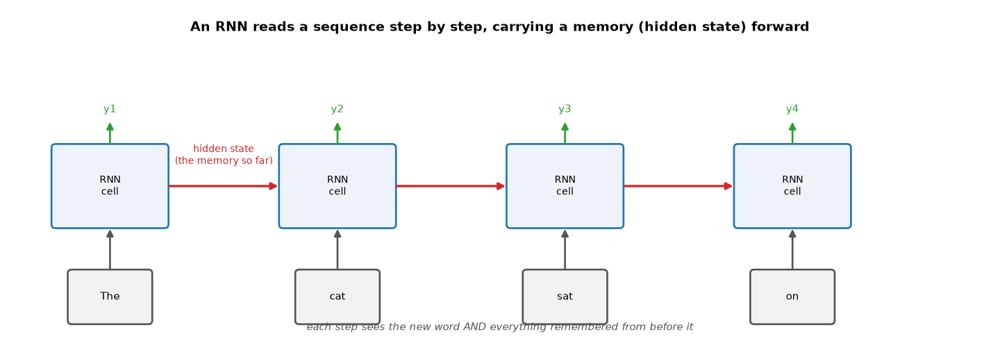
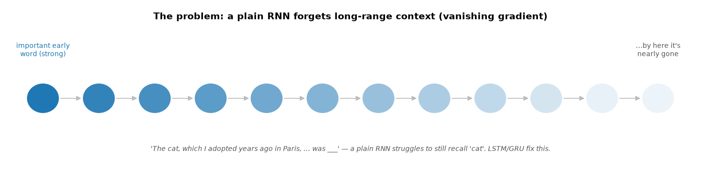
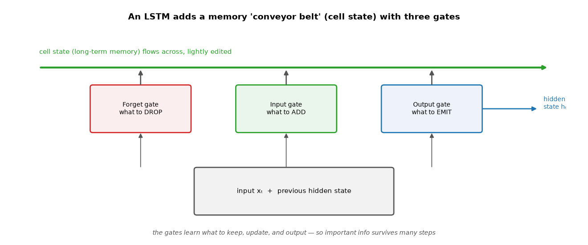
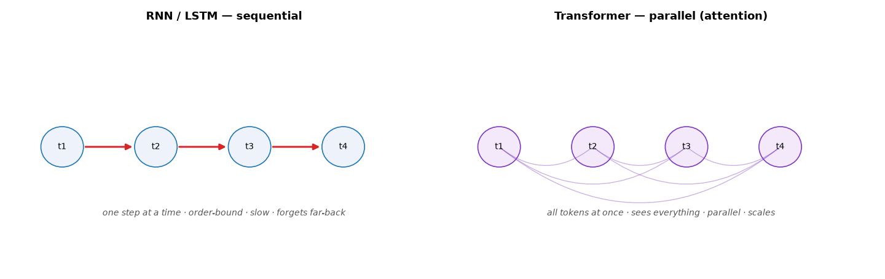

# ML Study 16 — RNNs, LSTMs & Sequences

**Covers:** what makes **sequence** data different → the **RNN** idea (a memory carried step by step) → unrolling the loop → the **vanishing-gradient / forgetting** problem → **LSTM** (gates + a cell state) → **GRU** → applications (text, speech, time series) → a **PyTorch** sequence model → **RNN vs Transformer** (why Transformers took over language, where RNNs still fit).
**Goal:** understand how a network handles data where **order matters** — carrying context forward one step at a time — and why LSTMs were the workhorse for sequences before Transformers.

**Series context:** the **sequence** branch of the deep-learning series ([Study 14](ML_Study_14_Deep_Learning.html) foundations, [Study 15](ML_Study_15_CNNs_Computer_Vision.html) vision, [Study 17](ML_Study_17_Embeddings_and_Transformers.html) the Transformer). RNNs/LSTMs are the bridge from feedforward networks to the attention-based models behind today's LLMs.

---

## Part 1 — Why sequences need something different

A feedforward network (Study 14) and a CNN (Study 15) look at a **fixed input all at once**. But lots of data is a **sequence** where **order matters** and length varies:

- **Text** — "dog bites man" ≠ "man bites dog."
- **Speech / audio** — a waveform over time.
- **Time series** — stock prices, sensor readings, a patient's vitals, weather.

These need a model that (a) handles **variable length** and (b) **remembers what came before**. A plain network has no memory — each input is independent. That's the gap the **RNN** fills.

---

## Part 2 — The RNN idea: carry a memory forward

A **Recurrent Neural Network (RNN)** reads a sequence **one step at a time**, and at each step it keeps a **hidden state** — a running summary of everything seen so far — and feeds it into the next step.


*What this shows: the **same** RNN cell is applied at each step. It takes the new word **plus the hidden state** from the previous step, updates the hidden state (the red arrow — the "memory so far"), and can emit an output. So by the time it reads "on," it still carries a summary of "The cat sat." That carried-forward hidden state is what gives an RNN memory.*

It's literally a loop: `hidden = update(hidden, next_input)`, repeated for every element. Unrolled across time, it looks like a chain — but it's one small cell reused at every step (like a CNN reuses one filter across space, an RNN reuses one cell across time).

---

## Part 3 — The problem: RNNs forget long-range context

The plain RNN has a serious weakness: **it forgets things that happened far back.** As the hidden state is rewritten at every step, early information fades — and during training the gradients that should carry that signal back shrink toward zero (the **vanishing-gradient** problem).


*What this shows: information from an early word weakens as it's passed through many steps. In "The **cat**, which I adopted years ago in Paris, … was ___," a plain RNN struggles to still remember it was a *cat* by the time it reaches the blank. Short sequences are fine; long ones lose the thread.*

---

## Part 4 — LSTM: gates that decide what to remember

The **LSTM (Long Short-Term Memory)** fixes forgetting by adding a separate **cell state** — a memory "conveyor belt" that runs through the whole sequence, edited only gently — controlled by three **gates**:



- **Forget gate** — what to **drop** from memory (e.g., once a sentence ends).
- **Input gate** — what new information to **add** to memory.
- **Output gate** — what to **emit** as this step's hidden state.

Because the cell state is only lightly modified each step (add/remove, not fully overwritten), important information can **survive across many steps** — the LSTM learns *what's worth keeping*. The **GRU (Gated Recurrent Unit)** is a popular simpler cousin: two gates instead of three, fewer parameters, often just as good. For years, LSTM/GRU were **the** answer for text, speech, and time series.

---

## Part 5 — A sequence model in PyTorch

The pattern: turn tokens into embeddings (Study 17), run an LSTM over them, take the final hidden state, classify. Sentiment/spam classification, for example:

```python
import torch.nn as nn

class TextClassifier(nn.Module):
    def __init__(self, vocab_size, embed=64, hidden=64):
        super().__init__()
        self.embed = nn.Embedding(vocab_size, embed)      # token IDs → vectors (Study 17)
        self.lstm  = nn.LSTM(embed, hidden, batch_first=True)  # read the sequence, carry memory
        self.fc    = nn.Linear(hidden, 1)                 # final hidden state → prediction

    def forward(self, x):
        x = self.embed(x)
        out, (h, c) = self.lstm(x)      # h = last hidden state (summary of the whole sequence)
        return self.fc(h[-1])           # classify from that summary
```
The training loop is the same as Study 14 (forward → loss → `backward()` → `step()`). Swap `nn.LSTM` for `nn.RNN` or `nn.GRU` and nothing else changes. For **time-series forecasting** (predict the next value), the idea is identical — feed the sequence of past values, predict the next.

---

## Part 6 — Where RNNs/LSTMs are used

- **Time series** — forecasting demand, prices, energy load, patient vitals; anomaly detection on sensor streams.
- **Speech** — recognition and generation (historically).
- **Text** — sentiment, classification, older translation systems.
- **Wearables** — heartbeat/arrhythmia and fall detection from sensor sequences.

They're still a solid, lightweight choice for **numerical time-series** and streaming data — especially when sequences are short and data or compute is limited.

---

## Part 7 — RNN vs Transformer (the bridge to Study 17)

For **language**, Transformers have largely **replaced** RNNs. The reason is structural:


*What this shows: an RNN processes **one step at a time** (order-bound, slow, and prone to forgetting far-back context). A **Transformer** looks at **all tokens at once** via attention (Study 17) — it sees the whole sequence together, so it captures long-range relationships directly and trains in **parallel** on GPUs. That parallelism is what let language models scale to today's sizes.*

| | RNN / LSTM | Transformer |
|---|---|---|
| Processing | sequential (step by step) | parallel (all at once) |
| Long-range context | weak (LSTM helps) | strong (attention sees all) |
| Speed / scaling | slower, hard to parallelize | GPU-friendly, scales |
| Best for today | numerical **time series**, short/streaming | **language** & most large-scale tasks |

**The takeaway:** RNNs/LSTMs taught us how a network can carry memory across a sequence — a foundational idea. Transformers kept the goal (model relationships across a sequence) but replaced the *sequential* mechanism with *parallel attention*, which is why they now dominate language. Both are worth knowing; pick by data and scale.

---

## Quick reference / glossary

| Term | Meaning |
|---|---|
| Sequence data | data where order matters (text, audio, time series) |
| RNN | **R**ecurrent **N**eural **N**etwork — reads a sequence step by step |
| Hidden state | the running memory carried from step to step |
| Unrolling | drawing the one reused RNN cell as a chain over time |
| Vanishing gradient | signal/gradient shrinks over long sequences → forgetting |
| LSTM | **L**ong **S**hort-**T**erm **M**emory — cell state + 3 gates to remember long-range |
| Cell state | the LSTM's long-term memory "conveyor belt" |
| Forget / input / output gate | drop from memory / add to memory / emit as hidden state |
| GRU | **G**ated **R**ecurrent **U**nit — simpler LSTM (2 gates) |
| `nn.RNN` / `nn.LSTM` / `nn.GRU` | PyTorch recurrent layers |
| RNN vs Transformer | sequential-with-memory vs parallel attention over the whole sequence |

*ML Study 16 — RNNs, LSTMs & Sequences: sequence data (text, audio, time series) needs a model that remembers order. An **RNN** carries a **hidden state** step by step, but a plain RNN **forgets** long-range context (vanishing gradient). An **LSTM** adds a **cell state** with **forget/input/output gates** so important information survives; the **GRU** is a simpler version. In PyTorch it's `nn.Embedding` → `nn.LSTM` → `nn.Linear`, same training loop as Study 14 — great for time series. For language, **Transformers** (Study 17) replaced RNNs by processing all tokens in parallel with attention; RNNs/LSTMs remain a solid choice for numerical time-series.*
