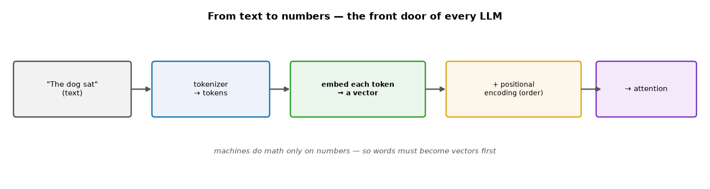
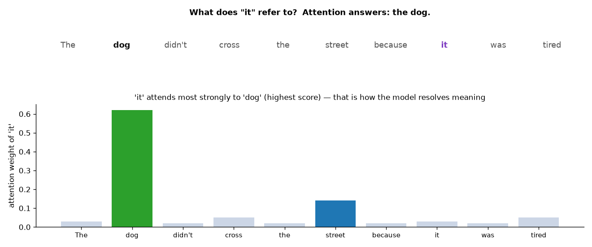
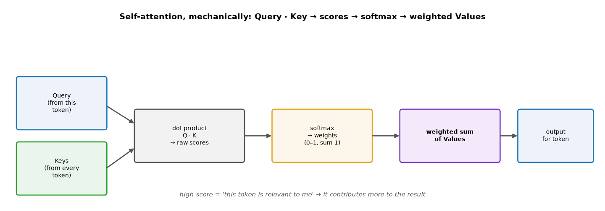
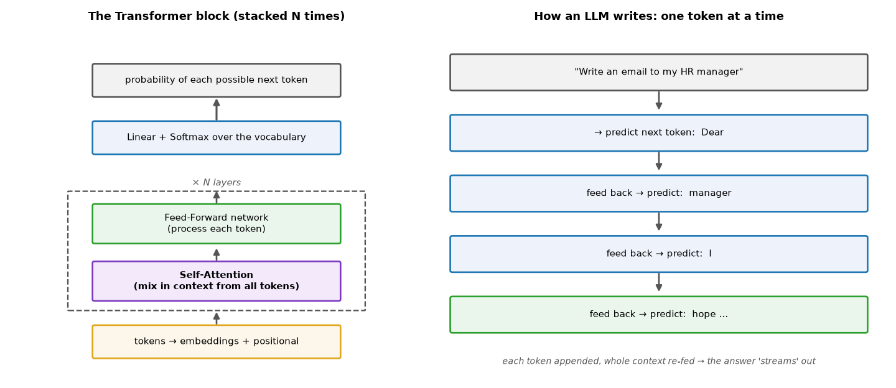

# ML Study 17 — Embeddings & the Transformer

**Covers:** why words must become **numbers** → **embeddings** (with a runnable tool showing king/queen/laptop) → how embeddings are **learned** → **tokens** & tokenization → **positional encoding** → **attention** (the "it → dog" intuition) → **Query/Key/Value** mechanics → **self-attention & multi-head** → the **Transformer** block → **next-token prediction** (how an LLM writes) → why it changed everything → the link to **RAG** and Study 13.
**Goal:** open the box behind LLMs. You'll be able to explain — with real numbers and a diagram — how text becomes vectors, how attention decides what matters, and how a Transformer generates one token at a time.

**Series context:** the deep dive behind the "Transformers & embeddings" bridge in [Study 14](ML_Study_14_Deep_Learning.html), and the foundation under [Study 13 (LangChain & Agents)](ML_Study_13_LangChain_Agents.html). Runnable companion: `notebooks/hello_embeddings.ipynb` (word vectors + distances live).

---

## Part 1 — The core problem: machines only do math on numbers

A neural network multiplies and adds **numbers** — it has no idea what a word *is*. So the very first job of any language model is to **turn text into numbers** in a way that keeps the *meaning*. Two ideas do this: **embeddings** (words → vectors) and **attention** (letting those vectors share context). Everything about LLMs is built on these two.


*What this shows: text → **tokenizer** → tokens → **embedding** (each token becomes a vector) → **+ positional encoding** (so order is preserved) → into the **attention** layers. The rest of this doc walks each step.*

---

## Part 2 — Embeddings: turning a word into numbers (the tool)

An **embedding** maps a word to a **list of numbers** (a vector) so that **similar meanings sit close together**. Here's the tool — real pretrained vectors, a few lines:

```python
# pip install gensim   (Colab already has it)
import gensim.downloader as api
wv = api.load("glove-wiki-gigaword-50")     # every word -> 50 numbers
print(wv["king"][:8])                        # first 8 of king's 50 numbers
```

What "king", "queen", "laptop" actually become (first 8 of 50 numbers):

| word | first 8 numbers of its 50-number vector |
|---|---|
| **king** | `0.505  0.686  −0.595  −0.023  0.600  −0.135  −0.088  0.474` |
| **queen** | `0.379  1.823  −1.265  −0.104  0.358  0.600  −0.175  0.838` |
| **laptop** | `0.598  −0.212  2.172  0.157  0.384  −0.479  −0.061  −0.958` |

**Measure the distance** between words with **cosine distance** (`1 − cosine similarity`; **0 = identical meaning**):

```python
print(1 - wv.similarity("king", "queen"))    # 0.22  -> CLOSE   (both royalty)
print(1 - wv.similarity("king", "laptop"))   # 0.80  -> FAR     (unrelated)
print(1 - wv.similarity("cat",  "dog"))      # 0.08  -> very close
```

| pair | cosine distance | |
|---|---|---|
| **king ↔ queen** | **0.22** | close |
| king ↔ laptop | **0.80** | far |
| cat ↔ dog | 0.08 | very close |

Meaning becomes **geometry**. And relationships become arithmetic: **king − man + woman ≈ queen**. *(Live demo + a 2-D plot: `notebooks/hello_embeddings.ipynb`.)*

---

## Part 3 — How embeddings are *learned*

Nobody hand-writes these numbers — they're **learned from data**, on one idea:

> **"You shall know a word by the company it keeps."** Words that appear in similar contexts get similar vectors.

Classic **word2vec** does this by training a tiny network on a simple task over billions of sentences: *predict a word from its neighbors* (or the neighbors from the word). To do that well, the network is *forced* to give "king" and "queen" similar vectors because they show up around similar words (throne, royal, ruled). The vectors are a **by-product** of that prediction task — and they end up encoding meaning, including the king−man+woman≈queen relationships. Modern models learn richer, **contextual** embeddings (the vector for "bank" differs in *river bank* vs *money bank*), but the principle is the same.

---

## Part 4 — Tokens: how text is actually split

Real models don't split on whole words — they split into **tokens**. A token can be **a whole word, a piece of a word, a punctuation mark, or a space**. "unbelievable" might become `un` + `believ` + `able`.

**Why subwords?** It keeps the vocabulary a manageable size while still handling *any* word (including typos and new words) — rare or unseen words are just built from smaller known pieces. A **tokenizer** does the splitting; each token then gets its embedding.

---

## Part 5 — Positional encoding: order matters

Attention (next) looks at all tokens at once — which means, on its own, it would be **blind to order**. But order changes meaning:

> "the dog **did** cross the street because it was **not** tired" vs. "the dog did **not** cross…" — moving one token flips the meaning.

So after embedding each token, the model **adds a positional encoding** — a signal that says *where* each token sits. Now the vector carries both **what** the token means and **where** it is.

---

## Part 6 — Attention: the key idea

**Attention lets every token look at every other token and decide how much each one matters** for understanding it. The classic example:


*What this shows: in "The dog didn't cross the street because **it** was tired," what does **it** mean — the dog or the street? A human knows "the dog." The model figures it out by giving **it** a high **attention score** to **dog** and low scores to everything else. Attention is how a model captures **meaning and context**, not just surface word-matching.*

This is the leap over older models: earlier networks matched **patterns** (two phrases *looked* different, so they were treated as different); attention captures **semantics** ("return department" and "refund department" mean the same thing).

---

## Part 7 — Query, Key, Value: attention, mechanically

How does the model compute those scores? Each token produces three vectors (via learned weight matrices):

- **Query (Q)** — "what am *I* looking for?"
- **Key (K)** — "what do *I* offer?" (one per token)
- **Value (V)** — "the actual information I carry."



The steps (this is the whole mechanism):
1. **Score** — dot each token's **Query** with every token's **Key** → raw relevance scores.
2. **Softmax** — squash the scores to weights in **0–1 that sum to 1** (Study 14's softmax).
3. **Mix** — take a **weighted sum of the Values** using those weights.

A high Q·K score means "that token is relevant to me," so its Value contributes more. That weighted mix is the token's new, context-aware representation. In one runnable line of intuition:

```python
import numpy as np
def attention(Q, K, V):
    scores  = Q @ K.T                      # 1. relevance of every token to every token
    weights = np.exp(scores) / np.exp(scores).sum(axis=-1, keepdims=True)  # 2. softmax
    return weights @ V                     # 3. weighted sum of values
```

---

## Part 8 — Self-attention & multi-head

When the Queries, Keys, and Values **all come from the same sequence**, it's **self-attention** — every token attending to every other token in the *same* input, in **parallel** (no waiting, unlike an RNN's step-by-step crawl).

**Multi-head attention** runs several attention operations side by side ("heads"), each free to focus on a different kind of relationship — one head might track *grammar*, another *who-refers-to-what*, another *topic*. Their outputs are combined. More heads = more relationships captured at once.

---

## Part 9 — The Transformer block

Stack the pieces and you have a **Transformer**: embeddings + positional encoding → then a repeating block of **self-attention** (mix in context) followed by a **feed-forward network** (process each token), stacked **N times**, and finally a **linear + softmax** over the whole vocabulary.



- The original design has an **encoder** and a **decoder**; today's LLMs (GPT, Claude) are usually **decoder-only**.
- Each block has **attention + feed-forward** layers; stacking many gives depth.
- The final **softmax** produces a **probability for every possible next token**.

---

## Part 10 — How an LLM writes: next-token prediction

An LLM does **not** produce a whole answer at once. It predicts **one token at a time**, appends it, and feeds everything back in:

> Prompt *"Write an email to my HR manager"* → softmax says `Dear` is most likely (say 0.8) → append it → re-feed *"…manager Dear"* → predict `manager` → `I` → `hope` → `you` → `are` → `doing` → `well` …

Every step runs the **whole context** through the stack and picks from the probability distribution over the vocabulary. That loop is why answers **stream out** word by word — and why it needs a **GPU**: millions–billions of calculations per token, done in milliseconds.

> **One honest simplification:** the model doesn't always take the single highest-probability token — a "temperature" setting lets it sample, which is why the same prompt can give slightly different answers.

---

## Part 11 — Why it changed everything (and where you'll use it)

- **Parallel + scalable.** RNNs/LSTMs read one step at a time and forgot long-range context. Transformers read everything at once → GPU-friendly → they keep improving as you add data and compute (**scaling laws**). That combination produced GPT / Claude / Gemini.
- **Semantics, not patterns.** Attention captures meaning and long-range relationships — the reason these models feel like they "understand."
- **Where it connects to your stack:** the **embedding** step is the engine of **semantic search and RAG** — embed a question and your documents, retrieve the nearest chunks by cosine distance, feed them to the LLM (Study 13). And the whole Transformer is what sits behind `model.invoke(...)` in LangChain.

**Every major LLM is a Transformer.** Embeddings turn words into meaning-carrying numbers; attention lets those numbers share context; stacking and scaling turns that into GPT-4 / Claude.

---

## Quick reference / glossary

| Term | Meaning |
|---|---|
| Embedding | a word/token → a vector of numbers; similar meaning → nearby vectors |
| Cosine distance | `1 − cosine similarity`; 0 = identical meaning, larger = more different |
| word2vec | classic method that learns embeddings by predicting a word from its neighbors |
| Token | the unit a model reads — a word, subword, punctuation, or space |
| Tokenizer | splits text into tokens |
| Positional encoding | a signal added to each token so the model knows word order |
| Attention | each token weighs how relevant every other token is |
| Attention score | the relevance weight from one token to another |
| Q / K / V | Query (what I seek) · Key (what I offer) · Value (info carried) |
| Self-attention | attention where Q, K, V come from the same sequence |
| Multi-head | several attention operations in parallel, each catching different relationships |
| Transformer | embeddings + positional → (attention + feed-forward) × N → softmax |
| Encoder / decoder | the two halves of the original Transformer; LLMs are usually decoder-only |
| Next-token prediction | LLMs generate one token at a time, feeding the result back in |
| Softmax | turns raw scores into probabilities that sum to 1 |
| RAG | Retrieval-Augmented Generation — retrieve nearby chunks by embedding distance, then generate |

*ML Study 17 — Embeddings & the Transformer: machines need numbers, so **embeddings** map words to vectors where meaning is geometry (king↔queen close, king↔laptop far), learned from context (word2vec). Text is split into **tokens**, embedded, and given **positional encoding**. **Attention** lets each token weigh every other (the "it → dog" resolution) via **Query·Key → softmax → weighted Value**; **self-attention** does this in parallel, **multi-head** captures several relationships. A **Transformer** stacks attention + feed-forward blocks and ends in a **softmax over the vocabulary**; an LLM generates **one token at a time**. This is the engine under RAG and every LLM in Study 13. Companion: `notebooks/hello_embeddings.ipynb`.*
