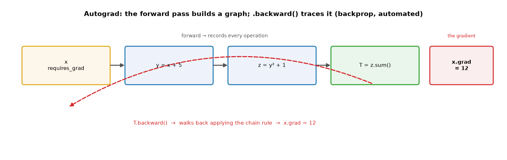
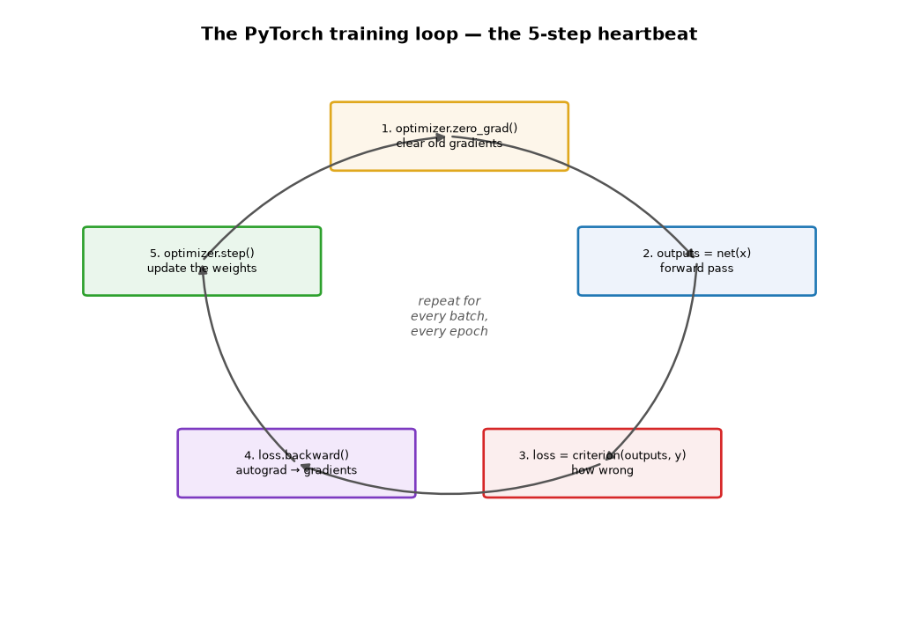
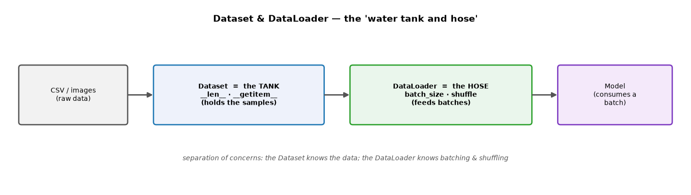

# ML Study 18 — PyTorch: Tensors, Autograd & the Training Loop

**Covers:** what PyTorch is → **tensors** (the building block) → **autograd** (automatic differentiation = backprop, automated) → **`nn.Module`** (building a network) → **loss + optimizer** → **the 5-step training loop** → **Dataset & DataLoader** (batching) → **GPU** → **saving & loading** a model → a **debugging checklist**.
**Goal:** move from *understanding* deep learning to *building* it. After this you can read and write PyTorch — the framework behind the code snippets in Studies 14–17.

**Series context:** the **build-time** companion to the deep-learning series. Studies 14–17 explained the *concepts* (neurons, training, CNNs, sequences, transformers); this shows the *tool* that implements them. Runnable PyTorch: `notebooks/hello_deeplearning.ipynb` (the MNIST classifier, in Colab).

---

## Part 1 — What PyTorch is (and why you don't hand-code backprop)

**PyTorch** is a deep-learning framework. You describe the **forward pass** — how data flows through your network — and PyTorch handles the hard part automatically: computing gradients (**backprop**, Study 14) and updating weights. You get three things:

1. **Tensors** — fast, GPU-capable arrays (like NumPy, but they can run on a GPU).
2. **Autograd** — automatic differentiation: it computes every gradient for you.
3. **`torch.nn`** — ready-made layers, losses, and optimizers.

The whole point: in Study 14 you derived backprop by hand with the chain rule. PyTorch does that derivation **automatically** for any network you build.

---

## Part 2 — Tensors: the building block

A **tensor** is an n-dimensional array — a number, a vector, a matrix, or higher. It behaves like a NumPy array, converts to/from NumPy freely, and can move to a GPU.

```python
import torch
x = torch.tensor([[1., 2.], [3., 4.]])   # a 2x2 tensor
x.shape                                    # torch.Size([2, 2])
x + 10, x @ x                              # elementwise, matrix multiply — like NumPy

x.numpy()                                  # tensor -> NumPy
torch.from_numpy(np_array)                 # NumPy -> tensor
```

*(A method ending in `_` modifies the tensor in place, e.g. `x.add_(1)`.)* Everything in PyTorch — inputs, weights, activations, gradients — is a tensor.

---

## Part 3 — Autograd: backprop, automated

This is PyTorch's magic. Tag a tensor with **`requires_grad=True`** and PyTorch **records every operation** you do with it, building a **computation graph**. Call **`.backward()`** and it walks that graph *in reverse*, applying the chain rule, and fills in each input's `.grad`.



```python
x = torch.ones(3, 2, requires_grad=True)   # "track this variable"
y = x + 5                                    # graph records: y depends on x
z = y * y + 1                                # z depends on y
T = z.sum()                                  # T depends on z
T.backward()                                 # trace back through everything
print(x.grad)                                # dT/dx = 12  everywhere
```

Check it by hand: `T = Σ(y²+1)`, `y = x+5` → `dT/dx = 2y = 2(x+5) = 2(6) = 12` ✓. **You only ever write the forward pass** — autograd generates the backward pass from it. (Two mental hooks: `requires_grad` is a *GPS tracker* on a variable; the graph is a *receipt* recording every step so it can trace back.)

> **The #1 gotcha — gradients accumulate.** PyTorch *adds* new gradients to the old ones by default, so you must **clear them each step** (`optimizer.zero_grad()`), or gradients from the last batch corrupt this one. And wrap manual weight updates in **`with torch.no_grad():`** so PyTorch doesn't try to differentiate the update itself.

---

## Part 4 — `nn.Module`: building a network

You define a network as a class that subclasses **`nn.Module`**. Think of it as a **blueprint**: `__init__` declares the layers (the building materials); `forward()` describes the data flow (the assembly instructions). **You never write `backward()`** — autograd builds it from your `forward()`.

```python
import torch.nn as nn
import torch.nn.functional as F

class Net(nn.Module):
    def __init__(self):
        super().__init__()
        self.fc1 = nn.Linear(784, 128)   # a layer of neurons: 784 in -> 128 out
        self.fc2 = nn.Linear(128, 10)    # -> 10 classes

    def forward(self, x):                # define the data flow
        x = F.relu(self.fc1(x))          # layer -> ReLU (Study 14)
        return self.fc2(x)               # no softmax — the loss adds it
```

*Design before code: what are the inputs (shape)? the outputs (1 for regression, N for N classes)? how many hidden layers? which activation (ReLU hidden, none/softmax out)? which loss and optimizer?* PyTorch expects **batches** — inputs are shaped `[batch, …]`; use `.unsqueeze(0)` to make a batch of one.

---

## Part 5 — Loss and optimizer

Two objects drive learning (both from Study 14, now as one-liners):

```python
criterion = nn.CrossEntropyLoss()                       # classification loss (adds softmax)
optimizer = torch.optim.Adam(net.parameters(), lr=1e-3) # gradient descent (Adam = the reliable default)
```

- **Loss** (`criterion`) measures how wrong a prediction is. `CrossEntropyLoss` for classification, `nn.MSELoss` for regression.
- **Optimizer** holds the weights (`net.parameters()`) and applies the update rule. **Adam** "just works"; **SGD** is the classic.

---

## Part 6 — The training loop: the 5-step heartbeat

Every PyTorch training loop is the same five steps. Memorize this pattern — you'll write it forever:



```python
net.train()                                 # training mode
for epoch in range(num_epochs):
    for inputs, labels in train_loader:
        optimizer.zero_grad()               # 1. clear old gradients (the gotcha from Part 3)
        outputs = net(inputs)               # 2. forward pass
        loss = criterion(outputs, labels)   # 3. how wrong
        loss.backward()                      # 4. autograd computes all gradients
        optimizer.step()                     # 5. update the weights
```

That's it — those five lines *are* training. Evaluation turns learning off:

```python
net.eval()                                  # eval mode (disables dropout etc.)
with torch.no_grad():                       # no gradients needed -> faster, less memory
    outputs = net(inputs)
    predicted = outputs.argmax(1)           # class with the highest score
```

Each step maps to a concept you already know: forward (Study 14 §5), loss (§7), `backward()` = backprop (§8), `step()` = gradient descent (§9).

---

## Part 7 — Dataset & DataLoader: feeding the data

You rarely feed one sample at a time — you feed **batches**. Two objects split the job (the "water tank and hose"):



- **`Dataset` = the tank** — holds the samples; you implement `__len__` (how many) and `__getitem__` (draw one).
- **`DataLoader` = the hose** — controls **batch size**, **shuffling**, and parallel loading, and hands the model one batch at a time.

```python
from torch.utils.data import DataLoader, random_split
train_set, test_set = random_split(full_dataset, [800, 200])
train_loader = DataLoader(train_set, batch_size=32, shuffle=True)   # shuffle training
test_loader  = DataLoader(test_set,  batch_size=32, shuffle=False)  # NOT test
```

*Why the split of responsibilities?* Clean design — the Dataset knows the data format; the DataLoader knows batching. **Shuffle training** (so the model doesn't learn the order), **don't shuffle test** (reproducible evaluation).

---

## Part 8 — Using a GPU

Tensors and models live on a **device** — CPU or GPU. Move them explicitly:

```python
device = "cuda" if torch.cuda.is_available() else "cpu"   # use the GPU if present
net = net.to(device)
inputs, labels = inputs.to(device), labels.to(device)     # data must be on the same device
```

Everything in an operation must be on the **same** device (a common error is a tensor on CPU meeting a model on GPU). Free GPUs on Colab: Runtime → Change runtime type → GPU (Study 14).

---

## Part 9 — Saving and loading a model

Training is expensive; save the result. The recommended way saves just the **weights** (`state_dict`), not the Python class:

```python
torch.save(net.state_dict(), "model.pth")   # save the learned weights

net = Net()                                  # rebuild the architecture
net.load_state_dict(torch.load("model.pth")) # load the weights into it
net.eval()                                   # always eval mode before inference
```

This is exactly the **train-time → file → serve-time** handoff from [Study 12](ML_Study_12_Serving_Models_FastAPI.html): the `.pth` file is the model, portable to any machine, loaded by a serving API that never retrains. Saving `state_dict()` (not the whole model) is portable and robust — it's just the numbers, independent of file names or imports.

---

## Part 10 — Debugging: "my model isn't learning"

When loss won't go down, trace the pipeline step by step (print-and-check):

| Symptom | Likely cause | Fix |
|---|---|---|
| Loss not decreasing | learning rate off, wrong loss, or a bug in `forward()` | print shapes & values at each layer; try `lr=1e-3` |
| Gradients are `None` | the tensor wasn't connected to the loss | check the forward pass links inputs → loss |
| Gradients → NaN / infinity | exploding gradients | lower the learning rate; add gradient clipping |
| Gradients all zero | dead ReLUs or a disconnected graph | check activations / the computation graph |
| `backward()` errors on 2nd call | called `.backward()` twice | restructure to call it once per step |
| Weights never change | forgot `optimizer.step()` or `zero_grad()` | verify all 5 loop steps are present |

**The universal checklist:** (1) shapes match at every layer, (2) forward pass produces sane output, (3) loss is a real number, (4) gradients exist after `backward()`, (5) weights actually change after `step()`.

---

## Quick reference / glossary

| Term | Meaning |
|---|---|
| Tensor | n-dimensional array (NumPy-like, GPU-capable) — everything in PyTorch |
| `requires_grad=True` | track this tensor so autograd can compute its gradient |
| Autograd | automatic differentiation — computes gradients (backprop) from your forward pass |
| Computation graph | the record of operations autograd walks backward |
| `.backward()` | compute all gradients (fills each tensor's `.grad`) |
| `zero_grad()` | clear old gradients — required each step (they accumulate) |
| `torch.no_grad()` | run without tracking gradients (eval, or manual weight updates) |
| `nn.Module` | base class for a network — `__init__` = layers, `forward` = data flow |
| `nn.Linear` / `Conv2d` / `LSTM` | ready-made layers |
| criterion / loss | how wrong a prediction is (`CrossEntropyLoss`, `MSELoss`) |
| optimizer | applies the update rule (`Adam`, `SGD`) over `net.parameters()` |
| training loop | zero_grad → forward → loss → backward → step |
| Dataset / DataLoader | the sample store / the batching + shuffling feeder |
| `.to(device)` | move a tensor or model to CPU/GPU |
| `state_dict()` | the model's learned weights — saved/loaded for serving |

*ML Study 18 — PyTorch: everything is a **tensor** (NumPy-like, GPU-capable). **Autograd** records the forward pass and computes gradients automatically (backprop, done for you) — just remember to `zero_grad()` each step. Build networks by subclassing **`nn.Module`** (`__init__` = layers, `forward` = flow; never write `backward`). Pick a **loss** and **optimizer** (Adam), then run the **5-step training loop** (zero → forward → loss → backward → step). **Dataset/DataLoader** feed batches (tank & hose); `.to(device)` uses the GPU; `state_dict()` saves the weights for serving (Study 12). The build-time companion to the concept docs (14–17). Runnable: `notebooks/hello_deeplearning.ipynb`.*
