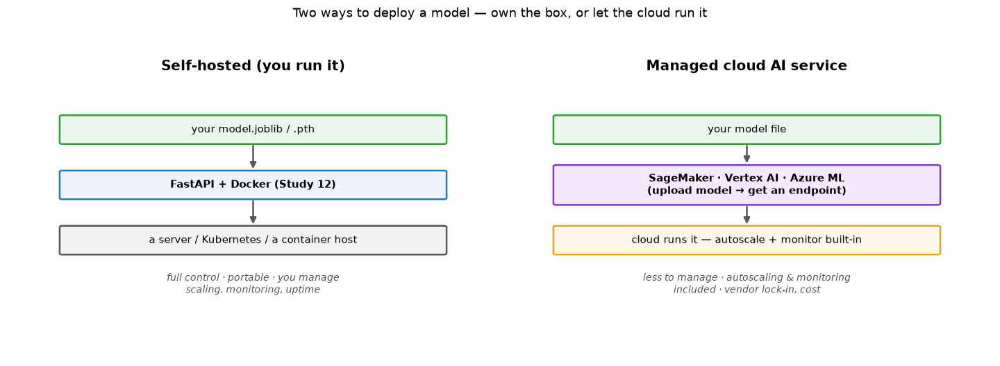
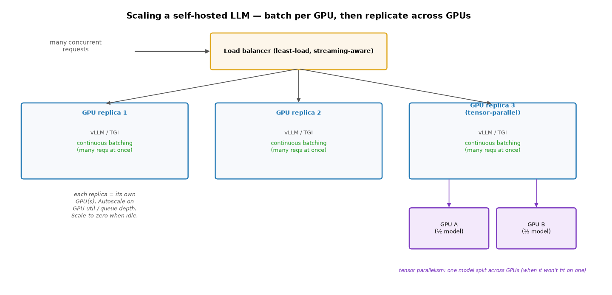
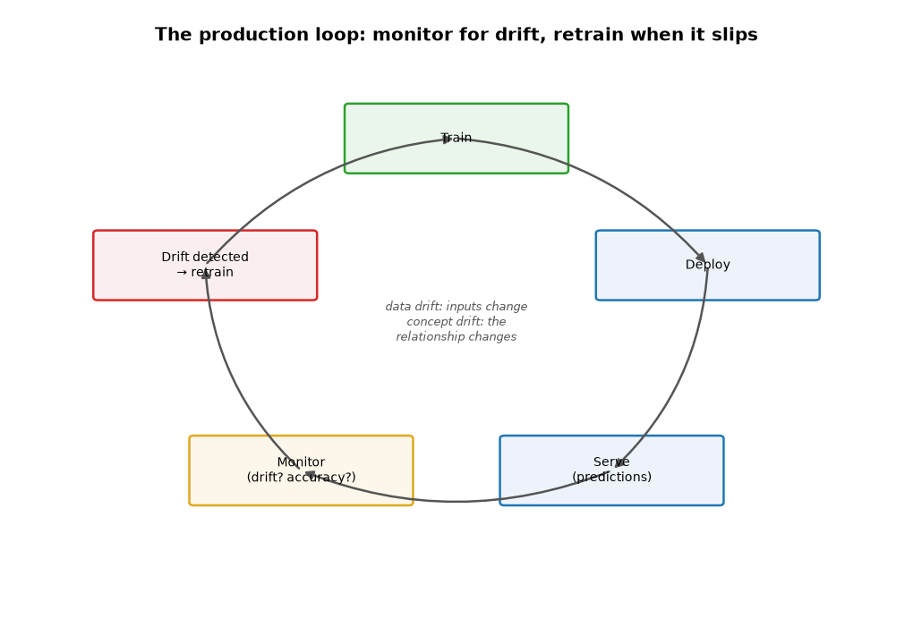
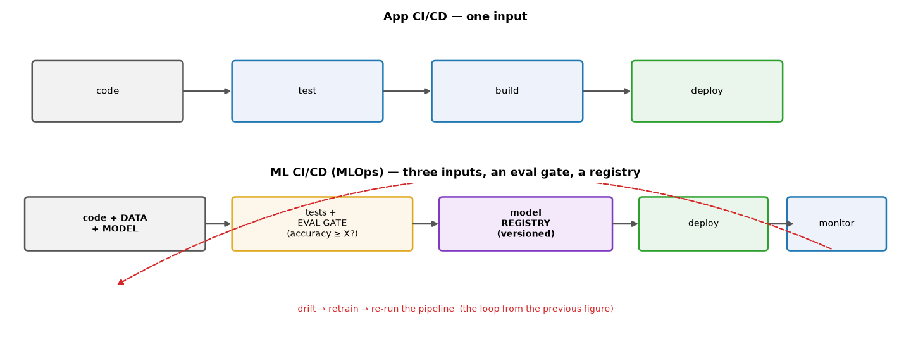
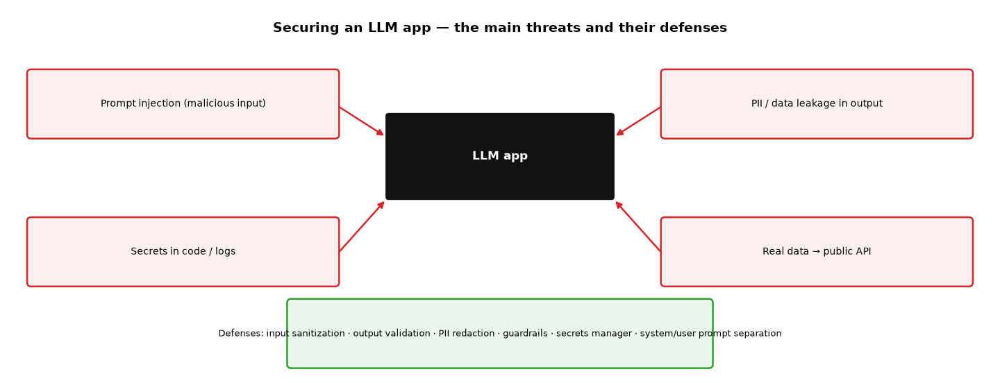

# ML Study 19 — Deploying AI/ML: Cloud, Monitoring, CI/CD & Security

**Covers:** the two deployment paths (self-hosted vs managed cloud) → **cloud AI services** (SageMaker / Vertex AI / Azure ML) → **scaling & load balancing** → **monitoring & model drift** → **retraining** → **CI/CD for ML (MLOps)** → **LLM security** (prompt injection, PII, secrets, guardrails) → testing an ML service.
**Goal:** understand what it takes to run an AI/ML model *reliably in production* — not just serve it once, but scale it, watch it, update it, and secure it.

**Series context:** the **production/deployment** capstone of the applied-engineering track. It builds directly on [Study 12](ML_Study_12_Serving_Models_FastAPI.html) (serving a model over FastAPI) and [Study 13](ML_Study_13_LangChain_Agents.html) (LLM apps & guardrails). This is the "support deployment and monitoring of AI solutions" skill.

---

## Part 1 — Two ways to deploy a model

This section is about deploying **a classical ML model *you* trained** — the `.joblib` / `.pth` file from Study 12 (a scoring model, a classifier). Once you have that file, there are two paths to production. Neither is "right" — pick by team size, control needs, and budget.

> **What about LLMs?** LLM/GenAI deployment splits into deploying *your app* vs. *the model*. You always deploy **your app** (the FastAPI/LangChain service from Study 13) using the two paths below. The **model** has three options:
>
> 1. **Hosted API** (Claude, GPT via Anthropic/OpenAI) — easiest, most capable; someone else runs the GPU. Most common.
> 2. **Managed cloud endpoint** (AWS Bedrock, Vertex AI, Azure) — cloud-hosted model, still their GPU.
> 3. **Self-hosted / local open LLM** — **you deploy the model yourself.** Run an open-weights model (Llama, Mistral, Qwen) on your own hardware via **Ollama**, **vLLM**, or **llama.cpp**; it exposes an HTTP endpoint your app calls. **Use it when:** data can't leave (privacy/PHI/on-prem), you want no per-token cost at scale, or you need offline/air-gapped operation. **Cost:** you need a **GPU** with enough **VRAM** (or a small **quantized** model on CPU), open models are usually less capable than frontier ones, and you run the ops. *(Our `RAG_from_Scratch` notebook uses Ollama — a local LLM — for exactly this reason.)*
>
> So options 1–2 = "the model is a hosted service, you deploy the app"; option 3 = "**you deploy the model too**" — the local-LLM case.

- **Self-hosted** — wrap the model in **FastAPI + Docker** (Study 12) and run it on your own server, Kubernetes, or a container host. **Full control and portability**, but *you* manage scaling, monitoring, and uptime.
- **Managed cloud AI service** — upload the model to **AWS SageMaker**, **Google Vertex AI**, or **Azure ML**, and the cloud gives you a **hosted endpoint** with autoscaling and monitoring built in. **Less to manage**, at the cost of some vendor lock-in and per-hour pricing.

> **Rule of thumb:** small team / simple model / need portability → **self-host** (FastAPI). Need autoscaling, managed monitoring, or you're already on that cloud → **managed service**. The *serving concepts are the same either way* — a model file, loaded once, behind an HTTP endpoint.

---

## Part 2 — Cloud AI services (the managed path)

The big three all follow the same shape: **register a model → create an endpoint → call it over HTTP**, and they add production features you'd otherwise build yourself.

| Provider | Service | You get |
|---|---|---|
| **AWS** | **SageMaker** | hosted endpoints, autoscaling, model registry, pipelines, monitoring |
| **Google Cloud** | **Vertex AI** | endpoints, AutoML, pipelines, feature store, monitoring |
| **Azure** | **Azure ML** | managed endpoints, registries, pipelines, monitoring |

What the managed service handles for you: **autoscaling** (spin replicas up/down with traffic), **model versioning** (roll back a bad model), **health checks**, **built-in monitoring**, and often **A/B / canary rollout**. The trade-off is **cost** and **lock-in** — you're renting their platform. For LLMs specifically, you'd instead call a hosted model API (Claude, GPT) or a managed inference endpoint — same idea, someone else runs the GPU.

---

## Part 3 — Scaling & load balancing (recap)

Real traffic hits **many replicas** behind a **load balancer** — each replica loads its *own* copy of the model into memory at startup (Study 12, Part 7½). Because the model file is **read-only at serve time**, copying it across servers is safe (no locking, no sync). The one rule: **all replicas must serve the same model version** — or the same request could get different answers depending on which server it lands on. Managed cloud services do this replication + load balancing for you; self-hosted, you do it with Kubernetes or a load balancer.

---

## Part 3½ — Scaling a self-hosted LLM (it's different)

Scaling a **self-hosted LLM** (the local-LLM option from Part 1) is *not* like scaling a classical model. A `.joblib` is tiny — you copy it across cheap **CPU** servers. An LLM is **billions of parameters / many GB of VRAM** — it needs a **GPU**, and the GPU is the expensive bottleneck. So the goal flips: **squeeze the most requests out of each GPU first, then replicate.**

The levers, in the order you reach for them:

1. **Use a real inference server — not Ollama.** Ollama / LM Studio are for dev and single users. For throughput, switch to **vLLM**, **TGI** (Text Generation Inference), or **TensorRT-LLM**.
2. **Continuous (dynamic) batching — the biggest win.** A GPU is most efficient running *many* sequences at once, so these servers **batch concurrent requests together on the GPU** — often **5–20× more throughput on the same hardware**. vLLM adds **PagedAttention** (efficient KV-cache memory) to pack even more concurrent requests per GPU. *Frequently you don't need more GPUs — you need batching.*
3. **Replicate across GPUs behind a load balancer.** Run N model-server replicas (each on its own GPU); a load balancer routes to them. Two LLM-specific notes: prefer **least-connections / least-load** routing over round-robin (a 10-token reply and a 2,000-token reply are wildly different work), and the balancer must handle **long-lived streaming connections** (SSE/websockets) for token streaming.
4. **Shard a big model across GPUs — tensor parallelism.** When the model won't fit on one GPU, split it across several (`tensor_parallel_size` in vLLM/TGI). That's *vertical* scaling of a single replica.
5. **Autoscale + orchestrate.** Use Kubernetes with **KServe / Ray Serve**, autoscaling on **GPU utilization / queue depth** (not CPU), with **scale-to-zero** for spiky traffic — GPUs are too expensive to leave idle.

**Cost levers unique to LLMs:** **quantization** (INT8/INT4 → fits on smaller/fewer GPUs, serves more per GPU), **right-sizing** the model (a smaller "good-enough" model serves far more), **caching** (common prompts/responses, prompt caching), and **model routing** (easy queries → a small model, hard ones → a big one).

> **The one-liner:** classical model → *replicate a small file across cheap CPU servers*. Self-hosted LLM → *maximize throughput **per GPU** with continuous batching (vLLM/TGI), replicate across GPUs behind a load balancer, shard big models with tensor parallelism — and use quantization + smaller models + caching + scale-to-zero to control GPU cost.*

---

## Part 4 — Monitoring & model drift

A model is trained on **past** data. The world changes — so a model that was accurate at launch silently gets **worse over time**. That decay is **drift**, and catching it is the whole point of monitoring:

- **Data drift** — the *inputs* change (e.g., new countries appear, an economic shock shifts the distributions). The model sees data unlike what it trained on.
- **Concept drift** — the *relationship* changes (what predicted loan default in 2019 no longer holds post-shock). Same inputs, different correct answer.

**What to watch:** the input distributions (are they shifting from training?), the prediction distribution (suddenly all "high risk"?), and — when labels eventually arrive — live accuracy. This is why `serve.py` exposed `/metrics` (Study 12): monitoring is a first-class part of serving, not an afterthought.

---

## Part 5 — Retraining

When monitoring shows drift (or accuracy drops below a threshold), you **retrain on fresh data and redeploy** — the loop in the figure above. Retraining can be:

- **Scheduled** — e.g., retrain weekly/monthly regardless (simple, predictable).
- **Triggered** — retrain when a drift/accuracy metric crosses a threshold (efficient, responsive).

Retraining reuses the **train-time → file → serve-time** handoff from Study 12: train a new model, save a new versioned file, and roll it out — ideally through the CI/CD pipeline (next), so the new model is *tested* before it goes live.

---

## Part 6 — CI/CD for ML (MLOps)

Regular app **CI/CD** ships **code**: commit → test → build → deploy. ML CI/CD (**MLOps**) is harder because a model depends on **three** things — **code, data, AND the model** — and "does it pass the tests" isn't enough; you also need "**is the model good enough?**"

The ML pipeline adds:
- **Data & model versioning** — you must be able to reproduce *which data + which code* produced *which model*.
- **An evaluation gate** — automated: the new model must beat a quality bar (e.g., accuracy ≥ X on a held-out set) before it can deploy. A model that passes unit tests but *scores worse* must be blocked.
- **A model registry** — a versioned store of models (which one is "production," rollbacks, lineage) — exactly what the metadata sidecar (Study 12) hints at, scaled up.
- **The retraining loop** — drift triggers a re-run of the whole pipeline.

> **The one-liner:** MLOps = CI/CD **plus** data/model versioning **plus** an automated "is it good enough?" gate. It's what makes retraining safe to automate.

---

## Part 7 — LLM security

LLM apps add security concerns that classical models don't have — because the input is free text and the output can leak information. The main threats and their defenses:

- **Prompt injection** — a user (or a document the agent reads) sneaks in instructions to override your system prompt ("ignore previous instructions and…"). **Defenses:** separate system vs user prompts, sanitize input, validate output, never let untrusted text become a command.
- **Sensitive-data / PII exposure** — PII leaking into model outputs, logs, or training data. **Defenses:** PII **redaction**, data classification, don't log raw prompts, guardrails (Study 13's PII-detection middleware).
- **Secrets in code** — API keys hardcoded or committed. **Defenses:** **never hardcode**; use a **secrets manager** (AWS/GCP Secret Manager, HashiCorp Vault), keys in `.env` (gitignored) for dev.
- **Real data → a public API** — pasting confidential/PHI data into a public LLM endpoint. **Defenses:** synthetic-only for anything that leaves the org; use in-VPC / private endpoints for sensitive data; know your data-residency rules.

> **The mandatory habits:** system/user prompt separation · input sanitization · output validation · PII redaction · a secrets manager · human-in-the-loop for consequential actions (Study 13). Security is a *design* choice, added early — not a patch.

---

## Part 8 — Testing an ML service

Before any of this goes live, test it — ML services need the usual layers **plus** ML-specific checks:

- **Unit tests** — the feature-building and scoring functions (does `build_features` produce the right shape/order? — the contract from Study 12).
- **Integration tests** — hit the running API (`/api/score`) and check the response shape and status codes.
- **Load tests** — many concurrent users (e.g., Locust) to find the breaking point before users do.
- **ML-specific tests** — does the model still hit its accuracy bar? Are predictions in a sane range? (This is the eval gate from Part 6.)

---

## Quick reference / glossary

| Term | Meaning |
|---|---|
| Self-hosted vs managed | run the model yourself (FastAPI) vs a cloud service (SageMaker/Vertex/Azure ML) |
| Endpoint | a hosted URL you send inputs to and get predictions back |
| Autoscaling | add/remove replicas automatically with traffic |
| Model / data versioning | tracking which data + code produced which model (reproducibility) |
| Model registry | a versioned store of models — which is "production," rollbacks, lineage |
| Data drift | the model's *inputs* shift away from training data |
| Concept drift | the *input→output relationship* changes over time |
| Monitoring | watching inputs, predictions, and accuracy in production |
| Retraining | train on fresh data + redeploy (scheduled or drift-triggered) |
| MLOps / ML CI/CD | CI/CD + data/model versioning + an automated evaluation gate |
| Eval gate | automated check that a new model meets a quality bar before deploy |
| Prompt injection | malicious input overriding the LLM's instructions |
| PII redaction | removing personal data from prompts/outputs/logs |
| Secrets manager | secure store for API keys / passwords (never hardcode) |
| Guardrails | input/output checks (Study 13 middleware) — PII, safety, format |

*ML Study 19 — Deploying AI/ML to production: two paths — self-host (FastAPI, Study 12) or a **managed cloud service** (SageMaker/Vertex/Azure ML) with autoscaling & monitoring built in. Real traffic runs on **load-balanced replicas** (same model version everywhere). A model decays via **drift** (data or concept), so you **monitor** and **retrain** (scheduled or triggered). **MLOps** = CI/CD + data/model versioning + an **eval gate** that blocks a worse model. **LLM security** adds prompt-injection, PII, secrets, and public-API risks — defended with prompt separation, sanitization, redaction, guardrails, and a secrets manager. Test with unit/integration/load/ML-specific checks. Closes the applied-engineering track.*
