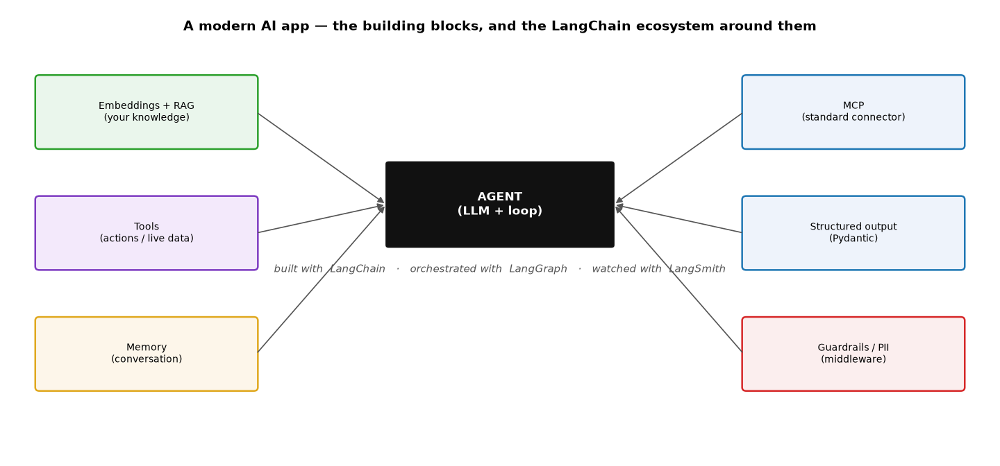
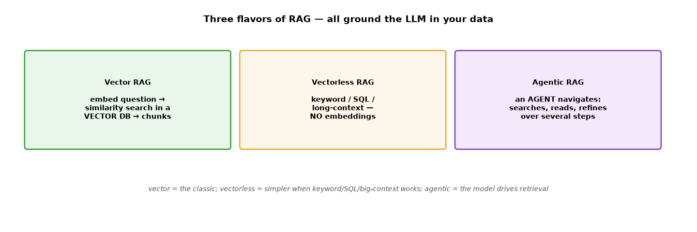
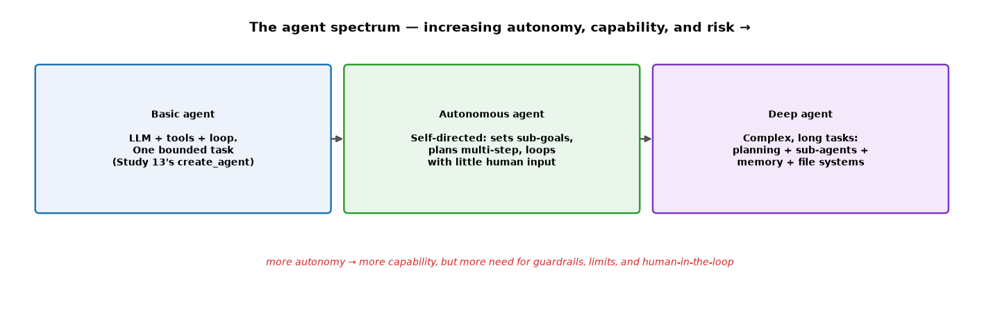

# ML Study 20 — Modern AI & GenAI: The Big Picture (a map)

**Covers:** where GenAI sits in the AI story → the **building blocks** of a modern AI app (model · embeddings · RAG · tools · memory · MCP · guardrails) → **Tools vs RAG vs MCP** → **RAG variants** (vector / vectorless / agentic) → the **LangChain ecosystem** (LangChain · LangGraph · LangSmith · Deep Agents) → **agent types** (basic · autonomous · deep) → how it all fits and where each topic lives.
**Goal:** a one-page mental map of modern AI — so every piece (RAG, tools, agents, LangGraph…) has a place and you know how they connect, before diving into any one of them.

**Series context:** the **orientation doc for the GenAI half** — the counterpart to [Study 00](ML_Study_00_ML_Foundations.html) (the big-picture map for classical ML). It ties together [Study 13](ML_Study_13_LangChain_Agents.html) (LangChain, tools, agents, middleware), [Study 17](ML_Study_17_Embeddings_and_Transformers.html) (embeddings & the Transformer), RAG, and [Study 19](ML_Study_19_Deploying_AI_Cloud_MLOps_Security.html) (deployment). Read this first to see the forest; the others are the trees.

---

## Part 1 — Where GenAI sits

The whole story in one line: **AI ⊃ Machine Learning ⊃ Deep Learning ⊃ (Transformers → LLMs → GenAI → Agents).**

- **Classical ML** (Studies 01–11) — you engineer features; the model learns patterns on tabular data.
- **Deep learning** (Studies 14–18) — networks learn features *and* patterns from raw data (images, text).
- **Transformers → LLMs** (Study 17) — attention + scale gave us language models.
- **GenAI & agents** (this map) — we *build applications* on top of LLMs: they retrieve knowledge (RAG), take actions (tools), remember (memory), and act autonomously (agents).

This doc is about that last layer — turning an LLM into a *useful application*.

---

## Part 2 — The building blocks of a modern AI app

An LLM by itself just predicts text. A real app surrounds it with pieces that give it **knowledge, actions, and memory**:

| Block | What it adds | Where |
|---|---|---|
| **The model (LLM)** | reasoning & language | Study 17 |
| **Embeddings + RAG** | *your* knowledge (answer from documents) | Study 17 + RAG |
| **Tools** | *actions & live data* (call an API, query a DB) | Study 13 |
| **Memory** | remembers the conversation across turns | Study 13 (checkpointer) |
| **MCP** | a *standard connector* for tools & data | Study 13 |
| **Structured output** | typed results (Pydantic) instead of free text | Study 13 |
| **Guardrails / PII** | safety, limits, redaction | Study 13 (middleware) + 19 |

**Yes — LangChain provides all of these.** It's the umbrella framework with the building blocks; you assemble the ones your app needs.

---

## Part 3 — Tools vs RAG vs MCP (the confusion, cleared up)

These three get conflated constantly. They solve *different* problems:

| | **Tool** | **RAG** | **MCP** |
|---|---|---|---|
| Gives the model… | **hands** (do / fetch) | **notes** (read your docs) | a **standard plug** |
| Example | `get_weather("Boston")` → live API | "what's our refund policy?" → search policy docs | expose a GitHub/DB server any client can use |
| It's a… | capability (action / live data) | knowledge-grounding *pattern* | *protocol* for connecting tools & data |

**Analogy:** a **tool** is a *phone* the assistant picks up; **RAG** is a *filing cabinet* it searches before answering; **MCP** is the *standard wall socket* everything plugs into (so nothing needs custom wiring). They're **complementary** — a real agent uses RAG for knowledge, tools for actions, and MCP as the standard way those are connected. *(Note: RAG can even be wrapped as a "search" tool — "agentic RAG" — and served over MCP. The line blurs, but the intents above stay distinct.)*

---

## Part 4 — RAG and its variants

**RAG (Retrieval-Augmented Generation)** = fetch relevant text from *your* data and put it in the prompt, so the LLM answers from your knowledge (and hallucinates less). There's more than one way to "retrieve":

- **Vector RAG** (the classic) — embed the question, do a **similarity search** in a **vector database**, pull the nearest chunks (Study 17's embeddings in action).
- **Vectorless RAG** — retrieve **without** embeddings: keyword/BM25 search, **SQL** over structured data, or just **long-context** (drop the whole document into a big-context model). Simpler and cheaper when it works — and with huge context windows, you often don't need a vector DB at all.
- **Agentic RAG** — an **agent** drives retrieval: it searches, reads, and refines over several steps (like a person navigating files) instead of one similarity lookup.

> **The judgment:** vector RAG is the default for large document sets; vectorless is simpler when keyword/SQL/long-context suffices; agentic RAG shines on complex questions that need multi-step lookup.

---

## Part 5 — The LangChain ecosystem

One ecosystem, four pieces — know which is for what:

- **LangChain** — *build* agents fast. High-level building blocks: models, messages, tools, structured output, RAG, `create_agent`. **Start here.**
- **LangGraph** — *orchestrate* with full control. A **stateful graph** (nodes = steps, edges = flow) for loops, branching, memory, and human-in-the-loop. `create_agent` is built *on* LangGraph — you drop down to it when the agent's control flow gets complex.
- **LangSmith** — *observe & evaluate*. Trace every step (tools called, tokens, latency), score quality on datasets, debug, and monitor in production. Not for building — for **watching and improving**.
- **Deep Agents** — a LangChain offering for **long, complex, multi-step tasks** (planning + sub-agents + memory).

> **One line:** **LangChain builds it · LangGraph orchestrates it · LangSmith watches it.**

---

## Part 6 — Agent types: basic → autonomous → deep

"Agent" spans a spectrum of autonomy:

- **Basic agent** — LLM + tools + the loop, handling **one bounded task** (Study 13's `create_agent`). Predictable, short.
- **Autonomous agent** — **self-directed**: sets its own sub-goals, plans multi-step, and loops with little human input. More capable, longer-running.
- **Deep agent** — built for **complex, long tasks**: planning, **sub-agents**, memory, and file systems (a research agent that plans → delegates → synthesizes over many steps).

> **The trade-off to name:** more autonomy = more capability **and** more risk. Higher up the spectrum you *need* guardrails, model/tool-call limits, and human-in-the-loop (Study 13 middleware) — a runaway autonomous agent is a real cost and safety hazard.

---

## Part 7 — How it all fits (and where to go next)

Putting the map together — a production GenAI app is: **an LLM (17)**, grounded by **RAG**, extended with **tools** and **MCP**, kept safe with **guardrails/middleware (13)**, wrapped as an **agent** — **built with LangChain, orchestrated with LangGraph, watched with LangSmith** — and **deployed & scaled (19)**.

| To learn… | Go to |
|---|---|
| Embeddings, tokens, attention, the Transformer | **Study 17** |
| LangChain, tools, `create_agent`, middleware | **Study 13** |
| RAG hands-on (load → chunk → embed → retrieve → generate) | the `RAG_from_Scratch` notebook |
| Deploying, scaling, monitoring, LLM security | **Study 19** |
| The classical-ML foundation underneath | **Studies 00–18** |

---

## Quick reference / glossary

| Term | Meaning |
|---|---|
| LLM | large language model — a big Transformer (Study 17) |
| Embedding | text → a vector; similar meaning → nearby vectors |
| RAG | Retrieval-Augmented Generation — ground the LLM in your documents |
| Vector / vectorless / agentic RAG | similarity search / keyword-SQL-long-context / agent-driven retrieval |
| Tool | a function the model can call — actions or live data |
| MCP | Model Context Protocol — a standard way to expose tools & data to any client |
| Memory / checkpointer | remembers the conversation across turns |
| Guardrails | input/output safety checks (PII, limits) — middleware |
| Agent | LLM + tools + a loop that decides and acts |
| Basic / autonomous / deep agent | bounded task / self-directed / complex multi-step with sub-agents |
| LangChain | framework to *build* LLM apps & agents |
| LangGraph | *orchestrate* stateful, multi-step agent graphs |
| LangSmith | *observe & evaluate* agents (tracing, eval, monitoring) |
| Deep Agents | LangChain offering for long, complex, multi-step tasks |

*ML Study 20 — the map of modern AI: an LLM becomes an app when you add **RAG** (your knowledge, via embeddings — vector, vectorless, or agentic), **tools** (actions & live data), **MCP** (a standard connector), **memory**, and **guardrails**. Tool = hands, RAG = notes, MCP = the standard plug. Build it with **LangChain**, orchestrate with **LangGraph**, watch with **LangSmith**. Agents span **basic → autonomous → deep** (rising capability and risk). The GenAI counterpart to Study 00; the forest around Studies 13, 17, 19, and the RAG notebook.*
